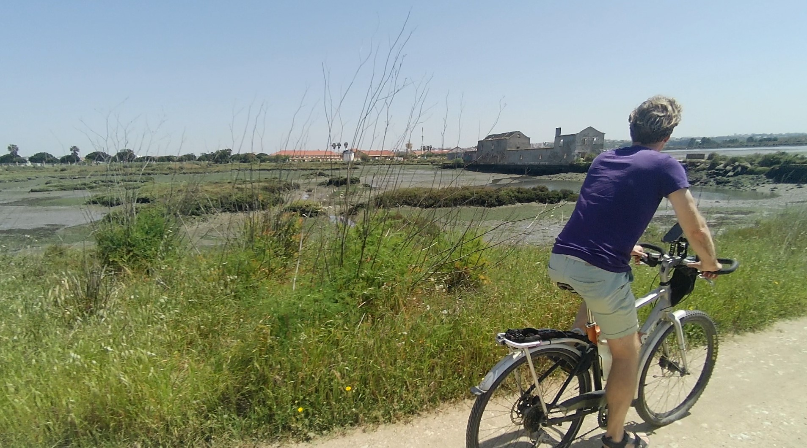
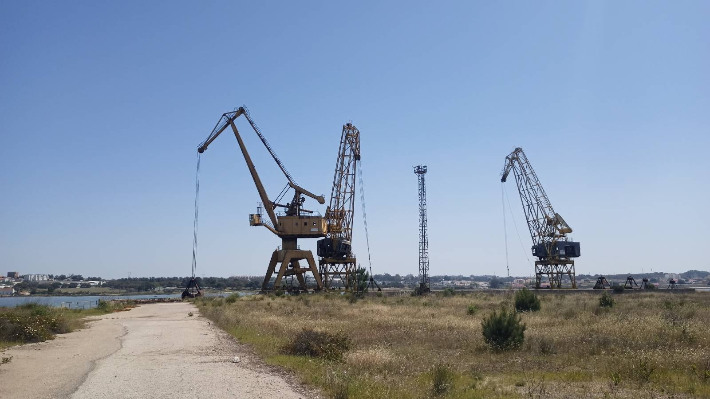
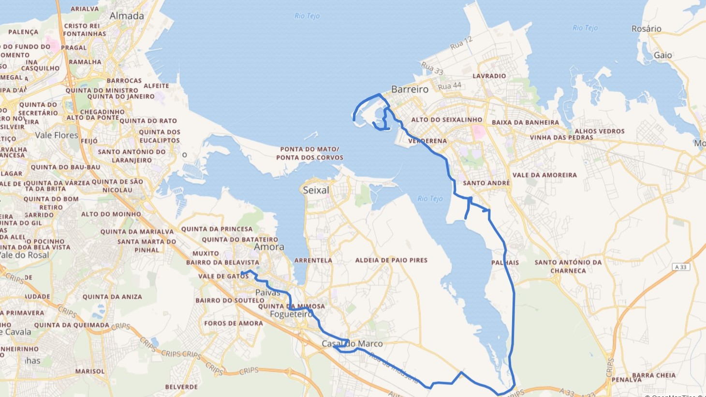

import SevenRoutesDownload from "../../../src/utils/sevenRoutesDownload.js";

Die Tejo-Bucht von Lissabon ist weit verzweigt und nicht leicht zu überqueren. Die Pizzeria unseres Nachbarn ist 5 km Luftlinie entfernt, auf dem Fahrrad war es eine schöne Tour von 25 km größtenteils am Wasser entlang: von Amora über Seixal nach Barreiro.

  <iframe width="1026" height="577" src="https://www.youtube.com/embed/qtzv4i2xM18" title="YouTube video player" frameborder="0" allow="accelerometer; autoplay; clipboard-write; encrypted-media; gyroscope; picture-in-picture" allowfullscreen></iframe>

## Mit dem Fahrrad über den Tejo

Egal auf welcher Seite der Tejo-Bucht: Fahrradfahren ist sowohl in Lissabon als auch am Südufer, der „Margem Sul“ eine Herausforderung. Die Fahrradinfrastruktur befindet sich noch im Anfangsstadium. Als wäre das nicht genug, ist es zudem kein Leichtes die Bucht zu überqueren. Beide Brücken sind nämlich für Fahrradfahrer und Fußgänger gesperrt! Wenn du Anwohner bist: hier gehts zur [Petition für einen Fahrradweg über die Brücke 25 de Abril](https://peticaopublica.com/pview.aspx?pi=P2013N70468).

In 3 Orten verbinden Fähren die Gegend unserer Pizzeria-Fahrradtour mit Lissabon: in Almada, Seixal und Barreiro. Auf der Fähre könnten wir das Fahrrad mitnehmen. Untereinander haben diese Orte allerdings keine Fährverbindung. Auch Brücken über diese Seitenarme der Tejo-Bucht gibt es bisher nicht und wird es in naher Zukunft auch nicht geben.

Wir müssen somit entweder ein aufblasbares SUP mitschleppen oder um die ganze Bucht herumfahren. Letzteres ist nicht die schlechteste Wahl. Denn die Bucht bietet spektakuläre Aussichten und der Weg ist recht gut befahrbar, selbst ohne Mountainbike. Schau dir unser [Video von unserer Fahrradtour zu Nachbars Pizzeria](https://youtu.be/qtzv4i2xM18) an!

## Amora – Seixal: die erste Bucht

Von unserem Haus in Amora fahren wir durch die Stadt ein kurzes Stück zur Bucht. Dort gibt es einen Fahrradweg, der bis nach Seixal um die ganze Bucht führt. Bei Ebbe ist dieser Teil der Tejo-Bucht komplett ohne Wasser. Ein kleiner Bach, der Rio Judeu, mündet in die Bucht, führt aber kaum Wasser.

In Seixal gelangen wir an das Ufer der Hauptbucht des Tejo. Die ist riesig und führt auch bei Ebbe Wasser.

Früher gab es an dieser Bucht unzählige Gezeitenmühlen. Das Wasser wurde bei Flut in einem Becken gesammelt und bei Ebbe zum Antreiben der Mühlsteine genutzt. Auf dem Foto siehst du eine der vielen Ruinen einer solchen Gezeitenmühle.

## Seixal – Barreiro: die zweite Bucht

Auf der Seite von Seixal der nächsten Bucht können wir auch direkt am Wasser entlangfahren. Ein Industriegebiet liegt zwischen Wasser und Stadt. Der Wanderweg, auf dem wir mit unseren Tourenrädern fahren, schlängelt sich an Sandhügeln, Ladekränen und alten Schienen entlang. Industrieromantik pur!

Manchmal ist die Strecke etwas abenteuerlich, geht durch einen aufgeschnittenen Zaun, kurz steil bergab und natürlich ab und zu durch Sand. Menno fährt überall einfach durch, während ich hier und da schieben muss, weil ich nicht mit dem nötigen Schwung über Stelle bin (im Video Minute 5 und 5:50 😬)

Am Ende dieses Teils mündet der Fluss Coina in die Bucht. Und wir müssen auf die Straße, die N10, auf der Radfahren echt kein Spaß ist. Glücklicherweise nur kurz, dann biegen wir Richtung Barreiro ab. Am Wasser können wir leider nicht entlang. Zunächst ist da Sumpf und dann ein größeren Militärgelände. Also Landstraße und dann durch die Stadt. Der Verkehr ist OK, wir kommen entspannt bei der [Pizzeria unseres Nachbarn](https://goo.gl/maps/c4nr8hwFQ3deCtRZ6) an.

Die Tejo-Bucht ist vor Barreiro sehr breit, Lissabon ist kaum zu sehen. Ein frischer Wind weht. Fußgängerbrücken führen über die Verzweigungen der Bucht zu einem geselligen Stadtstrand. Auf dem Rückweg gelingt es uns, noch etwa 5 km am Wasser entlang zu radeln, dann geht es auf die Straße und auf dem kürzesten Weg nach Hause.

Der Wasserlinie der Tejo-Bucht zu folgen, macht richtig Spaß! Trotzdem würden wir uns über eine bessere und sicherere Infrastruktur für Fahrräder und Fußgänger freuen. Auf dieser Website teilen wir unsere Routen und Erfahrungen, damit du nicht auf bessere Zeiten zu warten brauchst, sondern jetzt gleich mit deinem Fahrradabenteuer loslegen kannst.

**_Schwing dich aufs Fahrrad, teile die schönsten, die sichersten, die kürzesten, längsten oder praktischsten Fahrradrouten mit anderen. Sprich über Fahrradreisen Verschenk' mal ein Rad oder einen Fahrradtag! Gib einfach nicht auf, bis alle Fahrrad fahren. Denn Fahrradfahren macht glücklich._**

<SevenRoutesDownload link="https://drive.google.com/drive/folders/1XKY74iZRZlyNPx7S9OsSLlRhhIrj3hhu?usp=sharing" />

Die Karten in diesem Artikel wurden mit [MapHub](https://maphub.net) unter Verwendung der Karte National Geographic, Esri, DeLorme, HERE, UNEP-WCMC, USGS, NASA, ESA, METI, NRCAN, GEBCO, NOAA, iPC erstellt.
