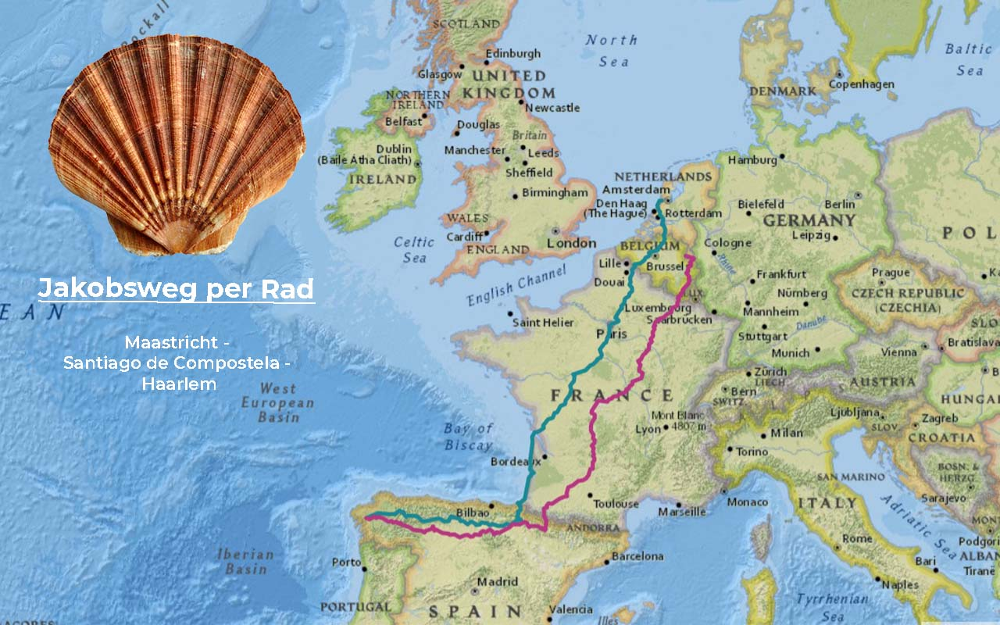
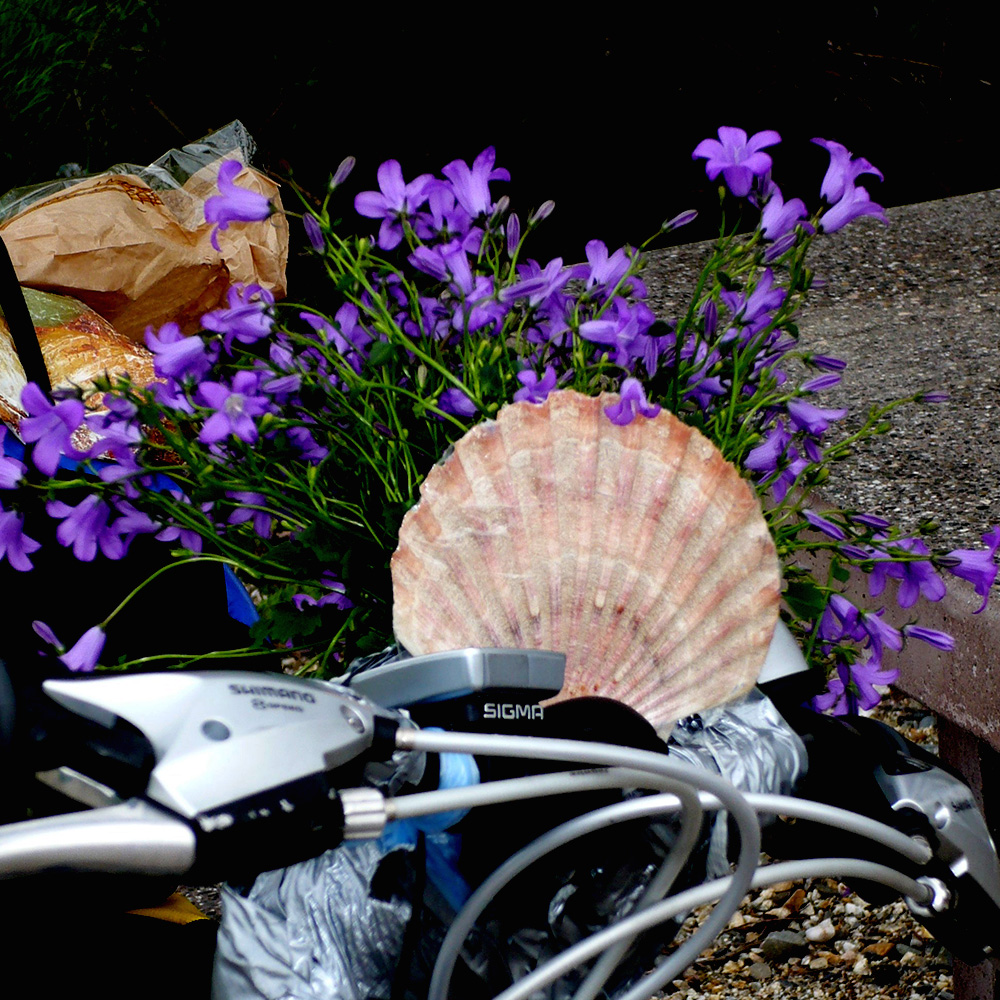
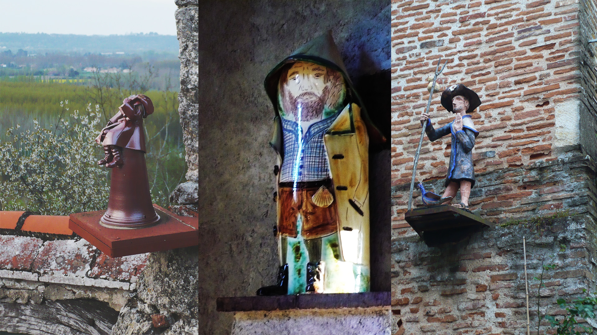
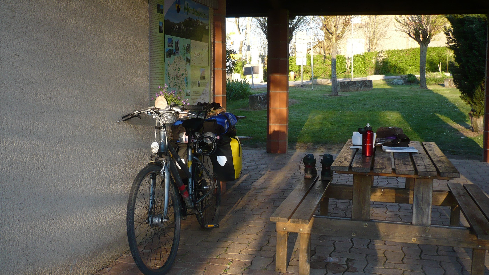
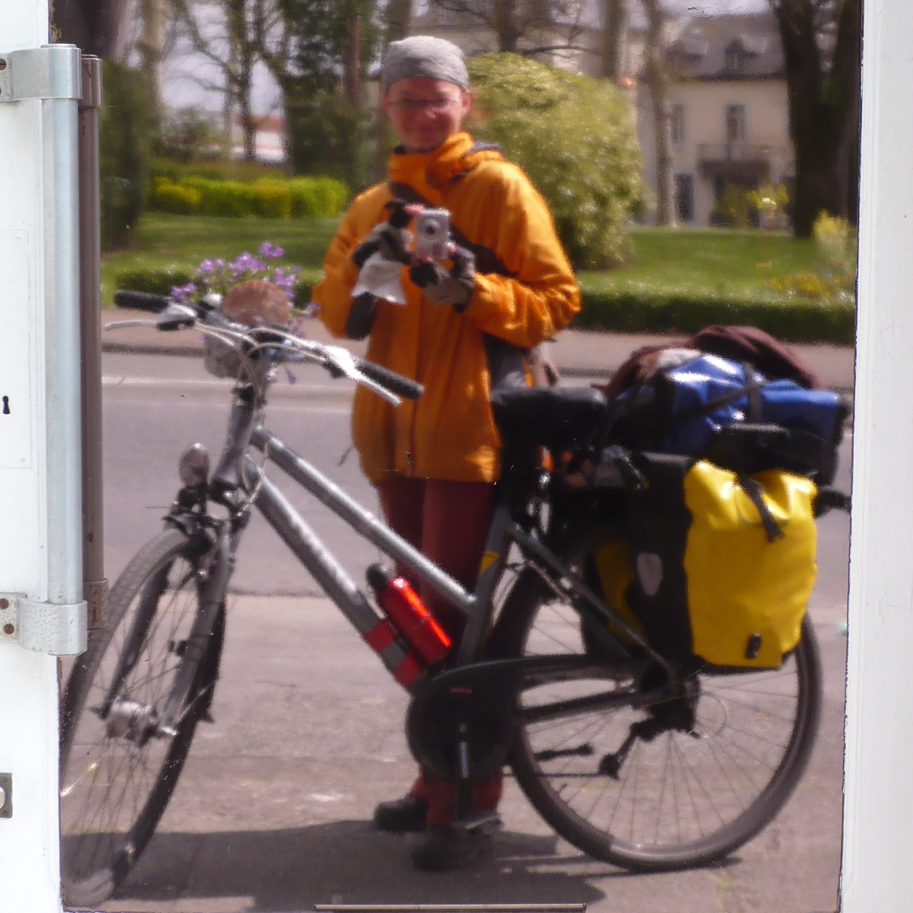

import SevenRoutesDownload from "../../../src/utils/sevenRoutesDownload.js";

Soloreisen kann einsam sein, erhofft oder gefürchtet. Im Frühjahr 2008 schwang ich mich mit 2 Packtaschen, einem Rucksack und einer Handtasche aufs Rad, fuhr gen Süden und kehrte nach 70 Tagen zurück - immer noch solo (oder besser gesagt wieder). An 10 dieser Tage hatte ich Begleitung: Jaqueline, Spezies: Reise-Campanula. Ich befestigte sie in einem Blumentopf an meinem Lenker und war in Gesellschaft. Durch Südfrankreich, über den Col du Somport, durch Regen und Hagel in Spaniens Norden, bis kurz vor Leon, wo sie den wechselhaften iberischen Witterungsbedingungen erlag. Lies mein Reisetagebuch aus Südfrankreich Tag 17 bis 19...

Die Route
---------

Ich war am 18. März von Eindhoven in den Niederlanden in Richtung Maastricht losgefahren, von wo ich der [Fahrradroute „Auf alten Wegen“](https://weonbikes.com/blog/7-fernradwege-fuer-urlaub-in-europa/#2-auf-alten-wegen-1600-km-maastricht--oloron-st-marie) nach Spanien folgen wollte. Das war recht früh im Jahr und ich hatte des Öfteren Schnee. 2008 hatte ich noch kein Smartphone mit GPS. Stattdessen schleppte ich 4 Fahrradbücher mit Routen nach Santiago de Compostela mit. Ich wusste nichts über den Jakobsweg und interessierte mich auch nicht besonders für die Pilgerei. Für die Strecke gab es aber gute Karten und sie ließ sich als Rundweg fahren.

Nach 4680 km kam ich wieder in Eindhoven an. Auf dem Rückweg von Santiago de Compostela fuhr ich zunächst auf einer nördlichen Route durch die Pyrenäen. Das war mit dem Tourenrad sehr anstrengend. Deshalb bin ich von Leon nach Irun mit dem Zug gefahren. In Frankreich entschied ich mich für den EuroVelo 1 am Meer entlang. Die Tour auf der Karte Maastricht - Santiago de Compostela - Haarlem ist etwa 5000 km lang, die GPX-Datei kannst du dir herunterladen.

<SevenRoutesDownload link="https://drive.google.com/drive/folders/1eDMvDqrpQdwcsQrsbptQuo3eoYFjxVgD?usp=sharing" />

Südfrankreich
-------------

### 17. Tag Donnerstag, 3. April 1455 km

> Morgens beim Abtrocknen nach dem Duschen fegte ich erstmal meine Brille vom Bord. Der rechte Bügel war abgebrochen. Scheiß. Ließ sich auch nicht kleben. Cornflakes und Löcherbrot mit Honig gefrühstückt.  
> Um 10 bin ich los. Bis Cahors quasi geflogen, bergab. Dann 10 km verfahren, um aus Cahors rauszukommen. Zunächst hässlich, aber dann! Plötzlich war ich richtig in Südfrankreich: 25°C, Sonne, blauer Himmel, südliches Flair, Palmen, eine Schwalbe - und die machte echt den Sommer.  
> In Castelnau-Montratier wollte ich ein Baguette kaufen. Das war schwierig, weil Mittag war. Schließlich fand ich einen Laden und kaufte ein ziemlich kleines Baguette für 0,95€. Ich aß es mit Schokolade und dann mit Käse. Mit Käse war noch schlimmer als mit Schokolade. Ich trödelte eine Stunde lang rum und hielt noch ein paar Mal, um mich zu sonnen.  
> Dann Moissac. Erste Begegnung mit Jaqueline. Ich schob das Rad durch die Innenstadt, als ich einen Blumenladen mit einer Reihe Glockenblumen in voller Blüte sah. Sommer! Eine davon vorwitzig, einzigartig zwischen ihresgleichen, aus auf Abenteuer – meine Reise-Campanula. Für 6€ (!!) war sie mein.  
> Ich befestigte sie mit Panzertape am Lenker. Als Windschutz baute ich Susis Jakobsmuschel an. Jaqueline stand meinem Fahrrad ausgezeichnet.

> Bei der Aktion hatte ich gar nicht gemerkt, wie viel Durst ich hatte. An einem öffentlichen Hahn füllte ich meine Wasservorräte auf, dann kaufte ich einen Liter O-Saft und ein Baguette. Den Liter trank ich sofort aus.  
> Die Sonne stand noch hoch. Ich beschloss bis Auvillar zu fahren. Das war die richtige Entscheidung, denn die Strecke war super schön. Erst am Kanal entlang, dann nach Süden auf eine ganz kleine Landstraße, an der komische Bäume wuchsen. Die 15 km haben in meinem Reiseführer jetzt Platz 1. Auvillar beeindruckte mit Blick auf das Garonne-Tal.  
> Ich stand suchend auf dem Dorfplatz und wurde direkt angesprochen. Ob ich eine Bleibe für die Nacht suchte. Als der Mann merkte, dass ich kein Französisch spreche, sprach er auf Englisch weiter. Er telefonierte und begleitete mich zu einem Franzosen, der mir ein Zimmer in einer stilvollen Gite gab. Superschön. 12€, zugegeben, für die Lage und Qualität hinterhergeworfen. Ich ging noch ein paar Fotos machen. Überall St.-Jacques-Figuren. Baguette, Tasse Tee, schlafen.

### 18. Tag, Freitag, 4. April 1555 km

> Ich kam mal wieder nicht aus dem Bett, stand dann auf, als die Vögel ganz laut zwitscherten. In der Gite traf ich beim Frühstück ein älteres Ehepaar aus München. Die fanden mein Vorhaben toll und meinten, ich solle den Camino Frances unbedingt machen, wo ich die Zeit schon mal hätte. Hier würde das Wetter bald wieder schlechter und baden könnte ich ja in Fisterra (Steilküste, hahaha)! Gutes Argument, an die französische Küste konnte ich auf dem Rückweg auch noch.  
> Ich fuhr los und war bald in Lectoure. Da ich wusste, dass die nächsten 80 bis 100 km nichts mehr kommen würde, ging ich in den nächsten Intermarché. Ich hatte Appetit auf Butter und Honig. Außerdem noch 2 kleine Baguettes für 0,23€, 2 Äpfel, 500g marokkanischen Couscous-Salat für 95 Cent (!) und für gleich 2 Suisse aux Chocolat für 1,50€. Alles zusammen 7,65€.  
> Dann lief ich über den Markt. Ein Glück hatte ich schon eingekauft, sonst hätte meine Schwäche für Crêpes und französische Patisserie mich hier 20€ gekostet. Ich suchte mir ein sonniges Plätzchen und mampfte meine Leckereien. Es war heiß. 25 Grad im Schatten. Richtiger Sommeranfang. Kaum Wind. Mit meinem Budget war das so eine Sache. Heute hatte ich einen 50€-Schein angerissen, den ich erst für Dienstag geplant hatte. Mit 10€ am Tag lag ich aber gar nicht schlecht im Rennen. Eines war jedenfalls sicher: Ganz genau rechnen hat mich noch nie vom Geldausgeben abgehalten.

Ich hatte etwa 3 Monate Zeit für die Tour und besaß 900 Euro. Wenn die alle waren, musste ich wieder arbeiten. Keine laufenden Kosten, da ich weder eine Wohnung noch ein Auto hatte. Ein paar Kisten standen seit meiner Scheidung bei meiner Mutter im Keller. In meinem alten Job als Flötenmacherin konnte ich in den Niederlanden auf Abruf arbeiten. In den Sommerferien war Hauptsaison.

> Ich fuhr bis Montesquiou und war dann auch echt fertig von 100 km in der Sonne.  
> Gleich am Ortseingang sah ich einen Touristeninfostand. Überdacht, mit Klo und Wasser und 2 Tischbänken. Gab sogar eine Feuerstelle! Des Pilgers Paradies. Ich aß erstmal eine Kleinigkeit. Nach einer Stunde schaute ich mich im Dorf näher um. Die Jakobsstatue aus meinem Reiseführer konnte ich leider nicht finden. Ich fuhr zurück an meine Schlafstelle. Wartete, bis die zwei Jugendlichen sich verzogen hatten, aß bei Sonnenuntergang und schrieb Tagebuch.  
> Für Pau bekam ich per SMS eine Absage vom Servas-Host, weil Wochenende war. Ich hatte prima Aussicht - und 3 Katzen. Die verzogen sich später. Um 9 Uhr machte ich mich in meinem Schlafsack lang.

Ich hatte kein Zelt mitgenommen, nur einen ganz einfachen Not-Biwaksack, falls ich unüberdacht schlafen musste. Zum einen hatte ich kein Zelt, zum anderen vermutete ich, dass ich eh meist keine Lust hätte, es aufzubauen. Außerdem sparte ich Gewicht. Kochzeug hatte ich auch nicht dabei, nur einen winzigen Klappkocher für eine Spiritustablette, um Wasser warm zu machen. In den kalten Ardennen hatte er mir gute Dienste geleistet.

19. Tag 5. April Samstag 1655 km
---------------------------------

> Die Nacht war nicht besonders ruhig, hab aber trotzdem viel geschlafen. Um 7 aufgestanden. Sonne, blauer Himmel. Wärme ist ein geldwerter Vorteil. Morgenroutine: aufs Klo, Linsen einsetzen, mit Feuchttüchern "waschen", Zähneputzen, Sonnencreme. Dann Frühstück: Müsli. Als der Becher wieder frei war, Tee, dazu Butterbaguette mit Honig.  
> Um halb 9 machte ich mich auf den Weg nach Pau. 90 km. Ich hoffte, dort ein Intercafé mit nächtlichen Öffnungszeiten zum Skypen zu finden. Außerdem wollte ich Sachen nach Hause schicken. Zuviel Werkzeug. Was ich bisher nicht gebraucht hatte, würde sich auch später ohne lösen lassen. In den Bergen wollte ich meinen Körper schonen und lieber auf mein solides Rad vertrauen...  
> So sinnierte ich vor mich hin, bog um eine Kurve und – da waren sie auch schon: sonnenbestrahlt, schneebedeckt und vor allem hoch! Die Berge. Zunächst einschüchternd. Nach 80 km hatte ich mich allerdings an den Anblick gewöhnt und fand sie direkt einladend, die Pyrenäen.

> In Maubourguet kaufte ich ein Baguette, das ich an diesem Tag nicht mal mehr aß, und 2 Chocolatine, die noch tropften, so frisch und heiß waren sie. Ich setzte mich in die Sonne auf eine Bank vor einer Bank und war happy.  
> Dann zur Post. Es war bereits halb 12 und es dauerte. Ich erstand ein Paket mit Schein für 6 kg für 25€, kaufte noch 2 Postkarten dazu, eine für Mama ins Paket und eine für Lily zum Geburtstag. Zahlte mit Visa. Bis um 12 schaffte ich es natürlich nicht, das Paket fertig zu packen. Ich fuhr also bis Pau mit einem unhandlichen Paket auf dem Rad.  
> In Pau navigierte ich zielsicher zur St.-Jacques-Kirche, von der ich nicht einmal wusste, dass es sie gab. Es war der schönste Tag der Welt. Ich vergaß glatt, Fotos von dem belebten Platz zu machen: Brunnen, Menschen, Eiswagen.  
> Ich packte das Päckchen. Die relevanten Servas-Adressen übertrug ich in die Routenbücher St.-Jacobsweg 1 und 2. Ich merkte auf einmal, wie irre verbrannt ich war. Ich war im Bodywarmer Rad gefahren. Meine Arme waren krebsrot. Mein Kopf wohl auch.

2008 hatte ich noch keine Ahnung von Sonneneinstrahlung im Süden. Meine Sonnencreme war viel zu schwach. Den Sonnenbrand wurde ich bis Santiago de Compostela nicht mehr los. Ich bekam zwar keine Blasen auf der Haut, aber immerhin hielten besorgte Spanier im Auto extra an, um mir zu sagen, dass ich mehr Sonnencreme benutzen sollte. So krebsrot blieb meine Haut 3 Wochen lang.

> Samstag um 6 konnte ich mein Paket natürlich nicht mehr zur Post bringen. Ich ging also in die Christliche Buchhandlung direkt am Platz und bat die Frau, mein Paket aufzugeben. Das tat sie gern. Sie war auch schon mal einen Teil des Weges gepilgert.  
> Sie kannte sogar ein Internetcafé in der Nähe. Ich lieft hin, ca. 4 kg leichter - gefühlte 10 kg! Der Laden hatte bis 24h geöffnet und 5h kosteten 8,95€. Ich suchte weiter, landete wieder an der Kirche und ging rein. Die Messe lief grad. Sie hatten einen sympathischen St. Jacques. Ich zündete für ihn und mich eine Kerze an. Vor dem Bergpass fand ich das passend.  
> Danach bat ich um den Stempel. Der in der weißen Kutte gab mir den Stempel und wünschte mir Erfolg. Seit Nevers und Vezelage hatte ich das dauernd gehört: Bom Route, Bom Chemin, Buon Camino, und bei schlechtem Wetter: Courage! Die Leute hier waren Pilger gewöhnt.  
> Dann lief ich zur Promenande: Palmen mit Bergen im Hintergrund, fantastische Aussicht. In dem Moment gab mein sonnenbrandgeplagter Kreislauf nach. Ich musste mich erstmal auf die nächstbeste Bank legen. Sonnenstich.  
> Später ging ich in das Internetcafé. Skype funktionierte. Ich telefonierte und las E-Mails: Papa hatte seit neuestem Internet! Ich habe auf seine E-Mail geantwortet. Unglaublich. Um Mitternacht stellte sich heraus, dass bis 2 Uhr geöffnet war. Ich sortierte also noch Fotos. Dann suchte ich mir auf der Promenade eine Bank und schlief im Schlafsack, Kopf auf der Handtasche. Vom Morgentau abgesehen, blieb es trocken.

Das war eine der schönsten Strecken dieser Fahrradreise, nicht zuletzt weil ich aus dem kalten Norden in den warmen Süden kam. In Frankreich fährt man mit dem Tourenrad außerdem angenehm auf kleinen Asphaltstraßen ohne viel Verkehr durch malerische Landschaften. Ideal für Fahrradurlaub mit Gepäck.

Im zweiten Teil geht es über den Pass und im dritten Teil begleitest du mich und Jaqueline auf dem Camino Frances durch Nordspanien. Hier ein Vorgeschmack:

Col du Somport
--------------

> \[...\] Heute setzte ich meinen Rucksack auf den Rücken, weil sich das bergauf besser fuhr. Beim Frühstück hatte ich noch eine Geburtstagskarte geschrieben. Als ich durch das nächste Dorf fuhr, Urdos, das letzte französische Dorf, warf ich sie in den Briefkasten, den man in Frankreich zuverlässig am verlassensten Ort findet.  
> Mit 6 km/h fuhr ich den Pass hoch. Schnee am Straßenrand und in der Landschaft. Ich hatte wieder Handschuhe an. In den 4 Stunden bis zum Somport fuhr mehrmals ein Linienbus an mir vorbei. In der Ferne wehten mir die Fahnen des Somport zu. \[...\]

Der Col du Somport ist der älteste Pass über die Pyrenäen und sehr fahrradfreundlich. Es gibt aber noch andere...

Spanien
-------

> \[...\] Nachdem ich festgestellt hatte, dass die Kamera fehlte, fiel mir auf, dass auch mein Geldbeutel weg war. Gestohlen? Ich versuchte mich an gestern Abend zu erinnern. Schwierig. Lag wohl am Wein. Ich hatte draußen auf meiner Sitzmatte gesessen. \[...\]

* * *

Im Frühjahr 2008 war nicht viel los auf dem Camino Frances. Das ist heute anders. Eine Alternative ist der ruhigere Camino del Norte, der ganz oben auf meiner Liste steht auf unserer Tour von Kap zu Kap im nächsten Jahr. An der nordspanischen Küste entlang durch Asturien, spektakuläre Aussichten und schön grün. Bleib dran! Bis dahin...

**_Schwing dich aufs Fahrrad, teile die schönsten, die sichersten, die kürzesten, längsten oder praktischsten Fahrradrouten mit anderen. Sprich über Fahrradreisen Verschenk' mal ein Rad oder einen Fahrradtag! Gib einfach nicht auf, bis alle Fahrrad fahren. Denn Fahrradfahren macht glücklich._**

<SevenRoutesDownload link="https://drive.google.com/drive/folders/1eDMvDqrpQdwcsQrsbptQuo3eoYFjxVgD?usp=sharing" />

Die Karten in diesem Artikel wurden mit [MapHub](https://maphub.net) unter Verwendung der Karte National Geographic, Esri, DeLorme, HERE, UNEP-WCMC, USGS, NASA, ESA, METI, NRCAN, GEBCO, NOAA, iPC erstellt.