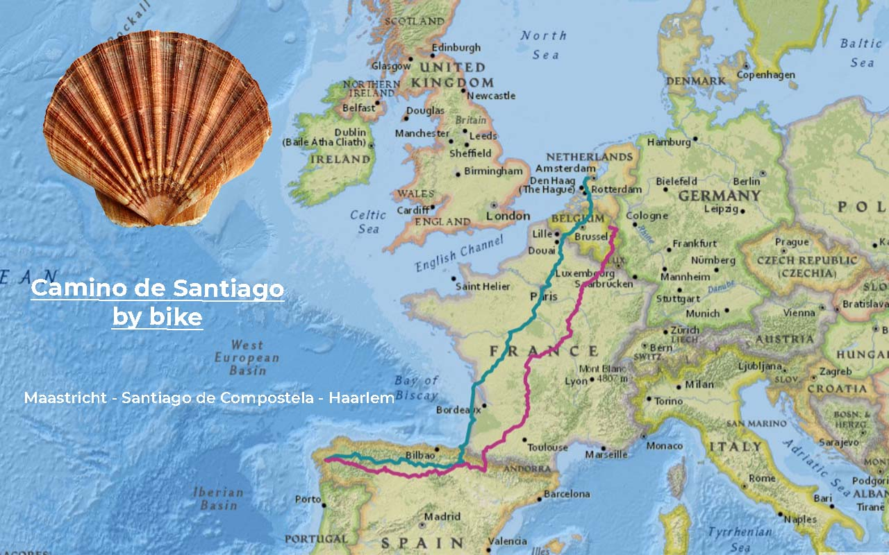

import SevenRoutesDownload from "../../../src/utils/sevenRoutesDownload.js";

Solo travel can be lonely, hoped for or dreaded. In the spring of 2008, I jumped on my bike carrying 2 panniers, a backpack and my handbag, went south and returned after 70 days still solo (or rather again). On 10 of those days, I had company: Jaqueline, Species: Travel Campanula. I attached her in a flowerpot to my handlebars to have company. We travelled southern France, over Col du Somport, through rain and hail in northern Spain, until just before Leon, where she succumbed to the changeable Iberian weather conditions. Read below my travel diary from South France day 17 to 19...

## The Route

I left Eindhoven in the Netherlands on March 18th to Maastricht, from where I wanted to follow the [cycle route _Along the Old Roads_](https://weonbikes.com/en/blog/7-cycling-routes-for-bike-tour-holidays/#2-along-old-roads-1600-km-maastricht--oloron-st-marie) to Spain. That was quite early in the year, and I often had snow. In 2008 I didn't have a smartphone with GPS. Instead, I lugged 4 bike books with routes to Santiago de Compostela around with me. I didn't know anything about the Camino de Santiago, nor was I particularly interested in pilgrimage. But there were good maps for the route, and I could cycle in a loop.

After 4680 km I was back in Eindhoven. On the way back from Santiago de Compostela, I first went on a northern route through the Pyrenees. That was pretty hard on a touring bike with luggage. I took the train from Leon to Irun to save some time. In France, I followed the EuroVelo 1 along the coast. The route on the map Maastricht - Santiago de Compostela - Haarlem has about 5000 km. You can download the GPX file.

<SevenRoutesDownload link="https://drive.google.com/drive/folders/1eDMvDqrpQdwcsQrsbptQuo3eoYFjxVgD?usp=sharing" />

## South France

### Day 17 Thursday, April 3, 1455 km

> In the morning when drying off after the shower, I swept my glasses off the board. The right arm broke off. Shit. Couldn't glue it either. Had cornflakes and bread with big holes and honey for breakfast.  
> I left at 10. Almost flew to Cahors, downhill. Then it took me 10 km to find my way out of Cahors. Ugly landscape at first, but then! Suddenly I was right in the south of France: 25°C, sun, blue sky, southern flair, palm trees, a swallow - and that really did make the summer.  
> In Castelnau-Montratier I wanted to buy a baguette. That was difficult because it was noon. I found a shop and bought a rather small baguette for €0.95. I had it with chocolate and then with cheese. With cheese was even worse than with chocolate. I dawdled for an hour and stopped a few more times to sunbathe.  
> Then Moissac. First encounter with Jaqueline. I was cycling downtown when I saw a flower shop with a row of bluebells in full bloom. Summer! One of them kind of meddlesome, unique among her kind, out for adventure - my travel campanula. For €6 (!!) she was mine.  
> I fixed her with duct tape to the handlebars. Susi's scallop shell served as a windbreak. Jaqueline suited my bike perfectly.

> I didn't even realize how thirsty I was during doing all that. I filled up my water supply at a public tap, then I bought a liter of orange juice and a baguette. I finished the liter right on the spot.  
> The sun was still high. I decided to go until Auvillar. That was the right decision because the track was super nice. First along the canal, then south on a very small country road lined with strange trees. These 15km are now number 1 in my guidebook. Auvillar showed off with some impressive views over the Garonne valley.  
> I was looking around on the village square and got approached right away. If I was looking for a place to stay for the night? When the man noticed that I don't speak French, he continued in English. He made a phone call and escorted me to a French guy who gave me a room in a stylish gite. Very nice. €12, which for the location and quality was a great price. I went to take some more photos. St. Jacques figures everywhere. Baguette, cup of tea, sleep.

### Day 18, Friday April 4, 1555 km

> I couldn't get out of bed again, then got up when the birds chirped very loudly. At breakfast in the gite, I met an elderly couple from Munich. They loved my plan and said I should definitely do the Camino Frances once I had the time. Here, the weather would soon get worse and if I wanted swimming, I could go swim in Fisterra (yeah right, from the cliffs)! They had a point; I could also go along the French coast on the way back.  
> I left and was soon in Lectoure. Since I knew that for the next 80 to 100 km there would be nothing to shop, I went to the next Intermarché. I felt like butter and honey. In addition, 2 small baguettes for €0.23, 2 apples, 500g Moroccan couscous salad for 95 cents (!) and 2 Suisse aux Chocolat for €1.50. All together €7.65.  
> Then I walked through the market. Luckily, I had already shopped, otherwise my weakness for crêpes and French patisserie would have cost me €20 here. I found a sunny spot and munched on my goodies. It was hot. 25 degrees in the shade. Proper start of summer. Hardly any wind. With my budget it was a bit tricky. Today I started a €50 bill that I had planned for Tuesday. On the other hand, with €10 a day I was not bad at all up to now. In any case, one thing was certain: Counting and recalculating has never stopped me from just spending my money.

I had about 3 months for the tour and had 900 euros. When that ran out, I had to go back to work. No running costs since I had neither an apartment nor a car. A few boxes had been in my mother's basement since my divorce. In my old job as a flute maker, I could work on call in the Netherlands. The summer vacations were peak season.

> I cycled to Montesquiou and was really exhausted after 100 km in the sun.  
> Right at the entrance to the village I saw a tourist information stand. Covered, with toilet and water and 2 benches. Even had a fire pit! The pilgrim's paradise. I ate a little first. After an hour I took a closer look around the village. The statue of St. Jacob from my travel guide I couldn't find. I went back to my sleeping place. Waited until the two teenagers had gone, ate at sunset and wrote my diary.  
> For Pau, I received a text message from the Servas host because it would be in the weekend. I had a relaxing view - and 3 cats. They later moved away. At 9 o'clock I stretched out in my sleeping bag.

I hadn't brought a tent, just a basic emergency bivy bag in case I needed to sleep uncovered. On the one hand I didn't owe a tent, on the other hand I suspected that I usually wouldn't feel like setting it up anyway. I also saved weight. I didn't have any cooking gear with me either, just a tiny folding stove for an alcohol tablet to heat water. It had served me well in the cold Ardennes.

### Day 19, Saturday April 5, 1655 km

> The night wasn't particularly quiet, but I still slept quite a lot. Up at 7. Sun, blue sky. A warm climate is definitely a monetary benefit. Morning routine: going to the toilet, inserting lenses, "washing" with wet wipes, brushing my teeth, sunscreen. Then breakfast: muesli. When the mug was free again, tea, and baguette with butter and honey.  
> At half past eight I made my way to Pau. 90 km. I was hoping to find an Internetcafé there with nightly opening hours for skyping. I also wanted to send things home. Too many tools. What I hadn't needed by now could be solved later without those tools as well. In the mountains I wanted to take it easy on my body and preferred to trust my solid bike...  
> So I mused to myself, turned around a bend and – there they were: sunlit, snow-covered and, above all, high! The mountains. Intimidating at first. After 80 km, however, I had gotten used to the sight and found them inviting, the Pyrenees.

> In Maubourguet I bought a baguette that I didn't even eat that day and 2 chocolatines that were still dripping, so fresh and hot they were. I sat down in the sun on a bench in front of a bank and was happy.  
> Then to the post office. It was already half past 12 and it took a while. I bought a package with a shipping label for 6 kg for €25, bought 2 more postcards, one for mom in the package and one for Lily for her birthday. Paid with Visa. Of course, I didn't manage to finish packing the package until 12. So I had to cycle to Pau with a bulky package on my bike.  
> In Pau, I navigated unerringly to the St. Jacques Church, which I didn't even know existed. It was the most beautiful day in the world. I forgot to take photos of the crowded square: fountains, people, ice cream vans.  
> I packed the package. I copied the relevant Servas addresses into the route books St. James Way 1 and 2. I suddenly realized how badly sunburned I was. I had been cycling in my sleeveless jacket. My arms were crimson. My head probably too.

In 2008 I had no idea about how strong the sun in the south can be. My sunscreen was way too weak. I couldn't get rid of the sunburn until Santiago de Compostela. I didn't get blisters on my skin, but worried Spaniards stopped their car to tell me to use more sunscreen! My skin stayed that red for 3 weeks.

> Of course, I couldn't bring my package to the post office at 6 pm on Saturday. So I went to the Christian bookstore right there and asked the woman to post my package. She was happy to do that. She had also done part of the way before.  
> She even knew of an internet café nearby. I went there, about 4 kg lighter - felt like 10 kg! The shop was open until midnight and 5 hours would cost €8.95. I kept looking, ended up back at the church and went inside. Service was in progress. They had a friendly St. Jacques. I lit a candle for him and me. Before the mountain pass, I found that appropriate.  
> Then I asked for the stamp. The one in the white robe gave me the stamp and wished me success. Ever since Nevers and Vezelage I had heard it all the time: Bom Route, Bom Chemin, Buon Camino, and in bad weather: Courage! People here were used to pilgrims.  
> Then I walked to the promenade: palm trees with mountains in the background, fantastic views. At that moment, my sunburned blood circulation collapsed. I had to lie down on the next best bench. Sunstroke.  
> Later I went to the internet cafe. Skype worked. I made calls and read e-mails: dad recently had internet! I replied to his email. Incredible. Turned out at midnight it was open until 2am. So I sorted photos. Then I looked for a bench on the promenade and slept in my sleeping bag, head on my handbag. Apart from the morning dew, it stayed dry.

That was one of the most beautiful stretches of this bike trip, not least because I came from the cold north to the warm south. In France on your touring bike, you can cycle comfortably on small asphalt roads through picturesque landscapes without much traffic. Ideal for cycling holidays with luggage.

The second part is about the pass and in the third part you can accompany me and Jaqueline on the Camino Frances through northern Spain. Here is a preview:

## Col du Somport

> \[...\]Today I put my backpack on the back because that cycled better uphill. At breakfast I had written another birthday card. When I passed through the next village, Urdos, the last French village, I threw it in the mailbox, which you can reliably find in France in the most deserted place.  
> I pedaled up the pass at 6 km/h. Snow on the roadside and in the landscape. I was wearing gloves again. In the 4 hours to Somport, a public bus overtook me several times. In the distance the flags of the Somport waved to me. \[...\]

The Col du Somport is the oldest pass over the Pyrenees and very bike friendly. But there are others...

## Spain

> \[...\] After realizing my camera was missing, I realized that my wallet was gone too. Stolen? I tried to remember last night. Difficult. Probably due to the wine. I had been sitting outside on my seat mat \[...\]

---

In spring 2008 there weren't many pilgrims on the Camino Frances. That's different today. An alternative is the quieter Camino del Norte, which is high on my list for our Cape-to-Cape tour next year. Along the north Spanish coast through Asturias, spectacular views and nicely green. Stay tuned! Until then...

**_Get on your bike and share the most beautiful, safest, shortest, or longest and most practical bike routes with others. Talk about holidays by bicycle. Give someone a bike or a bike day! Just don't give up until everyone's riding by bicycle. Because cycling makes you happy._**

<SevenRoutesDownload link="https://drive.google.com/drive/folders/1eDMvDqrpQdwcsQrsbptQuo3eoYFjxVgD?usp=sharing" />

The maps in this article were created using [MapHub](https://maphub.net/) using the map National Geographic, Esri, DeLorme, HERE, UNEP-WCMC, USGS, NASA, ESA, METI, NRCAN, GEBCO, NOAA, iPC.
