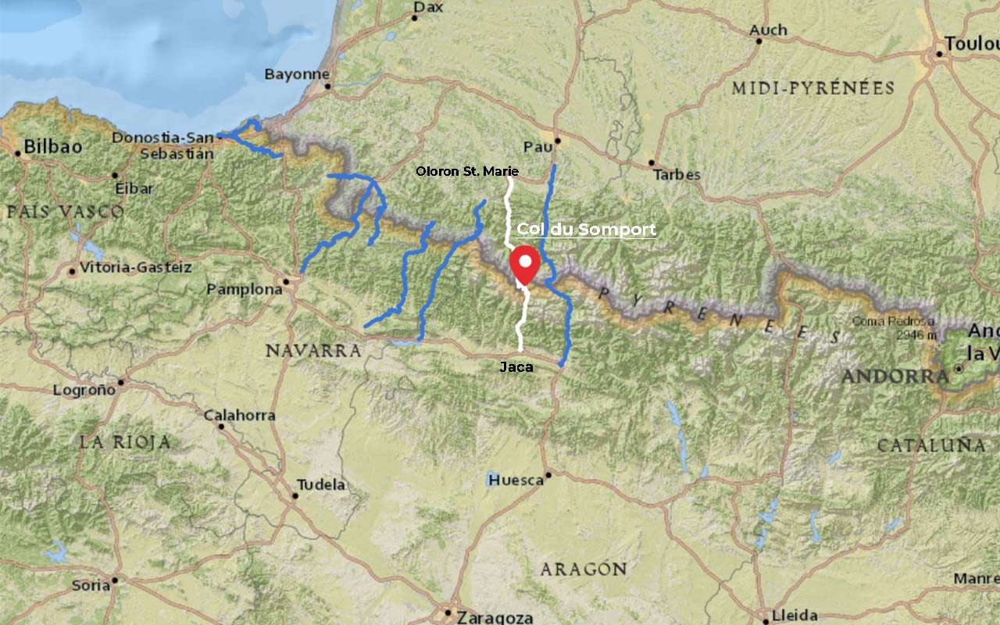
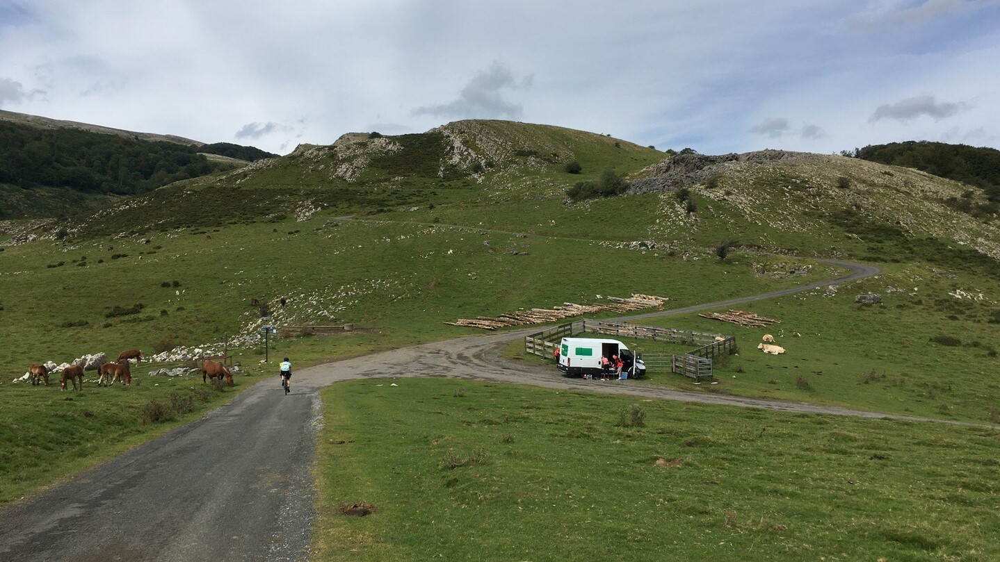
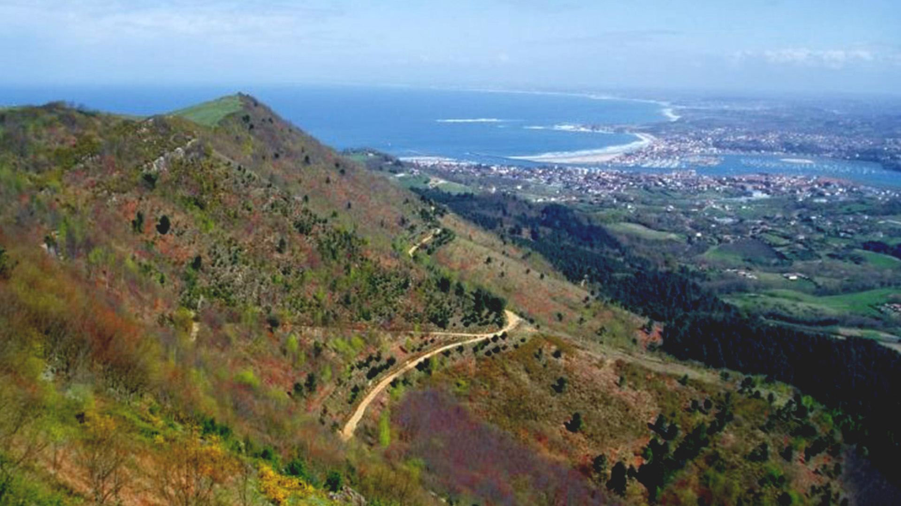
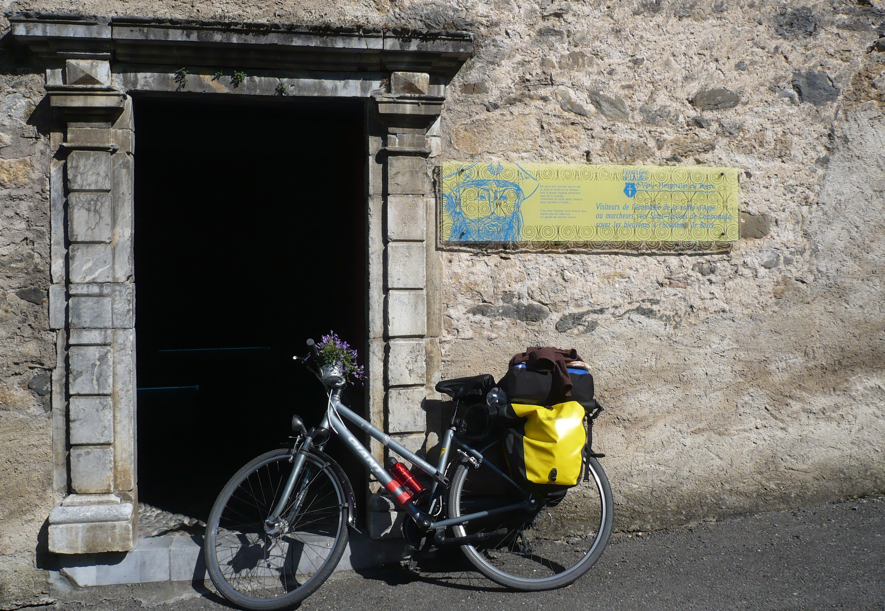
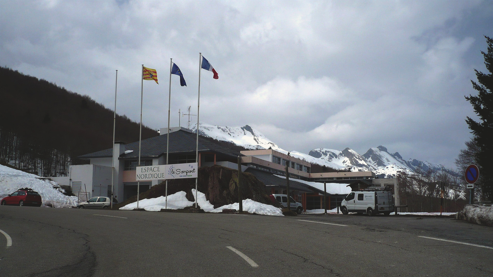
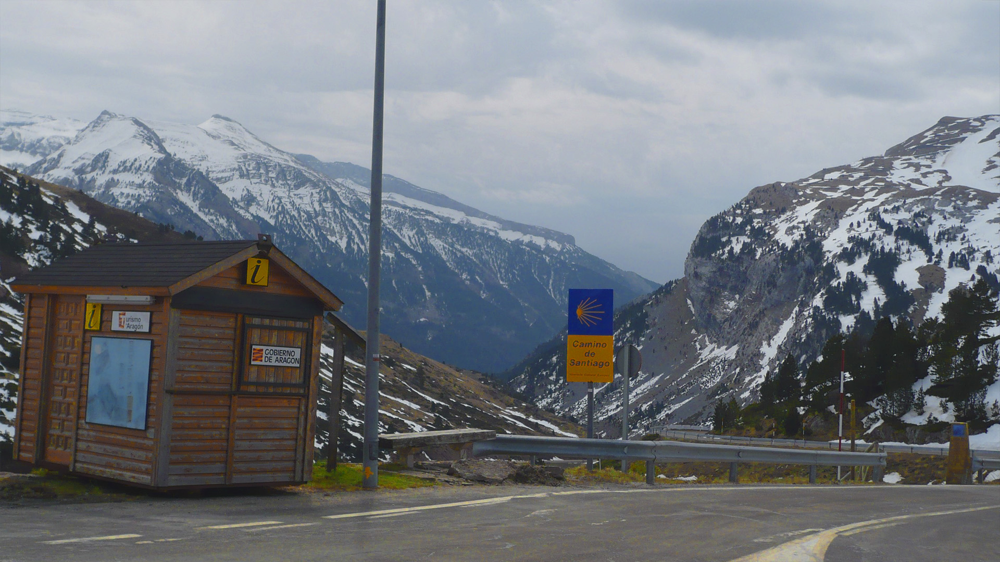

import SevenRoutesDownload from "../../../src/utils/sevenRoutesDownload.js";

In the south of France on my tour from the Netherlands to Spain, [I met Jaqueline](https://weonbikes.com/en/blog/camino-santiago-by-bicycle-part-1/), my travel campanula. After the early summer temperatures, we headed over the Pyrenees to Spain, where completely different weather awaited us. But first we had to cross the pass. Read about Pyrenees passes for bicycle pilgrims and my travel diary day 20 and 21...

Cycling across the Pyrenees
---------------------------

If you want to get from France to the Iberian Peninsula, you have to cross the Pyrenees. The 430 km long mountain range stretches between the Atlantic and the Mediterranean. Luckily, the highest peaks of over 3000 meters are not in the peripheral areas by the sea, so that you can get to the other side more or less comfortably on a touring bike. 8 passes on the west side of the Pyrenees are in the running for cycling pilgrims on the Camino de Santiago. You can download the GPX file of the Pyrenees passes here.

<SevenRoutesDownload link="https://drive.google.com/drive/folders/1eDMvDqrpQdwcsQrsbptQuo3eoYFjxVgD?usp=sharing" />

### Col du Pourtalet 1794 m

Cycling south from **Pau**, you'll get to the Col du Pourtalet or Puerto de Portalet d'Aneu. On the other side, the road goes south towards Huesca. The town of **Sabiñánigo** is roughly east of Jaca. There you can get onto the Camino Frances to Santiago de Compostela.

The pass has a **long ascent** through the Gave-de-Brousset river valley and is therefore not particularly difficult. East of the Spanish side of the pass is the Ordesa and Monte Perdido National Park: high mountains, deep lakes and beautiful views.

### Col du Somport 1632 m

I took this pass from **Oloron-St.-Marie** to **Jaca**. On the French side, the **climb is relaxed** on a not particularly busy road with scenic countryside. The pass is **open all year round** as ski resorts join on the Spanish side.

The Somport is one of the oldest passes in the Pyrenees. In the 20th century, it became so important that a train connection was built from Pau to Canfranc. Since 1970, the train connection was not operational, and the imposing Canfranc train station has served as the terminus ever since. The re-opening of the original route is planned for 2025.

### Col de la Pierre St. Martin 1760 m

Coming from **Oloron-St.-Marie**, this pass is another option. Lonely and in a grandiose landscape, however, it is pretty tough. On 21 km from Arette you overcome 1440 meters in altitude, that's about **7% incline**. This route joins the pilgrimage route at the eastern end of the **Yesa Reservoir** between Jaca and Pamplona.

### Port de Larrau 1573 m

Lonely and beautiful, but challenging is this somewhat remote pass. Part of the ascent from **Larrau** on the French side overcomes 730 meters in altitude over 7.2 km, which is about a **10% incline**. The pass lies in absolute no man's land between Oloron St Marie and St Jean Pied du Port. For lovers who already know the other passes or want to avoid any traffic.

On the Spanish side, this route comes out at **Lumbier west of the Yesa Reservoir**.

* * *

Coming from **St-Jean-Pied-de-Port** three passes are possible: to the east the Azpegi pass, the most used Puerto de Ibañeta, and to the west the east-west running Col d'Ispeguy.

* * *

### Azpegi 1051 m

Through pastures and along ancient stone circles, so-called chrome lechs, a narrow paved road leads over the Azpegi Pass, which is mainly used by tourists.

The 11.7 km long ascent from Estérençuby climbs 810 meters - an **incline of around 7%.** Suitable for cyclists looking for solitude and wanting to avoid the beaten track. From Orbaizeta on the Spanish side, the road follows the course of the Irati River. In the town of Ariba you can turn west to get back on EuroVelo 3, which then leads to **Pamplona**.

### Puerto de Ibañeta 1057 m

From St.-Jean-Pied-de-Port you can get to **Pamplona** on the [EuroVelo 3](https://weonbikes.com/en/blog/7-cycling-routes-europe-north-to-south/#6-pilgrims-route-5300-km-eurovelo-3) via this pass, also known as Col de Roncevaux or Port de Roncevalles. The pass is **the easiest pass** in the western Pyrenees with an average gradient of 5%. At the top of the pass, the chapel marks the beginning of the Camino Frances, the Spanish part of the Way of St. James.

### Col d'Ispeguy 672 m

From St.-Jean-Pied-de-Port you can also reach the Izpegi Pass. However, the pass doesn't really get you anywhere and is therefore suitable for cyclists who like to try a new pass or want to do an extra loop and enjoy a few steep climbs.

Coming from St.-Etienne-de-Baigorry in France, the average gradient is 6.2%. But there are some places with gradients of up to 12%.

On the Spanish side you come to Erratzu. From there you could continue via Elionzo to Santesteban. There you will meet the EuroVelo 1 to **Pamplona**.

### Alto Jaizkibel 455 m +Alto Agina 554 m

The [EuroVelo 1](https://weonbikes.com/en/blog/7-cycling-routes-europe-north-to-south/#1-atlantic-coast-route-11000-km-eurovelo-1) along the French coast runs from Irun on the Spanish-French border along the Bidasoa River to Pamplona.

Would you like to make a detour to **San Sebastián** or enjoy the breathtaking views of a mountain pass on the Atlantic? Then you should take the coastal road from Hondarribia to San Sebastián via the Alto Jaizkibel and from there through the foothills of the Pyrenees to the Alto Agina. On the pass road you get back to the EuroVelo 1 in Amixelaieta.

* * *

You can find more information about all the passes in the Pyrenees to cycle on [Quäldich](https://www.quaeldich.de/regionen/pyrenaeen/paesse/karte/) and on [Climbfinder](https://climbfinder.com/en/regions/pyrenees). Can't get enough of mountains? Take part in the [Trans-Pyrenees-Race](https://transpyrenees.cc/): 1500 km self-supported through the Pyrenees.

* * *

I had now arrived in Pau on my touring bike with luggage and was about to cross the Pyrenees for the first time. Let's see how it went:

## Day 20, Sunday April 6, 1740 km

> I was super tired from the sunburn. I woke up at my bench at half past seven. Cloudy - fortunately, no more sun. I rode to the train station. In order to be able to use proper toilets, I had breakfast in the café: coffee and 2 Chocolatine for €5.50. My budget was crying out for compensation days.  
> I didn't feel like cycling yet. I checked the station map for how to get to Oloron-St.-Marie. Then I wrote my diary.  
> Cycling is by no means a natural form of travel for everyone. "Why don't you just go for a ride and come back here?" my friend in the Netherlands had said. Well, that's basically what I did, even if the loop turned out to be bigger than expected. In contrast to the initial "let's get away", coming back had even become my travel motto. A lot of zen had already happened here.  
> "You can just as good go cycling in Poland, allow yourself being close," my friend in Germany had recommended. Of course, that would have worked as well. I would have learned other new things, not those - my - things I had learned by now that have become dear to me. Now I am here in Pau. 30 years old, almost divorced, resigned from my permanent full-time job, making a pilgrimage to Santiago de Compostela because that's where the bicycle travel guide leads to. Hm.  
> My blood pressure hadn't fully recovered yet. I dawdled away in all blissful peace, zen instead of haste, and sang a song. The sun broke through the cloud cover. Or never go back after all?  
> The sun didn't stay. With my sunburn and taped glasses on my nose, the clouds were more practical anyway. Otherwise, I would have to put in my contact lenses with sweaty fingers to be able to put on my sunglasses.  
> I drove to Oloron-St.-Marie. I had looked up the route on the station map. Because my [travel guide "Along the old ways"](https://weonbikes.com/en/blog/7-cycling-routes-for-bike-tour-holidays/#2-along-old-roads-1600-km-maastricht--oloron-st-marie) was already in the package on the way home. The next book only started in Oloron-St.-Marie.  
> As if by magic - or do I actually have navigation skills? - I found the junction. I was pretty proud of myself. As a total orientation dead loss... If I leaned my bike against a tree against the direction of travel, after peeing, I no longer knew where I had come from.  
> But was this junction such a good idea? The road was small and pretty bad. There was a slope of 14%, I got scared of heights - already! To be on the safe side, I rode downhill as slowly as the rode bike cyclists coming uphill.  
> The west wind (we are big friends) came up again after a week's break. Fresh and steady, he cooled my sunburned faces. Was just there, just like me, only a few billion years older. No reason to chafe.  
> After 30 km I arrived in Oloron-St.-Marie. Sunday Mass had just ended at Notre Dame. A demotivated clergyman gave me a stamp.  
> The whole town smelled chocolate. Looking for the little street my guide pointed me to, I came across the origin of the smell: a Lindt chocolate factory! Awesome thing. Otherwise, I didn't find anything that was open after noon on a Sunday, except for an expensive boulangerie.  
> So I cycled on to the mountains. I didn't feel like pedaling at all. I dawdled. There was a hostel in every village here, no worries. Later, however, I only passed through tiny villages and doubted that they would even let me stay overnight.  
> Visually I was going downhill, but if I didn't pedal, I stopped, even with a tailwind. Something's not right.

> Suddenly I was in the last village 20 km before the pass: Borce, very pretty, splendid view, St. Jacques Museum with a lovely pilgrim hostel in it. It cost €11.80, though. I could park my bike and Jaqueline warm and dry inside. I went in and unpacked, was the only one. Great, so I could wash my stuff.  
> I shopped in the village. For €7.70 I got 2 apples, 1x milk, mashed potatoes, chorizo, yoghurt, bread. I cooked at the accommodation. The chorizo was disgusting. I ate it anyway. Half past nine the landlady came to collect and stamp. She had her 10-year-old daughter with her who thought my food stank, which she was absolutely right about. I showered, washed my clothes, wrote my diary and played the flute. Relaxed.

I didn't take a tent on this trip, but I always had my flute with me. I played in the streets when necessary and as a thank you to people who had accommodated me. Or just like that for me.

## Day 21, Monday April 7, 1820 km

> My clothes weren't really dry in the morning. I put them on the heater and had breakfast. Muesli with yoghurt, an apple and chamomile vanilla tea. When my clothes were halfway dry, it was half past nine.  
> Today I put my backpack on my back because it was easier to ride uphill. At breakfast I wrote a birthday card. As I cycled through the next village, Urdos, the last French village, I posted it in the mailbox. You can always find one in France, even in the most remote place.  
> I cycled up the pass at 6 km/h. Snow on the roadside and in the countryside. I was wearing gloves again. In the 4 hours to Somport, a bus drove past me several times. In the distance the flags of the Somport. Almost there! In the end it wasn't that difficult. Only long. I was glad that I made it to Borce yesterday.

> At the border crossing there was a restaurant where I had soup with bread and a brownie chocolate ice cream. When I came out it started raining cold. There was also a strong headwind. Jaqueline was fed up: first the 2 days of heat and sun, then snow all around us and now this. She totally let herself down. I told her how other Campanula around the world delighted people's hearts under way more adverse circumstances, covering whole fields with a flower carpet that it was a feast for the eyes. Jaqueline just nodded tiredly. As a traveling campanula, she had her own challenges to contend with.

> I cycled downhill to the valley. Jaqueline didn't have a chance to hang anymore because I couldn't possibly keep the brake on all the time. I was in a hurry: in the heavy, freezing rain, Jaqueline and I quickly became a block of ice. I was only wearing the sleeveless fleece under my jacket.  
> Past Candanchú to Canfranc-Estación. Unfortunately, the well-known train station was just a major construction site. I quickly put on my fleece jacket on the street. Spain looked quite different from France, the signs, the traffic. Multi-storey new buildings instead of 1000-year-old ruins. The 30 km to Jaca went quickly. On the way I saw 6 pilgrims. After 3 weeks of French solitude, I was no longer used to "so many" people.  
> On arrival in Jaca it was half past three: rain and siesta time. The albergue was supposed to open at 4. I was the second to arrive. It would get completely full that day. The other pilgrim was a Spaniard just beginning his Camino. It was very routine here: Pilgrim's pass + ID = stamp, €8 = bed. I left my stuff on a bed and went with the Spanish guy to a supermarket. I paid €5.50 for yoghurt, bread, milk, chocolate and instant soup. In the meantime, Germans and 3 Australians had arrived at the hostel. Later we talked all evening over a glass of wine. One of the Australians told me how you can always win a bet: When you've just poured the last sip of wine, how many drops are left in the bottle? Mostly 17!  
> The dormitory was completely full. Another five Spanish people had arrived. I felt comfortable listening to all the snoring, mobile phone beeping and ringing.

In the third part of this Solo series, Jaqueline and I continue our cycling tour to Santiago de Compostela on the Camino Frances. From now on we meet many pilgrims and are more among people - with the associated side effects:

> \[...\] After realizing my camera was missing, I realized that my wallet was gone too. Stolen? I tried to remember last night. Difficult. Probably due to the wine. I had been sitting outside on my seat mat \[...\]

* * *

In spring 2008 there weren't many pilgrims on the Camino Frances. Nowadays that's different. An alternative is the less crowded Camino del Norte, which is high on my list for our Cape-to-Cape tour next year. Along the north Spanish coast through Asturias, spectacular views and nicely green. Stay tuned! Until then...

**_Get on your bike and share the most beautiful, safest, shortest, or longest and most practical bike routes with others. Talk about holidays by bicycle. Give someone a bike or a bike day! Just don't give up until everyone's riding by bicycle. Because cycling makes you happy._**

<SevenRoutesDownload link="https://drive.google.com/drive/folders/1eDMvDqrpQdwcsQrsbptQuo3eoYFjxVgD?usp=sharing" />

The maps in this article were created using [MapHub](https://maphub.net/) using the map National Geographic, Esri, DeLorme, HERE, UNEP-WCMC, USGS, NASA, ESA, METI, NRCAN, GEBCO, NOAA, iPC.