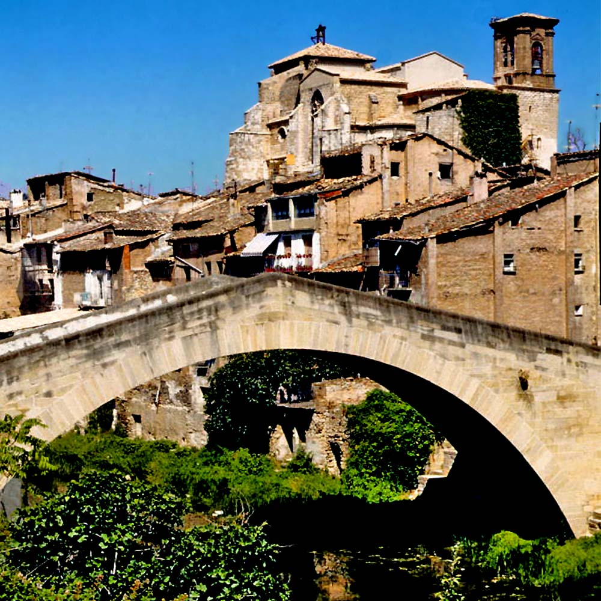
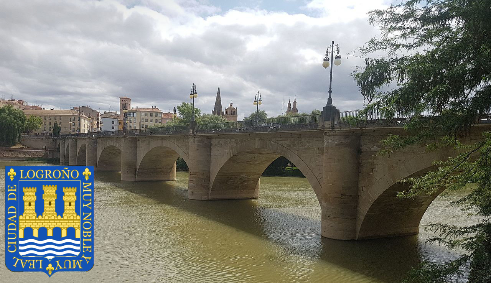

I had cycled from the Netherlands through picturesque France. In the sunny south I got myself a [bluebell named "Jaqueline"](https://weonbikes.com/en/blog/camino-santiago-by-bicycle-part-1/) and placed her on my handlebars to keep me company further on. I had [crossed the Pyrenees via the bike-friendly Col du Somport](https://weonbikes.com/en/blog/camino-santiago-by-bicycle-part2/) and now I had arrived in Jaca, at the start of the Camino Frances – the Spanish part of the Camino de Santiago...

## Day 22, Tuesday April 8, 1875 km

The next morning the Spaniards packed up at half past five. It was pouring rain outside. The Australians also left at half past seven. One of them gave me a golden kangaroo pin. So now I'm walking around in Spain with a kangaroo pin. The 4 Germans were still there.

Georg, a recently retired lawyer, wanted to go for a coffee. That was music to my ears. We found a Pastelería and George invited me. I ordered 2 coffees and 2 croissants straight away. A conversation at breakfast at a table, in the dry. Very pleasant. We said goodbye at half past nine.

It was pouring rain. Nevertheless, the first 30 km flew by. I saved myself the detour to the monastery of San Juan de la Peña in this lousy weather. All the way to Yesa was on the N240, the only major east-west road in the area. True to the law of the series, 3-4 trucks drove past me again and again. The landscape was exciting. I had no idea what to expect in Spain and so got to see what I didn't know. Lunar landscape, reservoir, vultures, strong-smelling juniper trees (or something like that).

Jaqueline recovered well under these conditions. When I got to Yesa, the rain stopped. It was only 1 o'clock. Today I wanted to go to Sanquesa, only 13 km further, so I made a detour to the Castillo de Javier. That was boring, though. I sat on the wall and ate a huge apple. Then uphill, out of the reservoir valley.

I arrived again in the middle of the siesta: at 3 o'clock. I searched the hostel and was referred to an address for the keys. Closed. A phone number. No English. The man still understood that I was standing in front of his hostel and came out. He gave me the key. A Polish guy who spoke German and his Spanish girlfriend were in the albergue. The man asked me about my route. With my mouth full, eating bread with honey, I told him about my tour.

Shopping. The bad thing about the Camino is that it gets 30 cents more expensive every few kilometers. The Albergue cost 8€. So I would spend 13€ every day. Too much. I had to eat less and sleep outside more often. So far, that hasn't been as easy in Spain as it was in France.

I was alone again in the accommodation. The other two had apparently left. So I had the shower to myself and could wash my laundry, which I then dried one piece at a time on the rickety electric heater.

## Day 23, Wednesday April 9,1950 km

Yesterday I found rice in the kitchen and had cooked it. Now I stored it in my luggage. Good for my budget. I ate the last cereal. Somehow, I lost quite a lot of hair. Certainly not from malnutrition. In addition to the amounts I ate, I also took vitamin pills. More likely from sweating. Or from thinking...

I left at 9. I wasn't used to seeing that many people on the street. It was warm and kind of muggy. After half an hour I came through an interesting canyon with vultures and swifts. I wandered around among the rocks and took pictures until the battery died. The valley extended for another 30 km. Vulture parents taught vulture children the most important flying skills. Red kites and other large birds I didn't know were flying around.

4 km country road with dusty trucks. Stress, also for Jaqueline. Shortly before Puente la Reina we were able to relax in a small octagonal church with relaxing music. Puente la Reina was very busy. Pilgrims everywhere. The Albergue cost 5€. For dinner we had yesterday's rice.

A group of 4 Germans invited me to wine. We were about the same age. I took out the cheese that I had carried about 400 km since Nexon. It had still been cold then. The smell drowned out that of 20 pairs of pilgrim shoes standing outside the door. Whether that was beneficial is hard to say. It was about 20°C and we sat comfortably outside.

Today I rode my 2000th kilometer of this trip. We toasted to that. My bike made noise for the first time. I oiled the chain. Maybe it will help.

## Theft

### Day 24, Thursday April 10, 2620 km

The first crazy pilgrims got up at 6 a.m. and started going. I got up at half past eight. Today I had rice and yoghurt for breakfast.

When I packed, I missed my camera. That was my day anyway; When I got the water bottles off the bike, the door had slammed shut behind me and I was locked in the garden. The gate was also closed. I shouted to a group of guys. After 3 times calling one went in but then came out without my door opening, shrugged and walked away with his friends. Then someone happened to come into the garden to get his laundry. I was freed.

After realizing the camera was missing, I realized my wallet was gone too. Stolen? I tried to remember last night. Difficult. Probably due to the wine. I had been sitting outside on my seat mat. Camera and wallet in the jacket. But I had gotten out the rice and cheese, and my guidebook. No matter how - both were untraceable. Who knows, maybe I gave away all that crap while I was drunk. Although the evening with Steffi, Katherina, Thomas and Mario, the hospital staff from Günzburg, wasn't so boozy that it would have left gaps in my memories.

There was only one pilgrim left in the shelter. She kindly took me to the manager and explained my problem in Spanish. No, of course nothing had been found. I gave her my phone number just in case, looked through everything again and then gave up. I borrowed one euro from her for the internet and had my bank card blocked and charged my mobile phone card.

Meanwhile, the cleaning lady was busy collecting the food that had been left behind. That way I got a bag of supermarket muffins, an apple, and some supermarket palmiers. Good yield.

I left at 10 a.m. After a few kilometers it started raining. But only briefly. Then hail set in. Mainly to protect Jaqueline, I hid under a tree next to a utility pole and waited out the storm. When the hail turned to rain again, I cycled on.

I mourned after my camera. I was actually a photo grump, but recently, I had started to have fun taking snapshots. Without a camera, my urge to communicate was handicapped.

I sat on my bicycle, dripping, with a travel Campanula rattled by the hail, and had to laugh. I still didn't like Spain very much and at least today I had a decent reason. It was a shame about the camera, but it was ugly here anyway. Of course, I no longer had the picture of me and Georg having breakfast in Jaca, nor the lunar landscape by the reservoir and the ravine with the vultures. On the other hand, I didn't have to take any more photos of an old stones. There were only a few cents in my wallet. And the Visa and debit card, railway card and - that was a pity - the golden kangaroo pin from the Australian. It was in there because I had washed my fleece shirt.

I still had 250€. So I had already spent 350€ in 24 days, with 100€ for the accommodation because of flooding. At €10 per day, that would be enough for 25 days. Maybe I could wire an amount to someone to get some cash? On my account I had 300 € left. At least, I now had the compensation days I wanted. Be careful _what you wish for_, my mother always says...

I rode through Estella, a nice town with a busy market which I really enjoyed. This way I liked Spain. Since Estella was still dripping from the thunderstorm, I ate a couple of my muffins while standing. the route continued uphill and downhill. Quite exhausting. Occasional heavy rain. Landscape was also there, but nothing to write home about. The 66 km to Logroño were enough for today.

Logroño surprisingly saved my day. A real city with dusty, smelly industry at the entrance, a bit of the Middle Ages and a lot of life. The albergue only cost 3€. There was a clothes dryer and pilgrims could use the internet on donation base. Perfect.

My pilgrim's left-over breakfast bag wasn't suitable to substantially satisfy my hunger, so I had to go shopping again. I opted for 2 apples, 3 bars of chocolate and 1 bread, of which the apples were by far the most expensive. For dinner I had the rest of the rice and chocolate. What a combination.

I met the Spanish guy with his girlfriend from Sanquesa at the accommodation. Since they didn't travel by bike, they must have made their "pilgrimage" by bus or car to be here already. Not allowed. I hope they don't end up in hell for this. Before Logroño there was actually a checkpoint for stamping the pilgrim's passport, that's how seriously they took it here.

In the dormitory there were always 2 bunk beds arranged as a compartment. I shared a compartment with 2 elderly gentlemen. I told my story about the stolen camera and wallet. The German guy comforted me with a bar of chocolate. The Swedish guy put the headphones of his MP3 player on my head. Neil Young playing. The world's all right...

---

So far so good. Budget for another 25 days and Jaqueline, my travel flower who keeps me company, recovered from the hail. I will continue my way to Santiago de Compostela by bicycle without my camera, but avidly writing my diary day after day:

> A momentous day. It started just below 0 degrees with dense fog. Punctually at 6:30 a.m. the lights and cheerful Camino music were switched on and at 8 a.m. the cleaning lady came rattling the keys. I had the best breakfast ever: lentil soup. The soup came from a coup-a-soup bag. Warm, especially warm, and possibly nutritious, too.  
> The guidebook sent me on the unacceptably rocky pilgrim's trail for the first 15 km. The fog settled on me as snow or frost....

Part 4 will bring us from Logroño to Burgos and Leon. Until then...

**_Get on your bike and share the most beautiful, safest, shortest, or longest and most practical bike routes with others. Talk about holidays by bicycle. Give someone a bike or a bike day! Just don't give up until everyone's riding by bicycle. Because cycling makes you happy._**

  Pictures used in this article are from:{" "}
  <a
    style="color: black"
    href="https://commons.wikimedia.org/wiki/User:Comakut"
  >
    Comakut
  </a>
  ,{" "}
  <a
    style="color: black"
    href="https://commons.wikimedia.org/wiki/File:Foz_de_Arbayún.jpg"
  >
    Foz de Arbayún
  </a>
  ,{" "}
  <a
    style="color: black"
    href="https://creativecommons.org/licenses/by-sa/3.0/legalcode"
    rel="license"
  >
    CC BY-SA 3.0
  </a>
  .{" "}
  <a
    style="color: black"
    href="https://commons.wikimedia.org/wiki/User:LBM1948"
  >
    LBM1948
  </a>
  ,{" "}
  <a
    style="color: black"
    href="https://commons.wikimedia.org/wiki/File:Estella_1990_01.jpg"
  >
    Estella 1990 01
  </a>
  ,{" "}
  <a
    style="color: black"
    href="https://creativecommons.org/licenses/by-sa/4.0/legalcode"
    rel="license"
  >
    CC BY-SA 4.0
  </a>
  .{" "}
  <a style="color: black" href="https://commons.wikimedia.org/wiki/User:Jynus">
    Jynus
  </a>
  ,{" "}
  <a
    style="color: black"
    href="https://commons.wikimedia.org/wiki/File:Vista_de_Logrono_2016.jpg"
  >
    Vista de Logrono 2016
  </a>
  ,{" "}
  <a
    style="color: black"
    href="https://creativecommons.org/licenses/by-sa/4.0/legalcode"
    rel="license"
  >
    CC BY-SA 4.0
  </a>
  .{" "}
  <a
    style="color: black"
    href="https://commons.wikimedia.org/wiki/User:Heralder"
  >
    Heralder
  </a>
  ,{" "}
  <a
    style="color: black"
    href="https://commons.wikimedia.org/wiki/File:Arms_of_Logroño_(Spain).svg"
  >
    Arms of Logroño (Spain)
  </a>
  ,{" "}
  <a
    style="color: black"
    href="https://creativecommons.org/licenses/by-sa/3.0/legalcode"
    rel="license"
  >
    CC BY-SA 3.0
  </a>

