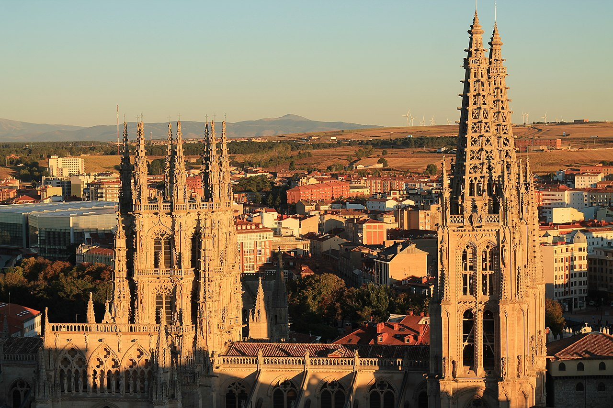
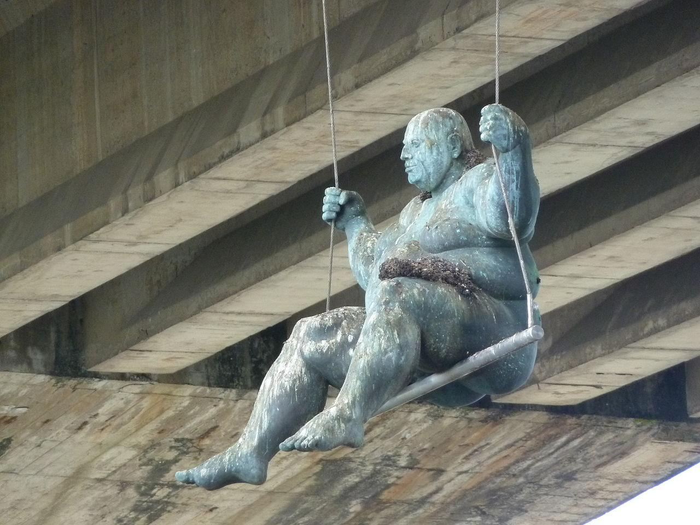
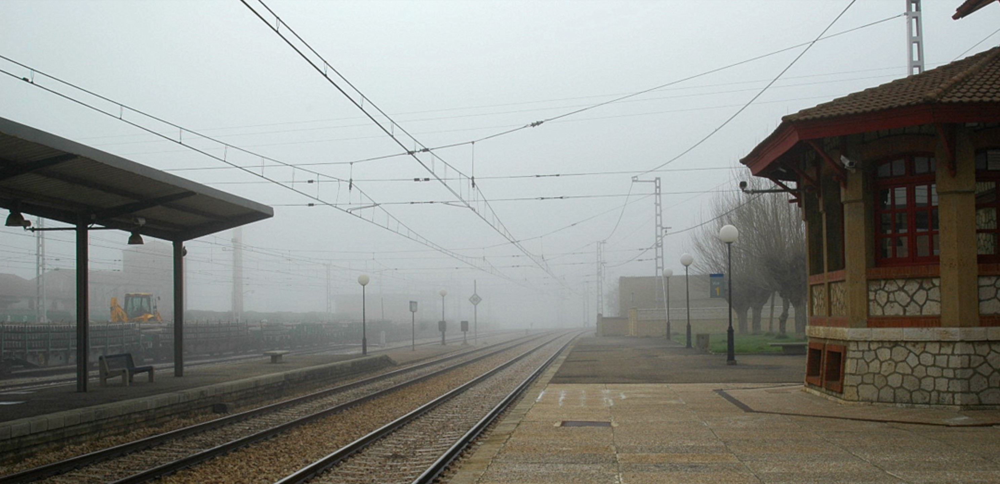
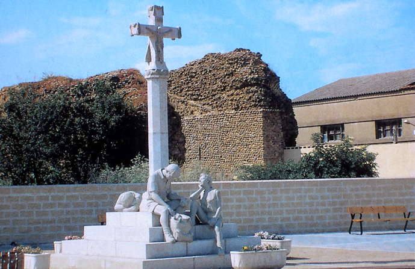
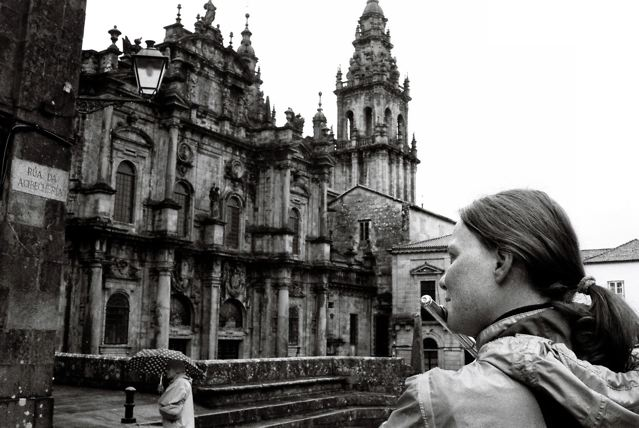

import SevenRoutesDownload from "../../../src/utils/sevenRoutesDownload.js";

2008 radelte ich solo ohne Zelt von den Niederlanden nach Spanien. In [Teil 1 in Südfrankreich](https://weonbikes.com/blog/jakobsweg-per-rad-solo-teil-1/) fand ich Jaqueline, eine Glockenblume, die mir fortan an meinem Lenker Gesellschaft leistete. Über den fahrradfreundlichen Col du Somport überqueren wir in [Teil 2 die Pyrenäen und stellen 7 weitere Bergpässe für Fahrradpilger](https://weonbikes.com/blog/jakobsweg-per-rad-solo-teil2/) vor. In Spanien, zu [Beginn des Camino Frances in Teil 3](https://weonbikes.com/blog/jakobsweg-per-rad-solo-teil-3/), werden mir Geldbeutel und Kamera gestohlen. Im vierten Teil geht es nun mit knappen Reserven gegen Wind und Regen weiter auf dem Pilgerweg per Rad. Jaqueline, meine blumige Reisebegleiterin, wird mich verlassen.

<SevenRoutesDownload link="https://drive.google.com/drive/folders/1eDMvDqrpQdwcsQrsbptQuo3eoYFjxVgD?usp=sharing" />

## 25\. Tag 11. April Freitag 2085 km

Heute schliefen die Leute länger, obwohl man hier pünktlich um 8 Uhr rausgefegt wurde. Meine Wäsche war natürlich nicht trocken. Von Socken und Unterhose hatte ich noch ein paar, den BH konnte ich weglassen, die Radlerhose zog ich einfach feucht an. Die wurde sowieso bei jedem Regen nass.

Beim Frühstück unterhielt ich mich mit einem australischen Jungen, der auch mit dem Rad unterwegs war. Aber sportlich, Berge hoch und runter. Wie ich schlief auch er öfter draußen. Wir tauschten Erfahrungen über Bushaltestellen aus und kamen überein, dass die an 3,5 Seiten geschlossenen in Frankreich, die besten waren.

Es war sonnig, aber die Temperatur war auf 5°C gesunken. Ich fuhr zunächst auf dem Wander-Camino und überholte alle meine Mitbewohner. Dann ging's auf der Straße weiter. In Najera machte ich Pause. Es war kalt und auf das ebenfalls kalte Chlorwasser aus dem Wasserhahn der Herberge in meiner Wasserflasche hatte ich keine Lust. In dem selten hässlichen Städtchen, das mir gleich sympathisch war, sah ich ein Café namens Sofia und genehmigte mir einen Kaffee. So saß ich mit meiner feuchten Radlerhose zumindest auf einem Stuhl und nicht auf kalten Steinen. Blasenentzündung war echt das Letzte was die Menschheit brauchte. Draußen aß ich noch ein Stück Brot mit Schokolade.

Dank Jaqueline legten die alltagsgestressten Spanier ihre verkniffenen Falten zu einem amüsierten Lächeln zusammen, wenn sie unser gewahr wurden.

Am anderen Ende der Stadt hatte Najera die ganze sagenumwobene Geschichte der Navarra zu bieten. Es begann zu regnen. Ich verzichtete. Auch auf den "Umweg" über die 3 Klöster aus meinem Reiseführer. Stattdessen nahm ich unverfroren die N120 nach St. Domingo de la Calzada. Über 20 km war ich damit beschäftigt, auf dem halbmeterbreiten Seitenstreifen dem Frachtverkehr zu entgehen.

In St. Domingo machte ich regengeschützt auf einer Bank Pause. Sogleich leisteten mir 2 gesellige Pilger aus Osnabrück Gesellschaft. Wir tauschten Schokolade gegen Magnesiumtabletten und hatten Spaß. Als der Regen aufhörte, zogen wir weiter.

Bis Belorado fuhr ich 20 km auf leichter Strecke. Regen. In dem ruhigen Ort suchte ich die Herberge. Für 7€ plus 3€ Frühstück wurde ich fündig. Wir waren bisher zu zweit. Ich schlief erstmal und duschte dann lauwarm. Immerhin wärmer als der Regen. Erstaunlicherweise war die Albergue mit Heizkörpern ausgestattet. Die waren allerdings trotz der 7°C draußen kalt. Wahrscheinlich nur für Minusgrade vorgesehen. Eine Küche gab es nicht.

Ich lief mit Michele, dem anderen Pilger, zum Supermarkt. Als er fragte, warum ich mein Geld in einer Plastiktüte hatte, erzählte ich ihm von dem gestohlenen Geldbeutel und der Kamera. Er lud mich gleich auf einen Kaffee ein.

Im Esszimmer der Albergue dinierte ich. Ich hatte mich dazu hinreißen lassen, außer Schokolade und Baguette auch noch Käse für 2,99€ zu kaufen, sodass ich schandhafte 5€ für Essen ausgab. Eine Missetat, die sich durch das Geschmackserlebnis relativierte. Außerdem aß Michele seinen Pilgermenü-Salat nicht auf! Die zweite Geschmacksexplosion. Ich hatte gefühlt seit Wochen keinen frischen Salat mehr gegessen. Dann noch einen heißen Tee.

Ich schrieb Tagebuch. Spanien war bisher nicht viel hübscher geworden, aber ich hatte begonnen, mich mit dem Land anzufreunden. Ich verdrehte mir zum Beispiel den Kopf nach den lustigen bunten Vögeln, die hier umherflogen und verstand schon etwas mehr von der Sprache. Trotzdem wollte ich mich nicht mit Sehenswürdigkeiten aufhalten, sondern Richtung Meer fahren. Jaqueline, meine Glockenblume, fand das gut. Denn wenn wir hier in Spanien am Meer waren, konnten wir schön zurück nach Frankreich radeln, wo das Klima günstiger für eine Reise-Campanula war. Und zu Hause würden wir für sie ein passendes Plätzchen im Garten finden.

## 26\. Tag Samstag, 12. April 2165 km

Der Tag begann kultiviert mit einem Frühstück in Gesellschaft von Michele. Für 3€ bekamen wir einen Berg Zwieback, Marmelade, 20g Butter, Saft, miesen Kaffee und warme Milch. Das war nicht dumm, denn der Zwieback-Milchkaffee-Mix quoll noch 2 Stunden später in meinem Bauch vor sich hin und sättigte.

Michele führte auf großen Blättern in penibler Schrift Statistiken über seinen Weg. Er war spät dran und zog los.

Draußen schien die Sonne vom wolkenlosen blauen Himmel und mein Freund der Westwind blies mir kräftig entgegen. Mein Organismus stellte sich sogleich auf die angenehm französisch-vertrauten Wetterbedingungen ein.

48 km waren es laut Schild auf der N120 nach Burgos. „Das hättest du ja gestern noch fahren können“, suggerierte mir mein wirres Hirn, obwohl ich schon beim Fußmarsch zum Supermarkt am Nachmittag fast zusammengeklappt wäre. Immer noch nicht tiefenentspannt.

Durch den klaren Himmel erschienen die schneebedeckten Gipfel beunruhigend nah. Ich beschloss, auf der N120 zu bleiben und dadurch ein paar Kilometer und somit auch Kräfte, Nahrung und Geld zu sparen.

Möglicherweise ein Trugschluss. Denn die N120 wellte sich zunächst bis Villafranca und wartete dann mit einer 7 km langen 5%-Steigung zum 1150 m hohen El Pejara auf. Bei Gegenwind ging es anschließend weiter bergauf und bergab. Kein Dorf weit und breit. Dann endlich wie aus dem Nichts eine Bushaltestelle - geschlossen mit Eingang.

Ich blieb draußen und machte es mir hinter einem Mauervorsprung in der Sonne windgeschützt bequem, denn innen war es arg vermüllt. Auch der Straßenrand war mit Plastikflaschen und Red-Bull-Dosen übersät. Kilometerweit. Die Ersatzwasserflasche auf meinem Gepäckträger hatte ich an einer Tankstelle in Hannover gekauft. Das war auf meiner Fahrradtour von Berlin in die Niederlande im Februar, als ich auf dem Weg meine Cousine besucht hatte. Die benutzte ich noch immer.

Die Sonne taute mein Eisfüße langsam auf. Baguette und Schokolade taten ihr übriges für meinen Blutzuckerspiegel. Von der langen Steigung war ich einigermaßen fertig, die nächsten 25 km kämpfte ich gegen den Wind.

Burgos begann wie jede andere Stadt: Ich unterquerte die Autobahn und den Stadtring, fuhr durch Industriegebiete und Neubaublöcke. Der gelbe Camino-Pfeil führte an derart abgewrackten Hinterhöfen vorbei, dass ich schon begann, an der Echtheit der Wegweiser zu zweifeln und eine Touristenfalle befürchtete. Aber nichts dergleichen. Ganz im Gegenteil. Verlor ich den Pfeil einmal, half mir ein aufmerksamer Bürger umgehend auf den rechten Pfad zurück.

Plötzlich stand ich im touristischen Zentrum und vor der gewaltigen Kathedrale. Für einen kurzen Moment spürte ich einen Fluchtimpuls in mir aufwallen. Ziemlich überwältigend nach dem anhaltenden Entzug urbaner Reize der letzten Zeit.

Ich fuhr zur Herberge im Park El Parral. 3€, fantastisch. Ich war völlig fertig. Wahrscheinlich Schokoladenvergiftung. Ständig Zucker ist eben nicht gut. Trotzdem wankte ich zurück in die Stadt, fand einen Bäcker und kaufte ein Brot und ein Ding mit Schinken, Ei und Käse und versuchte, meinen Magen mit eiweißhaltiger Kost versöhnlich zu stimmen.

Burgos hatte viel zu bieten. Am besten gefielen mir die vielen Skulpturen und die Flusspromenade am Arlanzon. Mit meiner Kamera hätte ich jetzt eine Skulpturen-Fototour gemacht und zu Hause die Leute damit gelangweilt. Hatten die Glück, dass die Kamera geklaut war.

Ich setzte mich alle Nase lang auf eine Bank. Nach einer Weile hatte sich mein Magen beruhigt und war das Blei aus meinen Beinen gewichen. Ich lief zum Bahnhof. Schock: winzig und unbedeutend. Entweder hatte ich da was verwechselt oder das war ein Minuspunkt für Burgos.

Ich ging zurück in die Albergue und schlief umgeben von angenehm lautem spanischem Stimmengewirr ein.

## 27\. Tag Sonntag, 13. April 2220 km

Das Bett hatte gehalten. Der nette übergewichtige Spanier war nicht durchgebrochen.

Trotz seines Übergewichts und meiner Überdosis aßen wir beide Schokolade zum Frühstück. Außerdem Brotreste mit Honig und Käse.

Ich unterhielt mich mit einer Frau aus Kanada, die ihre geschundenen Füße pflegte. Ich fühlte mich angeschlagen, hatte Halsschmerzen und überlegte laut, ob ich es in der großen Kathedrale vielleicht mal mit Beten versuchen sollte. Ich erzählte von meinem gestohlenen Geldbeutel. Schließlich war Sonntag und zum knappen Budget wollte ich nun nicht auch noch krank werden. Die Frau fand das eine ausgezeichnete Idee. Als ich vom Klo zurückkam war sie fort und an meinem Gepäck klebte ein 10€-Schein. Das war das Größte. Wusste sie, wie viel mir dieser Tage 10 ganze Euro bedeuteten?

Ich holte mein Rad und traf die Frau draußen wieder. Sogleich stellte ich ihr Jaqueline vor. Sehr erfreut: die Frau aus Kanada hieß auch Jaqueline!

Die Stadt war nass vom nächtlichen Regen, 5°C, garniert mit Westwind. Kein Mensch unterwegs. Ich hatte 10 Euro extra in der Tasche und konnte ruhigen Gewissens gleich weiterfahren. Andernfalls hätte ich auf Menschen gewartet und auf der Straße mit der Flöte ein paar Euro eingespielt.

Kurz hinter Burgos sah die Landschaft mit runden grünen Hügeln angenehm aus. Allerdings nur kurz. Dann ging sie wieder zu den komischen abgebrochenen braunen Felsen über. Nach 2 Steigungen landete ich auf einer Hochebene. Nichts, woran sich das Auge festhalten konnte. Ich fragte mich ernsthaft, worum sich die Leute hier vor 1000 Jahre gestritten hatten. Geier, Störche und Milane fühlten sich hier wohl, aber Menschen?

Der Wind fegte energisch über die barrierefreie Hochebene und mir meine Gedanken aus dem Kopf. Nach 25 km gegen den Wind kam ich in Castrojeriz an. Ich fand einen geöffneten Supermarkt und eine trockene windstille Bank auf einem Spielplatz und war dankbar. 2 Äpfel, Brot und Linsen, außerdem 2 schokohaltige Gebäckstücke.

Weiter ging es gegen den Südwestwind, ab und an Regen. Jaqueline brauchte mehr Windschutz. Die Jakobsmuschel in ihrem Blumentopf an meinem Lenker hatte ich seit Frankreich nicht mehr umgesetzt. Da wir jetzt direkt nach Westen fuhren, zeigte sie in die falsche Richtung. Der Wind rauschte über die Fahrradklingel direkt in Jaquelines Blätter. Zunächst füllte ich etwas Erde vom Acker auf und goss. Dann bastelte ich aus Distelstängeln mehr Windschutz. Das war besser.

Nach 100 Tageskilometern kam ich in Carillon an und fand die Albergue. Als erstes kochte ich Linsen.

Die große Albergue war an ein Stift angeschlossen. Echte Novizinnen hatten mich darauf hingewiesen, dass sich die Tür am Morgen zwischen 6.30 und 8 Uhr zum Entschlüpfen öffnen würde. Waschmaschinen, Trockner und Internet ließen sich gegen Geldeinwurf nutzen. In der Küche fand ich haufenweise übriggebliebene Nudeln. Zusammen mit 2 Pilgerinnen aus Schweden machten wir Pasta mit Pesto.

Die Herberge war kalt. Nach dem Duschen kroch ich in meinen Schlafsack und schrieb. Irgendjemand fand eine Gitarre, die beiden schwedischen Mädchen sangen ein Lied und die anwesenden Spanier legten mit Camino-Lidern nach.

## 28\. Tag Montag, 14. April 2320 km

Ein bedeutender Tag. Er begann kurz unter 0 Grad mit dichtem Nebel.

Pünktlich um 6.30 Uhr waren am Morgen in der Unterkunft die Lichter und fröhliche Camino-Musik eingeschaltet worden und um 8 Uhr warf die Putzfrau schlüsselklappernd die letzten Pilger raus. Ich hatte das beste Frühstück aller Zeiten: Linsensuppe. Die Suppe entstammte einer Coup-a-Soup-Tüte und war warm, vor allem warm.

Der Reiseführer schickte mich zunächst für 15 km auf den unakzeptabel steinigen Wanderpfad. Der Nebel legte sich als Reif auf mir ab – und auch auf Jaqueline. Ich konnte nichts tun. Als sich der Nebel nach anderthalb Stunden lichtete und den wolkenlosen blauen Himmel freigab, war Jaqueline erfroren.

Meine Begleiterin, meine Reise-Campanula hing schlaff über den Rand des Blumentopfs. Vom Frost dahingerafft und nicht mehr wiederzubeleben. Ich spürte, wie mich der Verlust deprimierte und ignorierte die traurige Szenerie an meinem Lenker zunächst. Passenderweise war um mich herum kilometerweit Nichts, das ab und an von grünem und rotem Acker abgelöst wurde. Im Norden sah ich die schneebedeckten Berge, irgendwo da verlief meine Rückroute.

Im Vergleich zu gestern war es heute ganz windstill. Herrliches Wetter und bis Sahagún hatte sich der Acker zu einer angenehmen Hügellandschaft aufgeschwungen. Sahagún sah nett aus. Ich sah Oberleitungen - ein Bahnhof! Da ich Bahnhöfe liebte machte ich mich direkt auf den Weg dorthin.

Sahagúns Bahnhof war gepflegt. Ein kleines ungewöhnliches Bahnhofsgebäude mit einem Café, der Boden übersät mit Kippen und Zuckertütchen, jedoch mit schönen gusseisernen Möbeln und kunstvoll gefliesten Tischen eingerichtet.

Mir stand der Sinn nach einem kultivierten Frühstück bei einer Tasse Kaffee im Warmen. Irgendwie musste ich meinen Jaqueline-Verlust verdauen. Dafür gab es kaum einen bessern Platz, als einen Bahnhof. Bahnhöfe waren für mich schon immer der Inbegriff von Bewegung, von A wegkommen. Nach B oder an einen unbekannten Ort. Ein Bahnhof bietet Sicherheit. Sicherheit gegen das Wetter, das Festsitzen, gegen Aussichtslosigkeit. Ein Bahnhof - egal wie klein - ist ein Tor zur ganzen Welt.

Ich kaufte mir also einen Kaffee und machte mir mein mitgebrachtes Käse-Honig-Baguette. Die Barfrau störte das überhaupt nicht. Sie war damit beschäftigt, einem alten Mann beim Knacken des Automaten zu helfen. Die beiden hatten Glück oder Verstand – jedenfalls klingelte es in der Kasse.

Bis Leon waren es noch 60 km. Seit dem Verlust meiner Kamera hatte ich jedes Interesse an alten Steinen verloren. Aber nach dem kultivierten Frühstück hatte ich Lust, die Infos in meinem Reiseführer zu lesen und mehr über das Land, in dem ich reiste, zu erfahren. Hier in Sahagún hatte einst das größte Kloster Spaniens gestanden, aber weil es eine französische Benediktiner-Abtei war, fühlten sich die Leute in Leon gestört und zerstörten es. Aha.

Auf dem Weg nach Mansilla wurde es warm. In Mansilla setze ich mich für eine Stunde auf den Dorfplatz und ließ mir die Sonne die Steifigkeit aus den Gelenken heizen. Ich aß Linsen mit einem reingeschnipselten Apfel und betrachtete die 3 erschöpften steinernen Pilger, die ein Bildhauer über die Treppenstufen eines Steinkreuzes geworfen hatte. Einer ließ sich den Kopf auf den Armen ruhend völlig hängen, während eine Frau mit einem steinernen Stück Brot in der Hand ihren Pilgerfreund anhimmelte, der gerade an seinem steinernen Rucksack rumfummelte, wahrscheinlich um sie mit einem steinernen Apfel zu beeindrucken.

Auf den 25 km bis Leon wurde es immer wärmer: 20°C. Ein bisschen so, wie als ich [in Südfrankreich nach Pau](https://weonbikes.com/blog/jakobsweg-per-rad-solo-teil-1/#s%C3%BCdfrankreich) gefahren bin. Im Hintergrund die Berge, ein paar Hügel, nur nicht ganz so blumig. Weder die Landschaft noch an meinem Lenker. Jaquelines zarte violette Blüten waren erschlafft und begannen bereits ihre Farbe zu verlieren.

Leon war eine gute Stadt, nicht völlig zugepflastert mit Camino-Zeichen. Ich verfuhr mich auch gleich, wurde aber direkt wieder von Passanten auf den richtigen Weg gebracht. Ich hielt an der Albergue. Die war kostenlos, beziehungsweise auf freiwilliger Spendenbasis. Zum ersten Mal gab es nach Geschlechtern getrennte Schlafsäle, und das Frühstück war gratis!

Ich wusch erstmal Wäsche und hängte sie im warmen Wetter draußen auf. Dann lief ich mit den übrigen 4 Kleidungsstücken am Leib in die Stadt: Schuhe, Jacke, meine winddichte Hose und der Bodywarmer aus Fleece, alles ziemlich dreckig.

Kurz vor der Kathedrale traf ich Juan. Er quatschte mich von der Seite an: ob wir einen Kaffee trinken wollen. Ich stellte klar, dass ich kein Geld für so etwas hatte. Juan lud mich ein. Er sprach Spanisch, Mallorquí und etwas Französisch. Da gab es wenig Überschneidung... Wir kamen schnell überein, dass man sich das meiste von dem, was man so von sich gab, auch sparen konnte, kommunizierten allerdings prächtig dabei.

An Juans Brille fehlte der Bügel genau auf der anderen Seite als an meiner. Er trank Tee, ich Kaffee. Er baute sich einen großen Joint. Wäre auf der Durchreise, sagte er. Sein Zug ginge um 9. Er meinte, in dem Dorf Foncebadón, in das ich morgen auf dem Weg zum Pass kommen würde, könnte ich in der Privat-Albergue von Phillipe gegen Abwaschen oder ähnliches ein Essen und Übernachtung bekommen.

Wir liefen ein Stück und gingen in den Supermarkt. Für 3,22€ kaufte ich 2 Äpfel, Brot, Linsen im Glas und 2 Tafeln Schokolade. Juan kaufte Obst, Kekse, Brot und Wurst. Wir setzten uns auf eine Bank. Juan baute sich den nächsten Joint, verfütterte zwei Kekse an die Tauben und gab mir eine Birne. Ich aß Brot mit Schokolade.

Wir besichtigten den Bahnhof, lösten am Busbahnhof Juans Gepäck aus und legten uns auf die Wiese in die Sonne. Das Gott-in-Frankreich-Gefühl war zurückgekehrt. Spanien war auch OK.

Um 8 Uhr machte ich mich auf den Weg zur Albergue, wer weiß, ob ich die so schnell wiederfand. Juan gab mir seine Telefonnummer und ich ihm meine. Wir hatten einen entspannten Nachmittag zusammen in Leon. Beim Abschied kramte er in seiner Tasche und zog einen 10€-Schein heraus, den er mir in die Hand drückte. Ich war ein Glückspilz!

---

Das waren sie, die 10 Tage, die ich zusammen mit meiner Glockenblume Jaqueline pilgerte. 10 von 70 Tagen meiner Solo-Fahrradreise von den Niederlanden nach Santiago de Compostela und zurück. Meine Glücksphase hielt an. Juan behielt recht: Am nächsten Tag bekam ich in Foncebadón Kost und Logis im Tausch gegen 2 Stunden Mandeln knacken und Hilfe beim Abwasch. In Santiago de Compostela konnte ich mit Straßenmusik Geld für den Rückweg einspielen und eine Pilgerin aus Deutschland gab mir vertrauensvoll 200 Euro Bargeld gegen eine Überweisung.

Zurzeit planen wir unsere [Fahrradreise vom Nordkap in Norwegen zum Cabo de São Vincente in Portugal](https://weonbikes.com/blog/7-radwanderwege-in-europa-nord-sued/) im nächsten Jahr. Der Rückblick in mein Tagebuch von 2008 hat mir gezeigt, wie wenig wir unbedingt brauchen, wie wichtig es ist, einfach loszufahren und dass es immer weitergeht.

Nette hilfsbereite Menschen begegneten mir nicht nur auf dem Camino immer wieder, sondern auf all meinen Fahrradreisen, ob Solo oder im Duo, ob in Portugal oder [per Rad von Moskau zum Nordkap](https://weonbikes.com/buch/) oder auf der Pendelstrecke auf dem Weg zur Arbeit. Bis heute. Warte also nicht aufs perfekte Fahrrad, den richtigen Partner und das passende Budget...

**_Schwing dich aufs Fahrrad, teile die schönsten, die sichersten, die kürzesten, längsten oder praktischsten Fahrradrouten mit anderen. Sprich über Fahrradreisen Verschenk' mal ein Rad oder einen Fahrradtag! Gib einfach nicht auf, bis alle Fahrrad fahren. Denn Fahrradfahren macht glücklich._**

<SevenRoutesDownload link="https://drive.google.com/drive/folders/1eDMvDqrpQdwcsQrsbptQuo3eoYFjxVgD?usp=sharing" />

  Bilder in diesem Artikel sind von: <a style="color: black" href="https://commons.wikimedia.org/wiki/File:Burgos_Catedral.jpg">Luxebre</a>, <a style="color: black" href="https://creativecommons.org/licenses/by-sa/4.0">CC BY-SA 4.0</a>, via Wikimedia Commons, <a style="color: black" href="https://commons.wikimedia.org/wiki/File:P1160742_Escultura_El_columpio_baixo_ponte_autoestrada_R%C3%ADa_Burgo_08.JPG">Elisardojm</a>, <a style="color: black" href="https://creativecommons.org/licenses/by-sa/3.0">CC BY-SA 3.0</a>, via Wikimedia Commons, <a style="color: black" href="https://creativecommons.org/licenses/by-sa/4.0">CC BY-SA 4.0</a>, via Wikimedia Commons, <a style="color: black" href="https://commons.wikimedia.org/wiki/File:Monumento_al_Peregrino.jpg">DoctorMaligno</a>, Public domain, via Wikimedia Commons

