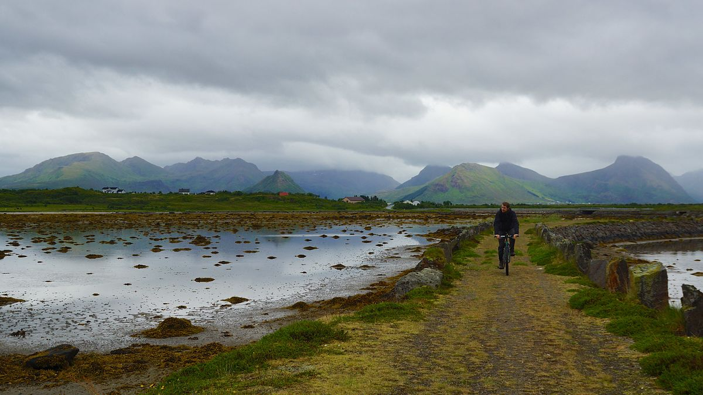
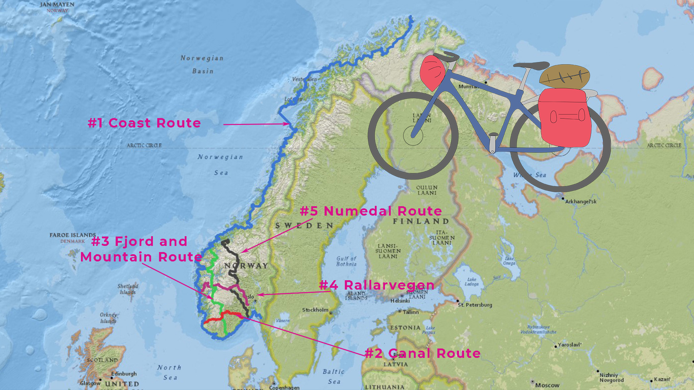
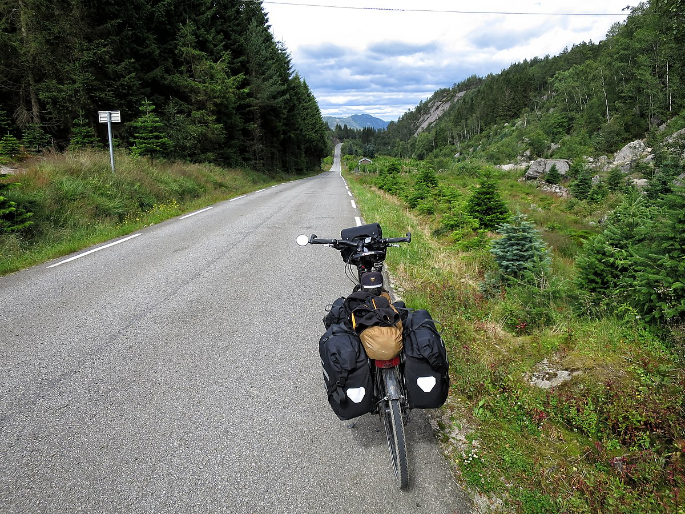

import SevenRoutesDownload from "../../../src/utils/sevenRoutesDownload.js";
import gif from "../img/Menno-end-June-in-Norway.mp4";

Eine Fahrradreise durch Norwegens atemberaubende Landschaften ist der Traum vieler
Bikepacker. Im Land am Polarkreis gibt es allerdings einiges zu beachten: Wetterbedingungen,
Autotunnel und endlos lange Bergpässe machen eine genaue Routenplanung unerlässlich.
In diesem Artikel findest du wichtige Hinweise zum Radwandern in Norwegen und 5 der
existierenden 10 ausgeschilderten Fernradwege mit GPX-Routen zum Herunterladen: Nordkap,
Lofoten, Fjord-Norwegen und mehr.

<SevenRoutesDownload link="https://drive.google.com/drive/folders/1O21r2LK0h2lESc-36dR3AHFmbmUacigp?usp=sharing" />

## Reisezeit für Fahrradurlaub in Norwegen

Ganz klar: der Sommer. Besonders dann, wenn du Pässe überqueren willst. Norwegen wird vom Nordkap bis zum Skagerrak vom Skandinavischen Gebirge durchzogen. Viele touristische Bergpässe und Hochstraßen sind nur von Ende Mai bis Mitte September geöffnet, bei viel Schnee eventuell auch kürzer. Am besten fährst du also frühestens Mitte Juni in die Berge und hast einen Plan B breit.

---

  <video width="70%" controls autoplay loop>
    <source src={gif} type="video/mp4" />
  </video>

_In Nordnorwegen Ende Juni auf unserer Tour von Moskau [zum Nordkap](https://weonbikes.com/buch/) 2018_

---

Schlechtes Wetter, Nebel und Regen sind in Norwegen normal. Auch im Sommer. Du solltest immer auf niedrige Temperaturen vorbereitet sein und Essen für den Notfall dabeihaben. Die Bevölkerungsdichte ist nicht sehr hoch und für den nächsten Supermarkt musst du möglicherweise über den nächsten Pass radeln.

Im Gegenzug wirst du mit fantastischen Aussichten belohnt und findest nahezu **überall trinkbares Wasser**. Auch **Wildzelten** geht überall, sofern du das richtige Zelt für steinigen Untergrund, Wind und Regen dabeihast. In Norwegen gibt es ein ausgedehntes Netz von **Hütten**, private, vom Touristenverein DNT und vom Statskog, einem staatlichen Unternehmen des Forstministeriums. Auf dieser Website findest du detaillierte Infos zu allen [Hütten in Norwegen](https://ut.no/kart#4.8/63.76/13.99). Für manche Hütten muss man den Schlüssel vorher in einem Ort abholen, andere sind eher mit einem Hotelbetrieb zu vergleichen. Die Preise variieren.

## Autotunnel und Fahrradwege

Norwegen ist ein bergiges schmales Land am Meer und nur 1,7 Prozent der Fläche ist von Menschen bewohnt. 50 Prozent sind entweder Gebirge, karge Hochebene oder Moor. Angesichts dieser Voraussetzungen sind Anzahl und Qualität der Straßen im Land erstaunlich. Aber es geht nicht immer irgendwie weiter wie in Westeuropa. Viele Straßen hören am Ende des Fjords auf – Sackgasse. Plane deine Route oder du wirst viele Extra-Kilometer radeln.

**Tunnel**

Wegen der vielen Landrutsche und des Schnees im Winter gibt es in Norwegen überall Tunnel. Nicht alle sind für Fahrradfahrer zugelassen. Du solltest nicht einmal versuchen, trotzdem durch einen solchen Tunnel zu fahren! Sie sind oft unbeleuchtet und haben nur schmale Seitenstreifen. Warte lieber auf eine Mitfahrgelegenheit, wenn du dich doch mal mit der Route vertan hast. Auf dieser Website findest du [alle Tunnel in Norwegen, die für Fahrradfahrer](https://www.cycletourer.co.uk/maps/tunnelmap.shtml) erlaubt bzw. verboten sind.

**Fahrradwege**

In Norwegen gibt es 10 nationale Fahrradrouten. Diese verlaufen auf Straßen, auf alten Wegen und in urbanen Gebieten auch mal auf Fahrradwegen. Norwegen hat eine geringe Bevölkerungsdichte, das Verkehrsaufkommen auf einer Fernstraße ist nicht besonders hoch. Die Straßen sind normalerweise zweispurig und es gibt Lkw-Verkehr.

Die nationalen Fahrradrouten sind auf Open Street Map eingetragen. Jede routing-fähige App sollte also eine Fahrradroute für dich errechnen können.

Beachte dabei, dass häufig Fähren genutzt werden, um Tunnel zu umgehen. An einigen Stellen, wie bei Route Nummer 4, ist die Bahn die einzige Option.

Fahrrad heißt auf Norwegisch _Sykkel_ und Fahrradroute _Sykkelruter_. Auf dieser offiziellen Website findest du [Informationen zu den Fernradwegen in Norwegen](https://www.visitnorway.com/things-to-do/outdoor-activities/cycling/national-cycle-routes/) (auf Englisch).

## #1 Küstenroute 4500 km

Diese Route verläuft von Norden nach Süden an der Küste entlang durch ganz Norwegen. Von Kirkenes zum Nordkap, über die Lofoten nach Trondheim, Bergen, Lindenes und Kristiansand an der Südspitze bis nach Svinesund an der schwedischen Grenze südlich von Fredrikstad.

Die Küstenroute stimmt mit dem [Eurovelo 1 (Atlantikküstenroute)](https://weonbikes.com/blog/7-radwanderwege-in-europa-nord-sued/#1-atlantikk%C3%BCsten-radweg-11000-km-eurovelo-1) und dem [Eurovelo 12 (Nordseeküstenroute)](https://weonbikes.com/blog/3-meere-in-europa-per-rad-umrunden/#nordseek%C3%BCsten-route-7000-km-eurovelo-12) überein. Wer diese Route mit dem Fahrrad fährt, wird unzählige Male mit der Fähre übersetzen. Für die Preise bietet die [Website von Fährbetreiber Fjord1](https://www.fjord1.no/) einen Anhaltspunkt. Zum Beispiel: Die Verbindung Oldeide-Måløy, eine Fahrt von etwa 30 Minuten, würde für ein kleines Auto 115 NOK kosten, für ein Motorrad 45 NOK und für Fahrräder steht kein Preis dabei.

Oft verläuft die Fahrradroute 1 auf den sogenannten [_Scenic Routes_](https://www.nasjonaleturistveger.no/de/routen/), den norwegischen Landschaftsrouten, beispielsweise zwischen Kårvåg und Bud auf der Scenic Route _Atlanterhavsvegen_. Das sind Autorouten auf besonders sehenswerten Landschaftsstraßen.

## #2 Kanalroute 386 km

Die Kanalroute führt in Ost-West-Richtung von Stavanger nach Porsgrunn durch Südnorwegen. In der östlichen Hälfte verläuft sie am **Telemarkkanal** entlang. Der verbindet die Schärenküste am Skagerrak mit der Hardangervidda. Telemark ist bewaldet, vergleichsweise flach und hervorragend zum Fahrradfahren geeignet. Die Kanalroute verbindet außerdem die Fahrradroute 1 mit der Fahrradroute 3.

## #3 Fjord- und Berge-Route 1000 km

Fahrradroute Nummer 3 führt von Kristiansund (nördlich von Ålesund) über den Sognefjord, am **Hardangerfjord** entlang nach **Odda** und durch die Setesdal-Region nach Kristiansand ganz im Süden. Fjord-Norwegen von seiner schönsten Seite.

Wenn du in Kristiansund beginnst: Die Stadt liegt auf einer Insel. Die Brücke, über die der Fahrradweg nach Süden führt, ist für Radfahrer nicht zugelassen. Es gibt von Kristiansund eine Fähre nach Bremsnes auf der anderen Seite des Fjords.

Die Route passiert den [Utvikfjellet](https://climbfinder.com/de/anstiege/utvikfjellet-utvik) mit 627 m und den [Røldalsfjellet](https://climbfinder.com/de/anstiege/roldalsfjellet-odda) mit 700 m und ist natürlich auch davor, dazwischen und danach bergig. Die spektakulären Aussichten auf die **Fjordlandschaft** entschädigen für die Beinarbeit.

## #4 Rallarvegen 500 km

Von Oslo nach Bergen gibt es eine Zugverbindung, die _Bergensbane_, die durch Europas größte Hochebene führt: die Hardangervidda. Der Rallarvegen ist der alte **Bahnarbeiterweg**, ein nicht asphaltierter Weg entlang der Bahnstrecke. Er wird heute als Rad- und Wanderweg genutzt. Von Haugastøl bis Myrdal ist der Fernradweg Nummer 4 mit dem Rallarvegen (ca. 180 km) identisch. Die übrige Strecke orientiert sich an der heutigen Bahnlinie.

Der gesamte Verlauf von Westen nach Osten: Bergen, Foss, Myrdal, Finse, Haugastøl, Geilo, Gol, Hønefoss, Olso. Im Westen und Osten schließt der Fernradweg Nr. 1 an. Bei Geilo, östlich des Rallarvegen, trifft Fernradweg Nr. 5 auf diese Route.

Für die Eingewöhnung ist es besser, im Osten zu beginnen. Dort ist die Strecke weniger bergig. Bei Myrdal führt der Fernradweg Nr. 4 nicht ins Tal in das touristische Flåm, sondern setzt auf die Bahnlinie und den Tunnel von Upsete, der direkt auf der Hochebene in Myrdal endet. Entspannt. Wer die spektakuläre Bahnlinie von Flåm nach Myrdal erleben will oder **Downhill** biken möchte, muss einen **Abstecher** machen.

Vom touristischen Flåm kommend könnte man nach **Myrdal hochfahren**. Steigungen von bis zu 18 Prozent bieten selbst hartgesottenen Climbern eine Herausforderung. Mit Gepäck und Tourenrad schlichtweg brutal. Außerdem ist die Gravelstrecke mit zahlreichen Spitzkehren eine beliebte Downhill-Route. Mach dich also besser sehr früh oder sehr spät auf den Weg nach oben, um Gegenverkehr zu vermeiden.

Der Rallarvegen wird meist Anfang Juli freigegeben. Vorher gibt es noch Schneefelder. Ein Mountainbike ist kein überflüssiger Luxus auf der Strecke. Je nach Wetterlage kann der Untergrund schwierig sein. Egal, denn wenn es Probleme gibt, ist **der nächste Bahnhof nicht weit**. Ein Versuch mit dem Tourenrad kann also nicht schaden. Wichtige Hinweise bietet die [Website zum Rallarvegen](https://www.rallarvegen.com/en/rallarvegen).

## #5 Numedal-Route 950 km

Eine schöne Anfahrt zum Rallarvegen bietet Fahrradroute Nummer 5. Sie beginnt in Larvik im Südosten Norwegens am Meer und führt über Kongsberg durch das grüne Numedal nach Geilo, siehe Route #4. Mit dem Rallarvegen vereint führt die Route dann bis Gol, um anschließend nach Norden in Richtung **Jotunheimen-Nationalpark** abzubiegen.

Den gesamten Bygdin-See überquerst du laut Route #5 mit dem historischen Boot MS Bitihorn auf 1060 Metern über dem Meeresspiegel. Auf der Tour über den Bygdin-See siehst du etliche der 2000 m hohen Gipfel von Jotunheimen.
Abfahrten von Bygdin (von Norden kommend) und Eidsbugarden (von Süden kommend) über Torfinnsbu. Den [Fahrplan findest du hier](https://jvb.no/rutetider/rutetider-m-b-bitihorn/) (nur auf Norwegisch).

Alternativ könntest du auf die Straße 51 ausweichen, die auf dem Stück zwischen Gol und Bygdin mit der Fahrradroute Mjølkevegen übereinstimmt, und die Bootsfahrt vermeiden. Straße 51 ist ab Bygdin auf 45 km eine der norwegischen Landschaftsstraßen, der Jotunheimvegen.

Der 250 km lange Mjølkevegen ist ein beschilderter Radweg von Vinstra auf 1000 m Höhe nach Gol auf 200 m Höhe über die Valdres-Hochebene östlich von Jotunheimen.

Nach der Valdres-Hochebene führt Route #5 in nordwestlicher Richtung am **Fluss Rauma** entlang nach Åndalsnes und Eidsvåg. Dort beginnt Route Nummer 8.

---

Im zweiten Teil erfährst du mehr über Nummer 6 bis 10 der Nationalen Fahrradrouten Norwegens. Außerdem gibt es noch einige kürzere touristische Routen, die bei der Streckenwahl helfen.

<SevenRoutesDownload link="https://drive.google.com/drive/folders/1O21r2LK0h2lESc-36dR3AHFmbmUacigp?usp=sharing" />

Für unsere Reise von Kap zu Kap durch Europa im nächsten Jahr waren in dieser Liste schon starke Kandidaten dabei: vielleicht eine Kombination aus Küstenroute, Fjord- und Bergroute und Rallarvegen? Am besten fangen wir schon mal mit dem Training an ;) Bis dahin...

**_Schwing dich aufs Fahrrad, teile die schönsten, die sichersten, die kürzesten, längsten oder praktischsten Fahrradrouten mit anderen. Sprich über Fahrradreisen Verschenk' mal ein Rad oder einen Fahrradtag! Gib einfach nicht auf, bis alle Fahrrad fahren. Denn Fahrradfahren macht glücklich._**

  Einige Bilder in diesem Artikel sind von:{" "}
  <a
    style="color: black"
    href="https://commons.wikimedia.org/wiki/File:Anlegget_%C3%98ksnes.jpg"
  >
    Julian-G. Albert
  </a>
  , <a style="color: black" href="https://creativecommons.org/licenses/by/2.0">
    CC BY 2.0
  </a>, via Wikimedia Commons, <a
    style="color: black"
    href="https://commons.wikimedia.org/wiki/File:EuroVelo_12_-_Nords%C3%B8ruten_vej.jpg"
  >
    Mikkel Houmøller
  </a>, <a
    style="color: black"
    href="https://creativecommons.org/licenses/by-sa/4.0"
  >
    CC BY-SA 4.0
  </a>, via Wikimedia Commons

