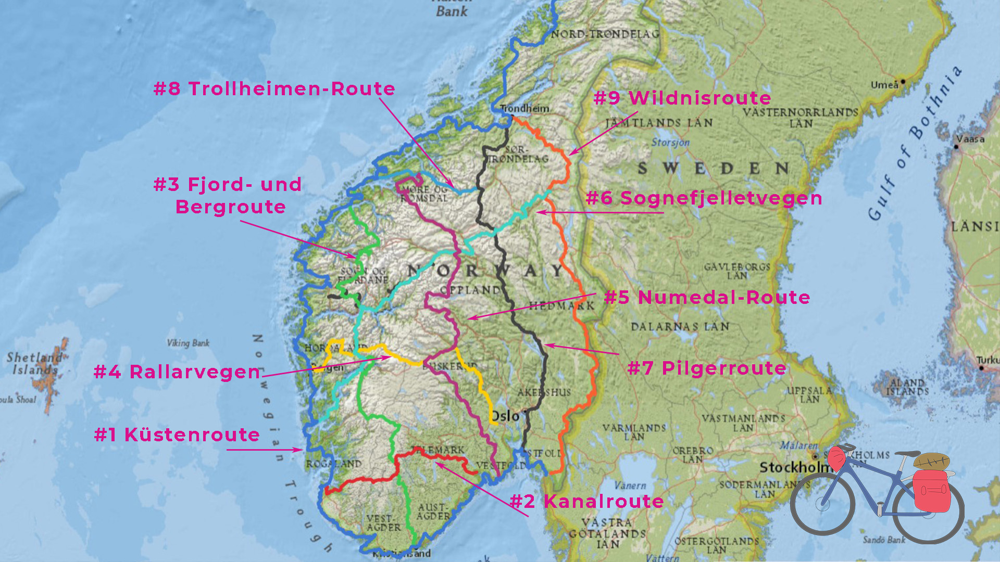
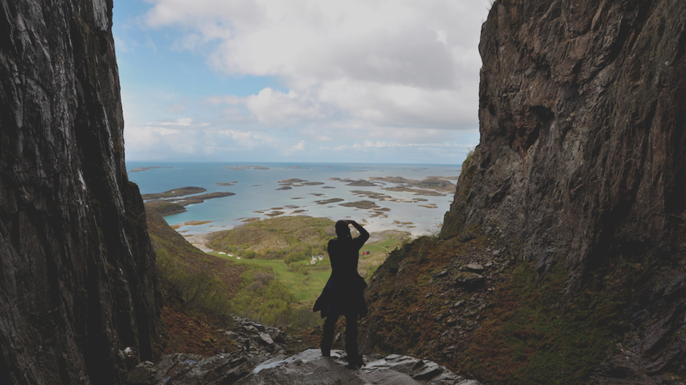
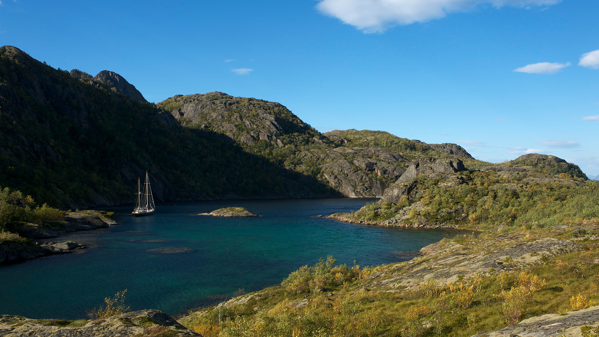
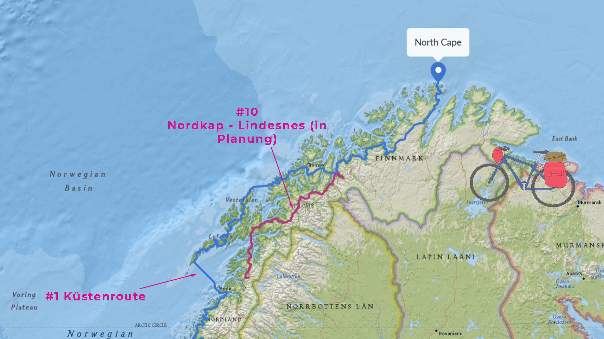

import SevenRoutesDownload from "../../../src/utils/sevenRoutesDownload.js";

Trolle, Fjorde und Aussichten, die dir die Sprache verschlagen – weiter geht's durch Norwegen per Rad! In [Teil 1 unserer Norwegen-Serie](https://weonbikes.com/blog/fahrradrouten-norwegen-1/) ging es um die richtige Planung einer Fahrradtour in Norwegen, um Autotunnel und wie du Hütten findest. Wir haben die ersten 5 der 10 nationalen Fernradwege vorgestellt: Küstenroute, Kanalroute, Fjord- und Berge-Route, Rallarvegen und die Numedal-Route. In diesem Artikel stellen wir nun die übrigen 5 der nationalen Fahrradrouten durch Norwegen vor. Im nächsten Teil wird es um kürzere besonders beliebte Strecken gehen, um die Auswahl der Route zu erleichtern.

<SevenRoutesDownload link="https://drive.google.com/drive/folders/1O21r2LK0h2lESc-36dR3AHFmbmUacigp?usp=sharing" />

## #6 Sognefjellsvegen-Route 800 km

Route Nummer 6 beginnt mit Weltkulturerbe in Røros, einer historischen Bergbaustadt mit einzigartiger Geschichte ganz im Osten des Landes. Über 1000 km führt die Route in südwestlicher Richtung bis an die Westküste nach Leirvik am Hardangerfjord.

Sognefjelletvegen ist eine 294 km lange Gebirgspass-Straße auf 1434 Meter Höhe über dem Meeresspiegel. Die Road 55 ist die höchste Passstraße in Nordeuropa und eine von Norwegens Landschaftsstraßen. Der Pass ist im Sommer je nach Schneelage ab Mitte Juni oder Juli geöffnet. Die von Schmelzwasser gespeisten Seen entlang der Route erscheinen bei Sonnenschein oft in atemberaubendem Gletscherblau und bei Wolken in Türkis.

Die Fahrradroute Nummer 6 passiert den Jotunheimen-Nationalpark auf der Nordseite. Dann überquert sie den Sognefjord und führt durch Fjord-Norwegen zum Hardangerfjord. Unübertrefflich.

## #7 Pilgerroute 700 km

Die Pilgerroute, der nationale Fernradweg 7, deckt sich mit dem EuroVelo 3. Auf dieser Website findest du weitere [Pilgerrouten in Norwegen](https://pilegrimsleden.no/en/pilegrimsledene). Der Olavsweg hat den Nidarosdom in Trondheim zum Ziel, die letzte Ruhestätte des Heiligen Olavs. Im Mittelalter war die Nidaros-Kathedrale die nördlichste Pilgerstätte Europas. Die Pilgerroute ist eng mit der Geschichte von König Olav Haraldsson verbunden, Norwegens Schutzpatron, und trägt den Namen _Gudbrandsdalsleden_. Der später heiliggesprochene Wikinger ließ sich in Rouen taufen und kehrte mit einigen Bischöfen in seine Heimat zurück. Olaf der Dicke, wie er zu Lebzeiten genannt wurde, war von 1015 bis 1028 König in Norwegen.

Nun, zu Olavs Zeiten war das Fahrrad noch nicht erfunden. Nichtsdestotrotz möchten wir die historische Route für unsere Tour von Kap zu Kap durch Europa von Norden nach Süden unter die Lupe nehmen. Von Trondheim läuft die Route direkt nach Süden und trifft bei Oppdal auf Route 8. Weiter geht's nach Folldal, wo sie die Sognefjell-Route kreuzt, siehe #6, und nach Lillehammer. Dort beginnt die Region um Oslo, in der die meisten Menschen in Norwegen wohnen. Bei Halden, südlich von Fredrikstad, geht die Pilgerroute dann in den EuroVelo 3 über.

Dieser Fernradweg verläuft im Vergleich zu den anderen Routen häufiger durch Städte und hat einen kulturellen Schwerpunkt.

## #8 Trollheimen-Route 166 km

Radwandern im Land der Trolle! Radfernweg #8 ist zwar kurz, hat es aber in sich. Er beginnt in Molde an der Küste und führt über Eidsvåg (Anschluss [Route #5](https://weonbikes.com/blog/fahrradrouten-norwegen-1/#5-numedal-route-950-km)) nach Oppdal, wo die Pilgerroute anschließt, siehe #7.

Südlich von Trondheim, etwa auf der Höhe von Ålesund, liegen mehrere gipfelreiche Nationalparks. So auch der Trollheimen-Nationalpark nördlich der Route #8 und der Dovrefjell-Sundalsfjell-Nationalpark südlich der Route. Da gibt es allerlei zu erleben.

Von Gjøra aus, etwa auf der Hälfte der Route zwischen Oppdal und Sunndalsøra, kommst du zum Beispiel am Åmotan-Wasserfall vorbei, der aus 153 Metern in die Tiefe fällt. Der Dovrefjell-Nationalpark ist bekannt für seine Moschusochsen und Fjordpferde. Innerdalen, am Grund des Sunndalfjords, gilt als eines der schönsten Täler Norwegens. Genau da führt die Route #8 entlang.

Ein beliebter Mehrtages-Wanderweg im Trollheimen-Gebirge ist der _Trekanten_, der die 3 Hütten Gjevilvasshytta, Jøldalshytta und Trollheimshytta verbindet. Eine Straße führt bis zur Jøldalshytta.

## #9 Wildnis-Route (Villmarksruta) 800 km

Diese Route ist eine Alternative zur Pilgerroute, siehe #7. Sie verläuft im Osten des Landes in Nord-Süd-Richtung von Trondheim nach Fredrikstad. Die Route umgeht die Gegend um Oslo, du fährst somit durch weitgehend unbewohntes Gebiet. _Villmark_ bedeutet dunkler Wald...

Von Trondheim führt die Strecke nach Südosten am Nea-Fluss entlang nach Stuggudalen und verläuft dann nach Süden. In Røros, der historischen Bergbaustadt, trifft sie auf Sognefjelletvegen, siehe #6.

Nach der Hälfte der Route kommst du durch Trysil. Der Ort beherbergt Norwegens größten Mountainbike-Park. Und der ist richtig cool. Da es Trails für alle Schwierigkeitsgrade gibt, könntest du die Packtaschen für einen Tag im Zelt lassen und mit deinem plötzlich ganz leichten Bike über einen Singletrack fliegen. Trysil bietet 50 km Bike Arena und 100 km natürliche Singletracks. Schau's dir im [Trysil Mountain Bike Guide](https://www.trysil.com/en/Do/Summer/biking/bike-news/the-ultimate-guide-to-mountain-biking-in-trysil/) an!

Wie die Pilgerroute, siehe #7, schließt auch die Wildnis-Route in Halden an der schwedischen Grenze an den EuroVelo 3 an.

## #10 Nordkap – Lindesnes

Route #10 ist noch in Arbeit. Fertig ist ein 550 km langes Stück in Nordnorwegen, das auf dem Festland parallel zum Lofoten-Radweg (EV1) verläuft. Diese Gegend heiß Ofoten und ist mindestens genauso spektakulär wie die Lofoten. Der Vorteil der Festlandroute ist, dass du weniger Fähren nehmen musst: nur eine Fährfahrt über den Ofotfjord.

Der Nachteil ist, dass die Route bisher an der E6 80 km nördlich vom Küstenradweg endet. Du kannst dann eine Nebenstraße wählen, von der keine Fährinfos online sind (Indre Styrkesnes – Røsvik). Du musst also eventuell mit Fischern verhandeln, um auf die andere Seite zu gelangen. Oder du nimmst die E6 mit unzähligen Tunneln, 14 um genau zu sein, davon 6 schlecht beleuchtet, aber nicht verboten.

Auf unserer [interaktiven Karte](https://maphub.net/weonbikes/norway) kannst du auf Route #10 gehen und die Tunnel anzeigen lassen.

Die Route #10 zweigt im Norden in der Nähe von Tromsø bei Storslett von der Küstenroute ab. In Zukunft soll sie das Nordkap mit Lindesnes, dem südlichsten Punkt Norwegens auf dem Festland, verbinden.

---

Das waren die 10 Nationalen Fahrradrouten in Norwegen. Da kommen etliche Kilometer zusammen. Für Fahrradreisen in Norwegen macht eine gründliche Planung und etwas Training den Unterschied zwischen einer entspannten Fahrradreise mit weißen Nächten und einem Urlaub voll Zeitdruck und Quälerei aus. Am besten legst du gleich los...

**_Schwing dich aufs Fahrrad, teile die schönsten, die sichersten, die kürzesten, längsten oder praktischsten Fahrradrouten mit anderen. Sprich über Fahrradreisen Verschenk' mal ein Rad oder einen Fahrradtag! Gib einfach nicht auf, bis alle Fahrrad fahren. Denn Fahrradfahren macht glücklich._**

---

<SevenRoutesDownload link="https://drive.google.com/drive/folders/1O21r2LK0h2lESc-36dR3AHFmbmUacigp?usp=sharing" />

Die Karten in diesem Artikel wurden mit [MapHub](https://maphub.net) unter Verwendung der Karte National Geographic, Esri, DeLorme, HERE, UNEP-WCMC, USGS, NASA, ESA, METI, NRCAN, GEBCO, NOAA, iPC erstellt.
