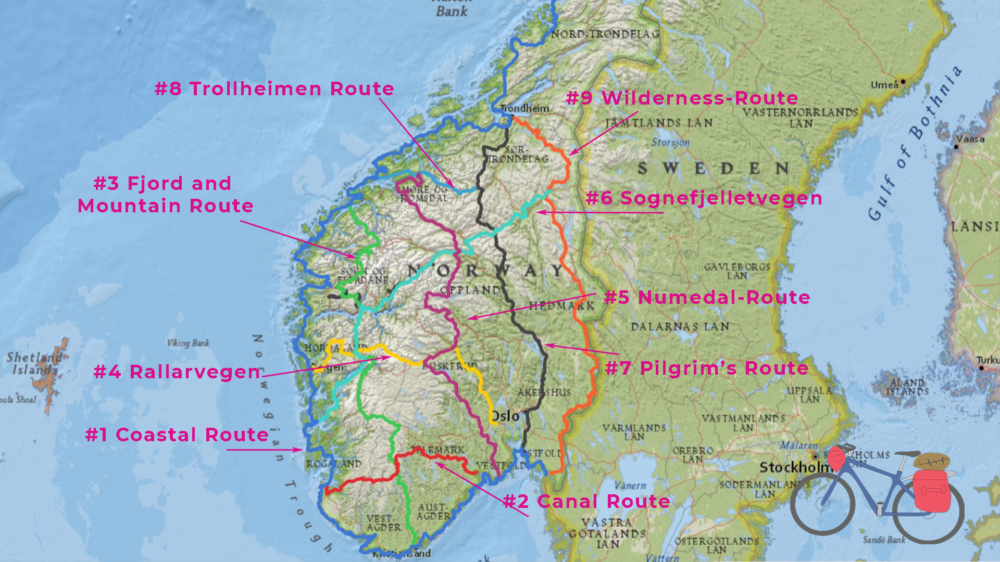
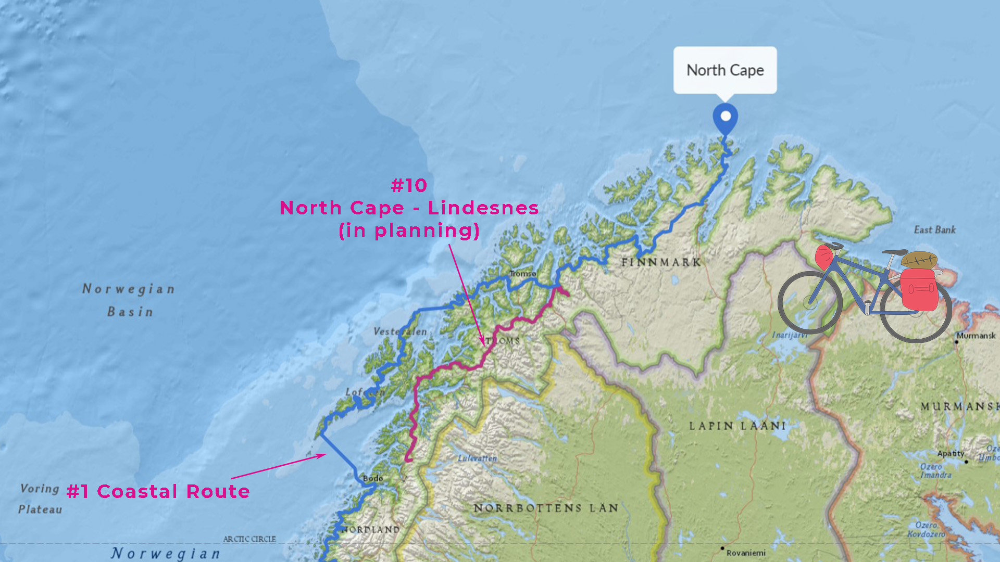

import SevenRoutesDownload from "../../../src/utils/sevenRoutesDownload.js";

Trolls, fjords, and views that leave you speechless – let's continue through Norway by bike! [Part 1 of our Norway series](https://weonbikes.com/en/blog/cycling-routes-norway-1/) was about how to plan a cycling tour in Norway, about car tunnels and how to find cabins. We have presented the first 5 of the 10 national cycle routes: Coastal Route, Canal Route, Fjord and Mountain Route, Rallarvegen and the Numedal Route. In this article you'll read about the remaining 5 of the national cycle routes through Norway. The next part will deal with shorter particularly popular routes to make choosing a route easier.

<SevenRoutesDownload link="https://drive.google.com/drive/folders/1O21r2LK0h2lESc-36dR3AHFmbmUacigp?usp=sharing" />

## #6 Sognefjellsvegen Route 800 km

Route #6 begins with World Heritage in Røros, a historic mining town with a unique history in the very east of the country. The route leads over more than 1000 km in a south-westerly direction to the west coast at Leirvik on the Hardangerfjord.

Sognefjelletvegen is a 294 km long mountain pass road at 1434 meters above sea level. Road 55 is the highest pass road in Northern Europe and one of Norway's scenic roads. The pass is open in summer from mid-June or July, depending on snow conditions. The lakes along the route often appear stunning glacial blue when the sun is shining and turquoise when it's cloudy.

Cycle route #6 passes Jotunheimen National Park on the north side. Then it crosses the Sognefjord and runs through Fjord Norway to the Hardangerfjord. Unsurpassed.

## #7 Pilgrim's Route 700 km

The pilgrim's route, national cycle route #7, coincides with EuroVelo 3. You can find more [pilgrimage routes in Norway](https://pilegrimsleden.no/en/pilegrimsledene) on this website. The Olavsweg leads to the Nidaros Cathedral in Trondheim, the last resting place of Saint Olav. In the Middle Ages, the Nidaros Cathedral was the northernmost place of pilgrimage in Europe. The pilgrim's route is closely linked to the story of King Olav Haraldsson, Norway's patron saint, and is called _Gudbrandsdalsleden_. The Viking, who was later canonized, got baptized in Rouen and returned to his homeland accompanied by some bishops. Olaf the Fat, as he was called during his lifetime, was king of Norway from 1015 to 1028.

Well, in Olav's time the bicycle hadn't been invented yet. Nonetheless, we would like to explore the historical route for our Cape to Cape tour through Europe from north to south. From Trondheim the route runs straight south and meets route 8 at Oppdal. It continues to Folldal where it crosses the Sognefjell route, see #6, and to Lillehammer. Here the region around Oslo begins, where most people in Norway live. At Halden, south of Fredrikstad, the pilgrim's route then merges into EuroVelo 3.

Compared to the other routes, this long-distance cycle route runs through cities more often and has a cultural focus.

## #8 Trollheimen Route 166 km

Cycling in the land of the trolls! Cycle route #8 may be short, but it's tough. It starts in Molde on the coast and leads via Eidsvåg (connection to [route #5](https://weonbikes.com/en/blog/cycling-routes-norway-1/#5-numedal-route-950-km)) to Oppdal, where the pilgrim's route connects, see #7.

South of Trondheim, around Ålesund, are several national parks with many peaks. So is Trollheimen National Park north of route #8 and Dovrefjell-Sundalsfjell National Park south of this cycle route. There is a lot to experience there.

For example, from Gjøra, about halfway between Oppdal and Sunndalsøra, you will pass the Åmotan waterfall, which falls from 153 meters. Dovrefjell National Park is known for its musk oxen and fjord horses. Innerdalen, at the bottom of the Sunndalfjord, is considered one of Norway's most beautiful valleys. And this is exactly where route #8 runs along.

A popular multi-day hiking trail in the Trollheimen mountains is _Trekanten_, which connects the 3 huts Gjevilvasshytta, Jøldalshytta and Trollheimshytta. A road leads up to Jøldalshytta.

## #9 Wilderness Route (Villmarksruta) 800 km

This route is an alternative to the pilgrim's route, see #7. It runs in the east of the country in a north-south direction from Trondheim to Fredrikstad. The route bypasses the Oslo area, so you ride through largely uninhabited territory. Villmark means dark woods...

From Trondheim the route leads southeast along the Nea River to Stuggudalen and then turns south. In Røros, the historic mining town, it meets Sognefjelletvegen, see #6.

Halfway down the route you pass through Trysil. The place is home to Norway's largest mountain bike terrain. And it's a really cool one. Since there are trails for all levels of difficulty, you could leave the panniers in the tent for a day and fly over a singletrack with your noticably lighter bike. Trysil offers more than 50 kilometres of purpose-built singletrack trails, and about 100 kilometres of natural singletracks. Go check it out in the [Trysil Mountain Bike Guide](https://www.trysil.com/en/Do/Summer/biking/bike-news/the-ultimate-guide-to-mountain-biking-in-trysil/)!

Like the Pilgrim's Route #7, the Wilderness Route connects to EuroVelo 3 in Halden on the Swedish border.

## #10 North Cape – Lindesnes

Route #10 is still a work in progress. A 550 km stretch in northern Norway is now complete, running on the mainland parallel to the Lofoten Cycle Route (EV1). This region is called Ofoten and is at least as spectacular as Lofoten. The advantage of the mainland route is that you have to take fewer ferries: just one ferry trip across the Ofotfjord.

The downside is that the route so far ends at road E6 80km north of the Coastal Cycle Route. You can then choose a side road for which there are no ferry infos online (Indre Styrkesnes – Røsvik). So you may have to negotiate with fishermen to get to the other side. Or you can take the E6 with countless tunnels, 14 to be precise, 6 of which are poorly lit but not forbidden.

On our [interactive map](https://maphub.net/weonbikes/norway) you can go to Route #10 and show the tunnels.

In the North, route #10 branches off the coastal route near Tromsø at Storslett. In the future, it will connect the North Cape with Lindesnes, Norway's southernmost point on the mainland.

---

These were the 10 National Cycle Routes in Norway. That's quite a few kilometers. For cycling trips in Norway, thorough planning and some training make the difference between an enjoyable cycling trip and a vacation full of time pressure and exhaustion. It's best to start right away...

**_Get on your bike and share the most beautiful, safest, shortest, or longest and most practical bike routes with others. Talk about holidays by bicycle. Give someone a bike or a bike day! Just don't give up until everyone's riding by bicycle. Because cycling makes you happy._**

---

<SevenRoutesDownload link="https://drive.google.com/drive/folders/1O21r2LK0h2lESc-36dR3AHFmbmUacigp?usp=sharing" />

The maps in this article were created using [MapHub](https://maphub.net/) using the map National Geographic, Esri, DeLorme, HERE, UNEP-WCMC, USGS, NASA, ESA, METI, NRCAN, GEBCO, NOAA, iPC.
