import SevenRoutesDownload from "../../../src/utils/sevenRoutesDownload.js";

Norwegen hat 10 nationale Fernradwege, die alle durch fantastische Landschaften führen. Da fällt die Auswahl schwer. Deshalb stellen wir in diesem Artikel die Höhepunkte von Norwegens Fahrradrouten vor, die schönsten Streckenabschnitte, die atemberaubendsten Aussichten, die besten Gravel-Strecken.

<SevenRoutesDownload
  link="https://drive.google.com/drive/folders/1exEaPcLHEQwcxpNG-MPh7dVnhJY9_e4c?usp=sharing"
  text="13 beste Routen in Norwegen herunterladen"
/>

Auf dieser interaktiven Karte kannst du Routen ein- und ausblenden und sehen, auf welchem nationalen Radfernweg sie liegen.

<iframe
  src="https://maphub.net/embed_h/aAWaONMP5PDplcpj?panel=1&panel_closed=1"
  title="interactive map"
  width="100%"
  height="400"
></iframe>

## #1 Rallarvegen nach Flåm 82 km (NSR 4)

Rallarvegen ist Teil des [Fernradwegs #4](https://weonbikes.com/blog/fahrradrouten-norwegen-1/#4-rallarvegen-500-km) (NSR 4) von Oslo nach Bergen. Der beliebteste Streckenabschnitt zwischen Haugastøl und Flåm am Aurlandsfjord ist eine 82 km lange Gravel-Strecke auf dem alten Bahnarbeiterweg. Der schlängelt sich auf etwa 1000 m über dem Meeresspiegel über die Hardangervidda-Hochebene. Der höchste Punkt ist Fagernut mit 1310 m.

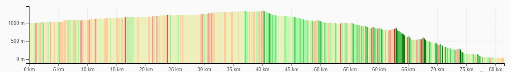

Das Höhenprofil ist bis Myrdal moderat. Die Downhill-Strecke nach Flåm ist dagegen sehr anspruchsvoll. Wer auf dem Fernradweg #4 weiter Richtung Bergen radeln will, nimmt in Myrdal die Bahn durch den Tunnel. Für einen Abstecher nach Flåm kannst du die weltberühmte Bahnlinie nutzen, die sich durch den Berg schlängelt.

<figcaption>Voringfossen am Eidfjord südlich von Haugastøl</figcaption>

## #2 Mjølkevegen in Valdres 250 km (NSR 5)

Von Gol (NSR #4, Rallarvegen) im Hallingdal führt die Route nördlich zunächst nach Bygdin. Sie beginnt im Golsfjellet in einem hügeligen Gebiet mit Trails. Weiter nördlich folgt ein Pass (935 Höhenmeter). Auf diesem Abschnitt trifft die Route immer wieder auf die [Numedal-Route](https://weonbikes.com/blog/fahrradrouten-norwegen-1/#5-numedal-route-950-km) (NSR #5). Wer die Straße 51 ab Beitostølen bis Bygdin komplett vermeiden möchte, kann auf die Numedal-Route ausweichen und eine 30 km lange Bootsfahrt über den Bygdin-See genießen.

Von Bygdin aus lohnt sich eine kurze Wanderung auf den Synshorn (1457 m), um die spektakuläre Aussicht über Jotunheimen zu genießen.

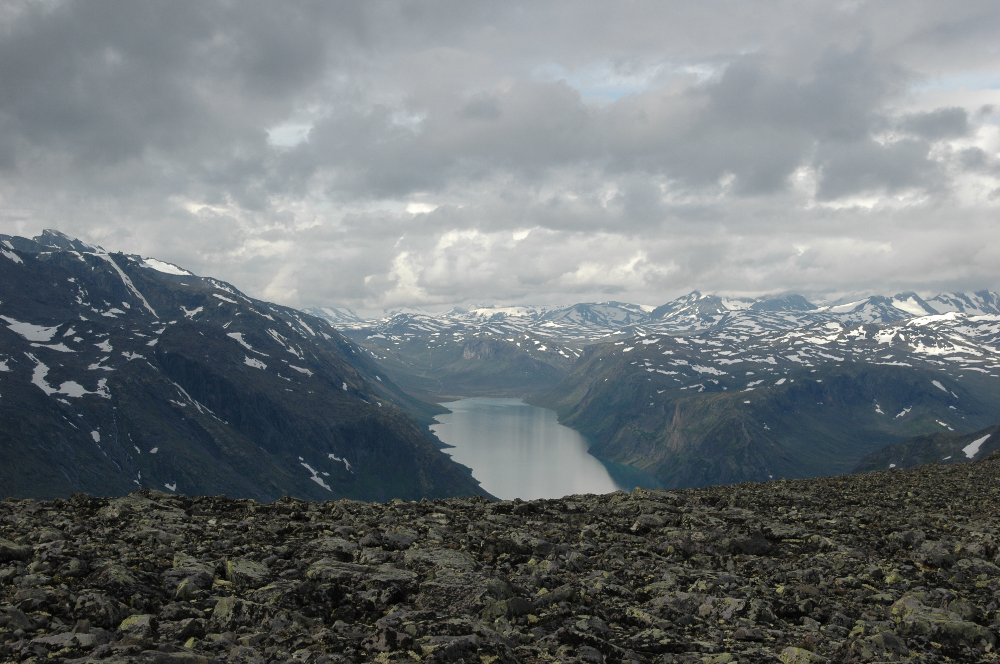

In Bygdin biegt die Route nach Nordosten ab und führt nach Vinstra (ca. 1000 Höhenmeter) im Gulbrandsdalen. Ziegen, Schafe und Kühe laufen in dem Gebiet frei. Du kannst aber trotzdem überall zelten. Eine schöne [Detailkarte von Valdres kannst du dir hier herunterladen](https://www.valdres.com/dbimgs/Mj%C3%B8lkevegenbrosjyre_2020_framside_download.pdf).

Vinstra hat einen Bahnhof und ist etwa 80 km von Lillehammer entfernt. Auf dem Mjølkevegen gibt es mehrere Hütten. Das Gebiet ist gut erschlossen und bietet viele verschiedene Optionen, zum Beispiel die Gravel-Strecke von Lemonsjøen nach Ruten durch das Murudalen als Alternative oder Ergänzung zum Start in Vinstra. Auch in Ruten gibt es eine Hütte.

## #3 Telemarkkanal 113 km (NSR 2)

Der Telemarkkanal wurde zwischen 1854 und 1892 errichtet, sollte die Flößerei ermöglichen und zur Industrialisierung des Provinz Telemark beitragen. Er überwindet auf 18 Schleusenstufen einen Höhenunterschied von 75 Metern.

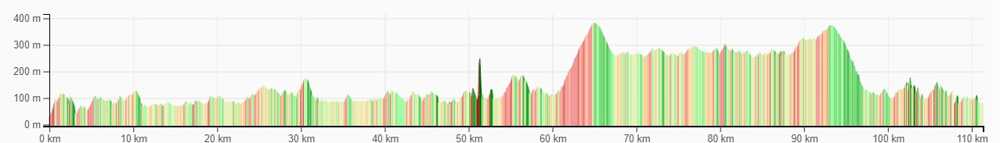

Der Radweg zwischen Ulefoss, im Osten der Route, und Dalen folgt dem nationalen [Fernradweg #2](https://weonbikes.com/blog/fahrradrouten-norwegen-1/#2-kanalroute-386-km), führt über kaum befahrene Straßen und befestigte Wege und überwindet dabei etwa 2300 Höhenmeter. Vorbei an hohen Schleusenwänden und langen Seen bist du schnell raus aus der Zivilisation und in überraschend wilder Natur.

## #4 Dovre-Runde 125 km (NSR 5)

Südlich von Trondheim, etwa auf der Höhe von Ålesund, liegen mehrere gipfelreiche Nationalparks. So auch der Trollheimen-Nationalpark nördlich der Route #8 und der Dovrefjell-Sundalsfjell-Nationalpark südlich der Route. Noch weiter südlich schließen der **Dovre-Nationalpark** und der Rondane-Nationalpark an. Der nationale Radfernweg #5 passiert sie im Westen.

Die Dovre-Runde ist ein 125 km langer teilweise neu angelegter Fahrradweg. Er führt zum größten Teil über befestigte Wege und streckenweise über Asphalt. In Dombås beginnend fährst du auf der neu angelegten Strecke nach Hjerkinn, folgst dann der Straße nach Folldal, nach Grimsdalen und Dovre und zurück nach Dombås.

Es gibt mehrere Möglichkeiten, Abstecher zu machen und den Nationalpark noch weiter zu erforschen. Die Routen sind auf der Open Cycle Map eingezeichnet. Alternativ kannst du die Route von den Bergen zum Fjord zu fahren: Beginn in Hjerkinn, nach Dombås, dann Richtung Norden nach Lesja und Bjorli und parallel zum Radweg #5 die spektakuläre Abfahrt durchs Romsdalen-Tal zum Fjord nach Åndalsnes (155 km).

Auf der Dovre-Runde gibt es allerlei zu erleben: Aussichtspunkt auf dem Snøhetta, Moschusochsen sichten (Fernglas mitnehmen), Bergbaumuseum in Folldal oder Reiten statt Radfahren. Es gibt auch eine Zuglinie bis nach Hjerkinn.

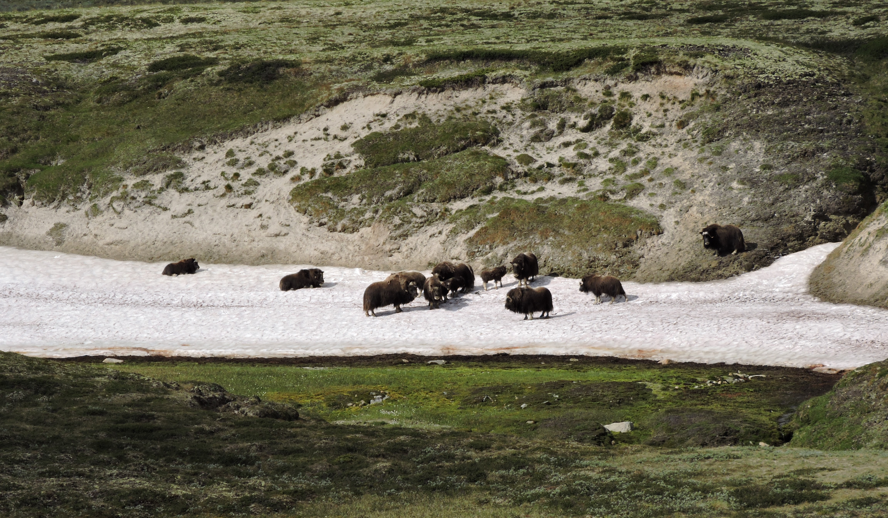

Die Numedal-Route, der nationale Fernradweg #5, verbindet die Dovre-Route mit dem Mjølkevegen, siehe Abschnitt #2 auf einer Gravel-Strecke über die Valdresflye-Hochebene nach Beitostølen: Dombås - Lesja - Vågå - Beitostølen (165 km).

## #5 Nordseeküstenroute durch Jæren 140 km (NSR 1)

Die Nordseeküstenroute ist Teil des nationalen Fernradwegs #1 und des [EuroVelo 12](https://weonbikes.com/blog/3-meere-in-europa-per-rad-umrunden/#nordseek%C3%BCsten-route-7000-km-eurovelo-12).

Ein besonders schöner Teil dieser Nordseeküstenrute ist die Jærruta, eine 140 km lange norwegische Landschaftsroute von Eigersund über Hå und Klepp nach Sola. Der Streckenabschnitt führt über Fahrradwege und sehr verkehrsarme Straßen, ist flach und familienfreundlich.

**Jæren** ist eine Küstenlandschaft in Südwest-Norwegen in der Provinz Rogaland. Die etwa 65 km lange Küste ist das größte Flachlandgebiet Norwegens und landwirtschaftlich von Bedeutung. Am westlichsten Punkt erstreckt sich über zwei Seemeilen das Jæren-Riff in die Nordsee hinein und sorgte bei Seefahrern jahrhundertelang für Jærens Ruf als Schiffsfriedhof.

Die Küstenlandschaft Jæren ist einzigartig in Norwegen: 70 km mit langen Sand- und Kieselstränden, schmale Straßen entlang steil aufragender Felsen, im Süden Mondlandschaft und der Magma-Geopark. Und dann der spannende **Fahrradtunnel am Jøssingfjord** mit Norwegens ungewöhnlichstem Rastplatz, spektakulärer Aussicht und Übernachtungsplatz. Ein kontrastreicher und authentischer Fahrradweg, denn die Strecke wird auch von Einheimischen genutzt.

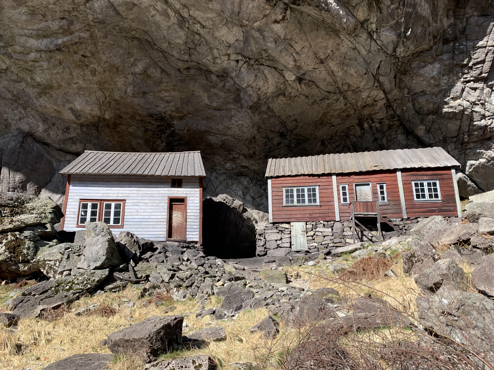

<figcaption>
  Traditionelle Häuser am Jøssingfjord. Foto von{" "}
  <a href="https://commons.wikimedia.org/wiki/File:Traditional_houses_at_Helleren_i_J%C3%B8ssingfjord,_Norway.jpg">
    Casey Brown
  </a>
  , <a href="https://creativecommons.org/licenses/by-sa/4.0CC BY-SA 4.0 Creative Commons Attribution-Share Alike 4.0">CC BY-SA 4.0</a>
</figcaption>

Einen [Reiseführer der Nordseeküstenroute in Norwegen auf Deutsch](https://issuu.com/designstrek/docs/nvmagasin2022-23_de) mit detaillierten Beschreibungen der Sehenswürdigkeiten findest du in der kostenlosen Broschüre zum Herunterladen vom norwegischen Touristenverband. Das ist die Route (fett gedruckt ist die Landschaftsroute Jæren): Kristiansand - Lindesnes - Farsund - Flekkefjord - Sokndal - **Eigersund - Hå - Klepp - Sola** - Stavanger. Die darauf folgenden Orte Randaberg - Kvitsøy - Bokn - Karmøy - Utsira - Haugesund sind in dieser Reihenfolge nur mit längeren Fährfahrten und Insel-Hopping zu erreichen, was an den vielen Autotunneln liegt. Die neue Küstenroute führt weiter östlich über Årdal.

## #6 Helgeland-Küstenroute ca. 500 km (NSR 1)

Die Helgeland-Küstenroute ist Teil des nationalen [Fernradwegs #1](https://weonbikes.com/blog/fahrradrouten-norwegen-1/#1-k%C3%BCstenroute-4500-km) entlang der Küste. Helgelandskysten ist eine der Norwegischen Landschaftsrouten. _Kystriksveien_ heißt die 650 km lange Route, die bereits etwas weiter südlich in Steinkjer beginnt, sonst aber die gleiche Strecke abdeckt. Außer den überwältigenden Aussichten auf die schroffen Felsen der norwegischen Küste hat sie viele Sehenswürdigkeiten zu bieten, die du auf dem Weg nicht verpassen solltest.

Die Helgeland-Küstenroute verläuft von Holm über Brønnøysund, Forvik, Sandnessjøen, Hellåga, Grønsvik, Braset, Storvika nach Bodø (mind. 6 Fähren). Mit dem **Nordland-Pass** für 1290 NOK (2022) kannst du eine Wochen lang in Nordland mit Fähre, Boot und Bus reisen. Mehr über die [Wochenkarte Nordland findest du hier](https://www.reisnordland.com/travel-pass-nordland). So sind auch ein paar Abstecher zu interessanten Gebieten, die nicht direkt auf der Route liegen, kein Problem.

**Torghatten** ist ein Felsen etwas südlich von Brønnøysund. Von der Seeseite aus sieht man, dass er ein riesiges Loch in der Mitte hat: 35 m hoch und 160 m lang. Man kann auf der Halbinsel eine kurze Wanderung zum Berg machen, sich in das Loch stellen und die Aussicht über die Schärenlandschaft genießen.

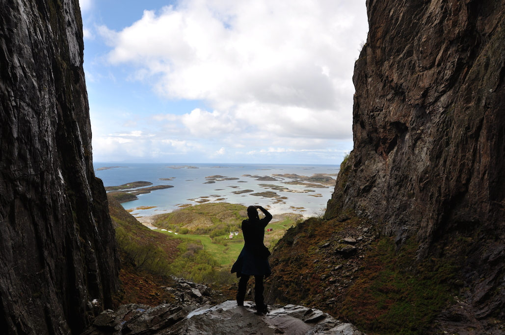

**Warum ist das Loch im Torghatten?** Lekamøya, eine ehrbare Jungfrau, war gerade dabei, die sieben wilden Töchter des mächtigen Trollkönigs Sulitjelmakongen zu erziehen, als sie von Hestmannen, dem Sohn eines anderen Trollkönigs beim Bade erspäht wurde. Um der Entführung zu entgehen, flüchteten die sieben Schwestern mit Lekamøya. Eine wilde mittsommerliche Verfolgungsjagt über die Inseln begann. Hestmannen schoss einen Pfeil ab. Das beobachtete der König der Sømnaberge und warf seinen Hut dazwischen. Aber da ging schon wieder die Sonne auf und alle Beteiligten versteinerten dort, wo sie waren. Der Hut mit dem Loch wurde auf der Insel Torgar zum Torghatten. Die sieben Schwestern, die Hestmannen eigentlich ganz attraktiv fanden, hatten sich auf der Insel Alster nebeneinander hingesetzt, um auf ihn zu warten, und Lekamøya hatte auf der Insel Leka Schutz gefunden.

Etwas weiter nördlich von Brønnøysund liegt **Forvik**, ein alter Handelsort. Direkt am Kai kannst du die gemütliche Kaffeebrennerei besuchen und dich mit Schokolade für deine Tour eindecken. Weiter geht es über die Insel Alster, wo du auf der Küstenstraße für einen kurzen Moment das gesamte Bergmassiv der **Sieben Schwestern** überblicken kannst.

**Insel-Hopping**: Das Vega-Archipel gilt mit seinem Zusammenspiel von Eiderenten und Inselbevölkerung als Welterbegebiet. Auf der Insel Lovund kannst du **Papagaientaucher** bewundern und auf der Insel Myken befindet sich die nördlichste **Whisky**\-Destille. Du könntest von Lovund über Træna nach Myken mit der Fähre fahren. Schöne Optionen, wenn du eine Tour nur in dieser Gegend geplant hast.

Zwischen Jektvik und Kilboghamn überquerst du den **Nordpolarkreis**. Am Holandsfjord lohnt sich ein Abstecher zum **Svartisen-Gletscher**. Und nur wenige Kilometer südlich von Bodø befindet sich **Saltstraumen**, der stärkste Gezeitenstrom der Welt mit vielen Strudeln auf einer Länge von 2,5 km.

## #7 Lavkaløypa in Lyngenfjord 68 km (NSR 10)

Die [Lavkaløypa](https://www.visitnorway.com/listings/lavkal%C3%B8ypa/217111/) ist eine 68 km lange Gravel-Route am Lyngenfjord, der sich etwa auf der Höhe von Tromsø in Nord-Süd-Richtung erstreckt. Du kommst daran vorbei, wenn du auf dem nationalen [Fernradweg #10](https://weonbikes.com/blog/fahrradrouten-norwegen-2/#10-nordkap--lindesnes) unterwegs bist.

Eines der beliebtesten Off-Road-Radrennen in Nordnorwegen, der _Lavkarittet_, folgt der Lavkaløypa. Die Route ist ausgeschildert, anstrengend, aber technisch gar nicht schwierig. Von Süden nach Norden beginnt sie in Hatteng, fast am Ende des Fjords, folgt dem Kitdal bis zum Gipfel. Du fährst dabei 800 Höhenmeter. Dann geht es über ein Plateau und durchs Skibotndal bergab nach Skibotn.

Ein Abstecher mit spektakulären Aussichten für Trail-Fans, den du am besten ohne Gepäck machst. Von Skibotn zurück nach Hatteng auf dem Nordlysveien (E6) am Fjord entlang sind es nur 22 km.

## #8 Mjøstråkk um den Mjøsa-See 234 km (NSR 7)

Der Mjøsa-See ist der größte See Norwegens. Du kommst daran vorbei, wenn du auf dem nationalen Fernradweg #7, dem Pilgerweg, radwanderst. Eine 250 km lange Fahrradroute, der Mjøstråkk, führt um ihn herum.

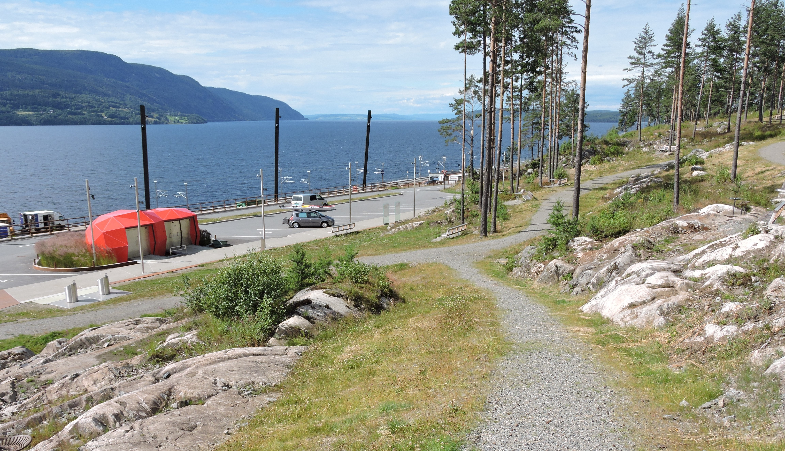

Drei größere Städte liegen auf der Route: Gjøvik, Hamar und Lillehammer. Die Strecke ist ausgeschildert und verläuft auf befestigten Wegen und Alsphaltstraßen. Technisch ist die Route einfach, es gibt allerdings einige Steigungen:

Minnesund–Gjøvik 72 km – anstrengend, Gjøvik–Lillehammer 48 km – ziemlich anstrengend, Lillehammer–Hamar 61 km – ziemlich leicht, Hamar–Minnesund 53 km – ziemlich leicht

Auf dem Mjøstråkk kommst du durch Städte und Orte und kannst Norwegens Kultur und Geschichte kennenlernen. Ob Kunstmuseum, Stabkirche, Steinzeichnungen, Kulinarisches oder Bootsfahrt, es bleiben keine Wünsche offen. Auf der [Mjøstråkk-Website](https://en.visit-innlandet.no/mjostrakk) findest du genaueres.

PS: In Gjøvik solltest du Norwegens kleinste Schokoladenfabrik nicht verpassen.

## #9 Suleskarvegen 135 km (NSR 2)

Suleskarvegen ist die höchste Verbindungsstraße im Südwesten Norwegens. Sie liegt zwischen Oslo und Stavanger. Sie beginnt in Suleskar im Sirdal, verläuft über Brokke im Setesdal, über die Berge nach Dalen in Telemark und endet in Høydalsmo. Eine Bergstraße mit tollen Aussichten für Fans von Höhenmetern.

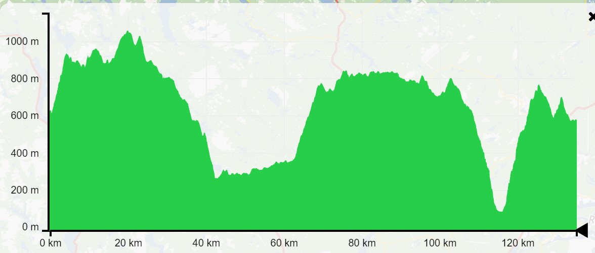

Der Suleskarvegen ist eine der Norwegischen Landschaftsrouten und liegt auf dem nationalen Fernradweg #2, der [Telemark-Route](https://weonbikes.com/blog/fahrradrouten-norwegen-1/#2-kanalroute-386-km). Diese Strecke ist auch bei Motorradfahrern sehr beliebt. Höhepunkte, die du auf dieser Route nicht verpassen solltest, findest du auf der [Sulekarvegen-Website](https://suleskarvegen.no/en/for-those-not-in-a-hurry/).

## #10 Klassische Fjordroute ca. 570 km (NSR 1)

Die klassische Fjordroute ist eine Straßenroute zwischen Ålesund und Kristiansund, die mit den Superlativen von Fjord-Norwegen aufwartet: die berühmte Atlantikstraße, **Trollstigen** mit seinen Haarnadelkurven, der **Geirangerfjord** und darüber **Dalsnibber**, der höchste Aussichtspunkt über einem Fjord.

Die Route beginnt in Molde und endet in Alesund. Sie ist in 5 Etappen aufgeteilt:

1.  **Molde - Bud - Atlantikstraße** nach Kårvåg und Håholmen, ca. 100 km. Die Atlantikstraße ist ein aus acht Brücken bestehendes Straßenbauwerk über mehrere kleine Inseln. Beeindruckend.
2.  **Atlantikstraße - Angvik**, ca. 100 km. Die Route führt an der Straße 666 am schönen Kvernesfjord entlang. 1300 Höhenmeter überwindest du für die schöne Aussicht.
3.  **Angvika – Eresfjord – Åndalsnes – Trollstigen – Valldal**, ca. 170 km. Von Eresdal geht es über die Hochebene Vistalsgheia nach Åndalsnes. Dann die Trollstigen hoch.

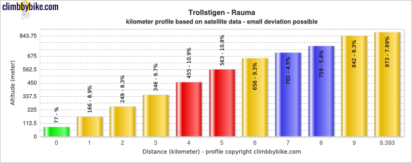

5.  **Valldal – Geiranger – Dalsnibba – Geiranger**, ca. 75 km. Mit der Fähre nach Eidsdal und dann an UNESCO-Welterbe-Fjordlandschaften entlang ins touristische Geiranger. Dann zur Aussichtsplattform Dalsnibba auf 1400 m Höhe mit atemberaubendem Blick über den Gairangerfjord. 2250 Höhenmeter überwindest du auf diesem weltbekannten Streckenabschnitt.

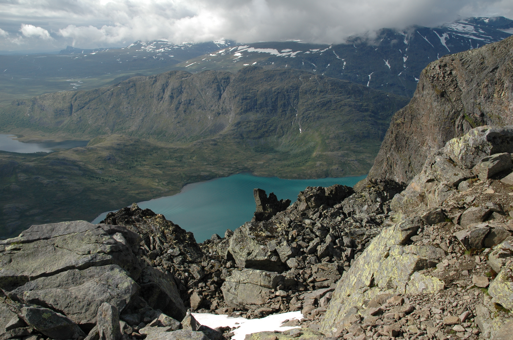

7.  **Geiranger – Ålesund**, ca. 120 km. Zunächst geht es mit der Fähre durch den Gairangerfjord nach Hellesylt. Dort beginnt die Königinnenroute durch das Norangsdalen, ein Tal voller Kulturdenkmäler. Es führt dich nach Urke zum Hjørundfjord, der von den spitzen Gipfeln der Sunmøre-Alpen umsäumten wird. Von dort geht es mit der Fähre Richtung Ålesund.

## #11 Oslofjord-Runde 215 km (NSR 7)

Viele Wege führen um den Oslofjord. Auf der Ostseite verläuft der nationale Fernradweg #7, die Pilgerroute. Weiter südlich führt auf beiden Seiten der Küstenradweg entlang. Die Ostseite des Fjords heißt Østfold, die Westseite Vestfold.

Nach einem Besuch in Oslo lohnen sich auch Abstecher nach Drøbak, Filtvet und auf die Insel Hvitsten, um nur einige zu nennen. Die urbane Umgebung mit viel Natur und Fahrradwegen ist für alle geeignet, die sich für Kultur, Kulinarisches, Land und Leute interessieren.

## #12 Andøya in Vesterålen 100 km (NSR 1)

Nördlich der Lofoten liegt Andøya mit dem Fischerdorf Andenes. Eine Straße führt um die felsige Insel herum. Eindrucksvolle Aussichten im schroffen Klima der norwegischen See kontrastieren mit weißen Sandstränden und der Mitternachtssonne. Die Strecke ist eher flach und unkompliziert. Die Straße um Andøya gehört zu den norwegischen Landschaftsrouten.

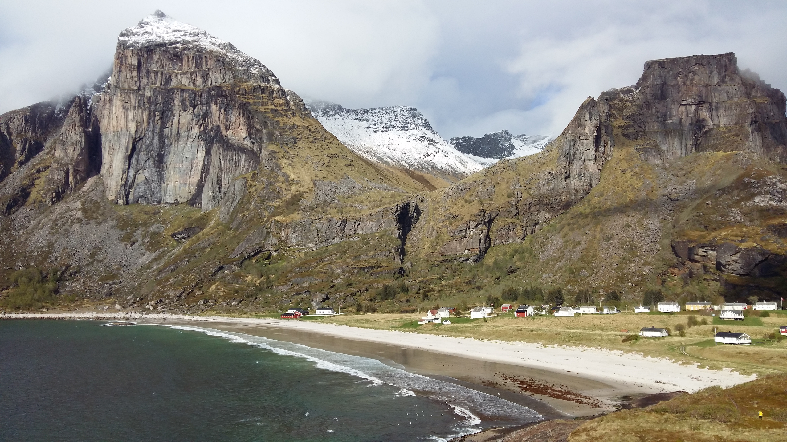

## #13 Majestätische Fjordroute 290 km (NSR 3)

Die sogenannte Majestätische Fjordroute beginnt östlich von Bergen in Vossevangen, erreichbar mit dem Zug von Bergen oder Oslo. Sie deckt sich teilweise mit der Landschaftsroute über den **Gaularfjellet** und liegt auf dem nationalen [Fernradweg #3](https://weonbikes.com/blog/fahrradrouten-norwegen-1/#3-fjord--und-berge-route-1000-km), der Fjord- und Bergeroute. Sie biegt bei Førde nach Westen ab und verläuft am **Stongfjord** entlang zur Küste, wo sie bis Askvoll dem Küstenradweg folgt. Alternativ gelangst du von dort mit der Fähre nach Bergen.

Mykedalen, Vikjafjellet, der Gaularfjellet-Aussichtspunkt, **Sunnfjord** und Stongfjord sind die Höhepunkte dieser Straßenroute. Auf dem YouTube-Kanal von Fjord Norway kannst du dir ein [Video von der _Majestic Ford Route_](https://www.youtube.com/watch?v=Oh7xhg4ub4w) anschauen.

---

Das waren eine Menge Höhepunkte im wahrsten Sinne des Wortes und eine Menge Details! Zu genau solltest du es mit der Reiseplanung dann aber selbst in Norwegen nicht nehmen. Am Ende kommt doch immer etwas anders, als geplant. Also...

**Schwing dich aufs Fahrrad, teile die schönsten, die sichersten, die kürzesten, längsten oder praktischsten Fahrradrouten mit anderen. Sprich über Fahrradreisen Verschenk' mal ein Rad oder einen Fahrradtag! Gib einfach nicht auf, bis alle Fahrrad fahren. Denn Fahrradfahren macht glücklich.**

<SevenRoutesDownload
  link="https://drive.google.com/drive/folders/1exEaPcLHEQwcxpNG-MPh7dVnhJY9_e4c?usp=sharing"
  text="13 beste Routen in Norwegen herunterladen"
/>
