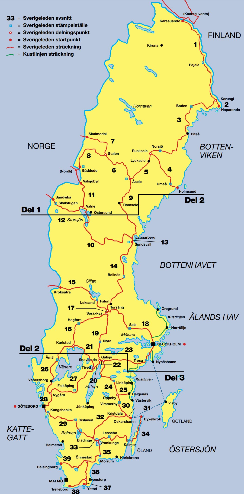
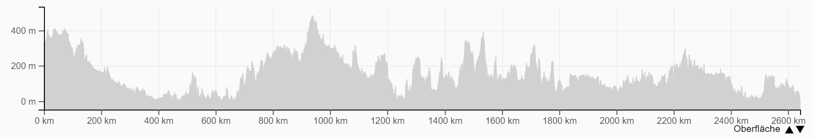

import SevenRoutesDownload from "../../../src/utils/sevenRoutesDownload.js";

Schweden ist ein tolles Fahrradland und ideal zum Radwandern. Sogar im Winter! Ja, es gibt tatsächlich ein Winter-Radrennen, die Abloc Winter Challenge, ein 315 km langes Radrennen um den Vättersee. Im Sommer profitierst du von den weißen Nächten. In diesem Artikel findest du Fernradwege und mittellange Touren mit GPS-Routen zum Herunterladen sowie nützliche Tipps für eine entspannte Radreise.

<SevenRoutesDownload
  link="https://drive.google.com/drive/folders/1tv5DjCIKZfj10e3V3auishKUPPWEQKl8?usp=sharing"
  text="GPX-/KML-Routen Schweden herunterladen"
/>

In der interaktiven Karte unten kannst du die beschriebenen Routen nachverfolgen.

<iframe
  src="https://maphub.net/embed_h/UyZF9SVKApJ2Yc2a?panel=1&panel_closed=1"
  title="interactive map"
  width="100%"
  height="400"
  frameborder="0"
></iframe>

## Für Radwander-Anfänger: fahrradfreundlich und ausgeschildert

Landschaftlich ist Schweden abwechslungsreich, fahrradfreundlich und weniger kompliziert als Norwegen. Im Norden gibt es viel Wald und Gebirge mit über 2.000 m Höhe. Weiter nach Süden wird es zunehmend flacher.

Der Radfernweg _Sverigeleden_ durchzieht das Land von Norden nach Süden. Die Hauptroute ist 2620 km lang, weist aber zahlreiche zusätzliche Verzweigungen auf. Die Radwege sind auf Open Cycle Map eingezeichnet und außerdem ausgeschildert: Fernradwege sind grün, regionale Routen sind blau und lokale schwarz.

## Fahrräder transportieren

Die Bahn in Schweden heißt SJ und nimmt meistens **keine** Fahrräder mit. Es gibt aber Ausnahmen: die [Inlandsbanan](https://inlandsbanan.se/) von Mora nach Gällivare, Flixtrain zwischen Stockholm und Göteborg, [X-trafik](http://xtrafik.se/) in der Region Gävleborg und [Norrtåg](https://www.norrtag.se/) auf den Strecken Sundsvall – Storlien und Sundsvall – Umeå. Auch entlang der nationalen Fahrradrouten (siehe unten) ist die Fahrradmitnahme möglich, wenn Platz ist, unter anderem mit den Regionalbahnen [Öresundstågen](https://www.oresundstag.se/en/) und [Krösatågen](http://www.krosatagen.se/).

**Flixbus** ist in Schweden recht gut vernetzt und nimmt konventionelle Fahrräder mit. 5 Stück hinten am Bus, dann musst du nichts auseinanderbauen, und 3 Klappräder im Bus, Transporttaschen werden bereitgestellt. Das Fahrrad musst du beim Ticketkauf dazubuchen. Das Ticket fürs Rad kostet nur 9 Euro (2022). Von Deutschland gibt es etliche wirklich günstige Verbindungen nach Schweden: Von Hamburg, Berlin und Rostock kommst du unter anderem nach Helsingborg, Göteborg und Stockholm. Von dort könntest du noch weiter in den Norden fahren. Flixbus bietet sogar eine direkte Verbindung von Bukarest nach Stockholm an, einmal längs durch Europa - aufregend, oder?

Hier findest du genaueres zur [Fahrradmitnahme bei Flixbus](https://www.flixbus.de/service/fahrrad-mitnahme).

Ein **Fahrrad mieten** ist in Schweden auch kein Problem. Das schlägt allerdings zusätzlich aufs Urlaubsbudget.

## Übernachten in Schweden

In Schweden gilt das Jedermann-Recht. Mit anderen Worten, du kannst für eine Nacht in angemessenem Abstand zu Privatland wildcampen. Im Ernstfall einfach nachfragen. Meist ist es kein Problem, ein Zelt für eine Nacht aufzustellen.

_Vandrarhem_ bedeutet Jugendherbergen, die sind vergleichsweise günstig. Privatunterkünfte sind dagegen eher teuer. Sie werden _Stuga_, _Rum_, _Gästboende_ oder _Gästis_ genannt.

In Schweden bezahlt man in Schwedischen Kronen und meistens bargeldfrei. Kreditkarte nicht vergessen!

## EuroVelo-Routen in Schweden

Durch Schweden verlaufen die folgenden EuroVelo-Routen:

### Sonnenroute, EuroVelo 7 ca. 3000 km

Die [Sonnenroute vom Nordkap nach Malta](https://weonbikes.com/blog/7-radwanderwege-in-europa-nord-sued/#3-sonnenroute-7700-km-eurovelo-7) führt von Norden nach Süden teilweise an der Ostsee entlang durch Schweden. Über Göteborg verlässt du Schweden in Richtung Kopenhagen in Dänemark.

### Ostseeküsten-Route, EuroVelo 10

Der [EuroVelo 10](https://weonbikes.com/blog/3-meere-in-europa-per-rad-umrunden/#ostseeradweg-9000-km-eurovelo-10) führt an der Ostseeküste entlang und daher auch über mehr als 2500 km Kilometer durch Schweden. Der Radwanderweg **Cykelspåret von Ystad nach Haparanda** deckt sich mit dem EV 10.

### Pilger-Route EV 3 und Nordseeküsten-Route EV 12

[EuroVelo 3](https://weonbikes.com/blog/7-radwanderwege-in-europa-nord-sued/#6-pilgerroute-5300-km-eurovelo-3) und [EuroVelo 12](https://weonbikes.com/blog/3-meere-in-europa-per-rad-umrunden/#nordseek%C3%BCsten-route-7000-km-eurovelo-12) verlaufen von der Norwegischen Grenze an Südschwedens Westküste entlang und decken sich mit dem **Kattegatt-Radweg von Göteborg nach Helsingborg**, siehe unten.

## European Divide Trail ca. 2200 km

Der nördlichste Abschnitt des [European Divide Trails von Grense Jakobselv nach Portugal](https://weonbikes.com/blog/7-radwanderwege-in-europa-nord-sued/#2-european-divide-trail-7700-km) verläuft von Norden nach Süden durch Schweden, aber etwas weiter westlich als der EuroVelo 7. Diese Route meidet Straßen und folgt wo immer möglich befestigten Wegen oder **Trails**.

## Sverigeleden Karesuando - Helsingborg 2620 km

Sverigeleden bedeutet Schwedenweg und ist eher ein Radwegenetz als eine einzelne Strecke. Insgesamt hat der Sverigeleden 9500 km. Die Hauptroute läuft von Norden, beginnend in Karesuando, nach Süden bis Helsingborg durchs ganze Land und hat viele Verzweigungen.

<figcaption>
  Quelle:{" "}
  <a href="https://www.svenska-cykelsallskapet.se/attachments/File/sveledbild.pdf">
    Schwedischer Fahrradverein SCS
  </a>
</figcaption>

Die Streckenabschnitte sind nummeriert und mit H für Hauptroute bzw. A für Alternativroute gekennzeichnet. Hier die Abschnitte der Hauptstrecke von Norden nach Süden und der Abstecher nach Stockholm, siehe auch die interaktive Karte:

- **1H Karesuando - Haparanda 393 km** Route durch Lappland, führt durch Tornio, älteste Stadt Lapplands, gegründet 1621, sehenswert

- **3H Karungi - Boden - -Rusksele 449 km**

- **5H Rusksele–Lycksele–Åsele 120 km**

- **9H Åsele–Ramsele–Laggarberg-Sundsvall 274 km**

- **14H Sundsvall–Bollnäs–Torsång 366 km**

- **17H Torsång–Stora Tuna–Spraxkya 15 km**

- 18A Torsång–Sala–Stockholm 307 km

- **19H Spraxkya–Nora–Snavlunda 218 km**

- **22H Snavlunda–Gålsjö 16 km**

- 23A Stockholm–Katrineholm–Gålsjö 303 km

- **24H Gålsjö–Linköping–Oppeby 181 km**

- **30H Oppeby–Vimmerby–Kristdala 91 km**

- **32H Kristdala–Virserum–Blädinge 173 km**

- **33H Blädinge–Torne–Vrankunge 25 km**

- **35H Vrankunge–Mörrum–Önnestad 143 km**

- **39H Önnestad–Helsingborg 145 km**

<figcaption>Höhenprofil Sverigeleden</figcaption>

Der Schwedenradweg ist fast durchweg asphaltiert, verläuft auf verkehrsarmen Straßen und Wegen und ist hügelig bis flach. Auf der Schwedenroute kommst du an vielen Erinnerungen aus der Vergangenheit vorbei. Schlösser und Burgen in Götaland und am Mälarsee, Kanalanlagen in Mittelschweden, Steingräber in Västergötland, Runensteine aus der Wikingerzeit, gut unterhaltene Dorfkirchen, Industriedenkmäler oder alte Fischerdörfer.

Für die Strecke gibt es detaillierte Papierkarten und sogar Stempelstellen entlang der Route. Außerdem ist sie deutlich ausgeschildert. Sie ist aber auch in Open Cycle Map mit Abschnittsnummern eingetragen. Hier findet ihr eine [Übersicht des Sverigeleden als PDF auf Deutsch](<https://www.svenska-cykelsallskapet.se/attachments/File/SverigeledsfolderTy(1).pdf>). **Ideal für Radwander-Anfänger!**

<SevenRoutesDownload
  link="https://drive.google.com/drive/folders/1tv5DjCIKZfj10e3V3auishKUPPWEQKl8?usp=sharing"
  text="GPX-/KML-Routen Schweden herunterladen"
/>

## Schwedens 3 Nationale Fernradwege, 900 km

In Schweden gibt es 3 nationale Fernradwege:

1.  Kattegattleden
2.  Sydostleden
3.  Sydkustleden

Zusammen bilden sie einen 900 km langen Radfernweg entlang der Küste. Obwohl die Route sehr gut erschlossen ist, gibt es bisher keine Informationen zu Ladestationen für E-Bikes an der Strecke, du musst also bei Restaurants und Unterkünften fragen. Die Infrastruktur ist allerdings voll entwickelt und es gibt überall Gelegenheiten. Wildzelten ist auch hier erlaubt, in Naturreservaten aber nur an ausgewiesenen Stellen.

Wer kein eigenes Rad mitbringen kann, findet für die Strecke auch Fahrradverleihe für Tourenräder: [Travelshop](https://travelshop.se/de/hyrcyklar/) in Malmö und Helsingborg und [EverTrek](https://www.evertrek.eu/rental-bikes/) in Gothenburg, zum Beispiel.

### Kattegattleden Göteborg-Helsingborg, 390 km

Der Kattegatt-Radweg ist in beide Richtungen ausgeschildert, größtenteils autofrei und asphaltiert. Es gibt eine ausführliche [deutschsprachige Website über den Kattegattleden](https://www.kattegattleden.se/de) mit Kartenmaterial und Infobroschüre.

Die Route befindet sich in der Region Skåne und passiert folgende Orte: Göteborg - Kungsbacka - Varberg - Falkenberg - Halmstad - Laholm - Båstad - Ängelholm - Höganäs - Helsingborg

Die Strecke ist absolut malerisch: Meer, Strände, auch im Sommer alles grün. Du kommst oft durch kleine Städte und pittoreske Häfen, kannst dir Sehenswürdigkeiten anschauen und leckeres Essen genießen. Halmstadt ist bekannt als Sommerstadt mit vielen Veranstaltungen.

### Sydostleden Växjö-Simrishamn, 270 km

Fischerdörfer, Gärten und Apfelplantagen, Kunstateliers, Hofläden und traditionelle Gasthöfe laden zu einer entspannten Tour auf diesem östlichen Streckenteil der drei nationalen Fernradwege ein. Der Sydostleden ist seit 2016 die zweite nationale Fahrradroute Schwedens. Von Norden nach Süden zur Küste kommst du durch folgende Städte: Växjö - Tingsryd - Fridafors - Karlshamn - Sölvesborg - Kristianstad - Brösarp - Simrishamn.

In Kristianstad befindet sich Schwedens niedrigster Punkt: 2,41 m unter dem Meeresspiegel. In Kiviks Musteri wird Schwedens bekanntester Apfelsaft gepresst. Das geht natürlich mit leckerem Apfelkuchen in urigen Cafés einher und im September verwandelt der Apfelmarkt den kleinen Ort in ein fröhliches Volksfest. Hier findest du die [Website zum Südost-Radweg.](https://sydostleden-sydkustleden.se/de/delled/sydostleden)

### Sydkystleden Simrishamn-Helsingborg, 260 km

Den Südküsten-Radweg gibt es seit 2019. Er schließt die Lücke zwischen dem Kattegattleden an der Westküste und dem Sydostleden an der Ostküste. Du kommst durch die Orte Simrishamn - Ystad - Trelleborg - Skanör - Malmö - Landskrona - Helsingborg.

<figcaption>Ale-Steine bei Kåseberga 10 km südöstlich von Ystad</figcaption>

Ystad ist Wallanders Revier. Henning Mankells berühmter Kriminalkommissar hat hier seine verzwicktesten Fälle gelöst. In Kåseberga gibt es eine der größten erhaltenen Schiffssetzungen. Smygehuk ist Schwedens südlichster Punkt und in Trelleborg gibt es eine Wikingerfestung. In Skanör kannst du dich an weißen Stränden erholen und in Malmö ins urbane Leben stürzen. Hier findest du die [Website zum Südküsten-Radweg](https://sydostleden-sydkustleden.se/de/delled/sydkustleden).

<SevenRoutesDownload
  link="https://drive.google.com/drive/folders/1tv5DjCIKZfj10e3V3auishKUPPWEQKl8?usp=sharing"
  text="GPX-/KML-Routen Schweden herunterladen"
/>

## Banvallsleden Karlshamn-Halmstad, 250 km

Der Banvallsleden ist ein Radweg, der zur Hälfte auf einer alten **Bahnstrecke** durch den Åsnen-Nationalpark am Åsnen-See entlang von der Ostküste zur Westküste durch Südschweden führt. Überwiegend fährst du auf Feld- und Waldwegen.

Von Osten nach Westen kommst du durch folgende Orte: Karlshamn - Hovmansbygd - Ryd - Torne - Vislanda - Ryssby - Ljungby - Byholma - Bygget - Simlångsdalen - Halmstad.

Die abwechslungsreiche Landschaft hat Eichen- und Buchenwälder, Flüsse und Seen und das schöne Simlångsdalen zu bieten. Der Mörrums­ån-Fluss ist möglicherweise das beste Lachsfischgewässer der Welt. Die alte Bahnhofsromantik ist erhalten geblieben, die Dörfer sind belebt und ab und an kommst du an einem Schloss vorbei.

## Sjuhäradsrundan östlich von Göteborg, 150 km

Die Sjuhäradsrundan verläuft auch auf einem alten **Bahndamm** und ist bis auf 30 km autofrei. Du kommst an alten Bahnhöfen und Eisenbahnbrücken vorbei. Die Route ist ausgeschildert und touristisch erschlossen: Jugendherbergen, Campingplätze, alles familientauglich.

Gegen den Uhrzeigersinn kommst du durch folgende Orte: Borås, Ulricehamn, Limmared, Tranemo und Svenljunga. Borås und Limmared erreichst du per Bahn.

## Mälarsee-Radweg, 440 km

Der Mälardalsleden ist Schwedens ältester Radwanderweg und führt um den Mälarsee herum, in der Nähe von Stockholm. Der Weg verbindet mehrere Großstädte wie Stockholm, Södertälje, Eskilstuna, Västerås und Enköping. Trotzdem führt die Strecke durch Wälder und Wiesen durch grüne Natur am See entlang.

Diese Route existiert bereits seit 1980, ist sehr gut ausgeschildert und größtenteils asphaltiert. Sie hat etliche Verzweigungen. Die Hauptroute in unserer interaktiven Karte hat 370 km.

## Vänern-Runde, 486 km

Brandneu und erst seit dem Sommer 2022 eröffnet ist dieser Seen-Radweg. Der Vänern ist Schwedens größter See und der drittgrößte See Europas. 13 Gemeinden liegen an dem riesigen Wasser. Die Infrastruktur ist also komfortabel. Neu angelegte Radwege, verkehrsarme Straßen und Schotterwege machen den Väner-Radweg aus.

Die Landschaft ist zwar vom See geprägt, die Tour ist jedoch trotzdem ungemein abwechslungsreich. Immerhin fährst du durch Wald, Schären und Ackerland, kannst dich am Strand aalen, Sehenswürdigkeiten in den anliegenden Städtchen bewundern oder in Cafés und Restaurants kulinarische Köstlichkeiten ausprobieren.

Die Strecke: Karlstad - Mariestad - Vänersborg - Åmål - Karlstad. Die Altstädte von Mariestad, Lidköping, Kristinehamn und Åmål sind sehenswert. In Håverud gibt es ein Aquädukt, du fährst über den Kinnekulle, einen der Schichttafelberge der Västgötaberge, und auf der Halbinsel Kålland gibt es das Hindens-Riff.

Die Route ist mit 640 km angegeben, eingetragen in unserer interaktiven Karte (siehe ganz oben auf der Seite) ergibt sie aber nur 486 km. Probiert's aus!

<SevenRoutesDownload
  link="https://drive.google.com/drive/folders/1tv5DjCIKZfj10e3V3auishKUPPWEQKl8?usp=sharing"
  text="GPX-/KML-Routen Schweden herunterladen"
/>

## Gotland-Route, 500 km

Die Insel Gotland ist die größte Ostsee-Insel und seit Urzeiten besiedelt. Die Insel ist ein beliebtes Ferienziel und im Sommer gibt es recht viel Autoverkehr auf den Straßen. Du kannst überall Fahrradfahren. Halte dich nicht krampfhaft an die Route, schaue lieber nach kleineren Wegen auf deiner digitalen Karte und vermeide verkehrsreiche Straßen. Die Beschilderung kann teilweise fehlen.

Fährverbindungen gibt es von Nynäshamn südlich von Stockholm, Oskarshamn in Småland und von Rostock in Deutschland aus nach Visby auf Gotland.

Was gibt es zu sehen, wenn du es einmal bis auf die Insel geschafft hast? Weiße Strände, Blumenwiesen, Gotländische Fischerstelle, mittelalterliche Landkirchen, bizarre Raukar - die eigentümlichen Kalksteinsäulen, Wikingerkunst und Visby. Jedes Jahr in der 32. Kalenderwoche richtet die mittelalterliche Stadt ein Festival aus: die Mittelalterwoche. Das ist wahnsinnig beliebt. Entscheide selbst, ob du den Trubel magst oder lieber in der Nebensaison um Gotland radeln willst.

<figcaption>
  Foto von{" "}
  <a href="https://commons.wikimedia.org/wiki/File:Rauks_(3881539849).jpg">
    allen watkin
  </a>
  , <a href="https://creativecommons.org/licenses/by-sa/2.0">CC BY-SA 2.0</a>
</figcaption>

## Öland-Route

Auf der Insel Öland gibt es mehrere Routen, die gut ohne spezielle Karte zu fahren sind. Sie sind auf Open Cycle Map angegeben. Vom Festland führt der Sverigeleden dorthin, nämlich Route 34A von Vrankunge über Kalmar nach Bryxelkrok im Norden von Öland, 279 km.

---

Das sind einige der besten Radrouten in Schweden. Es gibt noch viel mehr. Mit der Open Cycle Map bekommt man schnell einen guten Überblick. In Schweden kannst du auch ohne detaillierte Planung losradeln. Also...

**_Schwing dich aufs Fahrrad, teile die schönsten, die sichersten, die kürzesten, längsten oder praktischsten Fahrradrouten mit anderen. Sprich über Fahrradreisen Verschenk' mal ein Rad oder einen Fahrradtag! Gib einfach nicht auf, bis alle Fahrrad fahren. Denn Fahrradfahren macht glücklich._**

<SevenRoutesDownload
  link="https://drive.google.com/drive/folders/1tv5DjCIKZfj10e3V3auishKUPPWEQKl8?usp=sharing"
  text="GPX-/KML-Routen Schweden herunterladen"
/>
