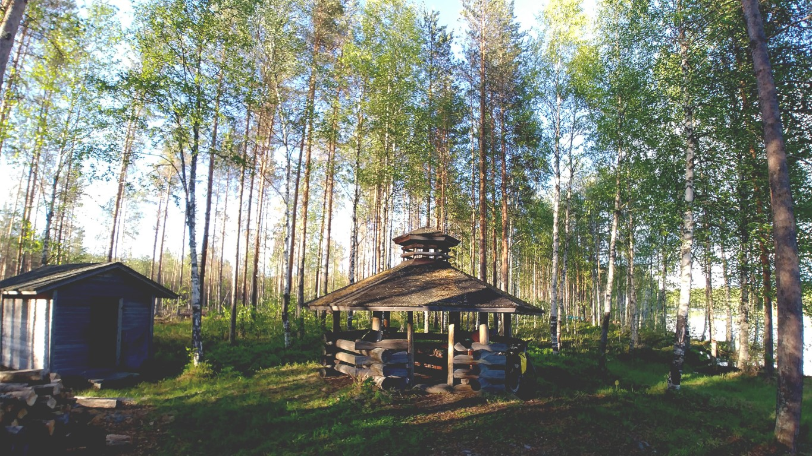
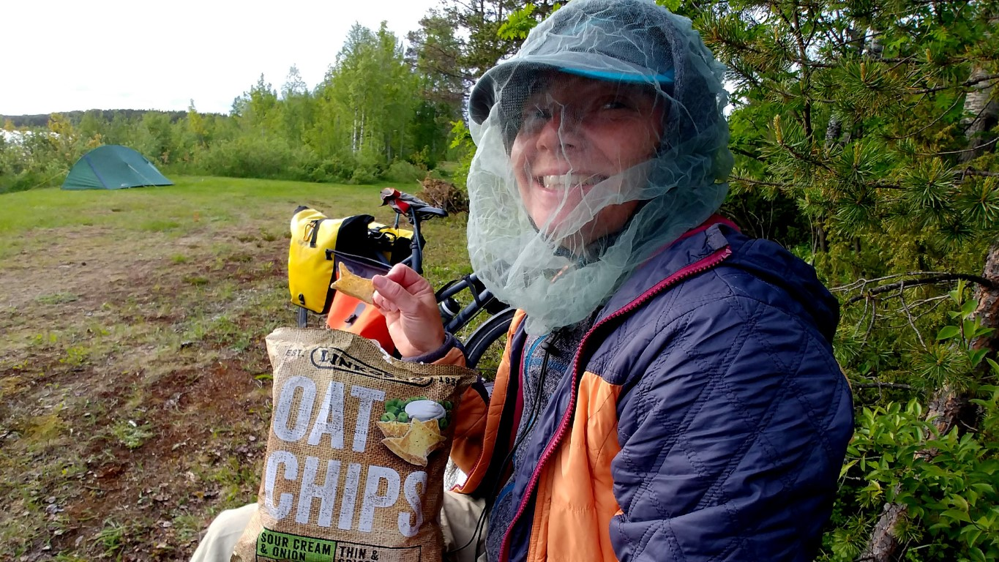
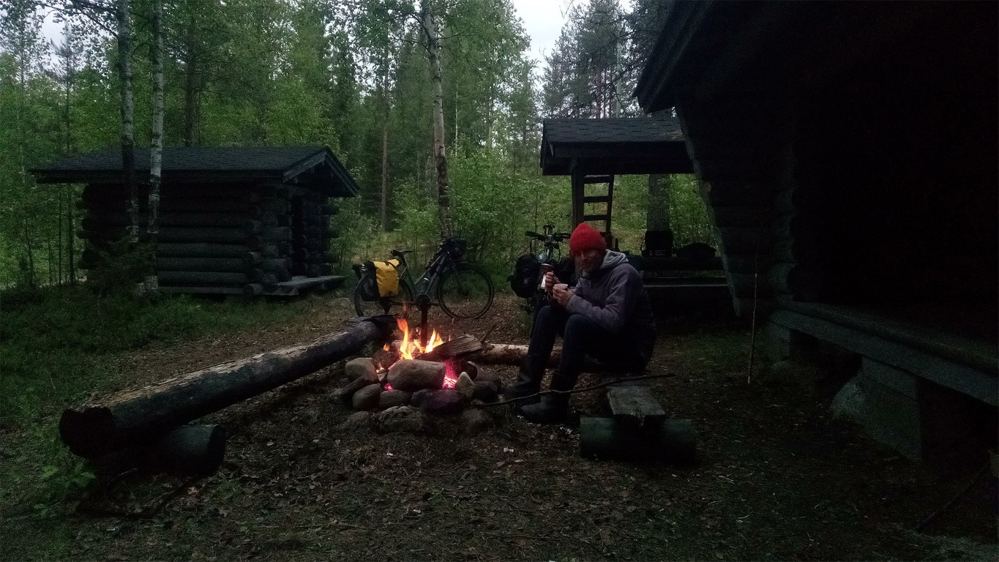
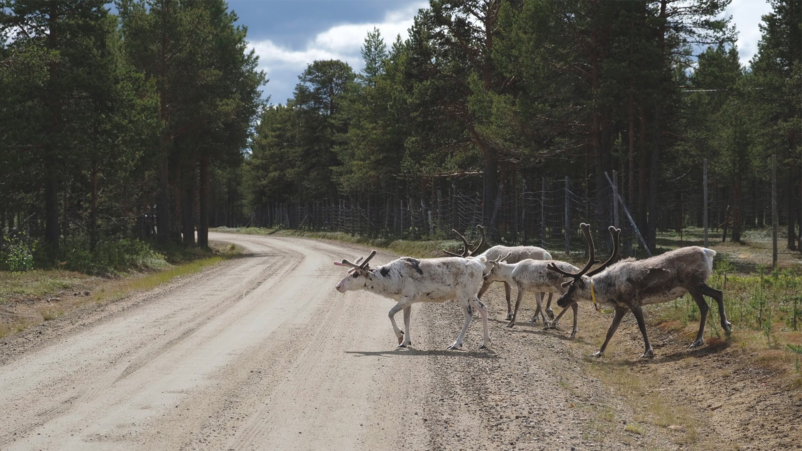
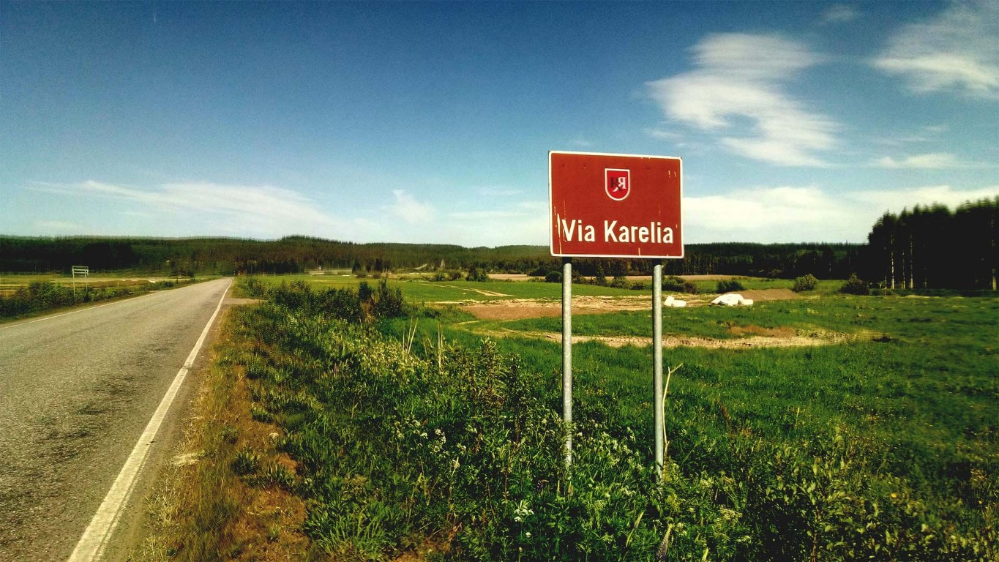
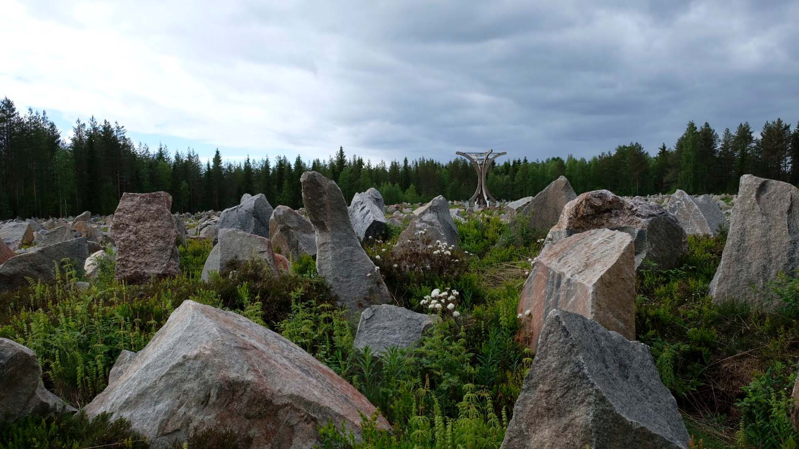
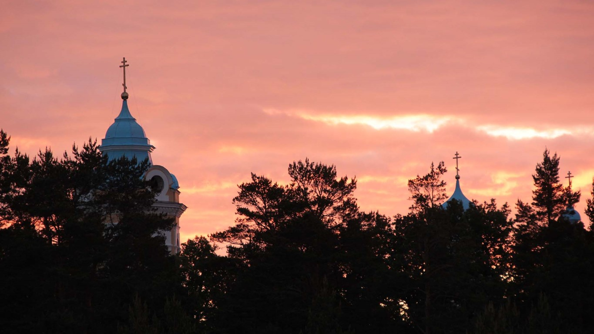
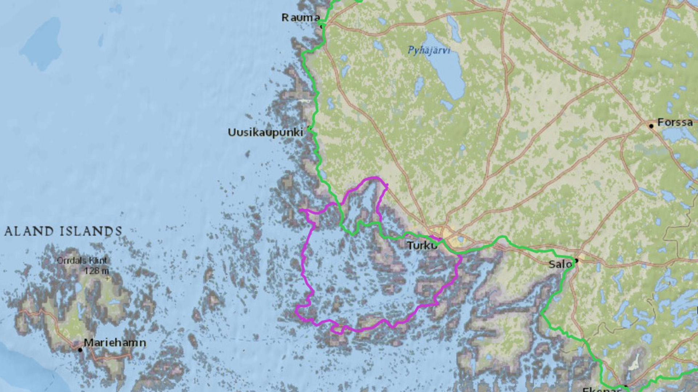
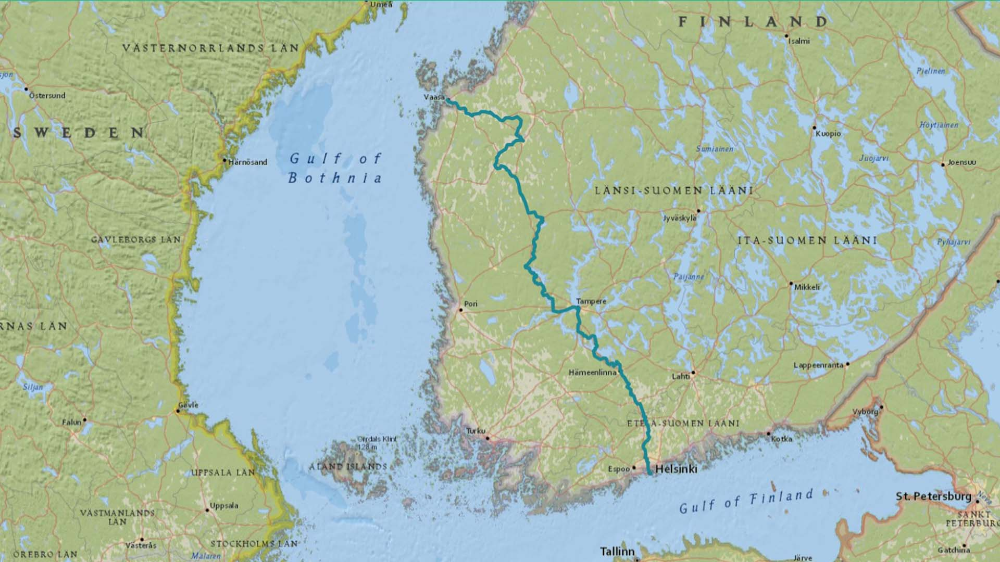

import SevenRoutesDownload from "../../../src/utils/sevenRoutesDownload.js";
import Carousel from "../../../src/components/carousel.js";

Abgelegen, endlose Wälder, 1000 Seen. Radwandern in Finnland ist nicht schwer. Das Land ist durchgehend flach. Uralte Handelsrouten ziehen sich durchs Land: die Via Karelia und der Königsweg zum Beispiel. Wer die Einsamkeit sucht, ist im Osten und Norden von Finnland richtig. Die Straßen sind gut und der sporadische Verkehr stört dich kaum, wenn du durch die idyllische Wald- und Seenlandschaft dahingleitest. Eher werden aufgescheuchte Rentiere vor dir her rennen. Autos kennen sie, vor Radfahrern haben sie Angst. Im Süden und Westen kannst du dagegen Land und Leute kennenlernen: die Hauptstadt Helsinki, Turku in den Schären, Industriestadt Tampere oder Oulo im Norden.

**Wichtig**: Danke = Kiitos, Wasser = Vesi,

**Nützlich**: Zelt = teltta, Fahrrad = polkupyörä, Zeltplatz = leirintäalue

<SevenRoutesDownload
  link="https://drive.google.com/drive/folders/1XaqpCmPDlPu85gkDamUgb0BjJPxGldAU?usp=sharing"
  text="GPX-/KML-Routen Finnland herunterladen"
/>

In der **interaktiven Karte** unten findest du die Radrouten in Finnland aus diesem Artikel. Im Seitenpanel kannst du die **Routen ein- und ausblenden**.

<iframe
  src="https://maphub.net/embed_h/WvgVt410J5EMst3J?panel=1&panel_closed=1"
  title="interactive map"
  width="100%"
  height="400"
  frameborder="0"
></iframe>

## Radwege und Nationalparks

Finnland hat ein Fahrradwegenetz von acht- bis zehntausend Kilometern, das auf der Open Street Map eingetragen ist. Die über 70 nationalen Fahrradrouten sind zu ca. 20 % ausgeschildert und unterschiedlich gut unterhalten. **GPS ist ein Muss**.

Das Verkehrsaufkommen ist außerhalb der wenigen urbanen Zentren so gering, dass du entspannt auf der Straße fahren kannst. Du solltest deshalb nicht nur nach Fahrradrouten suchen, sondern auch **Touristenstraßen für Autos** in Betracht ziehen: die [Nationalpark-Route](https://julkaisut.metsa.fi/assets/pdf/lp/Esitteet/7-finnish-national-parks-touring-route.pdf), die Via Karelia (siehe unten) oder die [Königsstraße](https://skandinavien.eu/finnland/reportagen/koenigsstrasse-in-finnland.html), die auf dem Ostseeküsten-Radweg EV10 verläuft. Hier findest du eine [Website mit Themenrouten durch Finnland](https://www.nationalparks.fi/self-guided-tours). Wenn du nicht tagelang durch einsame Wälder radeln willst, **ohne einer Menschenseele zu begegnen**, empfehlen sich diese Touristenrouten.

Das Land lässt sich mithilfe von GPS-Navigation auch größtenteils auf befestigten **Waldwegen** durchqueren. Außerdem gibt es ausgeschilderte **Gravel-Routen**, wie den Arctic Gravel Loop, siehe unten.

## Wildcamping und Hütten

Finnland ist Champion in Sachen Wildnis-Infrastruktur. Als wir auf unserer Fahrradreise zum Nordkap bei Niirala über die Grenze nach Finnland kommen, schreibe ich folgendes in mein Reisetagebuch:

> Wir haben Mühe, den plötzlichen Kulturschock zu verdauen. Man spricht Englisch, alles ist superordentlich und nicht eingestaubt, und neben der verlassenen, perfekten Asphaltstraße verläuft ein asphaltierter Fuß- und Fahrradweg, auf dem man bequem nebeneinander fahren kann. Der Radweg ist als Euroroute 13 ausgeschildert. Überall gibt es Landwirtschaft, im Supermarkt aber kein Letscho, doch Letzteres wissen wir noch nicht. Krass. Birken und Wald hingegen bleiben uns treu. Und ein leerer Holzlaster rast in hohem Tempo an uns vorbei, als wir gerade versuchen, ein Selfie vor dem Schild **Via Karelia** zu machen. Nicht alles ist anders...  
> OSM erweist sich auch in Finnland als zuverlässiger Navigator. Zielsicher führt uns die Karte 4 km durch den Wald zu einem Feuerplatz mit Feuerstelle, Holzmiete, Klohäuschen und Unterstand, ausgestattet mit Angelstock, Stielpfanne und Räucherstöcken. Willkommen in Finnland.

<SevenRoutesDownload
  link="https://drive.google.com/uc?export=download&id=1p54ki-XHxWpwgbslIFDEgqBtN9iG5rtt"
  text="Reisebericht Fahrradtour Finnland herunterladen"
/>

<figcaption>Laavu (Schutzhütte) bei Hoilola in Finnland</figcaption>

### Wildcampen

In Finnland kannst du wildcampen. Es gilt das **Jedermannsrecht**, du kannst also überall in angemessenem Abstand von Privatland zelten, solange du deinen Fußabdruck so gering wie möglich hältst.

Wir haben auf unserer [Radreise durch Finnland](https://weonbikes.com/buch/) immer einen Platz für unser Zelt gefunden. Manchmal auf Privatland, denn Ländereien können sehr weitläufig sein. Besonders, wenn ein See an den nächsten anschließt und du kein trockenes Plätzchen findest. Diese Stellen waren zu dem Zeitpunkt verlassen und wir fanden es angebracht, unser Zelt dort aufzustellen.

Sobald du in Finnlands ausgedehnten Wäldern unterwegs bist, kommst du fast immer an einer Hütte vorbei. Hier findest du eine [Karte mit Hütten und Campingplätzen in Finnland](https://www.tulikartta.fi/index.php?type=Kaikki&lataus=1). Du kannst den Namen aus der Karte kopieren und die Hütte dann auf der [Nationalpark-Website](https://www.nationalparks.fi/huts) suchen. Auch auf der Open Street Map sind die Hütten eingezeichnet. Es gibt derer so viele, dass du einem Weg zum Ufer eines Sees folgen kannst und häufig eine Hütte vorfindest, auch ohne dass sie in der Karte steht. So erging es uns auf unserer Radreise.

### Hütten

Es gibt viele Arten von Hütten. Alle sind mit Feuerstellen und Holzlager, meist auch Angelruten aus Stöcken und Kompost-Klos ausgestattet.

**Laavu** sind Schutzhütten, kleine Holzhütten, die an einer Seite offen sind. Manche sind groß genug, um ein Innenzelt darin aufzustellen, wenn es stark regnet. Nachts ist das allerdings ziemlich kalt.

**Ruokailukatos** sind überdachte Picknickplätze. Sehr praktisch bei Regen.

<figcaption>
  Ruokailukatos - überdachter Picknickplatz am Haapajoki-Fluss bei Ilomantsi,
  Finnland
</figcaption>

**Päivätupa**\-Hütten sind sogenannte Tageshütten, geschlossene Häuschen ohne Schlafbänke, in denen Reisende unterwegs Schutz finden und im Notfall übernachten können.

**Autiotupas** sind unverschlossene Hütten, die du für ein bis zwei Tage gratis nutzen kannst. Sie sind in der Regel mit Schlafbänken, Brennholz, Ofen und Tisch ausgestattet, einige haben auch eine Kochgelegenheit. Tolle Sache. **Kammi** sind so ähnlich, aber weniger gut ausgestattet.

<Carousel
  imagesObject={[
    { name: "Menno-Kruuntupa-Finland.jpg" },
    { name: "Stove-and-firewood-Kruuntupa-hut-finland.jpg" },
    { name: "Guestbook-Kruuntupa-hut-Finland.jpg" },
    { name: "Lake-Finland.jpg" },
    { name: "Flechten-wie-Schnee-Finnland.jpg" },
    { name: "Kruuntupa-hut-bicycles-Finland.jpg" },
    { name: "Forest-Finland.jpg" },
  ]}
/>

<figcaption>Kruuntupa-Hütte Nähe Inari, Finnland</figcaption>

**Kota** und **Hirsikota** sind mehr oder weniger runde Hütten mit einer Feuerstelle in der Mitte. Das Raucharoma macht Übernachten in diesen Hütten nur bei extrem schlechtem Wetter interessant.

<Carousel
  imagesObject={[
    { name: "Menno-Koti-Inarijoki-Finland.jpg" },
    { name: "Inside-Koti-Hut-Finland.jpg" },
  ]}
/>

<figcaption>Koti am Tana-Fluss</figcaption>

**Varaustupa**\-Hütten musst du reservieren und eventuell bezahlen. Du teilst dir die Hütte meist mit anderen Gästen. Sie sind in der Regel mit Bettzeug ausgestattet. Du findest [zu reservierende und zu mietende Hütten auf der Nationalpark-Website](https://verkkokauppa.eraluvat.fi/en/huts/). **Vuokrakammi** sind Hütten, die du vollständig mieten kannst.

## Mücken, Regen, Reisezeit

Im Sommer ab Anfang Juni gibt es in Finnland haufenweise Mücken, besonders am Ufer der Seen. Für deine Radreise solltest du mückendichte Kleidung für den Abend und einen Hut mit Moskitonetz dabeihaben. Sprays haben bei uns überhaupt nicht funktioniert. Ein Moskitonetz am Zelt ist praktisch, es ist abends aber nicht so warm, dass du ohne nicht schlafen könntest. Ein Lagerfeuer hilft ebenfalls gegen Mücken.

Trotz Mücken ist der Sommer die **beste Reisezeit für Finnland**. Ab Juni ist auch der Norden schneefrei. Bis in den August kannst du dann weiße Nächte genießen und kommst zügig voran. Im September werden die Tage schnell kürzer. Auch im September haben viele Campingplätze in Finnland noch geöffnet.

Der **Herbst gilt als Hochsaison** in Finnland. Schon im September färben sich die Wälder bunt und in den Nächten kannst du in Lappland Nordlichter sehen. Vielleicht begegnen dir ein paar Allradfahrzeuge im Wald oder mehr Wohnmobile auf der Straße. Auch das [Zusammentreiben der Rentierherden](https://paliskunnat.fi/reindeer/reindeer-herding/husbandry-year/autumn/) beginnt Mitte September. Wenn du totale Ruhe willst, wähle den Juni.

Finnland liegt in Skandinavien und wie die Mücken ist auch hier der Regen ein häufiger Begleiter. Vorbereitung ist alles. Ein Zelt, bei dem das Innenzelt einzeln eingepackt werden kann und funktionierende Regenkleidung erhalten die Reiselaune.

## Wie komme ich nach Finnland

Wenn du deine Radreise im **Norden** beginnst, ist der **Flughafen Kirkenes in Norwegen** der beste Startpunkt. Dorthin gibt es viele bezahlbare Flüge und Finnland beginnt direkt um die Ecke. Bevor du in die Wälder Lapplands eintauchst, kannst du noch einen Abstecher zum Nordkap machen.

Beginnst du im **Süden** und willst **nicht fliegen**, kannst du mit deinem Fahrrad den [Flixbus](https://www.flixbus.de/busverbindung) nach Tallin (Estland) nehmen und mit der Fähre zu Finnlands **Hauptstadt Helsinki** übersetzen. Helsinki ist ein toller Startpunkt für den Königsweg, die Küstenroute (Teil des Ostseeküsten-Radwegs) oder die [Nationalpark-Route](https://julkaisut.metsa.fi/assets/pdf/lp/Esitteet/7-finnish-national-parks-touring-route.pdf). Eine Alternative ist der Flixbus nach **Stockholm**. Von dort kannst du mit der Fähre auf die Insel Åland übersetzen und die berühmte **Archipel-Route** beginnen, siehe unten.

## EuroVelo Routen durch Finnland

3 EuroVelo-Routen führen durch Finnland.

- [Ostseeküsten-Radweg EV 10](https://weonbikes.com/blog/3-meere-in-europa-per-rad-umrunden/#ostseeradweg-9000-km-eurovelo-10)
- [Osteuropa-Route EV 11](https://weonbikes.com/blog/7-radwanderwege-in-europa-nord-sued/#5-ost-route-6500-km-eurovelo-11)
- [Eiserner-Vorhang-Route EV 13](https://weonbikes.com/blog/7-radwanderwege-in-europa-nord-sued/#4-europa-radweg-eiserner-vorhang-10000-km-ev-13)

Der EV 11 und der EV 13 verlaufen von Norden nach Süden durchs Land, wobei die Grenzroute EV 13 grenznah im einsamen Osten des Landes verläuft. Der EV 10 schlängelt sich auf 950 km an der Ostseeküste und am Bottnischen Meerbusen entlang durch Finnland und deckt sich mit der **Nationalen Küstenroute**.

## Helsinki-Nuorgam 1567 km

**In Nord-Süd-Richtung mitten durchs Land!** Diese Route schließt die Lücke zwischen den EuroVelo-Routen EV10 am Bottnischen Meerbusen und EV13 an der Ostgrenze. Sie stimmt teilweise mit dem EuroVelo 11 überein, der Osteuropa-Route. Dem nördlichen Teil dieser Route durch Lappland sind wir auf unserer [Radreise zum Nordkap](https://weonbikes.com/buch/) größtenteils gefolgt. Lies dir dazu gratis unseren Reisebericht über Lappland durch! Die Route Helsinki-Nuorgam findest du in der interaktiven Karte dieses Artikels. Auf der OpenCycleMap-Layer ist es Route Nummer 4.

<SevenRoutesDownload
  link="https://drive.google.com/uc?export=download&id=1ZjROWAUDbzS1ZdEKwqhRG4dOmF7fpvMs"
  text="Reisebericht Fahrradtour Lappland herunterladen"
/>

Im **Süden** verläuft die Route ganz in der Nähe der [Nationalparkroute](https://julkaisut.metsa.fi/assets/pdf/lp/Esitteet/7-finnish-national-parks-touring-route.pdf). Sie führt allerdings auf der Ostseite des Päijänne-Sees entlang. Du beginnst deine Radreise in **Helsinki**, einer Stadt, die allein schon 1500 km Fahrradweg aufzuweisen hat. Hier kannst du dich also ausleben und die Stadt per Rad erkunden. Bis Riihimäki folgst du der Bahnlinie, die erste, die in Finnland angelegt wurde. In **Riihimäki** gibt es auch ein historisches Museum dazu. Dann geht's Richtung **Päijänne-See** nach **Lathi**, es folgt Natur pur.

Im [Pyhä-Häkki-Nationalpark](https://www.nationalparks.fi/pyha-hakkinp) findest du die ältesten Kiefern des Landes, bis zu 400 Jahre alte Exemplare sind dort erhalten geblieben. Der südliche Teil dieser Route endet in Oulo direkt am Bottnischen Meerbusen. Oulo rühmt sich, die nördlichste Großstadt der EU zu sein. Sie hat eine Universität, viele Cafés, etliche Sehenswürdigkeiten und ist wie alle Städte in Finnland fahrradfreundlich.

Weiter im Norden radelst du durch Lappland. Du kommst in Rovaniemi, dem Zuhause des Weihnachtsmanns, vorbei und überquerst den Polarkreis. Auf Lapplands verlassenen Straßen wirst du Rentiere und ab und an ein Auto treffen.

Nutze die tollen Hütten und besuche den Lemmenjoki-Nationalpark. In Inari darfst du das große Samenmuseum auf keinen Fall verpassen. Die Geschichte der finnischen Grenze und die der Sami ist sehr bewegt. Ab Inari sind wir auf unserer Radreise zum Nordkap einen kleinen aber lohnenswerten Umweg am Tana-Fluss entlanggefahren, noch ruhiger als der finnische Norden sowieso schon ist.

## Via Karelia 1080 km

Die Via Karelia führt östlich von Helsinki nach Norden bis nach Salla in Lappland. Das Gebiet ist seit Urzeiten besiedelt. Karelische Handelsleute reisten auf dieser Route in den Norden. Die Via Karelia ist eine Touristenstraße und nicht speziell für Radfahrer ausgelegt. Sie verläuft aber im verlassenen Osten des Landes, wo du einsam auf guten Straßen durch die finnischen Wälder radeln kannst.

Bis auf kurze Strecken verläuft die Via Karelia auf dem grenznahen EV 13, dem Eisernen-Vorhang-Radweg. Du kommst durch folgende Städte: Vaalimaa, Lappeenranta, Imatra, Parikkala, Kitee, Tohmajärvi, Joensuu, Ilomantsi, Lieksa, Nurmes, Kuhmo, Suomussalmi, Kuusamo, Salla. Kurz nach Parikkala lohnt sich ein Abstecher auf die Straße 14 Richtung Westen zur [Olavinlinna-Burg](https://www.kansallismuseo.fi/en/olavinlinna). Auf unserer interaktiven Karte ist das die kurze Route Mikkeli-Imatra (nationale Radroute Nr. 14).

Weitere Sehenswürdigkeiten, die du auf der abgelegenen Strecke nicht verpassen solltest, findest du in dieser [Beschreibung der Via Karlia](https://viakarelia.fi/wp-content/uploads/viakarelia_runon-ja-rajan-tie_de_v1.pdf). Der Winterkrieg und die Nationalparks sind die größten Themen auf dieser Route. Auch das alljährliche Kammermusikfestival in Kuhmo, die Stromschnellen-Show in Imatra oder die traditionelle karelische Küche sind sehens- und erlebenswert.

<figcaption>Winterkriegsdenkmal bei Suomussalmi</figcaption>

<SevenRoutesDownload
  link="https://drive.google.com/uc?export=download&id=1p54ki-XHxWpwgbslIFDEgqBtN9iG5rtt"
  text="Reisebericht Fahrradtour Finnland herunterladen"
/>

Zwischen Nurmes und Lieksa führt die Via Karelia am **Pielinen-See** vorbei. Den 93 km langen See kann man mit dem Rad auch schön umrunden. Am Westufer befindet sich der [Koli-Nationalpark](https://www.nationalparks.fi/kolinp) mit dem Berg Koli, eine der sehr wenigen Gelegenheiten in Finnland die Aussicht über die Landschaft zu genießen.

Es gibt auch noch eine **Via Karelia in Ost-West-Richtung**, die sogenannte [Kirchenstraße](https://viakarelia.fi/wp-content/uploads/viakarelia_karjalan-kirkkotie_de_v2.pdf) (350 km). Sie beginnt in Heinävesi am Karvio-Kanal und verläuft durch Joensuu und Ilomantsi und endet in Värtsila, dem Grenzort, an dem wir auf unserer [Radreise zum Nordkap](https://weonbikes.com/buch/) nach Finnland gekommen sind. Die Kirchenstraße ist ein karelisch-orthodoxer Pilgerweg und führt an vielen Kirchen und Klöstern vorbei, dem [Lintula-Kloster](https://viakarelia.fi/de/ortodoksisuus/lintula-kloster-der-dreifaltigkeit/) und dem [Mönchskloster Neu-Valamo](https://de.wikipedia.org/wiki/Kloster_Uusi_Valamo), zum Beispiel. Das ursprüngliche Kloster Walaam liegt auf der gleichnamigen Insel im Ladoga-See im russischen Teil Kareliens. Kriegsbedingt waren die Mönche nach Finnisch Karelien umgesiedelt. 2013, als vorübergehend friedlichere Zeiten angebrochen waren, hatte ich die Gelegenheit Walaam mit dem Segelboot zu besuchen.

<figcaption>Walaam auf dem Ladogasee</figcaption>

## Archipel-Route 200 km + 50 km Fähren

Szenenwechsel. Ganz im Südwesten von Finnland befindet sich der wahrscheinlich inselreichste Archipel der Erde: die Turkuer Schären. Inseln ohne Ende, schätzungsweise dreißig- bis fünfzigtausend Stück. Strand, Meeresbrise, Städtchen und Dörfer, Brücken und Fähren.

Die **Schärenringstraße** wurde 1996 als Touristenstraße ins Leben gerufen. Sie beginnt im Osten in der Stadt **Turku** und kann im Westen auf der Insel Åland begonnen werden (falls du von Stockholm anreist). Die Fähren sind für Fahrräder kostenlos nutzbar. Im Hochsommer kann es am Wochenende voll werden auf der Straße. Plane die Tour lieber in der Woche ein.

Auf unserer Route von Turku gegen den Uhrzeigersinn kommst du durch folgende Orte:

Turku, Merimasku, Lieranta, Mietoinen, Taivassalo, Kustavi, Heponiemi-Kannvik-Fähre, Inö, Jumo-Skagen-Ferry, Dalen-Mossala-Fähre, Mossala E-Björkö-Fähre, Kivimo-Roslax-Fähre, Kittuis-Galtby-Fähre, Korppoo, Retais-Pärnäs-Fähre, Nauvo, Prostvik-Lillmälö-Fähre, Turku

Hier kannst du die [Fährzeiten](https://www.finferries.fi/en/ferry-traffic/ferries-and-schedules.html) nachschlagen. Auf dieser Website findest du viele [Details zum Archipelago-Trail](https://en.wikivoyage.org/wiki/Archipelago_Trail).

## Via Finlandia Helsinki – Vaasa 596 km

Die Via Finlandia ist die nationale Fahrradroute Nummer 3 und als solche ausgeschildert. In der Hauptstadt Helsinki beginnend führt sie Richtung Nordwesten zum Bottnischen Meerbusen. Auf der Route lernst du außer Helsinki noch Tampere und Vaasa kennen. Das ist die Strecke: Helsinki - Hyvinkää - Riihimäki - Hämeenlinna - Valkeakoski - Tampere - Ikaalinen - Kurikka - Vaasa

Hämeenlinna ist die Geburtsstadt des Komponisten **Jean Sibelius**. Außer dem [Museum](https://sibeliusmuseum.fi/en/sibeliusmuseum/) in seinem Geburtshaus kannst dort auch noch die [Burg](https://de.wikipedia.org/wiki/Burg_H%C3%A4me) bewundern. **Tampere** ist Finnlands drittgrößte Stadt. Sie liegt zwischen zwei Seen, die einen Höhenunterschied von 18 m haben. Dadurch entstehen dazwischen Stromschnellen, aus denen Energie gewonnen wird. Saunahauptstadt [Tampere](https://www.tripadvisor.de/Attractions-g189948-Activities-Tampere_Pirkanmaa.html) ist ein urbanes Zentrum mit allem was dazugehört: Musik und Kunst, Dom, Bars, Markt, Sehenswürdigkeiten, viel Industrie und 2 Häfen.

Nachdem du ca. 300 km lang deine Ruhe hattest, kannst du in der alten **Hafenstadt Vaasa** wieder urbanes Leben genießen. Von hier geht es weiter auf dem EuroVelo 10 um die Ostsee oder gen Norden nach Lappland.

## Südfinnland auf Gravel-Routen

Das finnische Zentrum für Fahrradtourismus entwickelt seit 2020 Bikepacking-Routen. Radrouten also, die nicht auf Asphaltstraßen, sondern auf befestigten Wegen verlaufen. Auf [Bikeland.fi](https://www.bikeland.fi/en) findest du eine genaue Beschreibung der insgesamt 900 km auf 5 Routen in Südfinnland.

Diese Routen sind nicht schwierig, 4-6/10. Empfohlen werden 45 mm Reifen. Diese Routen kannst du auch auf einem Tourenrad fahren. Auf der [Website der Trails](https://www.bikeland.fi/en/southbycycle) ist der Schwierigkeitsgrad sehr genau angegeben. Außerdem sind alle POIs eingetragen. Schau's dir an! Auf unserer interaktiven Karte haben wir die Routen ohne POIs mit aufgenommen.

Die Routen führen durch Nationalparks, Wald und Seen und passieren Campingplätze, Feuerstellen und Einkaufsmöglichkeiten. Das klingt nach einem entspannten Fahrradurlaub in der Natur!

## Arktische Gravel-Routen

2000 km Bikepacking-Routen sind vom Polarkreis im finnischen Lappland bis zum Nordmeer in Norwegen 2022 bereits kartiert. 5 MTB-Routen für All-Terrain-Räder und **6 Gravel-Routen**. Du findest sie auf der [ArcticByCycle-Website von Bikeland.fi](https://www.bikeland.fi/en/arcticbycycle). In unsere interaktive Karte haben wir nur die langen Gravel-Routen aufgenommen, die mit einem robusten Tourenrad vermutlich machbar sind. Die Routen berücksichtigen die vorhandenen Hütten und Infrastruktur. Da bekomme ich gleich richtig Lust auf Arktis per Rad!

1. [Arktische Poststraßen-Gravel-Route](https://www.bikeland.fi/en/arctic-postroad-gravel-route) 347 km durch den Pallas-Ylläs National Park nach Norwegen, 85 km auf der Autostraße. Dafür ist die Route einfach und mit 40 mm Reifen machbar.
2. [Mittel-Lappland Gravel-Runde](https://www.bikeland.fi/en/central-lapland-gravel-loop) 1140 km. Die Route ist nicht übermäßig schwierig. Allerdings sind 480 km Selbstversorgung angesagt. Gut, mit einem Umweg von 46 km könntest du zwischendurch shoppen gehen, einen Campingplatz gibt es auf der Strecke auch. Gerade mit dem Tourenrad sollte das also kein Problem sein.
3. [Santas West-Gravel-Runde](https://www.bikeland.fi/en/santas-western-gravel-loop), 493 km, startet im Weihnachtsmanndorf Rovaniemi, das 2002 genau auf dem Polarkreis lag. Du kommst hier auf dem EuroVelo 11, bzw. der Helsinki-Nuorgam-Route vorbei. Einen Bahnhof gibt es auch. Die Route gehört zu den einfachen in dieser Liste: nur 1% Singletrack, 19 Hütten und Schutzhütten und viele Ortschaften. In dem Gebiet werden zahlreiche **Rentierherden** gehalten und im Herbst fällt die meiste Arbeit an. Die Route ist zwar bis Ende September geöffnet, ab Mitte September solltest du aber bei Äkäslompolo auf der Straße fahren, um das [Zusammentreiben der Herden](https://paliskunnat.fi/reindeer/reindeer-herding/husbandry-year/autumn/) nicht zu stören. Die Tiere werden zu tausenden mit u.a. Motorrädern und Hubschraubern zusammengetrieben. Da möchtest du nicht im Weg stehen. Informiere dich vorher auf der Website des Trails.
4. [Korvatunturi-Gravel-Runde](https://www.bikeland.fi/en/korvatunturi-gravel-loop), 301 km, sehr abgelegen im Osten Lapplands, führt auf alten Forstwegen entlang. Es gibt viele Schutzhütten und 2 Campingplätze. Den Startpunkt Svukoski erreichst du auf dem EuroVelo 13, dem Eisernen-Vorhang-Radweg, siehe die interaktive Karte. Diese Route kann für ein Tourenrad mit Gepäck streckenweise schwierig sein. Glasklare Flüsse, Angelmöglichkeiten und die Einsamkeit des Waldes sollten für gelegentliches Schieben kompensieren. Extra Zeit einplanen!

---

Das waren sie vorerst, die Routen, auf denen du Finnland per Rad durchqueren kannst. Schau ab und zu wieder rein, es kommen sicher noch einige hinzu. Eine Reiseroute durchs flache waldreiche Finnland lässt sich anhand der Routen in der Open Street Map gut selbst planen. Wer es richtig einsam braucht, findet auf [Bikeland.fi](http://Bikeland.fi) tolle Gravel-Routen. Und wer es belebter mag, findet in diesem Radroutenführer [Inspirationen für kürzere Routen](https://issuu.com/outdoorsfinland/docs/cycling_manual_eng). Leg los...

**_Schwing dich aufs Fahrrad, teile die schönsten, die sichersten, die kürzesten, längsten oder praktischsten Fahrradrouten mit anderen. Sprich über Fahrradreisen Verschenk' mal ein Rad oder einen Fahrradtag! Gib einfach nicht auf, bis alle Fahrrad fahren. Denn Fahrradfahren macht glücklich._**

<SevenRoutesDownload
  link="https://drive.google.com/drive/folders/1XaqpCmPDlPu85gkDamUgb0BjJPxGldAU?usp=sharing"
  text="GPX-/KML-Routen Finnland herunterladen"
/>
