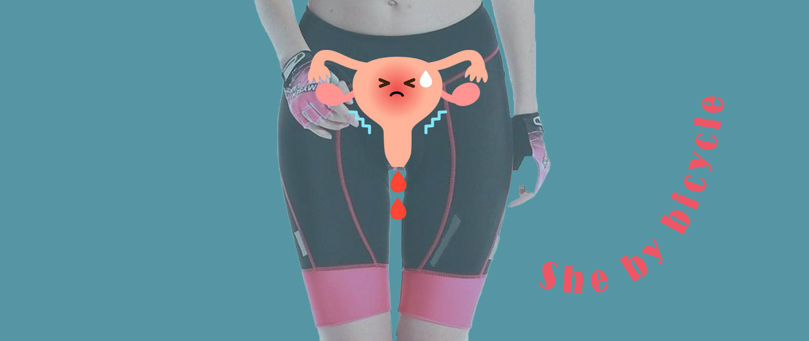

_Frau auf dem Rad_ und _Frau aufs Rad!_ sind unsere Mottos zum Frauentag. Viele Frauen fahren bereits Rad - auf Radwanderinnen trifft frau allerdings weniger häufig als auf Radwanderer. Unsere Beiträge auf weonbikes.com sind voller praktischer Tipps für alle auf dem Rad. Wie frau mit wenig Transportgewicht, allein und trotzdem sicher unterwegs ist, wird demnächst auf unserem Blog besprochen. Heute: Fahrradrahmen, Sättel, Menstruation beim Radfahren und Mobilität der Frau.

## Interview mit einer Radfahrerin

"Mama! Fahrrad und Frauen. Was fällt dir dazu ein?", frage ich meine Mutter vor ein paar Tagen in Vorbereitung auf diesen Beitrag zum Frauentag.

"Dass es immer schwierig war, mit langem Rock auf dem Rad zu fahren. Aber ich wusste genau, wie ich das am besten hinbekomme: den Rockzipfel von nur einer Rockseite mit der Hand am Lenker festhalten. Aber dann erst mit dem Petticoat...", war ihre erste Antwort. Sie hat immer gern lange Röcke getragen. 

Fahrradfahren hat sie wie viele Kinder nach dem Krieg auf dem Stangenfahrrad ihres großen Bruders gelernt. Da der Sattel unerreichbar war, ging das so: ein Bein unter dem Oberrohr durch den Rahmen gesteckt, den Arm oben drüber zum Lenker, rauf auf die Pedalen und dann schräg im Rahmen stehend die Straße runter. So war das.

Ein altes Gebrauchtes gab es, als sie zur Mittelschule in die nächste Stadt musste. Und dann kommt sie ins Schwärmen: "Als ich in der 10. Klasse war, ging meine Mutter mit mir ins Kaufhaus. Sie brauchte ein neues Rad und ich durfte mir auch ein ganz neues Fahrrad für mich aussuchen." Sie erinnert sich, wie sie um ein Diamant-Sportrad herumgeschlichen ist. Sportrad, weil es eine **4-Gang-Kettenschaltung hatte - sensationell**! 400 Mark, ein Monatsgehalt. "Meine Mutter kam und fragte, welches mir nun gefallen würde. Ich war so verliebt in die Gangschaltung... 'Ach, weißt du, mein Kind," hat sie da gesagt, 'wir müssen die Räder sowieso in Raten abbezahlen. Da kommt es auf ein paar Monate mehr auch nicht mehr an.'" Das war 1960. Wir finden ein Foto, auf dem sie die neue Errungenschaft glücklich präsentiert. Das Diamantrad mit der 4-Gangschaltung hat sie **30 Jahre lang** begleitet. Dann wanderte es in den Keller, weil sie ein anderes geschenkt bekam.

## Damenrad war früher - Räder für Frauen?

Das "Damenrad" ist aus der Mode gekommen. Es heißt heute Fahrrad mit "Wave-Rahmen", mit "tiefem Einstieg" oder **Tiefeinsteiger**. Zurecht, denn so ein Modell hat weniger mit dem Geschlecht als mit der Körpergröße und dem Gebrauchszweck zu tun.

Wenn du dein Bein nicht mehr elegant über den Sattel schwingen kannst, ist der Tiefeinsteiger deine Lösung. **Kindersitz hinten drauf?** Sehr praktisch, wenn du das Bein nicht auch noch über den Nachwuchs wuchten musst. Schnell mal absteigen geht so wirklich leichter. Besonders Anfänger ersparen sich mit dem tiefen Einstieg so manchen Sturz.

Auch wenn sie immer wieder zu wahren Packpferden werden, Fahrräder mit Wave-Rahmen sind **weniger verwindungsstabil** als Räder mit Diamant- oder Trapezrahmen. Wo das klassische Stangenfahrrad im Alltag gemieden wird, ist es bei Sport und Transport umso beliebter - und zwar bei allen Geschlechtern. Traditionelle Lastenräder hatten oft sogar eine Doppelstange. Heute gibt es zahllose robuste Modelle auch mit abgesenkter Stange.

### Was macht dann aber ein Fahrrad für Frauen aus?

Fahrräder, die sich gezielt an Frauen richten, sind für bestimmte körperliche Proportionen ausgelegt. Zum Beispiel für relativ kleine Hände: die Griffe sind schmaler und die **Bremsgriffe näher**. Das sorgt für deutlich mehr Komfort. Wenn du also kleine Hände hast, ist der Lenker eines "Frauenfahrrads" vielleicht der richtige für dich.

Die Sitzposition ist zweckabhängig. Fährst du drei Kleinkinder im Lastenrad durch die Stadt, willst du sicher **aufrecht sitzen, um gut manövrieren zu können**. Beim Radwandern sitzt du dagegen in einem Winkel von 40 bis 50 Grad. So lässt es sich richtig lange im Sattel aushalten. Bei diesem Sitzwinkel wird die Rahmenhöhe mit der Formel Beininnenlänge x 0,67 berechnet. Der Wert ist natürlich nicht in Stein gemeißelt. Für lange Touren darf der Rahmen etwas größer sein als für ein möglichst wendiges Stadtfahrrad. Das nächste Maß ist die Sattelhöhe.

### Beim Sattel sollten nun aber die großen Unterschiede zwischen den Geschlechtern zu Tage treten, oder?

Nur bedingt. Auch die [Sattelform](https://www.sq-lab.com/ergonomie/sqlab-produktkonzepte/unisex/) ist abhängig vom Sitzwinkel. Noch wichtiger ist allerdings der Sitzbeinabstand. Den [muss du messen](https://weonbikes.com/blog/sitzbeinabstand-bestimmen-in-3-schritten/) und deine Sattelbreite danach auswählen. Hier kommt nun der Unterschied: Bei Männern drücken die Genitalien auf die Sattelnase, **bei Frauen drückt der Schambeinbogen auf die Sattelnase**. Fazit: Bei beiden Geschlechtern sollte die Sattelnase leicht nach unten abfallen für eine Druckentlastung.

Und noch ein Unterschied: Das **Steißbein ist bei Frauen flexibler** und reagiert empfindlicher auf Druckbelastung. Ein Sattel sollte deshalb nicht zu weich oder hinten zu schmal sein und nicht am Steißbein aufliegen. Das spielt allerdings nur bei aufrechter Sitzhaltung wirklich eine Rolle.

Du siehst, es gibt nur wenig am Rad, was speziell für Frauen gemacht ist. Frauen haben nicht generell kürzere Beine oder kleinere Hände relativ zum Körper. Sie sind nur in der Statistik etwas kleiner. Auch kleinere Männer profitieren von Modellen, die von den Herstellern als Ladybike deklariert werden. Jeder Körper ist anders. Wer lange im Sattel sitzen will, sollte **genau messen**. Kommen wir nun zu einem handfesten Unterschied, oder?

## Periode und Radfahren

### Ohne Unterhosen?

Lieblingsthema Fahrradhose: Ich verdrehe die Augen: "Auf keinen Fall darfst du Unterwäsche unter der Fahrradhose anziehen!" Oder? Nun, ich bin eine Frau. Ich trage Fahrradhosen und - Periode oder nicht - darunter trage ich immer recht dünne **nahtlose Unterhosen** (meist die vom Decathlon). Mit dieser Kombi habe ich schon mehrfach wochenlang den gesamten Tag im Sattel gesessen, ohne je wund zu werden. Sattel und Sitzhaltung sind viel entscheidender. Und ein trockener Hintern.

### Blut

Blut ist nicht gut. Blut **ist feucht und klebt**. Auch und gerade Menstruationsblut. Wenn Blut zwischen Haut und Auflage kommt, sind wunde Stellen vorprogrammiert. Ganz besonders, wenn da keine Haare sind. Binden und Einlagen funktionieren daher während der Periode nur bedingt beim Fahrradfahren.

Bevor ich ein Loblied auf Tampon und Menstruationstasse anstimme, hier noch eine Alternative, die ganz gut funktioniert: **Heilwolle auf Slipeinlage**. Die Heilwolle liegt ziemlich fest am Eingang der Vagina an und rutscht nicht. Die festen Blutteilchen bleiben darin hängen. Die Feuchtigkeit wird von der Slipeinlage aufgenommen, die nahezu trocken bleibt.

Bequemer finde ich den guten alten **Tampon**. Die Strippe so verstauen, dass sie nirgends reibt. Eine **Menstruationstasse** scheint ähnlich gut zu funktionieren, wenn sie ordentlich sitzt. Ich habe sie aber noch nicht selbst ausprobiert. Das liegt daran, dass ich das Teil beim Radwandern nicht zwischendurch auswaschen will.

### Periodische Stimmung

Die technische Seite wäre also geregelt. Viel anstrengender sind die schlechtere körperliche Verfassung und die häufig miese Stimmung zu Beginn der monatlichen Periode. Das wird im Urlaub nicht unbedingt besser, weil frau dann noch weniger Lust darauf hat als sonst. Mein Tipp an dieser Stelle an Radwanderinnen mit Periode: immer mit der Ruhe. **Periodisches Treten tut gut**, körperlicher Stress hat an den Haupttagen aber wenig Sinn und macht nur noch erschöpfter.

## Betreuungsmobilität

Dieses frauenrelevante Thema möchte ich nicht nur einmal im Jahr zum Frauentag herauskramen, sondern in die Beträge zu aktiver Mobilität in unserem Blog integrieren.

Auf einen längeren Beitrag zum Thema könnt ihr euch also noch freuen. Wer so lange nicht warten möchte, kann gern in den Forschungsarbeiten von [Katja Leyendecker](https://katsdekker.wordpress.com/publications/) (1) und [Ines Sanchez de Madariaga](https://unhabitat.org/mobility-of-care-ines-sanchez-de-madariaga) (2)  schmökern, aus denen ich hier kurz zitiere:

**Radfahren mit Kindern** mag oberflächlich betrachtet wie die Entscheidung eines Einzelnen, einer Familie oder eines Haushalts aussehen, aber dieser Entscheidung liegt tief die strukturpolitische Dimension der Stadtgestaltung zugrunde \[...\]. \[...\] Der einfache Akt, sich Reisen mit Kindern vorzustellen führt zu einem sorgfältigeren Blick auf die Straßenumgebung und mildert die Aussichten und Erwartungen der Befragten (einschließlich der hartgesottenen britischen Radfahrer), wobei eine separate Infrastruktur überwiegend bevorzugt wird. (1)

Die Belegschaft und die Entscheidungsfindung im Transportwesen sind überwiegend männlich: Im Transportsektor stellen Männer 80 % aller Arbeitnehmer und 78 % der Führungskräfte (Eurofund 2018:7). Feministische Stadtplanerinnen haben ausführlich über die Zusammenhänge zwischen Entscheidungsfindung und **räumlichen Ungerechtigkeiten** geschrieben \[...\]. (2)

### **Mobilität ist ein Stück Unabhängigkeit**

Das ist wiederum nicht geschlechterspezifisch. Getroffen hat es aber dennoch Frauen. Vor nur 5 Jahren wurde im Iran eine Fatwa erlassen, die Frauen das Fahrradfahren in der Öffentlichkeit verbietet. Weltweit sind es Frauen, die den übergroßen Anteil aller Betreuungsarbeit verrichten und Frauen, die von noch fehlenden menschengerechten Verkehrskonzepten am stärksten betroffen sind.

**_Schwingt euch also aufs Fahrrad, teilt die schönsten, die sichersten, die kürzesten und praktischsten Fahrradrouten miteinander. Sprecht über Fahrradtransporte. Verschenkt mal ein Fahrrad oder einen Fahrradtag! Gebt einfach nicht auf, bis alle Fahrrad fahren. Denn Fahrradfahren macht glücklich._**
