import SevenRoutesDownload from "../../../src/utils/sevenRoutesDownload.js";

The best thing about planning a bike ride is the moment when you discover a new route and imagine yourself pedaling all those kilometers through the countryside, breathing the fresh air and experiencing it yourself, right? This is exactly what we did when we researched all **long-distance cycling routes in Norway, Sweden and Finland**. So exciting that we wanted to start our bike tour right away! In this article you will find all routes in Scandinavia, key facts and GPX files to download. Now all you have to do is choose your cycling holiday.

## Cycling in Scandinavia

Scandinavia, that is Norway, Sweden and Finland. They have a lot in common, but there are things they don't.

### White Nights and Northern Lights

A phenomenon which is common to all 3 countries is the summer of white nights. Depending on how far north you go, you can **cycle almost until midnight**. Already in September, on the other hand, days get shorter and you can see the **Northern Lights**. Tip: The area around 70 degree north is best for spotting northern lights, the Lofoten on the Coastal Route in Norway, or Rovaniemi on the EuroVelo 11 through Finland, for example. But you can also be lucky elsewhere to see the green glow in the sky.

### Mosquitoes at the Lake

Another common phenomenon Scandinavia is famous for are mosquitoes. The beasts have high season from June. They disappear with the first frost, sometime in September. While cycling, they don't bother you. But as soon as you settle down comfortably on the shore of one of the countless idyllic lakes, you should be prepared: a mosquito net for your head and mosquito-proof clothing. Fortunately, the evening hours are so cool that you would wear the clothes anyway. The spectacular views and vast, lonely landscapes will make up for the effort. Don't let a few mosquitoes spoil your cycling holiday.

### Rain on Cycling Vacation

We're not sugarcoating it: Vacation in Scandinavia without rain is extremely unlikely. Cycling in the sunshine is great, but with the **right rain gear** and a suitable tent, you can keep up the holiday spirit even when the weather is bad for a couple of days. That's how it's done: Accept the rain. Especially in Sweden and Finland, the landscape looks beautiful even in the rain, or then the most! The raindrops sparkle on moss and lichen and the green of the forests almost leaps at you.

Rain gear: There is no such thing as 100% waterproof rainwear. It just delays getting wet. At some point the water runs into the collar, into the sleeves, from the jacket into the trousers, from the trousers into the shoes. You could ride until you feel your clothes under the raingear get wet and then shelter or set up your tent. If you get completely wet, you should keep going until you come to a place where you can dry yourself.

Rainwear only makes sense when it's cold enough. Otherwise, you sweat under your clothes as if you had cycled without them. In Scandinavia it is cold when it rains. Especially in Norway where the rain goes with wind. Sturdy, really waterproof rain gear is worth it here. That your raingear is light and breathable is secondary if you want to keep up your holiday spirit.

Your **tent** should be suitable for rain. Practical is an anteroom, where you can cook and sit out the rain for a few hours. **Tunnel tents** usually offer large anterooms. They also have the advantage that you **can dismantle the inner tent individually**. That way it stays dry. So the next time you set it up, you put your mat in a dry inner tent. Sounds good, right?

### Mountains

Let's get to the differences. The mountains are very unevenly distributed in Scandinavia. The Scandinavian Mountains run all the way through Norway. The whole country is one big mountain range. In addition, the coast is rugged by countless fjords. In Norway you will make a lot of climbs and many kilometers in east-west direction to advance far less kilometers north to south. You will be compensated with the most breathtaking views in the world (my opinion).

Avoid detours by carefully planning your cycle route through Norway. At weonbikes.com you can download GPX files for all routes for your planning. If you want to be sure your route is feasible, [Matthew from Cycle Norway](https://www.cyclenorway.com/services) will help you personally with route planning in Norway.

In contrast to Norway, in Sweden and Finland you can just start cycling with a rough idea of your direction. In western Sweden there are still mountainous areas. Eastern Sweden and Finland are completely flat. Ideal for cycling with luggage.

### Tunnels

Speaking of detours. There are thousands of tunnels in Norway. Many of these tunnels are closed to cyclists. You should get information about it in advance. This is, because there is not always an alternative, which brings us back to detours. In Norway you should plan your route well in advance. Check out our [Norway article with interactive map](https://weonbikes.com/en/blog/cycling-routes-norway-1/) and this [website with tunnels in Norway for cyclists](https://www.cycletourer.co.uk/maps/tunnelmap.shtml).

## Cycle Routes in Norway

In this overview you will find Norway's 10 national cycle routes as well as the 13 highlights that you shouldn't miss if you cycle along one of these long-distance cycle routes. EuroVelo 1 and EuroVelo 12 run through Norway. They coincide with the Coastal Cycling Route. In addition, there is EuroVelo 3 to Trondheim. It coincides with the Norwegian pilgrimage route. The national long-distance cycle routes are called _Nasjonal Sykkelroute_ and are abbreviated to*NSR*

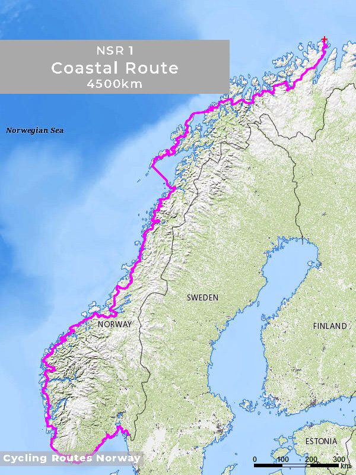

### Coastal Route 4500 km (NSR1)

National cycle route no. 1 with countless highlights. On this long-distance cycle route you pedal from the North Cape along the entire Norwegian coast to the Swedish border in the south. Find out [more about the Coastal Route](https://weonbikes.com/en/blog/cycling-routes-norway-1/#1-coastal-route-4500-km).

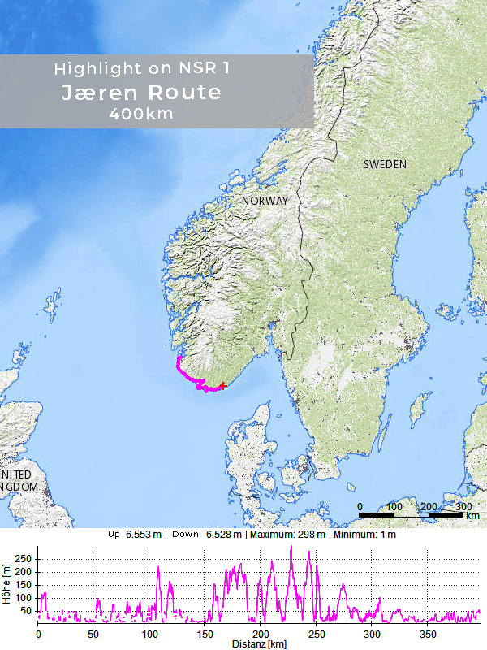

### North Sea Route across Jæren 400 km (part of NSR 1)

This route is one of the highlights of the Coastal Route: Beach, cultural sights, Geo Park. Find out [more about the Jæren Route](https://weonbikes.com/en/blog/cycling-routes-norway-3/#5-north-sea-coastal-route-through-j%C3%A6ren-140-km-nsr-1).

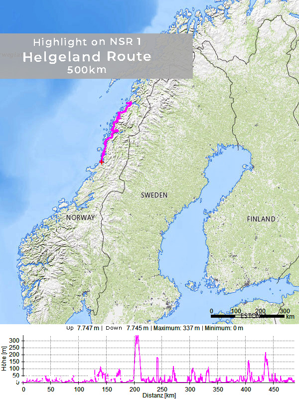

### Helgeland Coastal Route approx. 500 km (part of NSR 1)

The Helgeland route is also a part of the Coastal Route. Here you'll find the famous Torghatten mountain with the hole in the middle, and you drive over the Arctic Circle. Find out [more about the Helgeland route](https://weonbikes.com/en/blog/cycling-routes-norway-3/#6-helgeland-coastal-route-ca-500-km-nsr-1).

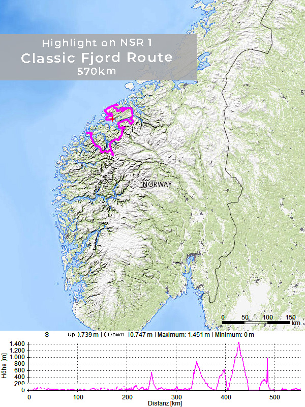

### Classic Fjord Route approx. 570 km (part of NSR 1)

On this route you will experience all the well-known highlights of Norway: the famous Atlantic Road, **Trollstigen** with its hairpin bends, the **Geirangerfjord** and above that **Dalsnibber**, the highest viewpoint over a fjord. This route is also part of the Coastal Route. Find out [more about the Classic Fjord Route here](https://weonbikes.com/en/blog/cycling-routes-norway-3/#10-classic-fjord-route-ca-570-km-nsr-1).

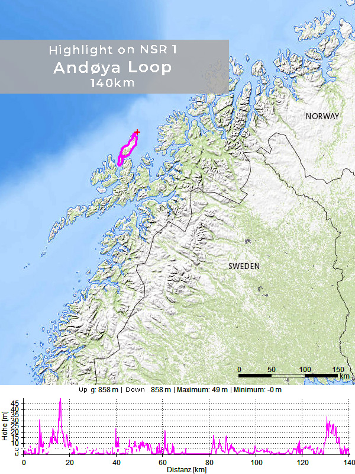

### Andøya in Vesterålen 140 km (part of NSR 1)

At the very north of the Coastal Route on Vesterålen you can cycle around the island of Andøya. A unique experience in the Norwegian Sea: white beaches above the Arctic Circle. You do not believe me? Check out [more about the cycle route around Andøya](https://weonbikes.com/en/blog/cycling-routes-norway-3/#12-and%C3%B8ya-in-vester%C3%A5len-100-km-nsr-1).

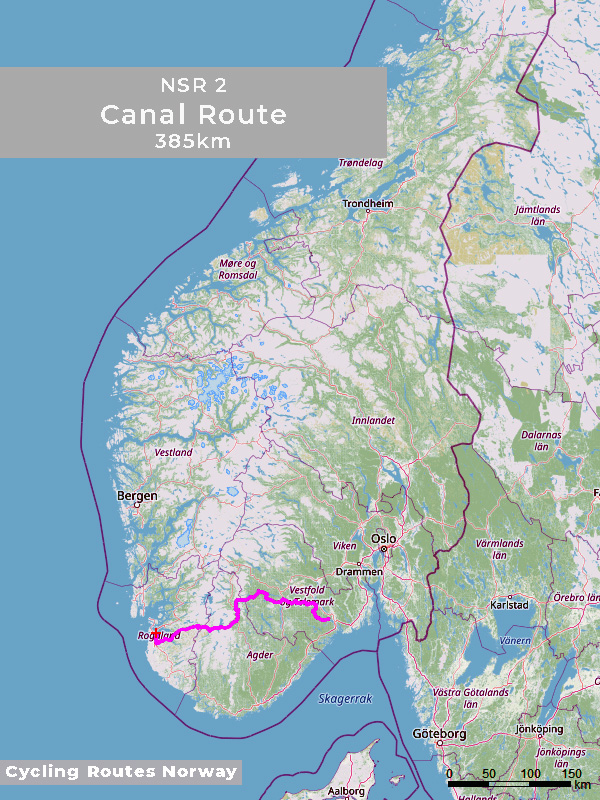

### Canal Route 386 km (NSR 2)

This route runs east-west from Stavanger to Porsgrunn through southern Norway. The Telemark Canal and Suleskarvegen are the highlights between Skagerrak and the west coast.

### Telemark Canal 113 km (part of NSR 2)

An idyllic cycle route along forest paths and quiet roads along the 18 locks of the Telemark Canal. Here you can find out [more about the history of this special canal](https://en.wikipedia.org/wiki/Telemark_Canal).

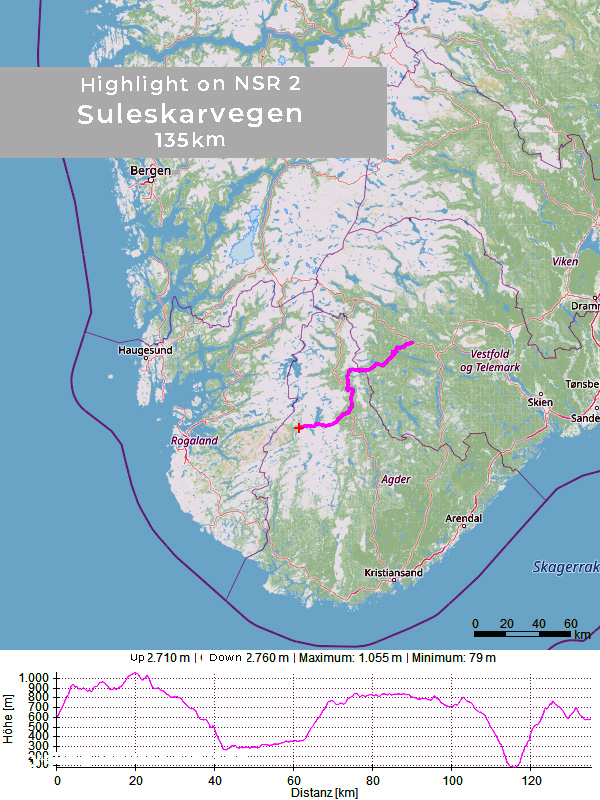

### Suleskarvegen 135 km (part of NSR 2)

Suleskarvegen is a mountain road with splendid views on the Canal Route. It is part of the Norwegian Landscape Routes. You can find more on the [Sulekarvegen website](https://suleskarvegen.no/en/for-those-not-in-a-hurry/).

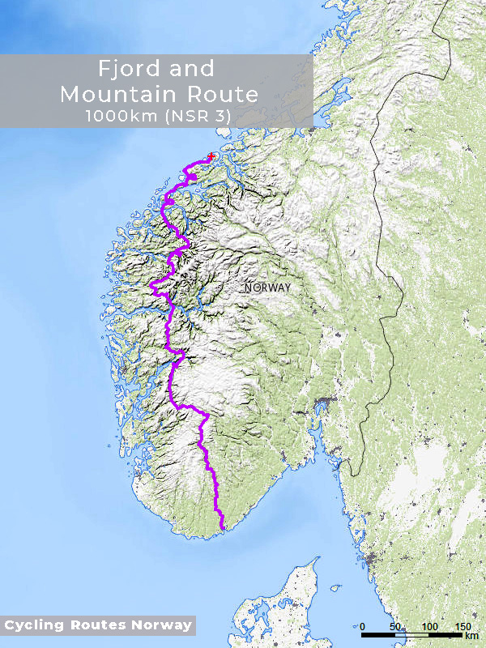

### Fjord and Mountain Route 1000 km (NSR 3)

This national long-distance cycle route runs north-south through Norway's fjord landscape and mountains. Spectacular views and lots of climbs. [More about the Fjord and Mountain route here](https://weonbikes.com/en/blog/cycling-routes-norway-1/#3-fjord-and-mountain-route-1000-km).

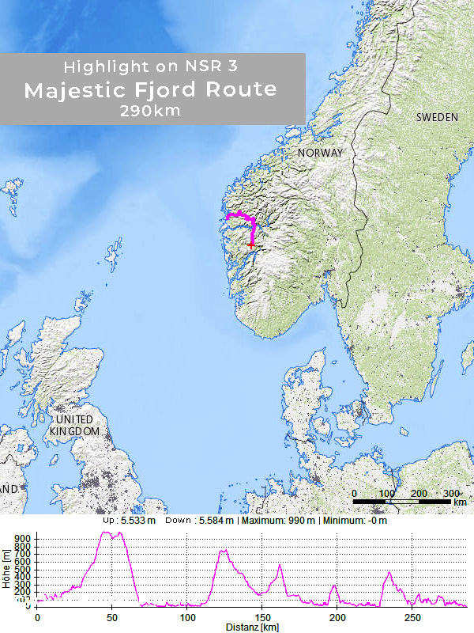

### Majestic Fjord Route 290 km (part of NSR 3)

Leads through Mykedal, over Gaularfjellet to famous Sognefjord. Can be reached by train from Bergen and Oslo. Here you can find a [video of the](https://www.youtube.com/watch?v=Oh7xhg4ub4w)[_Majestic Fjord Route_](https://www.youtube.com/watch?v=Oh7xhg4ub4w).

### Rallarvegen 500 km (NSR 4)

Probably the most popular long-distance cycle route in Norway. Rallarvegen means railway road. It runs in an east-west direction along the railway line between Oslo and Bergen over the Hardangervidda plateau. Here you can find [more about Rallarvegen](https://weonbikes.com/en/blog/cycling-routes-norway-1/#4-rallarvegen-500-km).

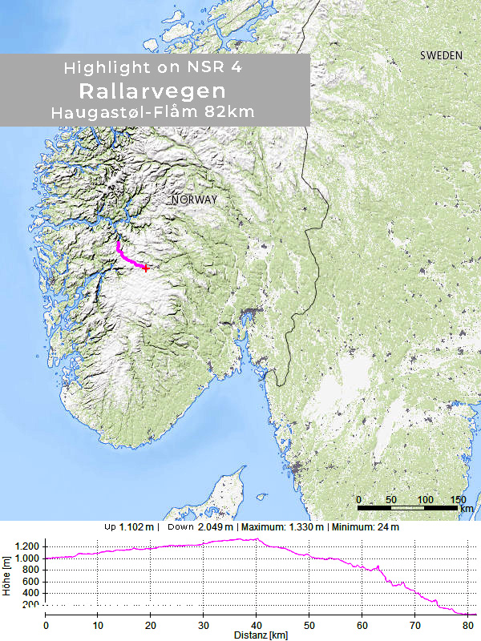

### Rallarvegen to Flåm 82 km (part of NSR 4)

The section of Rallarvegen between Haugastøl and Flåm through Hardangervidda - a must. Car-free and easily accessible by train! Visit the [official Rallarvegen website](https://www.rallarvegen.com/en/rallarvegen).

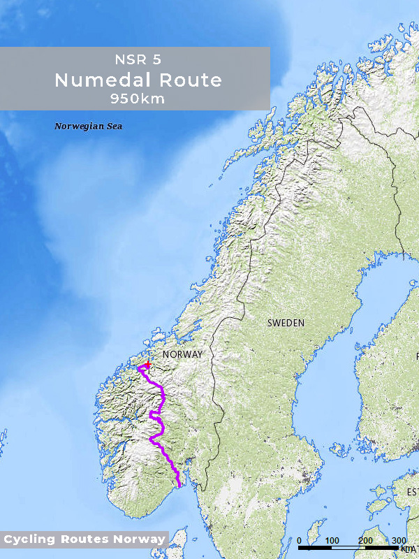

### Numedal Route 950 km (NSR 5)

The route starts in Larvik in southeastern Norway by the sea and heads north through the Numedal valley to Geilo. Geilo is located on the Rallarvegen route. A nice connecting route. You can find out [more about the Numedal route here](https://weonbikes.com/en/blog/cycling-routes-norway-1/#5-numedal-route-950-km).

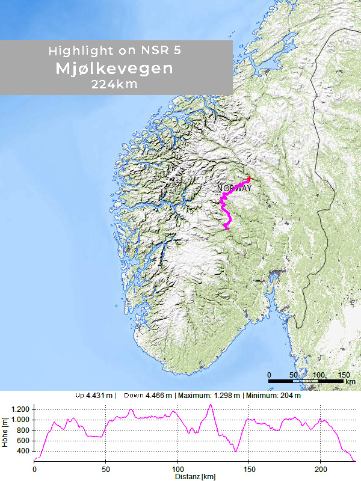

### Mjølkevegen in Valdres 250 km (part of NSR 5)

We continue on the Numedal Route further north of Rallarvegen. A super popular part of the route is Mjølkevegen in the Valdres area. On gravel paths through forest and tundra to Jotunheimen National Park. [More about Mjølkevegen](https://weonbikes.com/en/blog/cycling-routes-norway-3/#2-mj%C3%B8lkevegen-in-valdres-250-km-nsr-5).

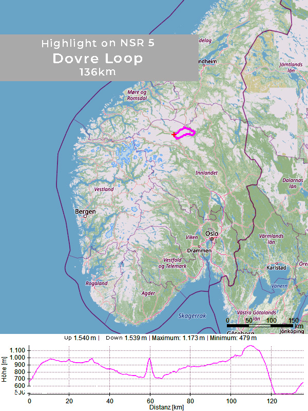

### Dovre Loop 125 km (part of NSR 5)

Bike tour through Dovre National Park on gravel paths through the tundra: Viewpoints and musk oxen. Part of the Numedalroute near Ålesund. [More on the Dovre Loop](https://weonbikes.com/en/blog/cycling-routes-norway-3/#4-dovre-loop-125-km-nsr-5).

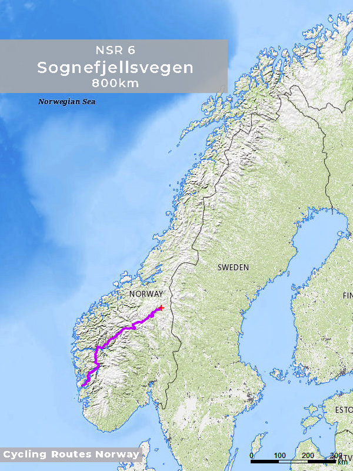

### Sognefjellsvegen Route 800 km (NSR 6)

Starts in the mining town of Røros near the Swedish border and heads southwest to the Hardangerfjord via the famous Sognefjellsvegen mountain pass road. The R55 is the highest pass road in Europe. [More about the Sognefhellsvegen Route](https://weonbikes.com/en/blog/cycling-routes-norway-2/).

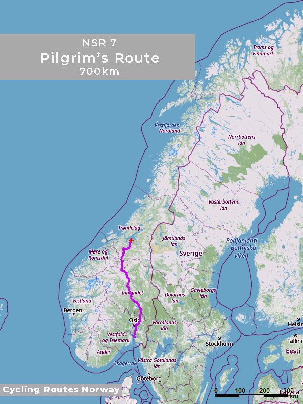

### Pilgrim's Route 700 km (NSR 7)

This route follows [EuroVelo 3](https://weonbikes.com/en/blog/7-cycling-routes-europe-north-to-south/#6-pilgrims-route-5300-km-eurovelo-3) to Trondheim. More urban than other routes through Norway, it passes through Oslo and Lillehammer and past many places and churches. For culture lovers. [More on the pilgrimage route](https://weonbikes.com/en/blog/cycling-routes-norway-2/#7-pilgrims-route-700-km).

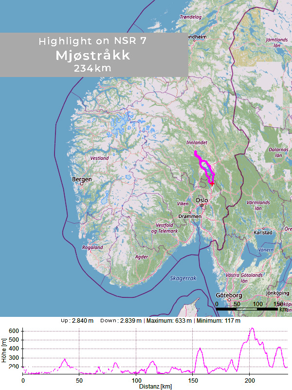

### Mjøstråkk around lake Mjøsa 234 km (part of NSR 7)

Easy detour around Mjøsa, Norway's largest lake. Find out more about [Mjøstråkk here](https://weonbikes.com/en/blog/cycling-routes-norway-3/#8-mj%C3%B8str%C3%A5kk-around-lake-mj%C3%B8sa-234-km-nsr-7).

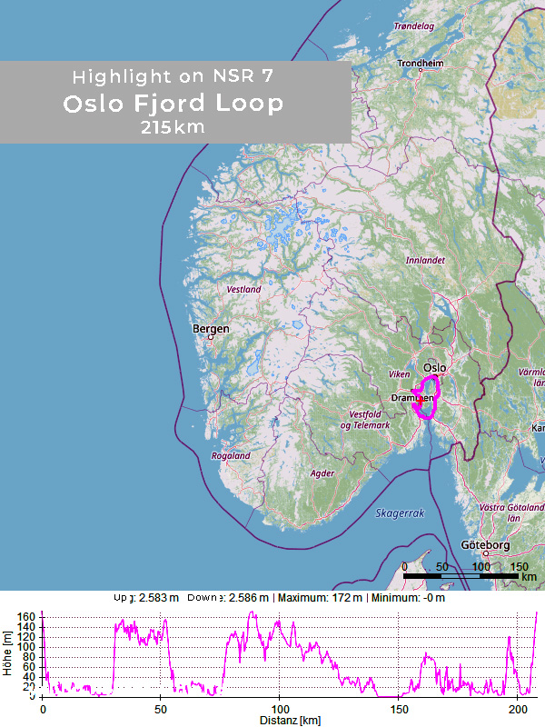

### Oslofjord Loop 215 km (NSR 7)

For the change get to know country and people. This route loops around the urban area of Oslo Fjord. Many small places, sights and culinary delights. Definitely not crowded. [More on the Oslo Loop](https://weonbikes.com/en/blog/cycling-routes-norway-3/#11-around-oslo-fjord-215-km-nsr-7).

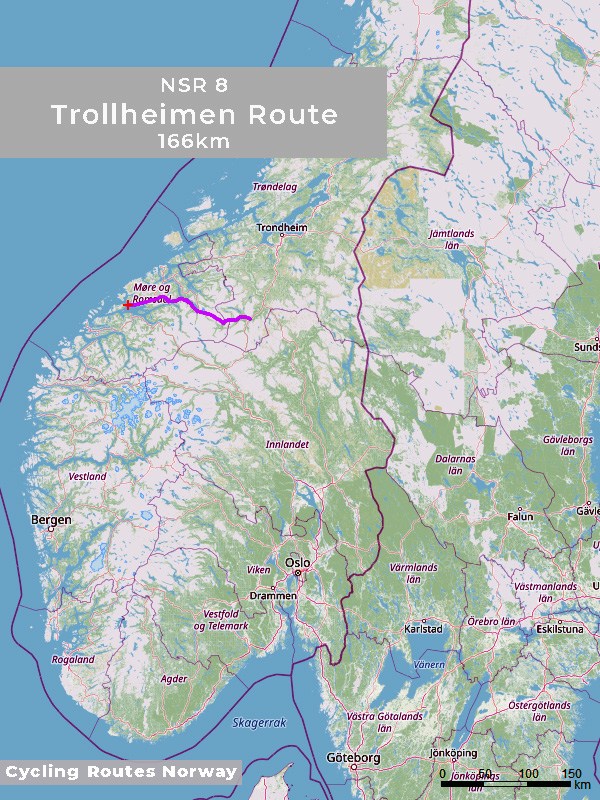

### Trollheimen Route 166 km (NSR 8)

Short but spectacular Route through Trollheimen National Park roughly near Ålesund. Connects the Coastal Route with the Pilgrim's Route. Don't miss the [Åmotan waterfall](https://www.tripadvisor.com/Attraction_Review-g2416787-d3522659-Reviews-Amotan-Sunndal_Municipality_More_og_Romsdal_Western_Norway.html)

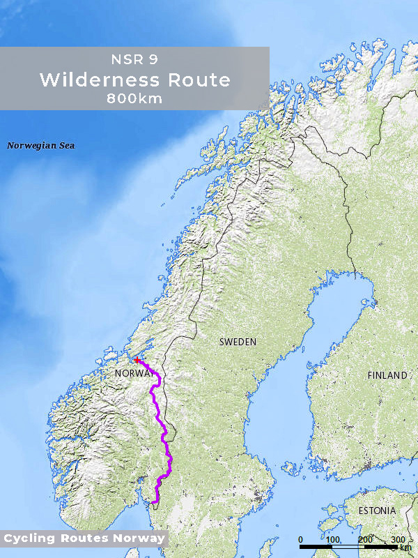

### Villmarks Route 800 km

As an alternative to the Pilgrim's Route, you can take this much quieter route in the very east of the country. From Trondheim to Frederikstad a little less hilly overall. [More on the Wilderness Route](https://weonbikes.com/en/blog/cycling-routes-norway-2/#9-wilderness-route-villmarksruta-800-km).

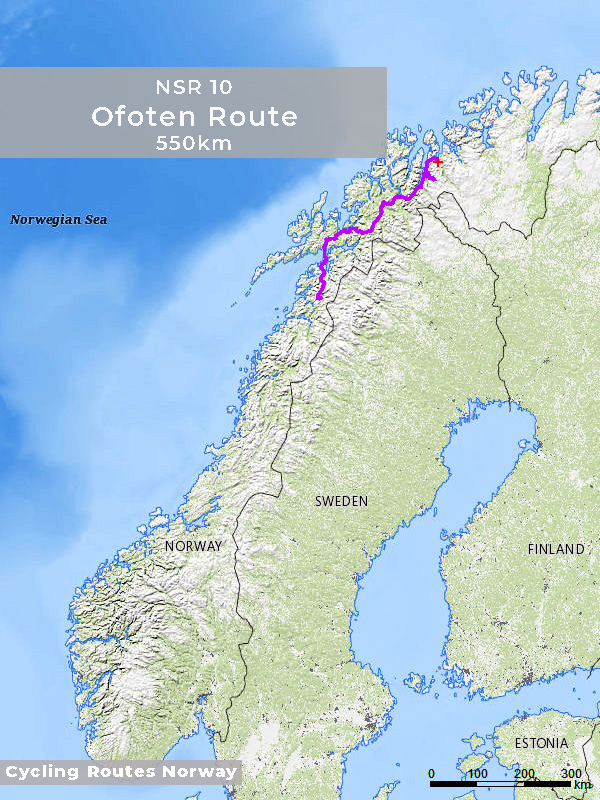

### North Cape - Lindesnes (fragment) 550 km

In future, this long-distance cycle route will cross the entire country from north to south. So far there is a section in the north that can serve as a good alternative to the Lofoten route with its many ferries. It runs through the Ofoten near Narvik. [More about the NSR 10 here](https://weonbikes.com/en/blog/cycling-routes-norway-2/#10-north-cape--lindesnes).

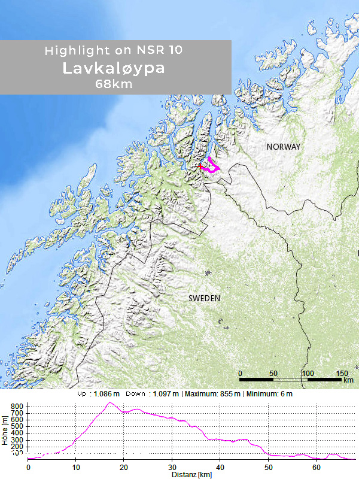

### Lavkaløypa in Lyngenfjord 68 km (at NSR 10)

This gravel route is part of a popular cycling race, the _Lavkarittet_. A detour with spectacular views for trail fans, which is best done without luggage. [More on the Lavkaloypa here](https://weonbikes.com/en/blog/cycling-routes-norway-3/#7-lavkal%C3%B8ypa-in-lyngenfjord-68-km-nsr-10).

<SevenRoutesDownload
  link="https://drive.google.com/drive/folders/1v1DVaKtnbta5TXeCEtRdEmq2oG31yyEs?usp=sharing"
  text="Download GPX routes Norway"
/>

## Cycle Routes in Sweden

Sweden is an uncomplicated country for bike touring. The routes are marked on the Open Cycle Map. In this overview you will find the most important long-distance cycle routes in Sweden.

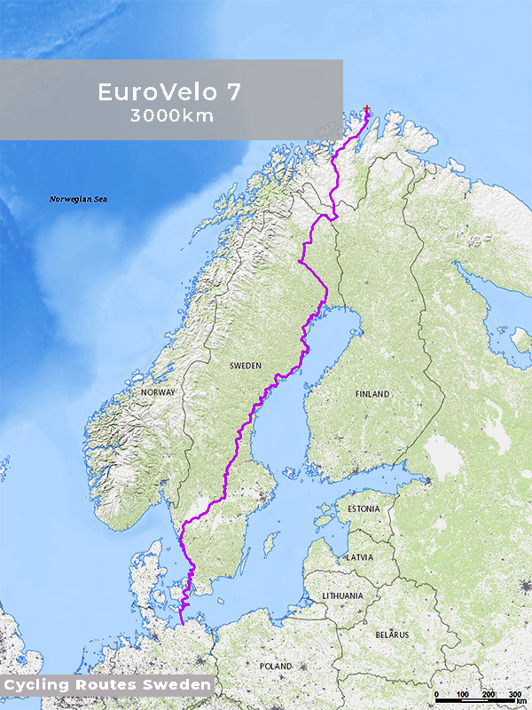

### EuroVelo 7 Sun Route 3000 km in Sweden

The Sun Route from the North Cape to Italy runs north-south through Sweden, crossing the entire country from Lapland along the northern part of the Gulf of Bothnia to Gothenburg. You can find out [more about EuroVelo 7 here](https://weonbikes.com/en/blog/7-cycling-routes-europe-north-to-south/#3-sun-route-7700-km-eurovelo-7).

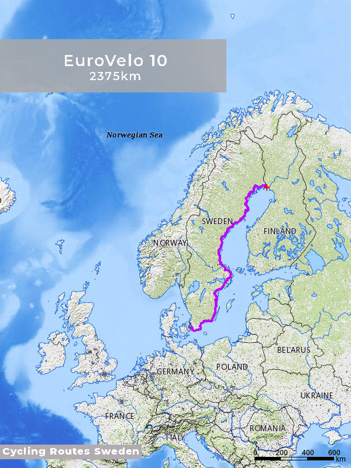

### EuroVelo 10 Baltic Coast Route 2375 km in Sweden

The long-distance cycle route around the Baltic Sea in Sweden runs along the western side of the Gulf of Bothnia and the northern shore of the Baltic Sea. [More about EuroVelo 10](https://weonbikes.com/en/blog/3-european-seas-by-bike/#1-baltic-sea-cycle-route-9000-km-eurovelo-10).

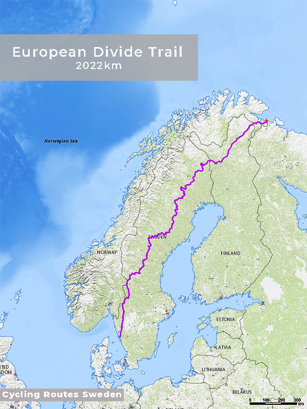

### European Divide Trail 2022 km in Sweden

The European Divide Trail is a long-distance gravel cycle route that runs through Europe from Norway to Portugal. It crosses Sweden from the very north to Helsingborg on the border with Denmark in the south. You can find out more about the route on the [European Divide Trail website](https://europeandividetrail.com/).

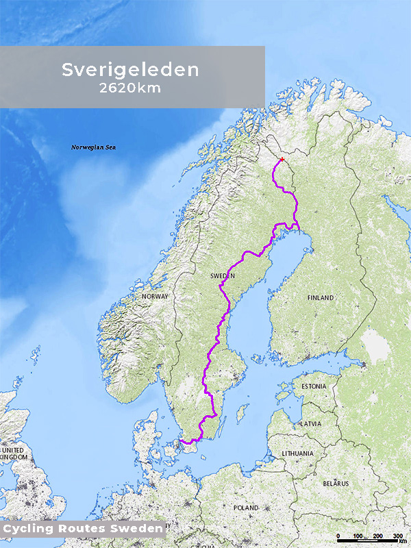

### Sverigeleden 2620 km

The most important and longest cycle route in Sweden is the Sverigeleden. It has many branches. On the main route you cross the country in a north-south direction. Read [all about the Sverigeleden](https://weonbikes.com/en/blog/cycling-routes-sweden/#sverigeleden-karesuando---helsingborg-2620-km).

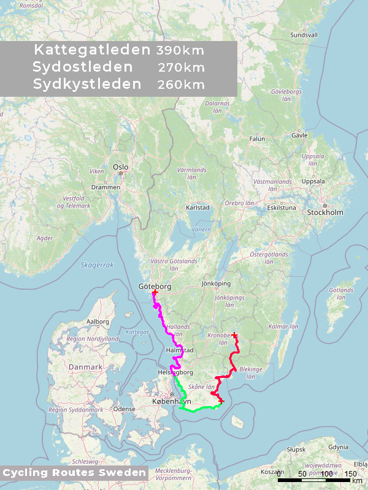

### 3 National Long-Distance Cycle Routes

The well-developed **Kattegatleden** coincides with EuroVelo 12 and runs along the west coast of the country from Gothenburg to Helsingborg. On the **Sydostleden** you cycle through idyllic places to the south coast and then enjoy the Swedish archipelago. On the **Sydkustleden** you pass Sweden's southernmost point. Idyllic harbor places and provincial summer fair romance. [More on Sweden's 3 national long-distance cycle routes](https://weonbikes.com/en/blog/cycling-routes-sweden/#swedens-3-national-cycle-routes-900-km).

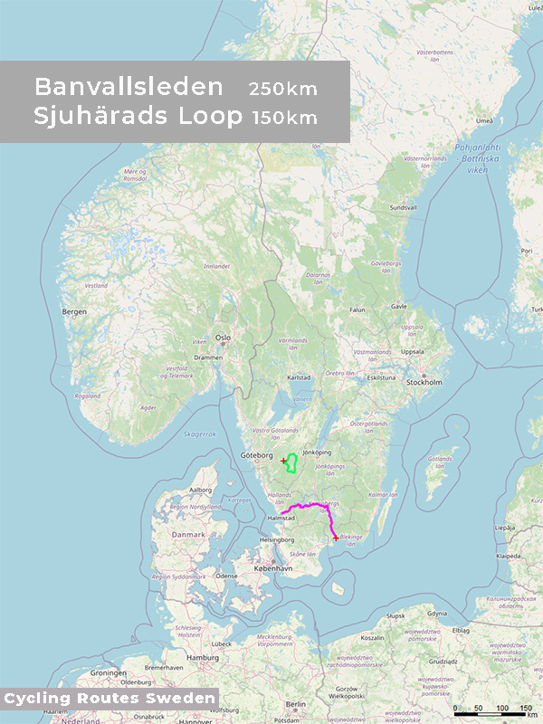

### Rail Trail Cycle Routes

Banvallsleden (Pink) **runs** east-west in southern Sweden from Karlshamn-Halmstad through Åsnen National Park. Train station romance and salmon fishing in the Mörrumsån river. The **Sjuhärads Loop** (Green) runs east of Gothenburg, is signposted, family-friendly with plenty of campsites and accommodation. [More on Sweden's rail trail cycle routes](https://weonbikes.com/en/blog/cycling-routes-sweden/#banvallsleden-karlshamn-halmstad-250-km).

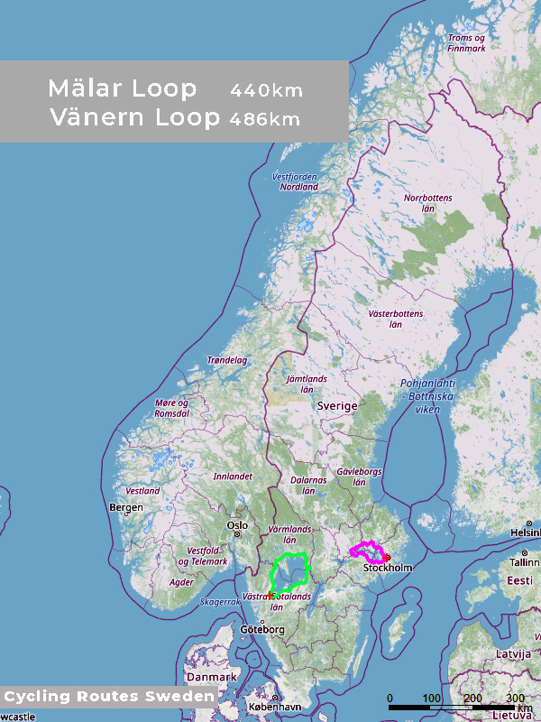

### Lake Cycle Routes

On the loop around **Lake Mälaren** near Stockholm, you can enjoy the lake idyll on forest paths. [More about Sweden's Lake Cycle Routes](https://weonbikes.com/en/blog/cycling-routes-sweden/#lake-m%C3%A4laren-cycle-route-440-km). The **Vänern** is Sweden's largest lake. Varied landscape, villages and comfortable infrastructure.

1[Island Routes Sweden](../img/Sweden/8-Island-Routes-Sweden.jpg)

### Island Routes

**Gotland** is the largest island in the Baltic Sea. The most important sight is the medieval town of Visby and its medieval festival in the 32nd calendar week. The island of **Öland** is easy to reach. The cycle route is part of the Sverigeleden. [More on island routes in Sweden](https://weonbikes.com/en/blog/cycling-routes-sweden/#gotland-route-500-km).

<SevenRoutesDownload
  link="https://drive.google.com/drive/folders/1CynrX_tHHRSNyZYcQHQMNBJZfJrbjDJB?usp=sharing"
  text="Download GPX Routes Sweden"
/>

## Cycle Routes in Finland

Finland is flat and ideal for a first cycling holiday on a budget. Wild camping is allowed! EuroVelo 10, EuroVelo 11 and EuroVelo 13 pass through the country. On the various other long-distance cycle routes on roads and gravel routes through the forest you can simply cycle away.

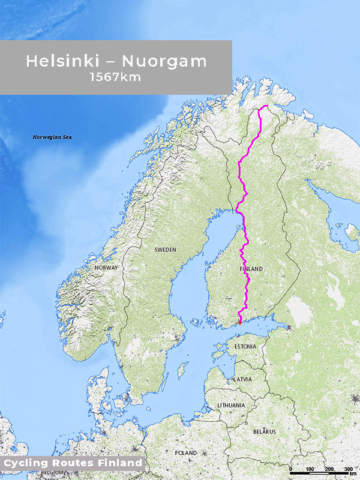

### Helsinki-Nuorgam 1567 km

Crossing the whole country from north to south! National parks, Lapland, reindeer. Coincides with EuroVelo 11 for the most part. [More on EuroVelo 11 through Finland](https://weonbikes.com/en/blog/cycle-routes-finland/#eurovelo-routes-through-finland).

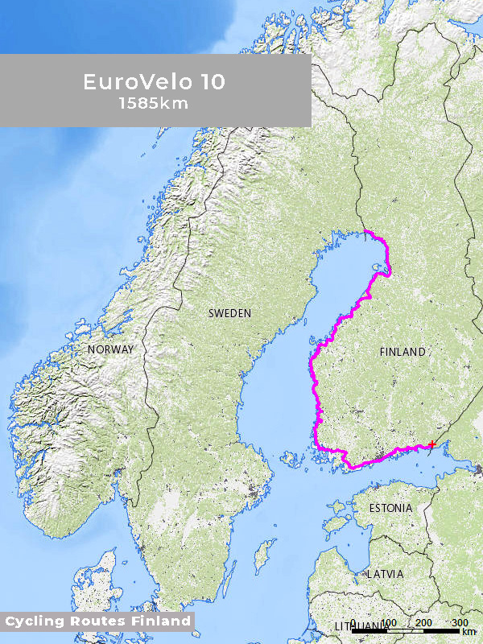

### EuroVelo 10 Baltic Coast Route 1590 km

The long-distance cycle route along the Gulfs of Finland and Bothnia leads through Helsinki, Turku, Vaasa and the northernmost city of Oulo to Lapland and finally to Sweden. [More about EuroVelo 10](https://weonbikes.com/en/blog/3-european-seas-by-bike/#1-baltic-sea-cycle-route-9000-km-eurovelo-10).

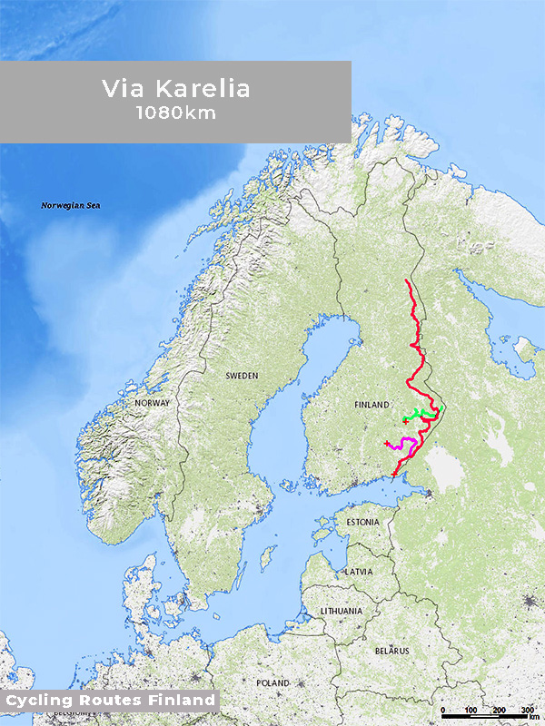

### Via Karelia 1080 km

Tourist route through North Karelia. You cycle in the east of the country from the Gulf of Finland up north to Lapland. [More on the Via Karelia](https://weonbikes.com/blog/fahrradrouten-finnland/#via-finlandia-helsinki--vaasa-596-km).

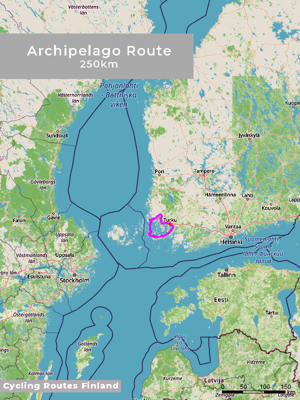

### Archipelago Route 250 km

Loop across the Turku Archipelago on the Archipelago Ring Road. [Archipelago Route details](https://en.wikivoyage.org/wiki/Archipelago_Trail).

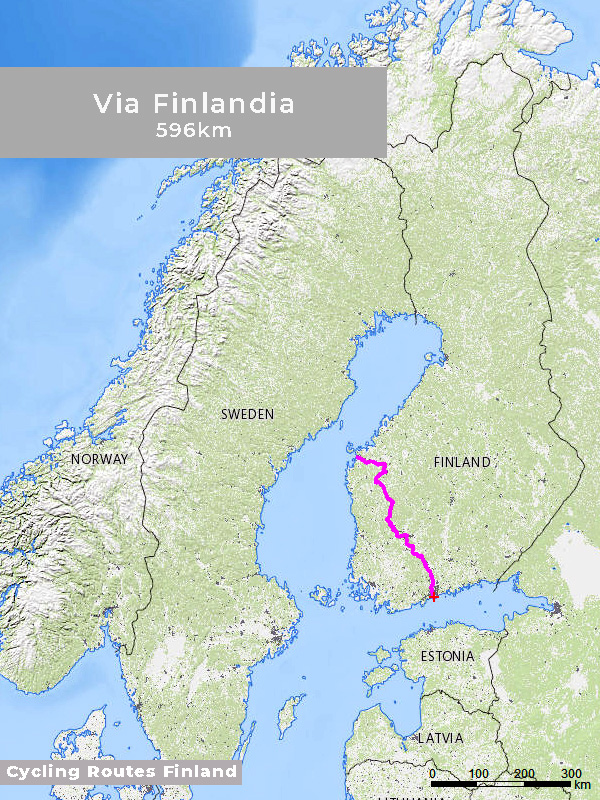

### Via Finlandia 596 km

Runs from Helsinki via Tampere to Vaasa. You get to know country and people. [More about the Via Finlandia by bike](https://weonbikes.com/en/blog/cycle-routes-finland/#via-finlandia-helsinki--vaasa-596-km).

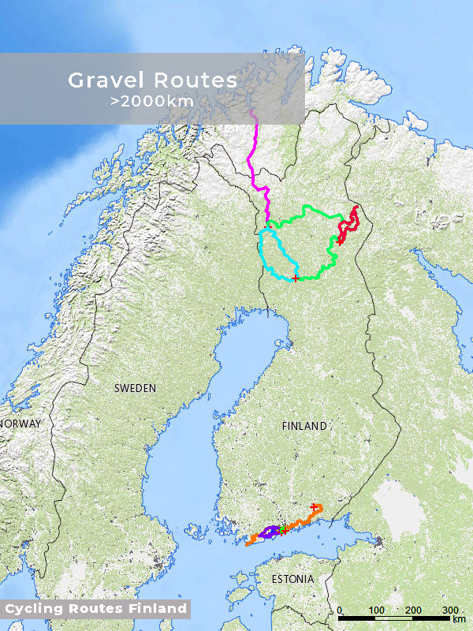

### Gravel Routes in Southern Finland and Lapland

Bikepacking routes through forest and tundra, which are feasible on a touring bike with luggage. You find exact routes on the [official website of ArticByBicycle](https://www.bikeland.fi/en/bikepacking).

<SevenRoutesDownload
  link="https://drive.google.com/drive/folders/1UHgkSRR2_Yit914y2z0zlCu_SoDif_cB?usp=sharing"
  text="Download GPX route Finland"
/>
