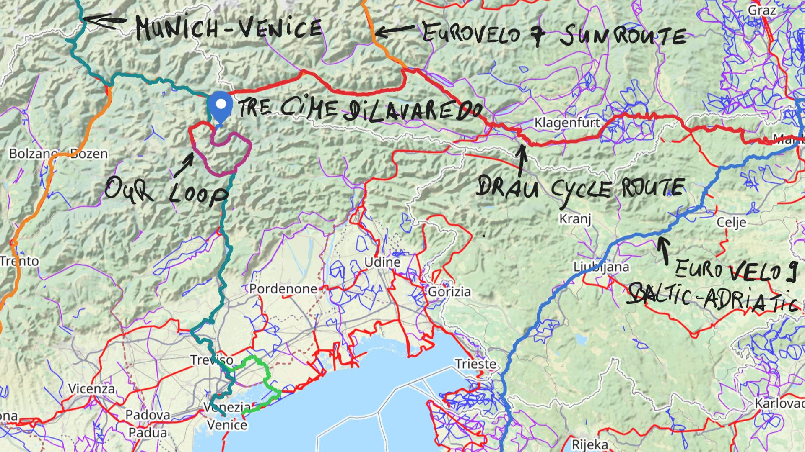
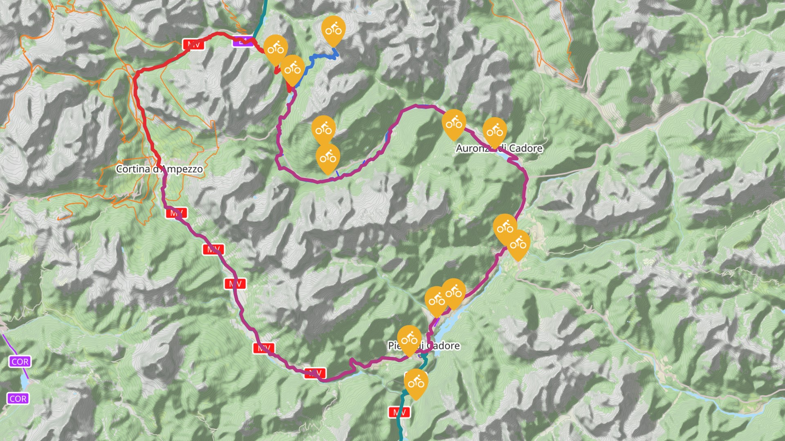
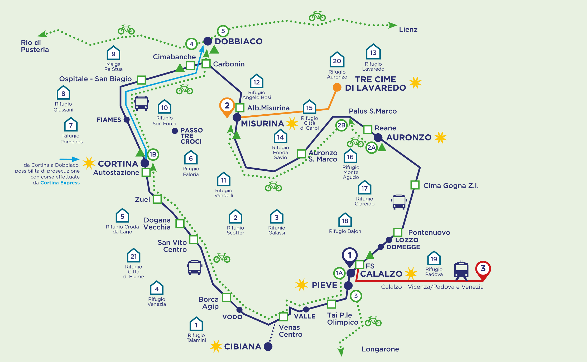
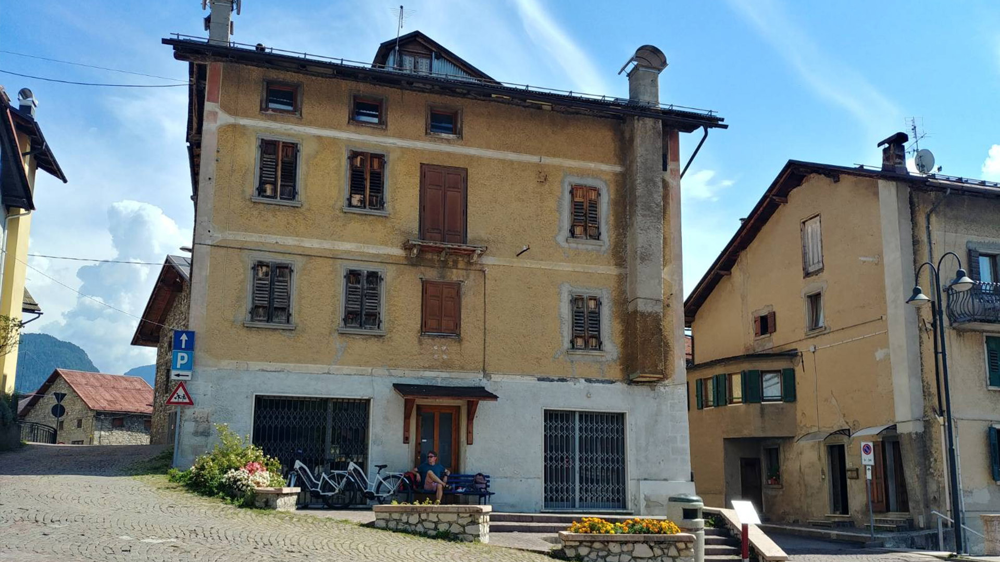
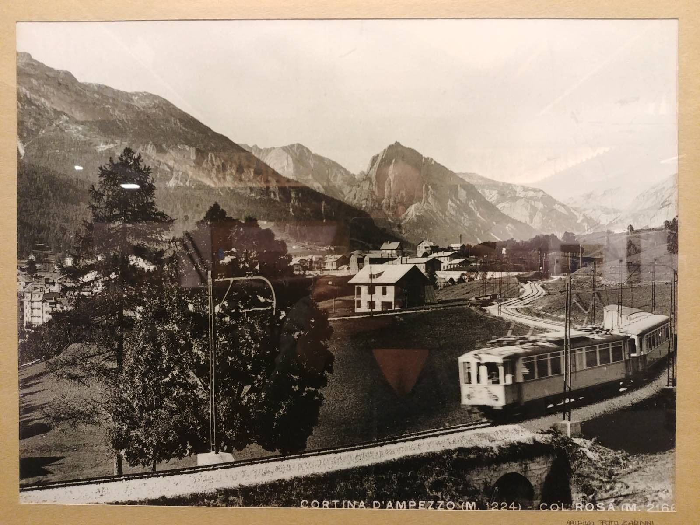
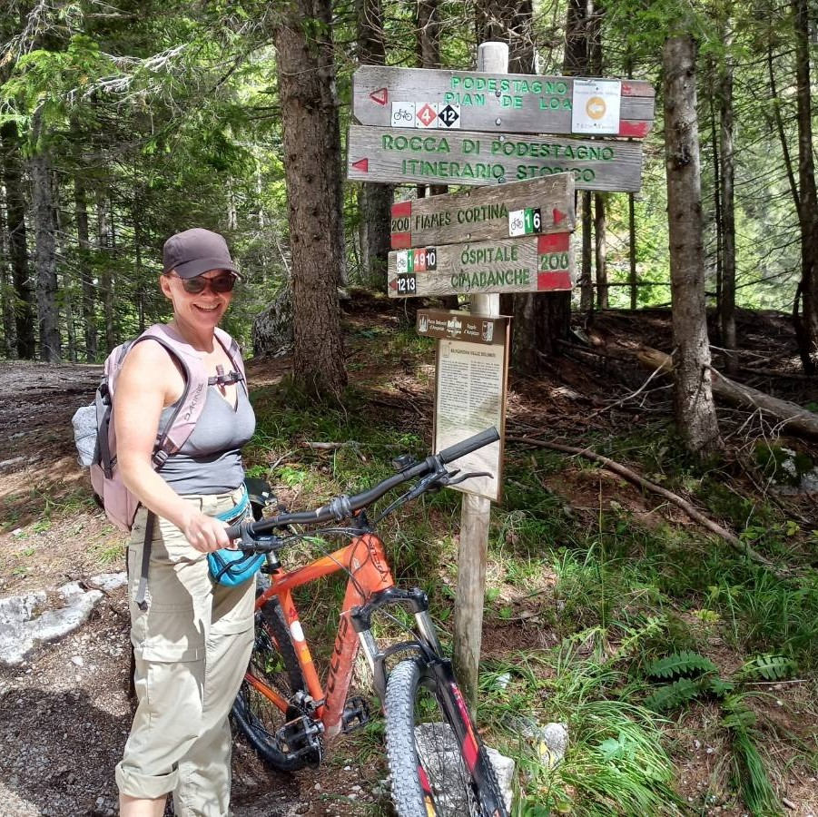

import SevenRoutesDownload from "../../../src/utils/sevenRoutesDownload.js";
import Carousel from "../../../src/components/carousel.js";

This year's summer holiday was a cycling and hiking vacation in the Sesto Dolomites mountains in Italy. We didn't have our bikes with us, because we could rent bikes of all kinds on site and do a wide variety of tours: the family-friendly rail trail cycle path through breathtaking mountain panoramas, MTB routes through the forest, or road bike tours on hair pin bends; everything is possible in the Dolomites. We tried out the well-known Ciclabile delle Dolomiti rail trail cycleway and the scenic Tre Cime di Lavaredo tour and made the GPX files together with long-distance cycle routes through the Dolomites available for you to download here.

On the interactive map you can see the access routes (long-distance cycling routes), our tour and other short routes in the Dolomites.

<iframe
  src="https://maphub.net/embed_h/9lgANkQaZyvRCmrO?panel=1&panel_closed=1"
  title="interactive map"
  width="100%"
  height="400"
  frameborder="0"
></iframe>

<SevenRoutesDownload
  link="https://drive.google.com/drive/folders/1X3mv1VtP_2NcydISlP727vmGQmuc_4yp?usp=sharing"
  text="Download GPX-Routes Dolomites"
/>

## Long-distance cycling routes through the Dolomites

If you want to cycle through the Dolomites, you've got several options. [EuroVelo 7](https://weonbikes.com/en/blog/7-cycling-routes-europe-north-to-south/#3-sun-route-7700-km-eurovelo-7), the sun route from the North Cape to Malta, runs right through it. From Salzburg in Austria, the EV 7 leads south and turns west at _Spittal an der Drau_ onto the Drau cycle path. Then it's through the Puster Valley and along the Eisack River via Bolzano further south through the Adige Valley to Trento.

The [Munich-Venice cycle route](https://www.muenchen-venezia.info/en/news/), on the other hand, turns south in the Puster Valley near Dobbiaco/ Toblach in the direction of the **Tre Cime di Lavaredo** and follows exactly the E1 Dobbiaco/ Toblach-Cortina d'Ampezzo-Calalzo di Cadore rail trail cycle path, which is also known as the **Ciclabile delle Dolomiti** and **Lunga Via delle Dolomiti**.

The Drau cycle path connects the EuroVelo 7 or the Munich-Venice cycle path with [EuroVelo 9](https://weonbikes.com/en/blog/7-cycling-routes-for-bike-tour-holidays/#1-balticadriatic-route-2000-km-eurovelo-9), the Baltic-Adriatic route. You can find detailed information on this [official Drau Cycle Path website](https://www.drauradweg.com/en/sections/)

<SevenRoutesDownload
  link="https://drive.google.com/drive/folders/1X3mv1VtP_2NcydISlP727vmGQmuc_4yp?usp=sharing"
  text="Download GPX-Routes Dolomites"
/>

From the west, the Dolomites can be reached from on the Via Claudia Augusta cycling route. The [Via Claudia Augusta](https://www.viaclaudia.org/en/bicycle-tour/cycling-the-via-claudia-augusta) from Augsburg to Venice leads via Merano to Bolzano and Trento. In the Adige Valley south of Bolzano you can cycle eastwards into the heart of the Dolomites on the old Fiemme Valley rail trail and the subsequent Fiemme and Fassa Valley cycle path. There you'll find Dolomites' highlights like **Rosengarten** and **Sella Group**.

## Rent a bike or bike transport?

**Bike rental**

The dolomites is a touristic area. You can rent bikes of all kinds in many places. We had an automatic rental station for e-bikes right in front of us at the Misurina campsite. This station is part of the **3Cime Bikesharing** network with several stations between the Auronzo hut at the foot of the Tre Cime di Lavaredo mountain range (spectacular, don't miss it) to Calalzo di Cadore.

Simply download the **Bicincitta** app, register with your credit card, top up your credit and start cycling. So far the instructions. In reality we had to be there early to get a bike and check the bikes very closely: Is the battery full? Do the gears work? Are the handlebars straight and centered? Does the motor make strange noises? In addition, it was difficult to get the bikes out of the rack, due to the washed-up earth the rack was to low for the bicycle and the pin got jammed in the cycle rack.

Once you have taken the bike out of the rack, the first hour starts running at 3 euros. Each additional **hour costs 2 euros**. This is cheap compared to the surrounding rental services; in Misurina there was e-mountain bike rental for **50 euros per day**. In Cortina d'Ampezzoe, we could rent a normal mountain bike for **25 euros per day** .

At 3Cime Bikesharing, for 2 €/h we get a large bike (size L) with a suspension fork and 47 mm tires. All in all, a practical solution if you don't have a bike with you.

**Bike transport**

The tourist shuttle buses through the Dolomites must be booked in advance, they are full in summer. It's very difficult to find information about taking a bike with you, especially if you don't speak Italian. When we had to transport our empty e-bikes back to Misurina, we took a taxi (55 euros).

The following map gives you an overview of the travel options by bus and train. You can find the PDF (in Italian) on the [Ciclabiledolomiti.com website](http://www.ciclabiledolomiti.com/wp-content/uploads/2012/05/trenobus-2017.pdf).

## Tre Cime di Lavaredo bike tour

Now to our first tour. We started from our campsite in Misurina. There you have a 3Cime bikesharing rental station at the parking. Alternatively, you can also take the **Dolomiti bus** up to the foot of the Tre Cime di Lavaredo mountains (15 min, 4 euros) and take a 3Cime bike from the station up there - if there is one available (see app). Then you can enjoy the **spectacular view from the Tre Cime di Lavaredo** (Three Peaks) and have even more hight meters for the descent. 580 meters in altitude to be precise, as the Auronzo hut at the foot of the Tre Cime di Lavaredo is at 2340 m and the campsite in Misurina at 1760 m.

Well, we had already walked around the Tre Cime di Lavaredo and had done via ferrata #117 to the Fonda Savio Hut (highly recommended!) and saved ourselves the traffic on the tourist mountain road. From Misurina, the cycle path runs almost **car-free** to Auronzo. A descent of 930 m on rough Dolomite gravel through the forest to Auronzo awaits us, often with a 15% gradient.

<Carousel
  imagesObject={[
    { name: "Misurina-Auronzo-downhill.jpg" },
    { name: "Ansiei-river-near-Auronzo.jpg" },
    { name: "gravel-path.jpg" },
    { name: "Auronzo-lake.jpg" },
    { name: "barrier-Auronzo.jpg" },
    { name: "cycleway-through-woods.jpg" },
  ]}
/>

From Auronzo we continue south through the forest. The cycle path is now more of a forest path with many coarser stones and gradients of more than 15%, on which I would have pushed my bike without an electric motor on my bike. But this is only a short stretch, about 2 km. Then we ride on a quiet road until the beginning of the rail trail cycle path in Calalzo di Cadore. We stop for lunch in picturesque Lozzo.

In Calalzo di Cadore we suddenly find ourselves on the _Lunga Via delle Dolomiti_ or _Ciclabile delle Dolomiti_ . The perfect asphalt cycle path meanders through the remarkable mountain panorama with a constant incline. Pure vacation feeling.

<Carousel
  imagesObject={[
    { name: "Dolomites-railtrail-board.jpg" },
    { name: "Lunga-via-delle-Dolomiti-Calalzo-di-Cadore.jpg" },
    { name: "Ciclabile-delle-Dolomiti.jpg" },
  ]}
/>

In Pieve we find a 3Cime bike sharing station with several bikes. Because Menno's motor is making strange noises, he now takes my bike - the battery still has 4 out of 5 marks. Up to now we went mostly downhill. I take a bike with a shorter stem that's a little less big for me. Unfortunately, I notice too late that the handlebars are off center. An Allen key set would be handy now. But we haven't. So I ride with one hand on the handlebars and the other on the grip.

The 4 out of 5 battery charge dashes on Menno's bike suddenly turn into 3 out of 5, 2 out of 5 very quickly, and then the controls go into survival mode with minimal motor assistance. The resistance is quite high and the bike is also heavy. It's now constantly uphill and Menno manages 11 km/h sweating.

We had imagined changing bikes again in Cortina d'Ampezzo. But there is no station there. We misinterpreted the picture at the station. The next station is Misurina, where we started in the morning, 14 km as the crow flies. The shortest route would be on the mountain road south along Monte Cristallo. Popular with road bike climbers, ruled out with an e-bike without a battery. We have to take a taxi to be able to log the bikes back into a station. Otherwise we continue to pay 2€/h per bike.

Luckily, we quickly find a taxi and the driver is flexible enough to help stow 2 heavy e-bikes in his van. The taxi driver also has an e-bike at home. _No battery lasts more than 70 km, not here_, he tells us, his lasts about 50 km in the mountains. He thinks 83 km is good. So after 83 km, 1800 m up and 2360 m down, we drive back to the campsite in Misurina by car.

<Carousel
  imagesObject={[
    { name: "Taxi-to-Misurina.jpg" },
    { name: "bikes-in-the-Taxi.jpg" },
    { name: "back-in-station.jpg" },
  ]}
/>

## Dolomites rail trail cycle route Cortina d'Ampezzo-Dobbiaco/ Toblach

The railway line was built during World War I for military purposes on both the Austrian and Italian sides to ensure easier connection to the respective main railway lines. The railway line was electrified in 1929 and modernized in 1956 for the Winter Olympics in Cortina d'Ampezzo. In 1964, however, the operation of the railway was discontinued. Today, cyclists can use the rail trail to enjoy the fantastic panorama of the Dolomites car-free and without a tiring climb.

The Dolomites rail trail Cycle Path connects the Drau Cycle Path or the EuroVelo 7 in Dobbiaco/ Toblach with the Piave Valley south towards Venice. It is part of the Munich-Venice cycle route. A variant of the Dolomites cycleway is signposted up to Feltre in the south, but has significantly steeper gradients than the actual rail trail cycle path. In Feltre the route meets the Via Claudia Augusta from Augsburg to Venice.

<SevenRoutesDownload
  link="https://drive.google.com/drive/folders/1X3mv1VtP_2NcydISlP727vmGQmuc_4yp?usp=sharing"
  text="Download GPX-Routes Dolomites"
/>

We start the second attempt of our Misurina loop in Cortina d'Ampezzo, where our tour had previously ended with a taxi ride. In the meantime we have moved to the Dolomiti campsite near Cortina and can walk to the bike rental. We rent a mountain bike (hardtail) for 25 euros each. The rental shop at the Faloria cable car has Focus bikes. I like that because my own reliable touring bike from 2013 is also a Focus. The 56 mm tires promise a comfortable ride. The Altus-Shimano gearing is sufficient, not only on the rail trail, but also for the climb up to Misurina, as I will learn later.

Our tour takes us on the Dolomite cycleway with a steady incline to the north out of Cortina d'Ampezzo over fine gravel into the forest. It's really idyllic. Around every bend there is a new scenic view of mountains, a river or forest and meadows.

<Carousel
  imagesObject={[
    { name: "on_ciclabile-della-dolomiti.jpg" },
    { name: "on_rentals-ciclabile-della-Dolomiti.jpg" },
  ]}
/>

At the Cimbanche Pass we take a break and eat our sandwiches in the meadow next to the grill restaurant. Now the Dolomites rail trail cycleway goes downhill to Dobbiaco/ Toblach. But since we want to close our loop to Misurina, we only ride until Carbonin and then turn south onto the mountain road to Misurina. First we try to ride on a forest path and in the river bed, but soon we have to get back on the road. 300 m climb over 5 km. Luckily there isn't much traffic. After 45 sweaty minutes (3.5 hours in total and approx. 1000 meters in altitude) we enjoy ice cream in the café at the Misurina campsite. Our loop is closed! We'll go back in half the time the same way we came.

<Carousel
  imagesObject={[
    { name: "Rio_Popena_near_Schluderbach.jpg" },
    { name: "to_Misurina.jpg" },
    { name: "2-tours-on-E1-Dolomites.jpg" },
  ]}
/>

## Vinschgau cycle route and Adige Valley

The Vinschgau cycling route from Reschen to Merano and the Adigo Valley cycleway from Merano to Bolzano and Trento are part of the Via Claudia Augusta (Augsburg-Venice, see routes for download). It begins at the Reschen mountain pass at 1500 m on the border between Austria and Italy. The steeple of the sunken village of Alt Graun peeks out of the Reschen reservoir. Small towns, meadow landscape, fruit-growing areas and the Stelvio National Park are among the highlights of this cycling route. What does that have to do with the Dolomites? The cycle route serves as the access route for the two following cycleways to the well-known Catinaccio mountain group (Rosengarten) and the Alpe di Siusi (Seiser Alm).

## rail trail cycleway Val di Fiemme and cycleway Val di Fiemme-Val di Fassa

Between Bolzano and Trento, these two adjoining cycle paths lead eastwards from Ora into the heart of the Dolomites. On the cycle path of the former Val di Fiemme railway line you overcome **900 meters** in altitude. The approximately **30 km** long route leads through wine-growing areas, tunnels and over viaducts. After the pass in San Lugano it goes on gravel to Molina di Fiemme, where the second bike path joins. The cycleway through the Fiemme and Fassa valleys is paved. In Val di Fassa there are a few climbs, a total of 650 meters in altitude to be overcome over **48 km** The **Rosengarten** moutnains can already be seen in the last third.

Rosengarten and Alpe di Siusi can also be reached from EuroVelo 7 between Bolzano and Chiusa.

---

As you can see, in the Dolomites you can find cycle routes for everyone, be it MTB, e-bike with family or road bike. There are car-free routes for lovers of history, nature, or wine. Even for passing through on touring bike there are long-distance cycle routes. So don't be afraid of the mountains...

**_Get on your bike, share the most beautiful, the safest, the shortest, the longest or the most practical bike routes with others. Talk about cycle touring. Give away a bike or a bike day! Just don't give up until everyone's riding bikes. Because cycling makes you happy._**

<SevenRoutesDownload
  link="https://drive.google.com/drive/folders/1X3mv1VtP_2NcydISlP727vmGQmuc_4yp?usp=sharing"
  text="Download GPX-Routes Dolomites"
/>

The maps in this article were created using [MapHub](https://maphub.net) using the map layer OpenCycleMap licensed under ODbL.