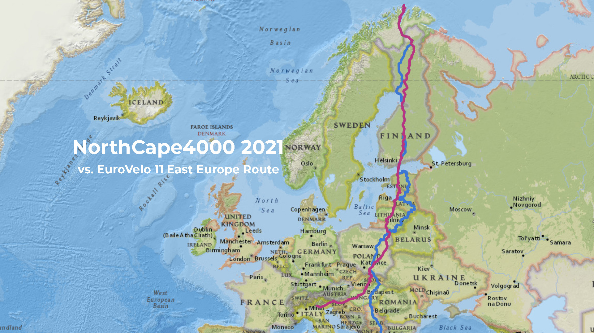
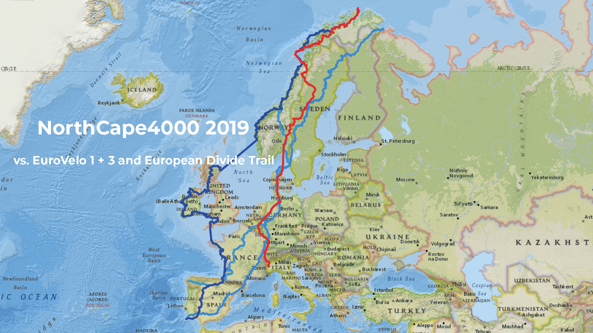
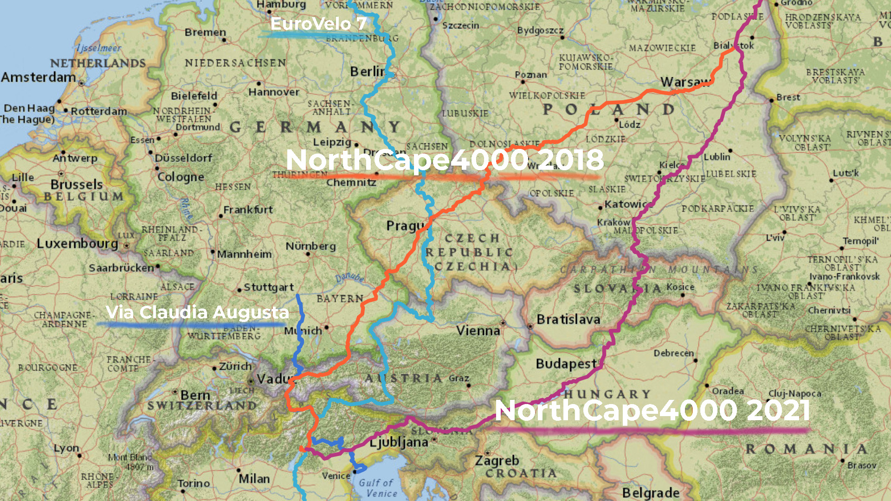

import SevenRoutesDownload from "../../../src/utils/sevenRoutesDownload.js";

Fahrradurlaub auf einer Radrennstrecke? Das klingt nicht wirklich entspannt. Aber lass dich vom sportlichen Charakter nicht täuschen! Denn NorthCape4000-Teilnehmer müssen mit eigenem Gepäck und ohne Unterstützung innerhalb von 22 Tagen von Süden nach Norden durch Europa radeln. Das sind im Schnitt 180 km pro Tag. Gute Chancen also, dass die Routen mit Tourenrad und Gepäck im eigenen Tempo tauglich für den Fahrradurlaub sind. Hier findest du alles über die NorthCape4000-Strecken, Karten und GPX-Dateien für deine Tourenplanung.

In der interaktiven Karte findest du alle Routen (in Rot) und ähnliche Eurovelo-Routen (in Blau). In der Seitenleiste kannst du die Routen ein- und ausblenden.

<iframe
  src="https://maphub.net/embed_h/2YYE4xlbM5vS0SRJ?panel=1&panel_closed=1"
  title="Interaktive Karte NorthCape4000-Routen"
  width="100%"
  height="400"
  frameborder="0"
></iframe>

<SevenRoutesDownload
  link="https://drive.google.com/drive/folders/1X8uua9rri37oRTMv0FSvE3Gknzihh1Nc?usp=sharing"
  text="GPX/KML-Routen NorthCape4000 herunterladen"
/>

## Ultradistance-Radrennen von Süden nach Norden durch Europa

Das [NorthCape4000](https://www.northcape4000.com/) verdankt seinen Namen den **4000 km, die den Gardasee vom Nordkap trennen**, je nach Route auch mal 4.500 km. Das Radrennen wird seit 2017 **einmal pro Jahr im Sommer** ausgetragen. Die Route variiert dabei von Jahr zu Jahr. Super! Denn so werden immer weitere neue Möglichkeiten entdeckt, Europa mit dem Fahrrad in Nord-Süd-Richtung zu durchqueren.

Abgekürzt nennt sich das Ultracycle-Race **NC4k**. Es ist unsupported, ein echtes Abenteuer also. Die Teilnehmenden müssen sich selbst verpflegen und alles was sie brauchen, selbst mitnehmen. Begleitfahrzeuge, Filmteams, Fotographen und Verpflegungsstationen sind nicht erlaubt. Auch bei Pannen gibt es keine Hilfe. Selbst reparieren ist angesagt. Nur wer auch beim Rennen mitfährt, darf helfen.

Die Teilnehmenden müssen durch die vorgeschriebenen Gates fahren und **innerhalb von 22 Tagen** ankommen. **2022** waren das Rovereto, **München, Berlin, Stockholm** und Rovaniemi. Und natürlich das Nordkap. Von 320 Radfahrern als erstes am Nordkap war 2022 Daniel Gottschalk (DE), erste Frau war Katharina Pier (DE). Hier die [Liste der Finisher 2022 auf Facebook](https://www.facebook.com/NorthCape4000).

Für mich ist an der Route von 2022 besonders interessant, dass sie ganz in der Nähe von Potsdam bei Berlin entlangführt, meiner Heimatstadt. Dort wollen wir auf unserer Tour von Kap zu Kap 2023 auch vorbeifahren und die Familie besuchen. Die NorthCape4000-Route 2022 kann uns also als Alternative zur [EuroVelo 7,](https://weonbikes.com/blog/7-radwanderwege-in-europa-nord-sued/) nützlich werden, der Sonnenroute, die direkt durch Potsdam führt.

<SevenRoutesDownload
  link="https://drive.google.com/drive/folders/1X8uua9rri37oRTMv0FSvE3Gknzihh1Nc?usp=sharing"
  text="GPX/KML-Routen NorthCape4000 herunterladen"
/>

## NorthCape4000 2021 - Östliche Route 4450 km

[NorthCape4000 2021](https://www.northcape4000.com/northcape4000-2021) ist mit 4.450 km länger als die Route von 2022. Sie hat einen interessanten Verlauf durch Osteuropa. Vom Gardasee ging es zunächst Richtung Osten zum **Balaton** in Ungarn, über die **Karpaten** in der Slowakei nach **Krakau** in Polen, **Riga** in Lettland und über Rovaniemi in Finnland zum Nordkap.

EuroVelo 11, die Osteuropa-Route, verläuft ungefähr in derselben Gegend, aber nur in Finnland sind die beiden Routen kurzzeitig deckungsgleich.

2021 schafften es 111 der 192 Gestarteten durchs Ziel. Eine der Finisher ist Sara Hallbauer. Hier kannst du [Saras unterhaltsamen Erfahrungsbericht vom NorthCape4000 2021](https://www.bikepackers.de/northcape-4000/) lesen. Darin kommt auch heraus, dass auf der Route schwierige Verkehrssituationen nicht immer vermeidbar sind.

<SevenRoutesDownload
  link="https://drive.google.com/drive/folders/1X8uua9rri37oRTMv0FSvE3Gknzihh1Nc?usp=sharing"
  text="GPX/KML-Routen NorthCape4000 herunterladen"
/>

## NorthCape4000 2019 - Westliche Route 4550 km

Ganz im Gegenteil zu 2021 verläuft die Route der 3. NorthCape4000-Edition 2019 durch Europas Westen und macht sogar einen Abstecher auf die Lofoten! 4550 km kommen dabei zusammen, nicht eben der kürzeste Weg von Italien zum Nordkap. Von daher vielleicht der Beiname "The Magnificent".

Diese Route kombiniert Teile von EuroVelo 3, der Pilgerroute, mit einem kurzen Stück von [EuroVelo 1](https://weonbikes.com/blog/7-radwanderwege-in-europa-nord-sued/#1-atlantikk%C3%BCsten-radweg-11000-km-eurovelo-1), dem Atlantikküsten-Radweg. Auch der [European Divide Trail](https://europeandividetrail.com/), eine Gravel-Route durch Europa, verläuft streckenweise in der gleichen Gegend. So richtig deckungsgleich sind die Routen aber nicht, sodass du auf der NorthCape4000-Route von 2019 immer noch Neues entdecken kannst.

Von 141 Teilnehmenden erreichten nur 65 innerhalb von 22 Tagen das Nordkap. Startpunkt war Turin. Es ging **direkt in die Alpen nach Aoste und über den Pass** [Col du Grand St. Bernard](https://www.quaeldich.de/paesse/col-du-grand-st-bernard/), 34 km und 1886 Höhenmeter. Im Mittel sind das 5,5% Steigung. Dann bergab zum **Genfer See**. Weiter ging es nach **Strasbourg**, Bastogne, **Oslo, Schweden** und über die **Lofoten** zum Nordkap. [Sophie Gateau berichtet hier von ihren Erfahrungen (auf Englisch)](https://bikepacking.com/plog/northcape-4000/). Wir als Tourenradler können uns da zum Glück mehr Zeit lassen!

Lade dir die Routen herunter und vergleiche sie. Auf der Website von [NorthCape4000-2019](https://www.northcape4000.com/northcape4000-2019/) kannst du anhand der Videos für die einzelnen Tage gut nachvollziehen, wie es in der jeweiligen Gegend aussieht.

<SevenRoutesDownload
  link="https://drive.google.com/drive/folders/1X8uua9rri37oRTMv0FSvE3Gknzihh1Nc?usp=sharing"
  text="GPX/KML-Routen NorthCape4000 herunterladen"
/>

## NorthCape4000 2018 Dolomiten-Route 3450 km

Die NorthCape4000-Route von 2018 unterscheidet sich nur in dem Teil von Italien bis Polen von der Route von 2021. Statt über den Balaton führt sie auf der [Via Claudia Augusta](https://www.viaclaudia.org/radtour/rad-route-via-claudia-augusta) durch die schönen Dolomiten über den Reschenpass nach Österreich - **der leichteste Alpenübergang für Tourenradfahrer**. Dann biegt die Route in Imst nach Osten in Richtung Prag ab. In unserem Artikel zu [Radrouten in den Dolomiten](https://weonbikes.com/blog/dolomiten-radrouten/) kannst du dich mit der Gegend vertraut machen. Eine schöne Variante!

Östlich von Warschau laufen die Routen zusammen und sind bis zum Nordkap deckungsgleich. Einziger Unterschied: 2018 führte das Rennen nicht direkt durch Riga. Prag, Warschau, Tallin und Rovaniemi waren die Gates bei diesem Ultracycle-Race von 3450 km Länge.

Als NorthCape4000 2017 ins Leben gerufen wurde, startete das Radrennen noch in Florenz. Auch die Strecke war noch nicht fix für alle Teilnehmenden. Damals ging es über Innsbruck nach Nürnberg, Stockholm und wiederum Rovaniemi zum Nordkap. Einen Track von der Tour konnten wir allerdings nicht finden.

## Mit Tourenrad und Gepäck auf NorthCape4000-Routen?

Ist das nun was für uns Radreisende - so eine Ultracycle-Bikepacking-Race-Strecke? **Unser Fazit:** Auf jeden Fall! Die Routen der bisherigen Rennen geben noch ein paar zusätzliche Anregungen und bieten **Alternativen zu den EuroVelo-Routen**. Wir brauchen noch nicht einmal Startgebühren zu zahlen 😉.

Du hast die Wahl zwischen anspruchsvoller oder leichterer Alpenüberquerung, oder zunächst Balaton statt Alpen und dafür dann Karpaten - auch schön. Drei der Routen führen durch Finnland und sind daher kürzer und weniger hart als die von 2019 durch Schweden und Norwegen.

Die NorthCape4000-Routen **meiden größere Straßen** wo immer es geht und auch große Städte stehen nur als Checkpoint auf dem Plan. Du bekommst somit mehrere **Asphaltrouten**, sehr geeignet für einen Urlaub mit Gepäck auf dem Tourenrad, getestet von mehr als 100 Radfahrenden.

4000 km / 22 Tage = 181 km pro Tag. Nun, das schaffen Radwandernde mit Gepäck vielleicht nicht. Aber **44 Tage à 90 km** sind denkbar. Von Süden nach Norden sind diese Routen im Prinzip **von Mai bis September** schneefrei und für den Fahrradurlaub geeignet.

---

Du siehst, selbst Rennstrecken können zu Fernradwegen für das Radwandern durch Europa werden. Probier's aus....

**_Schwing dich aufs Fahrrad, teile die schönsten, die sichersten, die kürzesten, längsten oder praktischsten Fahrradrouten mit anderen. Sprich über Fahrradreisen Verschenk' mal ein Rad oder einen Fahrradtag! Gib einfach nicht auf, bis alle Fahrrad fahren. Denn Fahrradfahren macht glücklich._**

<SevenRoutesDownload
  link="https://drive.google.com/drive/folders/1X8uua9rri37oRTMv0FSvE3Gknzihh1Nc?usp=sharing"
  text="GPX/KML-Routen NorthCape4000 herunterladen"
/>

Die Karten in diesem Artikel wurden mit [MapHub](https://maphub.net) unter Verwendung der Karte National Geographic, Esri, DeLorme, HERE, UNEP-WCMC, USGS, NASA, ESA, METI, NRCAN, GEBCO, NOAA, iPC erstellt.
