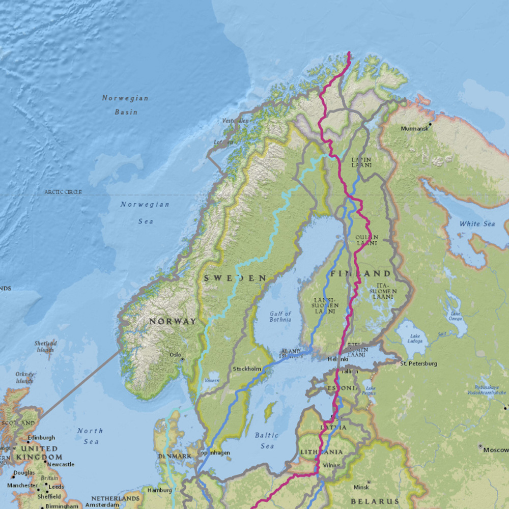
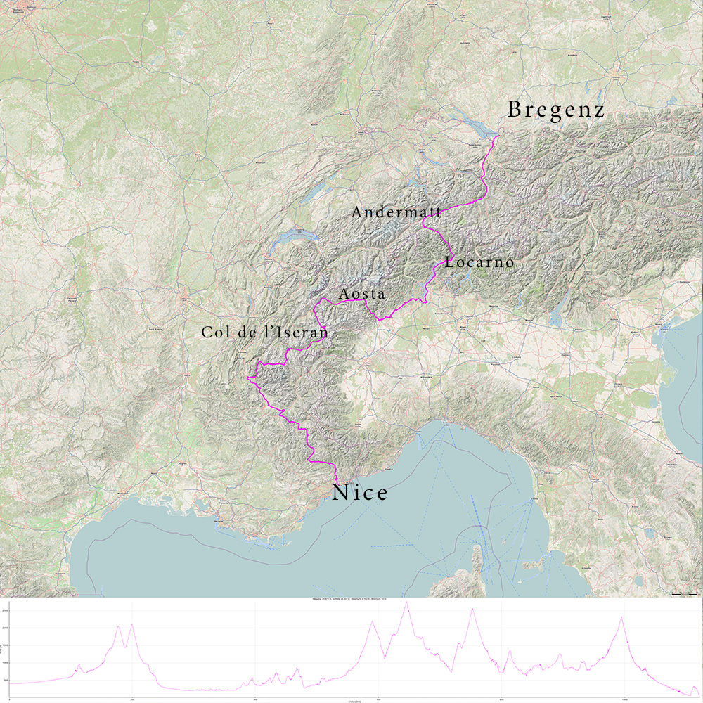
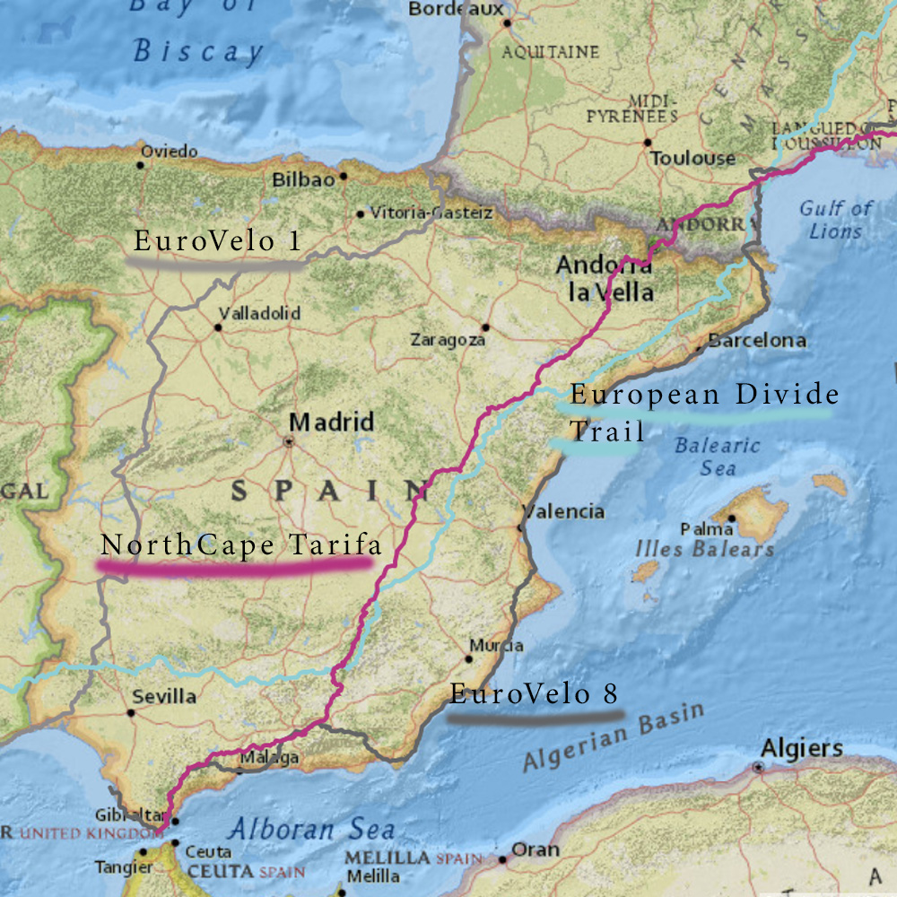

import SevenRoutesDownload from "../../../src/utils/sevenRoutesDownload.js";

Eine weitere Ultracycle-Race-Route durch ganz Europa, die wir auf ihre Tauglichkeit zum Radwandern überprüfen: Das Nordkap-Tarifa-Race soll mit 7400 km das längste Radrennen der Welt sein und eine der sichersten Routen haben! 2022 fand es zum dritten Mal statt. In diesem Beitrag findest du alles über die NCTA-Route von Norden nach Süden durch ganz Europa, die interaktive Karte mit ähnlichen Routen und die GPX-Datei zum Herunterladen.

<iframe
  src="https://maphub.net/embed_h/0pbRNs4r66WAHf77?panel=1&panel_closed=1"
  title="Interaktive Karte Nordkap-Tarifa-Routen"
  width="100%"
  height="400"
  frameborder="0"
></iframe>

<SevenRoutesDownload
  link="https://drive.google.com/drive/folders/1TJnTuxLKxN1oAkmFauhdXUu9j3E43uBS?usp=sharing"
  text="GPX/KML-Routen Nordkap-Tarifa herunterladen"
/>

## Nordkap - Tarifa 7400 km alle 2 Jahre seit 2018

Alle 2 Jahre in der Mitsommernacht, am 20. Juni, startet das Radrennen vom nördlichsten zum südlichsten Punkt Europas. Bei der Anmeldung können Teilnehmer sympathischerweise angeben, wie weit sie mitfahren möchten. 4 Optionen stehen zur Auswahl: bis Helsinki (1753 km, 15.000 hm), bis Bregenz (4070 km, 28.000 hm), bis Nizza (5370 km, 48.100 hm) oder Tarifa (7370 km, 80.000 hm). Wie man sieht, sind die Alpen und Spanien für den Löwenanteil der Höhenmeter verantwortlich.

Insgesamt geht es durch 15 Länder. Ein Zeitlimit gibt es nicht, der Gewinner bekommt alle Kudos. Hier geht's zur [Northcape-Tarifa-Website](https://www.northcape-tarifa.com/de/home-de/). Abgekürzt wird das Radrennen meist mit NCTA. Das Rennen ist unsupported, wer mitmacht muss also alles mitnehmen, was nötig ist. Für die meisten bedeutet das ein Bikepacking-Setup auf einem Gravel-Bike (so eine Art Rennrad mit breiteren Reifen).

## Wer hat die Nordkap-Tarifa-Radroute gemacht?

Transbike Adventures ist die Organisation, die das Nordkap-Tarifa-Rennen und noch einige andere internationale Ultracycle-Rennen organisiert. So zum Beispiel das Iberica Traversa in 2 Varianten, eine über Schotter und eine auf der Straße, das Marokko Bike Adventure oder das Alaska Divide. Ganz schön abenteuerlich.

Das engagierte Team findest du auf der [Transbike-Adventure-Website](https://transbike-adventures.com/en/team/). Andy Buchs ist für das Nordkap-Tarifa-Rennen verantwortlich und hat die Route erstellt. Auf der Website des Rennens kannst du nachschauen, [wer alles an der Routenplanung](https://www.northcape-tarifa.com/about-the-organizer/) beteiligt war.

## Die sicherste Radrace-Route durch ganz Europa

> “Der Organisator des Rennens, Andi Buchs, hatte sich zum Ziel gesetzt, nicht nur ein anspruchsvolles, sondern vor allem SEHR sicheres Rennen zu machen. Ich kann an einer Hand abzählen, wie oft ich auf den gesamten 7.390 km die Straße gefährlich fand. Und dann habe ich noch Finger zum Zählen übrig.
>
> Dies unterscheidet das Rennen wirklich von anderen, bei denen sich die Organisatoren entweder nicht übermäßig um die Verkehrssituation kümmern oder den Fahrern erlauben, ihre eigenen Routen auszuwählen. Es ist einfach unmöglich zu wissen, wie sicher eine Straße ist, ohne selbst mit dem Fahrrad dort gewesen zu sein. Andi ist bei der Planung des Rennens die gesamte Strecke abgefahren.“  
> _– Christopher Ross Bennett_

Quelle: [Christophers Blog-Artikel zu seiner Nordkap-Tarifa-Erfahrung](https://triduffer.wordpress.com/2018/07/28/north-cape-tarifa-race/) (aus dem Englischen übersetzt)

Schauen wir uns diese vielversprechende Route also mal genauer an. Genauer bedeutet, dass wir die **Route bis auf Dorf-Niveau nachvollzogen** haben. Die [garantiert genaue Route](https://www.northcape-tarifa.com/de/2022-tracking-de/) bekommst du nur, wenn du dich für das Rennen anmeldest. Die Organisatoren stecken jedes Jahr viel Mühe in die Aktualisierungen und auf der Website findest du sogar ein [Change-Log der Route](https://www.northcape-tarifa.com/de/route-changelog-de/).

<SevenRoutesDownload
  link="https://drive.google.com/drive/folders/1TJnTuxLKxN1oAkmFauhdXUu9j3E43uBS?usp=sharing"
  text="GPX/KML-Routen Nordkap-Tarifa herunterladen"
/>

## Routenverlauf im Vergleich zu anderen Europa-Routen

### **Norwegen**

Das Rennen startet um Mitternacht. Das ist praktisch, denn auf dem kurzen Stück vom Nordkap bis nach Alta geht es durch **7 Tunnel**. Der Tunnel vom Nordkap zum Festland ist der längste und tiefste. Du brauchst zusätzliches Licht. Nutze die Ruhe der Nacht für die Tunnelquerung. Bei Verkehr sind Tunnel laut und unangenehm. [Hier findest du sehr genaue Informationen zu jedem Tunnel.](https://www.cycletourer.co.uk/maps/tunnelmap.shtml)

### **Finnland**

Zunächst führt die Route durch Finnland. Allzu viel Auswahl an Straßen gibt es dort ja nicht. Aber wie wir schon in unserem Artikel über [Radwander-Routen in Finnland](https://weonbikes.com/blog/fahrradrouten-finnland/) herausgestellt haben, kannst du Finnland auch komplett auf Waldwegen durchqueren. Nun, Andi Buchs führt die Teilnehmenden des Nordkap-Tarifa-Rennens nicht über Waldwege, sondern **über kleine Straßen**.

Die Route unterscheidet sich von anderen großen Routen, die durch Finnland verlaufen, wie EuroVelo 11 oder NorthCape4000-Routen. Zunächst verläuft die Route auf derselben Straße vom Nordkap aufs Festland wie der EuroVelo 1. Beim ersten Richtungswechsel nach Süden radelst du aber schon auf neuen Wegen. Ein kleiner Teil der Route verläuft auf dem EuroVelo 7 und ein weiterer Streckenabschnitt auf dem EuroVelo 11. Große Teile der finnischen Route gleichen jedoch keiner anderen internationalen Route und verlaufen trotzdem auf Straßen und nationalen Fahrradrouten.

<SevenRoutesDownload
  link="https://drive.google.com/drive/folders/1TJnTuxLKxN1oAkmFauhdXUu9j3E43uBS?usp=sharing"
  text="GPX/KML-Routen Nordkap-Tarifa herunterladen"
/>

### **Polen, Tschechien, Deutschland und Alpen**

Auch in Polen und Deutschland nutzt die Route nationale und regionale Fahrradrouten und keine der bekannten internationalen Routen. Am Bodensee landet sie auf dem Rheinradweg und quert die Alpen in Andermatt (Oberalppass 2046 m). Dann geht's Richtung Süden nach Locarno und Richtung Westen nach Aoste. Südlich von Aoste darfst du dich auf den **höchsten Alpenpass, den Col d'Iseran mit 2764 m** freuen. Von Seez bis Mizoën ist die Route mit einem Teil der [Route des grandes alpes](https://en.routedesgrandesalpes.com/cycle-route/route-des-grandes-alpes-by-bike) identisch.

Die Route windet sich geschickt durch die Alpen und trifft erst in Nizza wieder auf den EuroVelo 8. Höhenmeter werden dabei nicht gescheut. Auf den 1120 km von Bregenz am Bodensee bis nach Nizza am Mittelmeer radelst du 20.000 m bergauf und auch wieder bergab.

### **Spanien**

Auf die Iberische Halbinsel kommst du auf der NCTA-Route über **Andorra**. Von Ax-les-Thermes erkletterst du die Pyrenäen über den Port d'Envalira (2407 m), ein gemäßigter Pass mit durchschnittlich 4,8% Steigung. Ab und zu trifft die Route in Spanien auf den Europe Divide Trail und in Granada ein Mal auf den EuroVelo 8. Beide verlaufen ebenfalls von Norden nach Süden durch den Osten Spaniens.

Der **Sierra Nevada** westlich von Granada sind wohl einige Höhenmeter der Route zuzuschreiben. Sie macht nämlich einen sportlichen Abstecher auf den **Pico del Veleta (3398 m)**, dem höchsten Punkt der Route, der gleichzeitig ein Checkpoint im Rennen ist. Dann geht es durch die reichlich hügelige Landschaft nach Tarifa zum Ziel.

<SevenRoutesDownload
  link="https://drive.google.com/drive/folders/1TJnTuxLKxN1oAkmFauhdXUu9j3E43uBS?usp=sharing"
  text="GPX/KML-Routen Nordkap-Tarifa herunterladen"
/>

## Radwandern auf der Nordkap-Tarifa-Route?

**Ja, für die Strecke vom Nordkap bis Bregenz**. Die Route ist interessant und abwechslungsreich, ergänzt bestehende internationale Routen und verläuft wo immer möglich auf Asphalt. Zudem soll sie sicherer sein als andere Ultracycle-Race-Routen.

### Anspruchsvoll

Willst du von Bregenz weiter nach Süden, musst du über die **Alpen**. Die Nordkap-Tarifa-Route führt über kleinere Straßen und sorgt mit bekannten Pässen gleichzeitig für ein lohnenswertes **Landschaftserlebnis**. Ganz verkehrsarm ist so mancher Pass natürlich nicht. Ob du in deinem Fahrradurlaub auf dem Tourenrad mit Gepäck so viele Höhenmeter machen möchtest, hängt davon ab, wie **trainiert** du bist und wie schnell du vorankommen willst. **Was bedeutet Fahrradreisen für dich?**

Willst du von Bregenz nach Spanien, bleibt als flache Alternative nur der Weg über Westfrankreich. Ist das keine Option für dich, dann ist die Nordkap-Tarifa-Route **über Andorra durch die Pyrenäen** eine interessante Variante. Durch Spanien gibt es kaum eine leichte Route: **Hitze, Wind und steile Anstiege** fordern beträchtliche Anstrengungen, um die besondere Landschaft des Landes zu erleben. Das Frühjahr ist ideal zum Radfahren in Spanien. Wenn du vom Nordkap kommst, erreichst du **Spanien im September**.

---

Rennstrecken können abwechslungsreich, kreativ und bisweilen zu anspruchsvoll für eine Radreise mit Gepäck durch Europa werden. Am besten du bringst viel Zeit mit, probierst es aus und hast einen Plan B parat. Also...

**_Schwing dich aufs Fahrrad, teile die schönsten, die sichersten, die kürzesten, längsten oder praktischsten Fahrradrouten mit anderen. Sprich über Fahrradreisen Verschenk' mal ein Rad oder einen Fahrradtag! Gib einfach nicht auf, bis alle Fahrrad fahren. Denn Fahrradfahren macht glücklich._**

<SevenRoutesDownload
  link="https://drive.google.com/drive/folders/1TJnTuxLKxN1oAkmFauhdXUu9j3E43uBS?usp=sharing"
  text="GPX/KML-Routen Nordkap-Tarifa herunterladen"
/>

Einige Karten in diesem Artikel wurden mit [MapHub](https://maphub.net) unter Verwendung der Karte National Geographic, Esri, DeLorme, HERE, UNEP-WCMC, USGS, NASA, ESA, METI, NRCAN, GEBCO, NOAA, iPC erstellt. Einige Karten in diesem Artikel wurden mit [GPXSee](http://www.gpxsee.org/) unter Verwendung der Karte 4U map erstellt, Daten CC BY-SA by OpenStreetMap.
