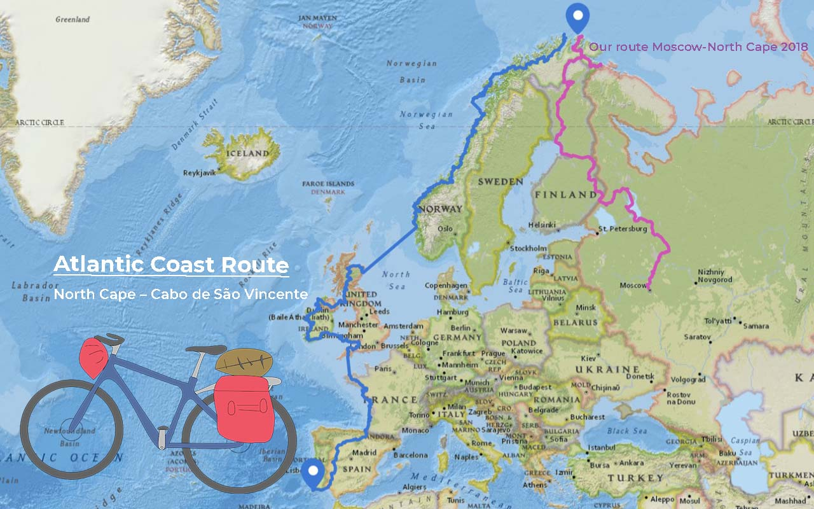
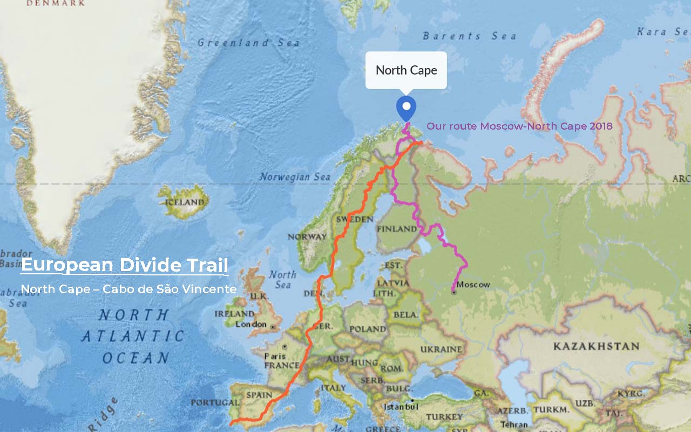
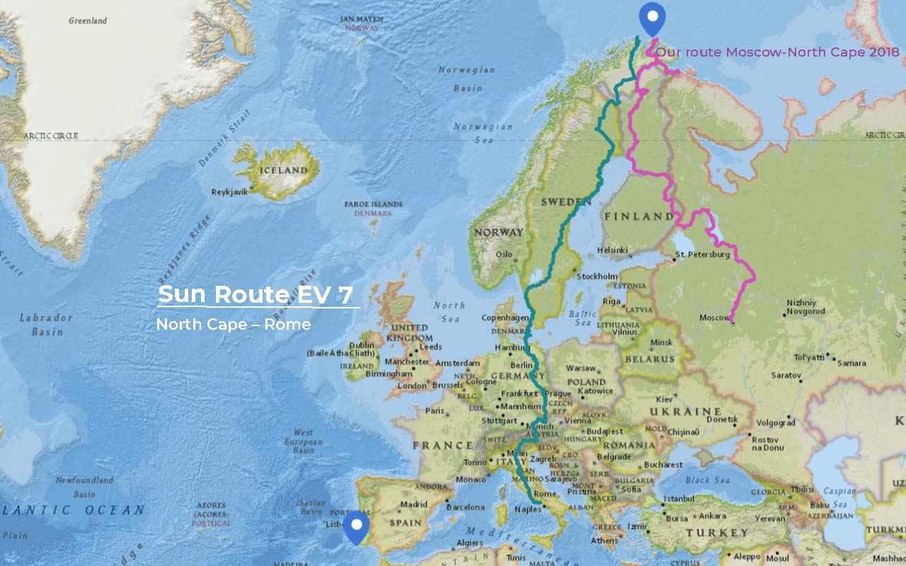
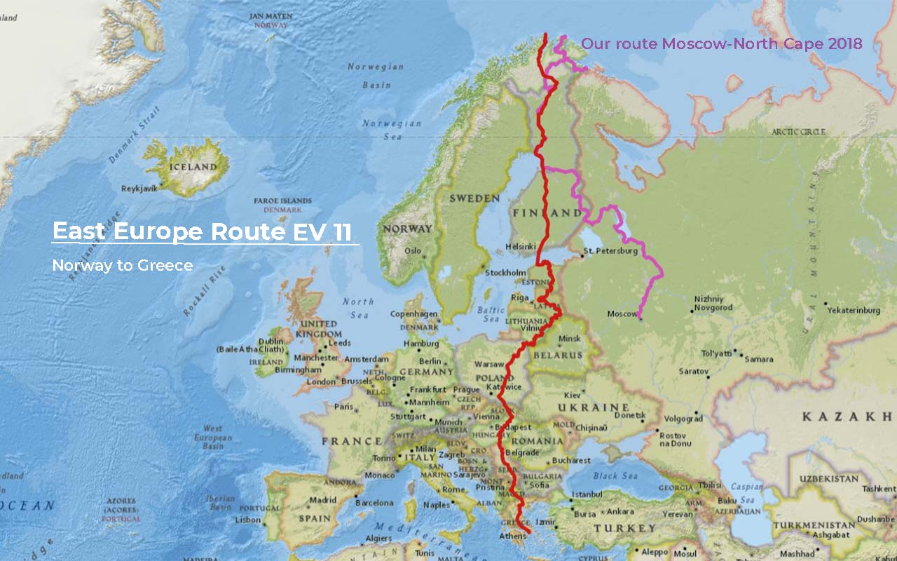
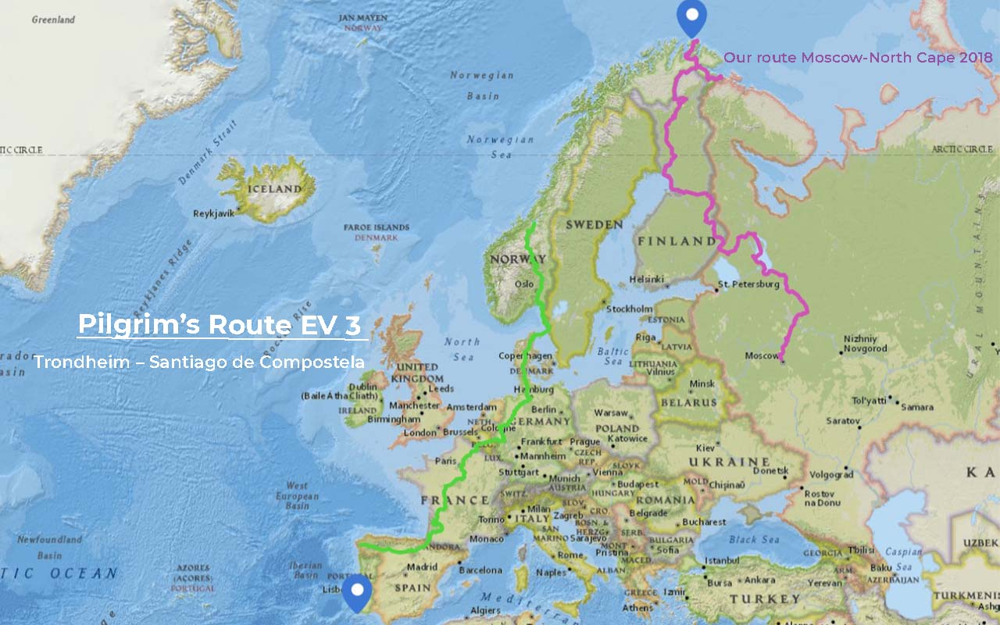
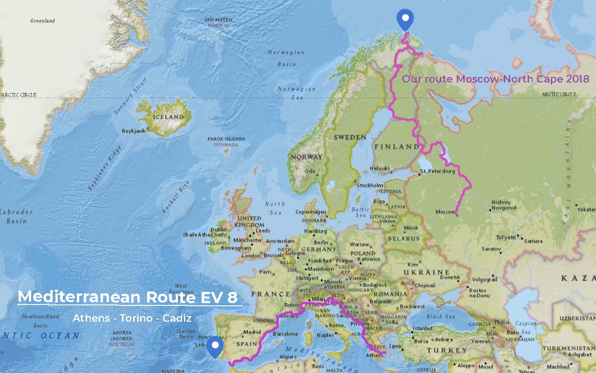

import SevenRoutesDownload from "../../../src/utils/sevenRoutesDownload.js";

Dit is deel 1 van de populairste langeafstandsfietsroutes in Europa. We kijken naar 7 routes van Noord naar Zuid die tussen 5.000 en 11.000 kilometer lang zijn. Is een van deze routes kandidaat voor onze fietsreis van kaap tot kaap volgend jaar? Ben je op zoek naar een langeafstandsfietsavontuur? Dan zijn deze routes misschien wel iets voor jou. In deel 2 vind je de leukste routes voor een zomer fietsvakantie.

<SevenRoutesDownload />

## #1 Atlantische kustroute 11.000 km EuroVelo 1

Het langste fietstocht in onze lijst! Inclusief een paar boottochten. Deze indrukwekkende route langs de oostkust van de Noord-Atlantische Oceaan verbindt de Noordkaap in Noorwegen met kaap Sint-Vincent in ons prachtige Portugal. De route gaat door **6 landen**: Noorwegen, VK, Ierland, Frankrijk, Spanje en Portugal en heeft waarschijnlijk de meest spectaculaire uitzichten van alle routes die in dit artikel worden besproken. In Spanje verlaat de route de kust en passeert een bergketen, de Extremadura. EuroVelo-routes zijn **gemaakt voor toerfietsen** en volgen fietspaden en kleinere wegen.

De Atlantische kustroute leent zich zeker voor ons project van kaap tot kaap, aangezien het zich uitstrekt tussen de Noordkaap en kaap Sint-Vincent.

We zijn van plan om onze fietsreis volgend jaar te starten op **midzomer op de Noordkaap**. Tijdens de zomervakantie zouden we langs populaire vakantiebestemmingen langs de kust rijden. Dat zou kamperen moeilijker en duurder maken. Op onze [tocht van Moskou naar de Noordkaap](https://weonbikes.com/en/book/) kampeerden we altijd wild en bespaarden zo op de kosten.

## #2 European Divide Trail 7700 km

Credits gaan naar Andy Cox en zijn [Website](https://europeandividetrail.com/) voor dit project. De route volgt **fietsroutes, kleine wegen, off-road tracks en trails en zelfs een beetje single track**. Het is meer bedoeld voor lange afstands fietstocht dan voor bikepacking en is daarom technisch niet al te veeleisend.

Deze route verbindt de Noordkaap en kaap sint-Vincent en is een directe kandidaat voor onze reis. Minder kilometers in vergelijking met EV 1 zullen zich niet vertalen in een kortere reistijd, aangezien het grootste deel van deze route onverharde wegen volgt. **50 mm banden worden aanbevolen**.

De route gaat door **8 landen:** Noorwegen, Finland, Zweden, Denemarken, Duitsland, Frankrijk, Spanje en Portugal. Het blijft uit de buurt van druk bevolkte gebieden, wat goed is voor het kamperen. Aan de andere kant is het in gemakkelijk Europa: onmogelijk om langer dan 2 of 3 dagen niet langs een supermarkt te komen, zelfs als je het probeert.

## #3 Zonroute 7700 km EuroVelo 7

Je begint op de Noordkaap en ziet Rome in Italië in gedachten voor je. Wat een motivator! Je kunt ook niet verdwalen, want zoals bekend leiden alle wegen naar Rome - nee serieus, download de GPX-track hierboven in dit artikel. De officiële EV 7 op eurovelo.com gaat zelfs nog verder naar het zuiden tot Malta, in totaal 7700 km. De route komt door **7 landen**: Noorwegen, Finland, Zweden, Denemarken, Duitsland, Oostenrijk en Italië, **8 als je helemaal naar Malta gaat.**

In Scandinavië is de route vrij rustig. Verder naar het zuiden passeer je Kopenhagen, Berlijn en Praag en kun je Salzburg, Bologna en tenslotte Rome bezoeken. De route volgt de westkust van Italië, brengt je naar Sicilië en hopt over naar Malta.

EuroVelo 7 leidt je **dwars door de Alpen en de Dolomieten**. Als je een fan bent van fietsen door de bergen, dan is dit jouw route. Als je in Noorwegen begint, zal je waarschijnlijk voldoende getraind zijn tegen de tijd dat je met de Alpen wordt geconfronteerd. De Dolomieten oversteken is echt niet zo moeilijk. Lees ons artikel over [de mooiste fietsroute door de Dolomieten over oude spoorwegen](https://weonbikes.com/en/blog/dolomites-cycle-routes/), zodat u hoogtepunten als de Drei Zinnen en de Rosengarten niet mist!

Voor onze fietsvakantie van kaap tot kaap zouden we in Bologna naar het westen afbuigen om onze reis voort te zetten langs de Middellandse Zeekust richting Portugal. Het zou niet de kortste weg naar huis zijn vanaf de Noordkaap, maar staat zeker op de lijst van mogelijke routes.

## #4 IJzeren Gordijn route 10.000 km EuroVelo 13

EV 13 een lange afstands fietsroute die het historische IJzeren Gordijn uit de Koude Oorlog volgt en herdenkt. Het voert langs de grens tussen het voormalige politieke Oost- en West-Europa. In de tijd dat dit artikel is geschreven, is er een "helemaal niet zo'n koude-oorlog" in Europa. Een mooi moment om deze route te fietsen als **symbool van verzoening**. Als fietscommunity dragen we bij aan vrede door lange afstanden te fietsen door verschillende landen, allerlei soorten mensen te ontmoeten en verhalen te vertellen die verbinden. Alles zelfvoorzienend op onze eigen duurzame energie.

De route loopt door **19 landen**: Noorwegen, Finland, Rusland, Estland, Letland, Litouwen, Polen, Duitsland, Oostenrijk, Slowakije, Hongarije, Slovenië, Kroatië, Servië, Roemenië, Bulgarije, Macedonië, een klein stukje Griekenland en Turkije. Altijd de grenzen volgend behalve in Duitsland waar het langs de voormalige Oost-Duitse grens loopt.

Het is een prachtige fietsroute. We hebben er een deel van gefietst langs de grens tussen Finland en Rusland tijdens onze reis van Moskou naar de Noordkaap. Je kunt er [over lezen in ons boek](https://weonbikes.com/en/book/). Ook volgden we de IJzeren Gordijn route langs de kust van de Baltische Zee in Estland en Letland tijdens een fietsvakantie in 2012.

## #5 Oost-Europa route 6500 km EuroVelo 11

Deze route leidt je door **7 verschillende hoofdsteden**. Als je geïnteresseerd bent in stedelijke cultuur in Europa, is dit jouw route. De route begint bij de Noordkaap in Noorwegen en komt door Finland met Helsinki, Estland met Tallinn, Letland met Riga, Litouwen met Vilnius, Polen met Warschau, Slowakije en Hongarije, Servië met Belgrado, Noord-Macedonië met Skopje en gaat verder naar Griekenland tot de hoofdstad Athene.

Voor ons plan van de Noordkaap naar kaap Sint-Vincent is deze route een beetje om. We zouden kunnen overwegen om het middelste deel van de route tot Hongarije te volgen, af te slaan naar Boedapest, door te gaan naar Ljubljana en dan naar het westen te gaan. Voor het noordelijke deel zouden we echter een andere route kiezen, omdat we deze op [onze reis van Moskou naar de Noordkaap](https://weonbikes.com/en/book/) hebben gezien en ook al door Estland en Letland al gefietst zijn.

## #6 Pelgrimsroute 5300 km EuroVelo 3

Deze route heeft ook een **culturele focus**. Het volgt beroemde pelgrimsroutes van Trondheim in Noorwegen naar Santiago de Compostela in Spanje, langs plaatsen met een religieuze geschiedenis. Zijn Kathedralen jouw ding? Dan is deze route voor jou.

Nou, ik heb delen van deze route gefietst en ik kan je vertellen: zelfs als kathedralen niet op je bucketlist staan, is deze route een fietsvakantie waard vanwege de **geweldige mix van stad en platteland**. Als je bang bent om je te vervelen door alleen maar door landschap te fietsen, dan zit je op EV 3 goed. De kans is groot dat je meer mede-fietsers tegenkomt dan op elke andere fietsroute die tot nu toe is besproken. Dat kan gezellig zijn en misschien maak je vrienden voor het leven.

Ik heb het volledige Spaanse deel en delen van de Franse route gefietst. Het interessante deel voor onze fietsreis van kaap naar kaap is die in Noorwegen. Aangezien we nog niet in Zuid-Noorwegen hebben gefietst, zou dit een goede gelegenheid zijn om een eerste indruk van het gebied te krijgen voor latere fietstochten, bijvoorbeeld in nationaal park Jotunheimen.

## #7 Middellandse Zeeroute 7500 km EuroVelo 8

Dit gaat niet van noord naar zuid, toch? Toch wel, gedeeltelijk volgt het de Spaanse kustlijn en de oostelijke oever van de Adriatische Zee. EV 8 verbindt vele populaire toeristische bestemmingen langs de Middellandse Zeekust. De route gaat door **11 landen**: Cyprus, Turkije, Griekenland, Albanië, Montenegro, Bosnië en Herzegovina, Kroatië, Slovenië, Italië, Frankrijk en Spanje.

Voor ons zou het middengedeelte van Slovenië naar Spanje interessant zijn, als we een oostelijke route zouden kiezen, om weer op het Iberisch schiereiland te komen. We hebben nooit langs de Spaanse kust gefietst. De andere kant om het schiereiland heen, tegen de klok in, is ook een optie om kaap Sint-Vincent in Portugal te bereiken.

## Hoe vind je fietsroutes in Europa

De EuroVelo-routes die in dit artikel worden besproken, zijn afkomstig van [eurovelo.com](http://en.eurovelo.com/), een door de EU gefinancierd project. Je kunt echter geen GPS-data van die website downloaden. Daarom bieden we je de 7 routes aan, makkelijk te downloaden hier op weonbikes.com. Deze tracks geven je een overzicht op basis waarvan je je dagelijkse routes kunt plannen.

<SevenRoutesDownload />

De beste bron om routes te vinden is de crowd. De **gratis** Android-app **OSMAND** heeft ons duizenden kilometers door Europa geleid. Open Cycle Map biedt uitgebreide gegevens over fietsroutes. Vergelijkbare door de fietscommunity gereden routes zijn beschikbaar op platforms als **Komoot** of **Ride with GPS**.

Maar wat is een fietsroute precies? Laten we eens kijken wat het meest gezaghebbende project OpenStreetMap te zeggen heeft:

> Fietsroutes zijn routes met een naam, nummer of anderszins aangegeven routes. Ze kunnen over wegen, paden of speciale fietspaden gaan.

De wereldwijde fietscommunity biedt zoveel gegevens en ervaring dat fietsroutes op **Open Cycle Map** tegenwoordig zeer betrouwbaar zijn. Er is een [OSM Wiki-pagina](https://wiki.openstreetmap.org/wiki/Cycle_routes) met de fietsroutes die al in kaart zijn gebracht.

Dit zijn waardevolle bronnen, maar ook behoorlijk vermoeiend om door te nemen, het is tijdrovend detectivewerk om te vinden wat je nodig hebt. **Weonbikes.com is er om je te helpen bij het plannen van jouw meerdaagse fietstocht.** Meer artikel over de beste routes, het vinden van routes en het plannen van fietsvakanties met bruikbare downloads volgen binnenkort.

Wij bieden fietsreizigers de middelen om hun droom fietsvakantie avontuur te verwerkelijken. Blijf niet stil zitten wachten op het perfecte moment! Maak deel uit van de duurzame reizende gemeenschap van gelukkige fietsreizigers.

**_Stap op je fiets en deel de mooiste, veiligste, kortste of langste en meest praktische fietsroutes met anderen. Praat over fietsvakanties. Geef iemand een fiets of een fietsdag! En geef niet op totdat iedereen op de fiets zit. Want fietsen maakt gelukkig._**

De kaarten in dit artikel zijn gemaakt met behulp van [MapHub](https://maphub.net/) met gebruik van de kaart National Geographic, Esri, DeLorme, HERE, UNEP-WCMC, USGS, NASA, ESA, METI, NRCAN, GEBCO, NOAA, iPC.
