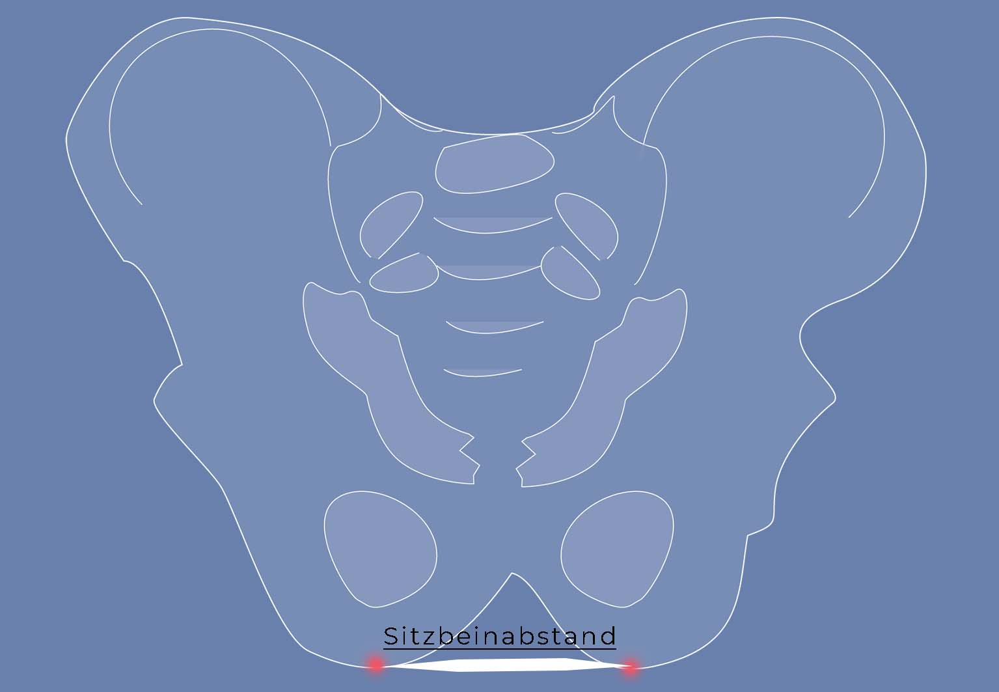
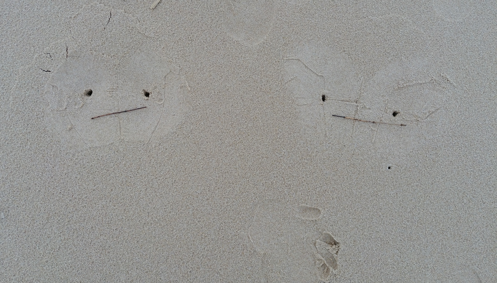
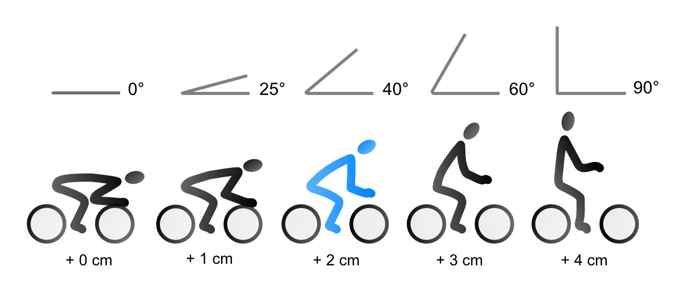

Die Sattelwahl wird schnell zur Qual, wenn du nicht weißt, worauf du achten musst. Dein Sitzknochenabstand bietet dir einen soliden Richtwert, um einen Sattel mit der richtigen Breite für deinen Allerwertesten zu finden.

  <iframe
    id="video"
    width="560"
    height="349"
    src="https://www.youtube.com/embed/Oy8iQvW1dUQ"
    frameborder="0"
    allowfullscreen
  ></iframe>

## Wo ist dein Sitzknochen?

Deine Sitzknochen oder Sitzbeinhöcker sind die untersten Punkte deines Beckens. Wenn du sitzt, tragen sie dein Gewicht.

## Warum ist der Sitzknochenabstand wichtig?

Mit dem Sitzknochenabstand kannst du die Sattelbreite bestimmen. Dein Po ist froh, wenn dein Gewicht bei stundenlangem Radfahren auf den Sitzknochen ruht. Weichteile und Nervenbahnen werden so entlastet. Du vermeidest wunde Stellen und eingeschlafene Beine. Schau dir das [Video](https://www.youtube.com/watch?v=Oy8iQvW1dUQ) an und lies die Beschreibung, wie du den Wert ganz einfach bei dir vermessen kannst:

## Anleitung zur Sitzknochenvermessung

### Was du brauchst

- Untergrund:

In diesem Beispiel machen wir einen Abdruck in **Sand**. Alternativ kannst du aber auch **Alufolie** auf den Teppich oder die Yoga-Matte legen oder dir **Wellpappe** als Unterlage für den Abdruck besorgen. Bikefitting-Profis legen spezielle Druckfolie auf den Sattel.

- Stock oder Finger zum Markieren im Sand, Stift bei Alufolie oder Wellpappe
- Maßband

### 1\. Mach im Sand einen Abdruck von deinem Po

Setz dich in weichen Sand, zum Beispiel am Strand oder im Sandkasten. Drücke den Po möglichst tief in Sand. Den Rücken lässt du dabei durchgestreckt. Versuche ein Hohlkreuz zu machen, um die Sitzknochen tiefer in den Sand zu drücken.

### 2\. Suche die tiefsten Stellen und markiere sie

Schau dir den Abdruck genau an und suche den tiefsten Eindruck. Dort steckst du einen Stock hinein oder malst ein Kreuz.

### 3\. Miss den Abstand

Jetzt misst du den Abstand zwischen den Markierungen. Dazu kannst du einen Stock in der passenden Länge abbrechen und diesen zu Hause mit dem Maßband messen. Bei uns sind das 11 cm bzw. 14 cm.

## Sitzwinkel und Berechnung der Sattelbreite

Du hast den Abstand deiner Sitzknochen gemessen. Sagen wir mal 12 cm. Die Sattelbreite ist nun abhängig von deiner Sitzposition.

### In welchem Sitzwinkel fährst du Rad?

Eine Sitzposition von 90° hast du auf dem Hollandrad, auf dem Profi-Rennrad dagegen beträgt dein Sitzwinkel nahezu 0°. Auf Radreisen beim Touring sitzt du leicht nach vorn gebeugt, so zwischen 60° und 40°. Dieser Sitzwinkel ist ideal für stundenlanges Radfahren, denn dann ruht dein Gewicht größtenteils auf deinen Sitzbeinhöckern, die für das Gewicht gemacht sind. Weder die Weichteile weiter vorne noch der Steißbereich hinten werden belastet.

### Berechnung der Sattelbreite

Für die Sattelbreite bei einem Sitzwinkel von 40°-60° addierst du 2-3 cm zum gemessenen Sitzbeinabstand hinzu. 12 cm + 2 cm = 14 cm. Auf einer Breite von 14 cm darf der Sattel also nicht nach unten abfallen.

## Wie geht's weiter?

Form und Modell des Sattels sind entscheidende Faktoren. Nichts darf drücken oder schleifen. Ein weiteres Thema ist die Sattelhärte. Hast du einen passenden Sattel gefunden, muss du ihn auch noch genau positionieren, sonst waren alle Messungen umsonst.

Du siehst, die Sattelwahl will gut durchdacht sein. In einem der nächsten Beiträge wird es deshalb um Sattelkauf und Sattelpositionierung am Fahrrad gehen. Zu guter Letzt muss der Sattel natürlich getestet werden, bevor es auf die große Tour geht.

**_Schwing dich also aufs Fahrrad, teste und teile die besten, robustesten, günstigsten oder fortschrittlichsten Sattelmodelle mit anderen. Sprich über Fahrradreisen Verschenk' mal ein Rad oder einen Fahrradtag! Gib einfach nicht auf, bis alle Fahrrad fahren. Denn Fahrradfahren macht glücklich._**
