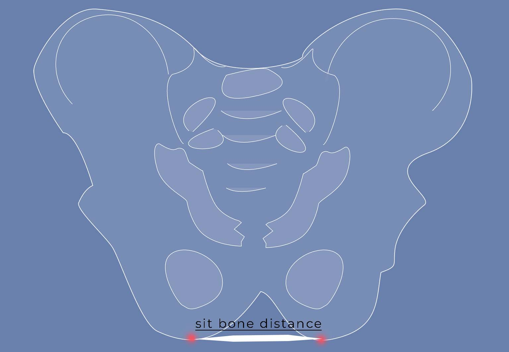

Choosing a saddle can be a cumbersome task if you don't know what to look out for. Your sit bone distance gives you a solid starting point to find the right saddle for your anatomy.

  <iframe
    id="video"
    width="560"
    height="349"
    src="https://www.youtube.com/embed/Oy8iQvW1dUQ"
    frameborder="0"
    allowfullscreen
  ></iframe>

## Where is your sit bone?

Your sit bones, are the lowest points of your pelvis. They carry your weight when you sit.

## Why is the sit bone distance important?

By measuring the sit bone distance, you can find the right saddle width for your own anatomy. When cycling hours in a row while touring, your bottom will thank you for having your weight resting on your sit bones. That way, soft tissue and nerve tracts don't get stressed. You'll avoid sore spots and numb legs. Watch the [video](https://www.youtube.com/watch?v=Oy8iQvW1dUQ) and read the instructions below to learn how to easily measure your sit bones yourself:

## How to measure your sit bones

### What you need

- base

In this example we will make a cast in **sand**. Alternatively, you can also place **aluminum foil** on a carpet or a yoga mat or get **corrugated cardboard** as a base for the imprint. Bike fitting professionals place special pressure mapping foil on the saddle.

- a stick or your fingers to mark the sand, a pen if you use aluminum foil or corrugated cardboard
- tape measure

### 1\. Cast your bottom in the sand

Sit down in soft sand, for example on the beach or in a sandbox. Press your bottom as deep as possible into the sand. Keep your back straight. Try arching your back to push your sit bones deeper into the sand.

### 2\. Find the deepest spots and mark them

Look closely at the imprint and find the deepest points. Make a hole with a stick or mark the points with your finger.

### 3\. Measure the distance

Now you measure the distance between the marks. You can break off a stick to the right length and measure it at home with a tape measure. Or you have our tape measure with you and take a picture. We measured 11 cm (4.3 in) and 14 cm (5.5 in).

## Sitting position and saddle width calculation

Great, you measured the distance between your sit bones. Let's say some 12 cm. The saddle width now depends on your sitting position.

### What is your sitting position on the bike?

On a roadster bike you'd have an upright sitting position of 90°, while triathlon cyclists bend forward to a sitting angle of almost 0°. When touring, you sit slightly to moderately bent forward, between 60° and 40°. This sitting angle is ideal for long hours of cycling because most of your weight rests on your sit bones. They are made for this load. Neither the soft tissue in front of your sit bones nor the coccyx area at the back of it get stressed.

### Saddle width calculation

For the saddle width at a sitting angle of 40°-60° you need to add 2-3 cm (0.8-1.2 in) to the measured sit bone distance. 12cm + 2cm = 14cm. So, over a width of 14cm, the saddle shouldn't start to round off.

## What's next?

The shape and model of the saddle are crucial factors. Nothing should pinch or chafe. Another issue is saddle hardness.

Once you have found a suitable saddle, you have to position it correctly on your bike, otherwise all measurements would have been in vain.

As you see, your saddle choice should be well thought out. One of the next posts will therefore be about what else to consider before buying a saddle and how to position it on the bike. Last but not least, a saddle should of course be tested before you take it on tour.

**_So, get on your bike, test and share the best, most durable, inexpensive or advanced saddle types with others. Talk about traveling by bicycle. Give someone a bike or a bike day! Just don't give up until everyone's riding by bicycle. Because cycling makes you happy._**
