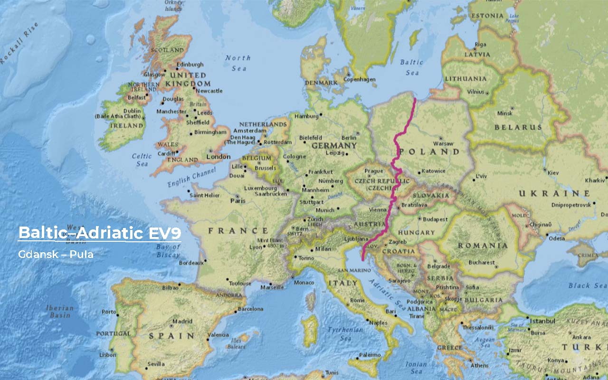
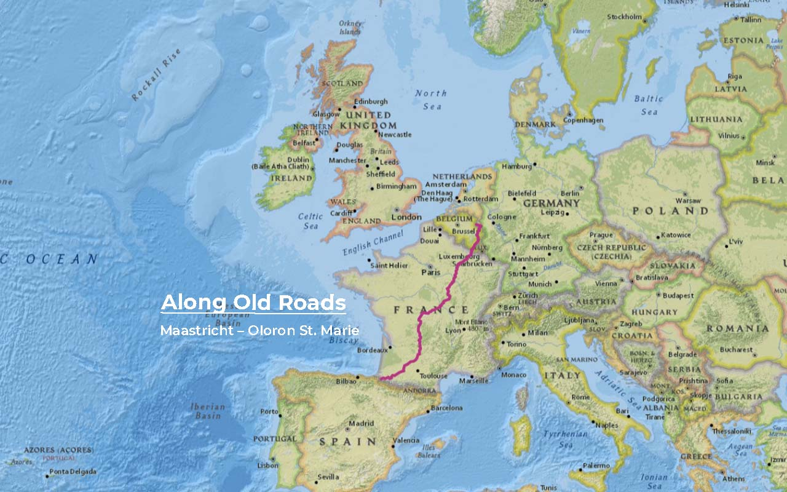
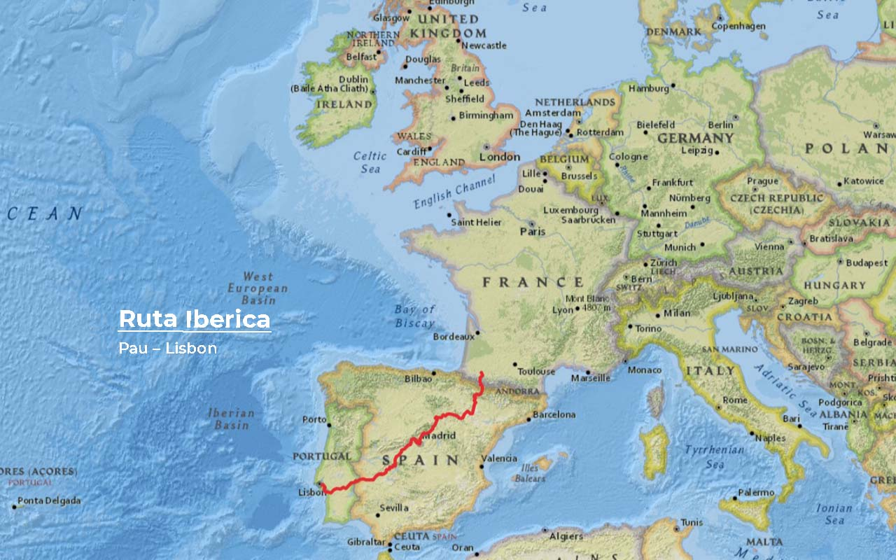
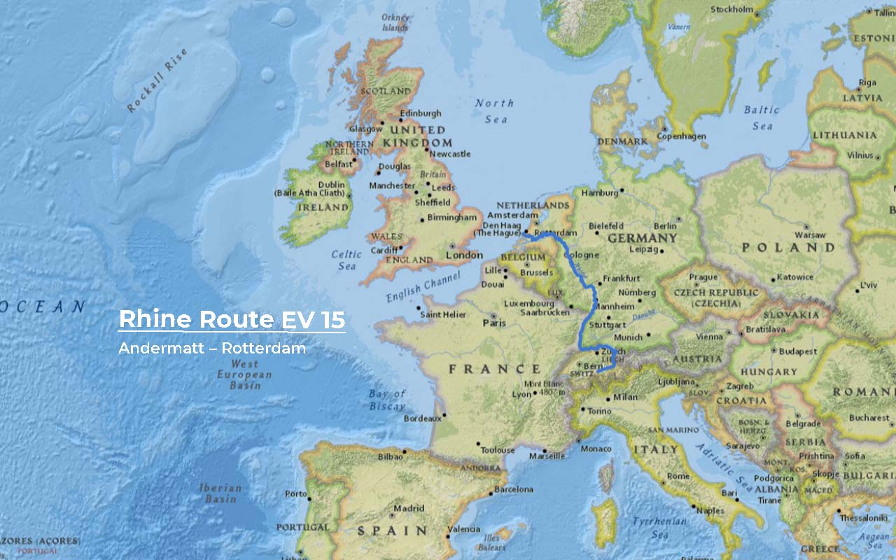
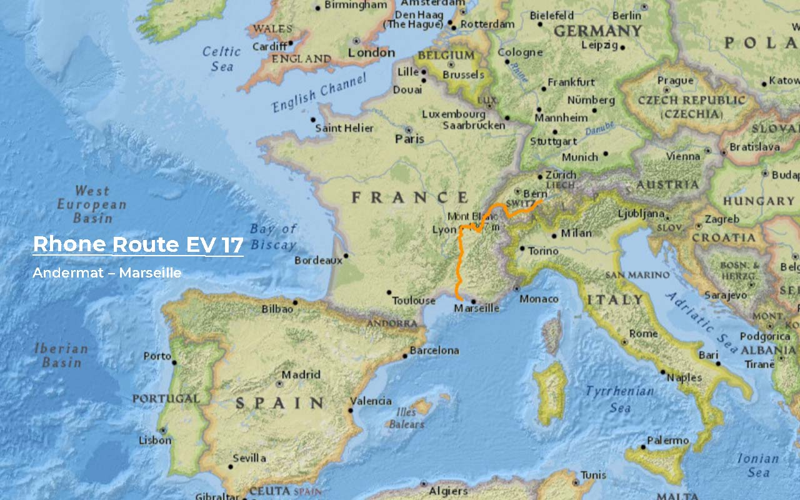
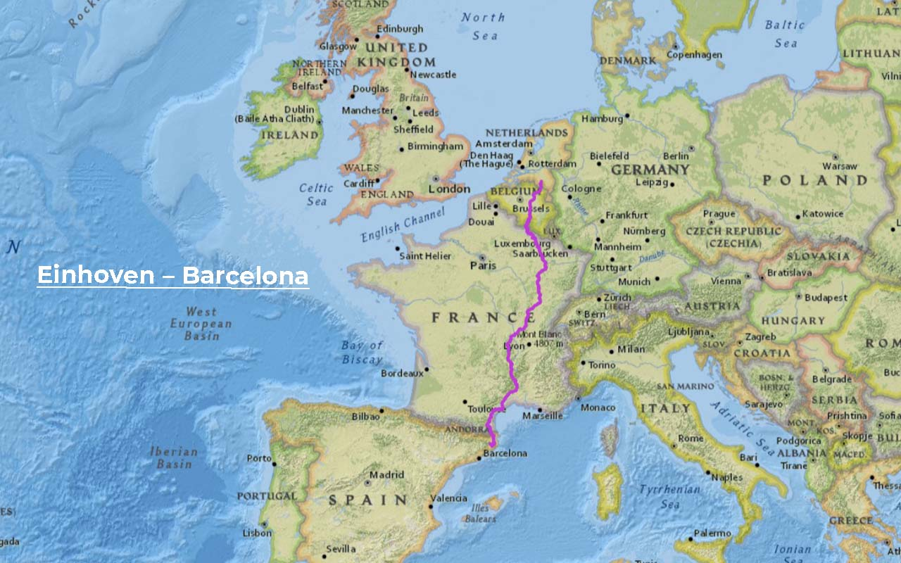
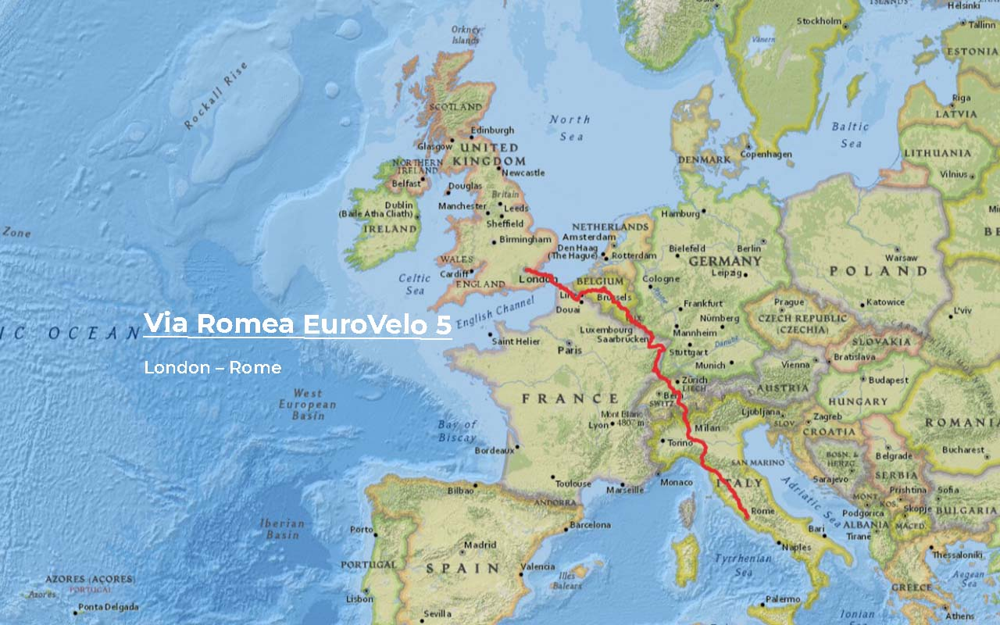

import SevenRoutesDownload from "../../../src/utils/sevenRoutesDownload.js";

Parte 2 do nosso planeamento de percursos de longa distância de bicicleta. Depois de escrever sobre [rotas de cicloturismo épicas de mais de 5.000 km pela Europa](https://weonbikes.com/en/blog/7-cycling-routes-europe-north-to-south/), veremos percursos populares de bike touring de médio alcance até 2.000 km. Viagens de bicicleta que se podem fazer numas férias de verão longas.

<SevenRoutesDownload link="https://drive.google.com/drive/folders/1DxlsSu0MWAGoVi_AGRZ8youXCGLd-ad5?usp=sharing" />

## #1 Rota Báltico-Adriático 2000 km EuroVelo 9

A rota Báltico-Adriático começa em Gdansk, na Polónia, e termina em Pula, na Croácia. Percorre ao longo da Rota do Âmbar, a rota comercial histórica entre São Petersburgo e Veneza.

Nesta rota vais atravessar **6 países**: Polónia, República Checa, Áustria, Eslovénia, Itália e Croácia. A parte mais plana de toda a rota fica na Polónia. Rios, parques naturais e cidades históricas como Wrocław moldam a paisagem. As montanhas dos Sudetas onde há algumas subidas só começam na fronteira Checa. Um treino suave para começar as férias.

Na Áustria, primeiro o EuroVelo 9 percorre uma região vinícola chamada _Weinviertel_, segue a trilha termal de ciclismo e depois pedala pela ciclovia do rio Mur. Parecem mesmo férias, certo? Na Eslovénia existem paisagens deslumbrantes e belas cidades. A capital [Liubliana é a anfitriã do VeloCity em 2022](https://www.velo-city2022.com/en/). O EuroVelo 9 termina com um mergulho no quentinho Mar Adriático.

A rota Báltico-Adriático é uma forte candidata para a nossa viagem do Cabo Norte, na Noruega, ao Cabo de São Vicente, em Portugal. Vindo da Escandinávia, esta rota oriental seria mais tranquila no verão do que através da Alemanha ou da França. E esta rota de cicloturismo realmente tem um ar de férias.

## #2 Ao longo de vias antigas 1600 km Maastricht – Oloron St. Marie

Esta é uma rota cheia de memórias para mim. Foi a **minha primeira viagem de bicicleta de longa distância a solo **: da Holanda para Espanha e voltar. Este percurso de bicicleta foi desenvolvido pelo autor de guias de viagens de bicicleta Clemens Sweerman e chama-se [Langs Oude Wegen](https://www.europafietsers.nl/fietsroutes/langs-oude-wegen-en-pelgrimssteden/) em holandês. Segue o antigo caminho de peregrinos de Santiago de Compostela. Na minha opinião, esta é a **melhor rota de norte a sul através de França**, estradas calmas, natureza, cidades e aldeias históricas, Rocamadour... Vai e vê por ti mesmo!

Começando em Maastricht, chegarias às Ardenas no segundo dia. Em França, segue por estradas rurais numa paisagem ondulada. Muito antes de chegar aos Pirenéus, já terás feito muitas subidas. Portanto, caso estejas em peregrinação, estarás bem preparado para a passagem da montanha.

Nesta rota bastante tranquila, pode-se desacelerar da vida agitada e acalmar a mente - perfeito para férias de bicicleta de verão.

## #3 Ruta Ibérica 1600 km

Este [percurso de bike touring de Paule Benjaminse](https://www.europafietsers.nl/fietsroutes/fietsen-naar-barcelona/) começa em Pau, no sul da França e liga a rota de bicicleta de longa distância _ ao longo de vias antigas_ com Madrid e Lisboa. Através da passagem de montanha em Col du Pourtalet, que está basicamente aberta todo o ano, e Saragoça, chegarás à Meseta Central espanhola. Também irás seguir ao longo do rio Douro durante algum tempo. A rota utiliza várias ciclovias de linhas férreas como a Via Verde del Eresma, a Via Verde de la Jara e a Via Verde de la Guadiana.

Não pode ser difícil, estás agora provavelmente a pensar. Esta ciclovia é na maior parte moderadamente difícil – se não fosse pelo **calor**! No planalto em redor de Madrid, 40°C não são incomuns no verão. Andar de bicicleta algumas horas no início da manhã e algumas à noite é uma das estratégias possíveis. Um chapéu de abas largas será mais útil nessa área do que um capacete de bicicleta. A estação mais bonita da Rota Ibérica é a **primavera**, quando tudo ainda está verde. No norte pode haver neve até abril. A preparação é muito importante!

A Rota Ibérica tem muitos ramos opcionais que apresentamos no artigo sobre percursos de cicloturismo em Espanha. A rota GPX que podes fazer download neste post passa pelo meio - por **Madrid** - e termina na linda **Lisboa**.

## #4 Ciclovia do Reno 1600 km EuroVelo 15

Voltemos a uma rota fluvial. As rotas fluviais têm a vantagem de serem planas e verdes. O rio Reno nasce na Suíça, toca o Liechtenstein, tem um pé na Áustria no Lago de Constança, segue a fronteira entre a França e a Alemanha e, na Holanda, encontra o Mar do Norte onde se chama _Maas_.

O ponto de partida da Rota do Ciclo do Reno na Suíça fica em Andermatt, a 1437 m de altitude. O primeiro passeio é chegar ao Passe Oberalp a 2044 m. São 600 metros de altitude durante 11 km (também é possível com a ferrovia de cremalheira). Este passe está aberto apenas entre maio e outubro. A partir daqui, em cerca de 1h30, pode-se caminhar até o Lago Toma, a nascente do rio Reno. Depois disso, é basicamente a descer montanha abaixo. O EuroVelo 15 está bem desenvolvido e é adequado para famílias.

No caminho de norte a sul seguiríamos o Reno rio acima. É um pouco incomum, mas tem a vantagem de se ligar diretamente à Ciclovia do Ródano, que leva ao Mar Mediterrâneo.

## #5 Ciclovia do Ródano 1000 km EuroVelo 17

A Ciclovia do Ródano também começa em Andermatt. Segue em direção a sul através do passe Furka (Maio-Outubro) até ao Lago Genebra e termina perto de Marselha, no Mar Mediterrâneo. A rota passa por paisagens deslumbrantes e interessantes cidades que valem a pena visitar: passa pelo Glaciar do Ródano e pelo Lago Genebra, veêm-se vinhedos a sul de Seyssel, grutas em Jons, vida urbana em Lyon, a cidade papal de Avignon e o charme do sul da França.

O EuroVelo 17 ainda não está totalmente desenvolvido e muitas vezes passa por estradas rurais. Ainda não é uma "ciclovia", mas mais um percurso de cicloturismo. Uma rota para todos os que amam belas paisagens, cultura e boa comida.

Aqui podes ler mais sobre a [parte suíça do EV 17](https://www.schweizmobil.ch/en/cycling-in-switzerland/route-01.html), aqui sobre a [parte francesa](https://en.viarhona.com/cycle-route).

## #6 Eindhoven – Barcelona 1800 km

Directamente de norte a sul pela parte oriental de França, a começar na Holanda, passando por Namur na Bélgica, tocando nas Ardenas e seguindo o rio Meuse. Bourgogne, Ardéche e uma **passagem de montanha tranquila para Espanha**. Uma rota bem pensada mas que não seria facilmente idealizada apenas olhando para o mapa.

Esta [rota de Paul Benjaminse](https://www.europafietsers.nl/fietsroutes/fietsen-naar-barcelona/) vem com muitos trilhos opcionais detalhados , para uma variante mais oriental ou um passeio Baujolais, por exemplo. A **pista geral** que podem fazer o download neste artigo é a rota ocidental que termina em Girona. O autor recomenda apanhar o comboio para a cidade de Barcelona.

Interessante para o nosso planeamento é a parte no sul da França, a passagem de montanha para Espanha e as várias rotas detalhadas para cicloturistas neste canto do nordeste da Espanha. Vamos falar sobre eles num artigo dedicado.

## #7 Via Romea 2600 km EuroVelo 5

É verdade - vais precisar de muitos dias de férias para uma viagem de bicicleta de tantos quilómetros, 3 semanas não serão suficientes. Mas **pedalar só uma parte deste percurso** também é muito divertido. Por exemplo, do Passe Oberalp em Andermatt, na Suíça, para norte em direção a Londres ou para sul em direção a Itália.

A Via Romea Francigena é baseada numa rota histórica de peregrinos. Começa em **Londres** e termina em **Roma**. A peregrinação continuava até Jerusalém. Portanto, o EV 5 oficial continua na histórica Via Appia até Brindisi, no sul de Itália. De lá, os peregrinos costumavam continuar de navio.

Vão atravessar vários**7 países** neste percurso de bicicleta de longa distância: Inglaterra, França, Bélgica, Luxemburgo, Alemanha, Suíça e Itália. Depois de começar em Londres, a rota passa pela Catedral de Canterbury, historicamente o início de tal peregrinação. Na Bélgica, Bruxelas e Namur estão na rota, em Itália são Milão, Pavia e Florença. Uma boa mistura de áreas rurais e visitas a cidades.

E aqui estão, 7 das muitas rotas de bike touring para conhecer a Europa numas **férias de verão de bicicleta**. As rotas GPX para download fornecem uma visão geral para iniciar o planeamento. Não fiques à espera até que tudo esteja perfeito! Até lá...

**_Pega na tua bicicleta e partilha os mais bonitos, seguros, curtos ou longos e mais práticos percursos de bicicleta com outras pessoas. Fala sobre férias em bicicleta. Oferece uma bicicleta ou um passeio de um dia a alguém. Simplesmente não desistas enquanto toda a gente não andar de bicicleta. Porque andar de bicicleta faz-te feliz._**

<SevenRoutesDownload link="https://drive.google.com/drive/folders/1DxlsSu0MWAGoVi_AGRZ8youXCGLd-ad5?usp=sharing" />

Os mapas contidos neste artigo foram criados no [MapHub](https://maphub.net/) que utiliza o mapa National Geographic, Esri, DeLorme, HERE, UNEP-WCMC, USGS, NASA, ESA, METI, NRCAN, GEBCO, NOAA, iPC.
