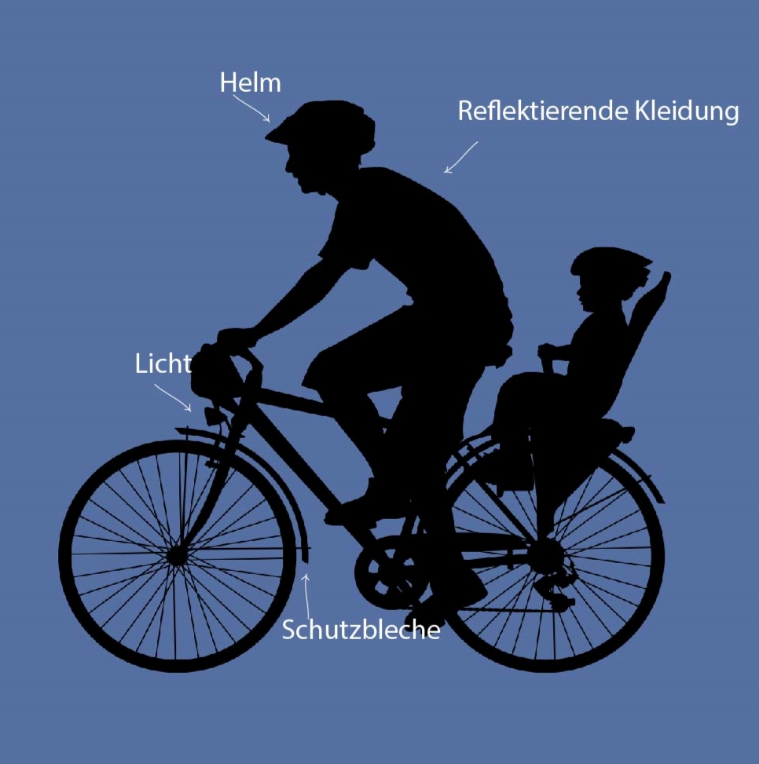

Bestimmt hast du ein Fahrrad und fährst ab und zu damit. Aber jeden Tag per Rad zur Arbeit kostet doch mächtig Überwindung. Keine Sorge, damit bist du nicht allein. Mit einer entspannten Einstellung, guter Vorbereitung und Motivation kann jeder mit dem Fahrrad pendeln. Lies hier, warum das gut ist und wie es gelingt.

## Welche Vorteile bringt Pendeln per Rad

Pendler verbringen mehr als 6 Stunden pro Woche im Auto, meist gestresst. Pendelst du per Rad können diese Stunden für dich zur Quality time werden, entspannt, gesund und umweltfreundlich.

1.  Du sparst Zeit.
2.  Du sparst Geld
3.  Du wirst fitter – körperlich und mental
4.  Du lernst deine Stadt besser kennen

Welcher dieser Vorteile wird auf deine Situation am ehesten zutreffen? Welche Verbesserung wünschst du dir am meisten? **Schreib's dir auf!** Diese Liste kann dich an schwierigen Tagen motivieren.

### Wie spare ich beim Pendeln per Rad Zeit?

Du denkst, wenn du als Pendler zur Arbeit fährst, geht das mit dem Auto sicher schneller als mit dem Rad? Nichts trifft **in der Stadt** weniger zu. Nimm beispielsweise die Zeit für die Parkplatzsuche. Die kann dich schnell 20 Minuten kosten. Wie weit kommst du in 20 Minuten mit dem Rad? Etwa 6 km weit. Stau ist ein weiterer Faktor, der dir beim Radfahren erspart bleibt. Selbst mit dem Bus kannst du im Stau stecken bleiben. Und wenn du die Zeit für den Weg zur und von der Haltestelle einrechnest, bist du mit dem Rad am Ende wahrscheinlich schneller als mit dem ÖPNV.

### Wie spare ich durch Pendeln mit dem Rad Geld?

Das liegt auf der Hand. Du sparst dir das wöchentliche Tanken. Oder füllst du sogar öfter nach? Weniger gefahrene Kilometer bedeuten auch weniger Service-Kosten bei der Durchsicht. Selbst für den ÖPNV gibst du weniger aus. Wenn du Radfahren beispielsweise mit dem Regionalzug kombinierst, brauchst du zumindest keine Fahrkarte für die Straßenbahn.

### Wie soll sich durch Pendeln meine Gesundheit körperlich und mental verbessern?

Du bewegst dich mehr und das auch noch draußen! Das alleine ist schon ein Stimmungs-Booster. Forschungen haben ergeben, dass körperliche Aktivität im Freien Depressionen verhindern kann und deine Konzentration verbessert. Auf deinem Weg zur Arbeit und zurück kannst du auf die nächste Situation umschalten und bist mit den Gedanken ganz im Hier und Jetzt. Das freut die Familie und die Kollegen.

Logischerweise bist du beim Radfahren körperlich aktiver als beim Autofahren oder im überfüllten Zug. Mit der Zeit steigert sich dadurch deine Fitness. Du brauchst dir noch nicht mal Sorgen um irgendwelche Ansteckungen zu machen.

### Wie soll ich beim Pendeln zur Arbeit die Stadt besser kennenlernen?

Du hast vielleicht den kürzesten Weg durch die Stadt gefunden, aber ist es auch der beste? Probiere verschiedene Routen aus. Nimm morgens den kürzesten Weg und nach Hause den schönsten! Mach einen kleinen Umweg zum Einkaufen oder triff dich kurz mit Freunden. Einen Parkplatz brauchst du ja nicht. Aus neuen Routen ergeben sich womöglich ganz neue Gelegenheiten für dich, in deiner Stadt Kontakte zu knüpfen. Du bist näher dran und fühlst, wie du durch deinen täglichen Weg dazugehörst.

## Wie der Einstieg ins Pendeln per Rad gelingt

Du bist mächtig beschäftigt und der ewige Arbeitsweg macht's jetzt auch nicht besser. Du hast mitbekommen, dass andere aufs Pendeln per Rad schwören und fragst dich nun, wie du am besten anfängst. Du möchtest natürlich schneller als vorher, aber auch sicher und gesund auf dem Rad zur Arbeit kommen. So gelingt's:

### Das passende Fahrrad und Zubehör für den Arbeitsweg per Rad

Das richtige Fahrrad für den Arbeitsweg ist das richtige Fahrrad für deine Stadt und deine Situation. Alles ist möglich. Hier in Lissabon wirst du auf dem Weg zum Arbeitsplatz sehr wahrscheinlich ein paar steile Anstiege überwinden müssen. Ein **E-Bike** ist hier eine gute Option, um motiviert zu bleiben.

Rechne dir aus, wie viel Zeit du für den Arbeitsweg jetzt aufbringst und ob die Strecke für dich auf einem konventionellen Fahrrad machbar ist. Sei realistisch! Du solltest nicht erschöpft bei der Arbeit ankommen. **Wähle ein Fahrrad aus, mit dem du auf lange Sicht Kosten sparst, aber bei gesunder Anstrengung nicht viel langsamer bist. Ein Rad, mit dem Fahrradpendeln für dich zur Normalität wird.**

Möchtest du ÖPNV mit dem Radfahren verbinden? Oder kommst du von außerhalb mit dem Auto zur Stadtgrenze? In diesem Fall ist ein **Klapprad** die richtige Wahl.

Bring dein Fahrrad zur Durchsicht. Ist die Schaltung richtig eingestellt und die Kette noch OK? Erspare dir den Ärger unterwegs und sorge dafür, dass es deinem Fahrrad gut geht. Ist das Rad richtig eingestellt? Achte darauf, dass der Sattel die richtige Höhe hat und der Abstand zum Lenker zu deiner Sitzposition passt.

Das Wichtigste ist, dass dein Rad sicher ist:

- gute Vorder- und Rückleuchten
- Schutzbleche
- Klingel
- reflektierende Kleidung
- ein gutes Schloss und
- ein Helm sind unerlässlich.

Vielleicht möchtest du auch **Fahrradsachen** anziehen und dich bei der Arbeit umziehen. Wenn du auf dem Weg nach Hause einkaufen willst, brauchst du außerdem stabile **Fahrradtaschen**. Die sind praktischer als ein Rucksack. Willst du bei jedem Wetter fahren? Besorg dir bequeme Regenkleidung.

### Finde jemanden zum Mitfahren

Du wirst nicht einfach so auf dein Fahrrad springen und durch die Stadt pendeln. Sonst würdest du diesen Beitrag nicht lesen. Zunächst musst du dir **die sicherste und angenehmste Route** heraussuchen und gefährliche Strecken vermeiden.

Du brauchst also eine super Route und ausreichend **Selbstvertrauen**, um loszulegen. Nun, der einfachste Weg zu diesen wichtigen Erfolgsfaktoren ist es, eine **Pendelpartnerin für den Anfang** zu finden. Finden jemanden, der schon länger täglich auf dem Fahrrad durch deine Stadt fährt und dir sagen kann, welche Kreuzungen oder viel befahrene Straßen du besser meidest. Oder welche Station sich für Fahrräder am besten eignet.

Fahre deinen neuen Arbeitsweg an einem Wochenende oder zu einer Uhrzeit mit wenig Verkehr zur Übung ab, bevor du versuchst, als Fahrradpendler pünktlich am Arbeitsplatz zu sitzen. Mach das am besten 2 oder 3 Mal. Dadurch wird der Weg zur **Routine**, die dir über den anfänglichen inneren Widerstand hinweghilft. Lies dir die Vorteile und Verbesserungen durch, die du am Anfang notiert hast, wenn du eigentlich lieber mit dem Auto fahren würdest.

Vergiss beim ersten echten Fahrradpendeln nicht, die frische Luft und die gesparte Zeit **in vollen Zügen zu genießen**!

### Erzähl deinem Arbeitgeber und deinen Freunden davon

Wenn du deine Fahrradpendler-Karriere startest, bist du das tägliche Radfahren nicht gewöhnt. Du verschätzt dich vielleicht mal in der Zeit. Oder die Kette springt ab, und du weißt noch nicht, wie du sie schnell wieder auflegst.

Erzähle deinem Umfeld von deiner Fahrradunternehmung, bevor du loslegst. Du wirst überrascht sein, wie viel Unterstützung und Motivation dir das einbringt! Bist du doch mal zu spät, ist das Verständnis größer und wahrscheinlich bekommst du sogar Hilfe. Vielleicht kannst du so andere von den Vorteilen überzeugen, das Auto stehen zu lassen und mit dem Fahrrad zur Arbeit zu fahren.

### Organisiere dir einen Fahrradstellplatz bei deiner Arbeit

Frag vorher nach, wenn du dein Fahrrad im Gebäude an einer Stelle abstellst, die kein richtiger Fahrradstellplatz ist. So vermeidest du Ärger. Nicht überall gibt es Fahrradstellplätze, manchmal muss eine kreative Lösung her. Mit einem guten Schloss und etwas, an dem das Fahrrad festgemacht werden kann, ist auch der Fußweg ein passabler Stellplatz.

## Sicher Radfahren in der Stadt

Fahrradfahren setzt sich durch. Fahrräder gehören selbst in schwierigen Städten wie Lissabon immer mehr zum Stadtbild. Je mehr Menschen Rad fahren und den urbanen Raum zurückgewinnen, desto besser wird die Fahrrad-Infrastruktur mit der Zeit werden. Und um so sicherer für Radfahrende. Jetzt solltest du für sicheres Pendeln auf dem Fahrrad folgende Grundsätze beachten:

- Trage auffällige oder reflektierende Kleidung und einen Fahrradhelm.
- Halte die Verkehrsregeln ein.
- Bestehe nicht auf deinem Recht – bei einem Zusammenstoß ziehst du den Kürzeren.
- **Beachte den toten Winkel**, in welchem du rechts hinten neben dem Auto fährst.

## Fazit

Pendeln per Rad kann eine entspannte, günstige und gesunde Alternative zum Autofahren oder ÖPNV sein. Immer mehr Menschen fahren täglich auf dem Fahrrad zur Arbeit, selbst in schwierigen Städten wie Lissabon – dank E-Bike. Die Vorzüge des Pendels per Rad sind vielfältig: weniger Benzinkosten, weniger CO2-Emission, weniger Zeit im Stau oder auf Parkplatzsuche und ein gesünderer Lebensstil. Mit der richtigen Strategie ist Pendeln auf dem Rad gut machbar.

Warte nicht, bis alles perfekt ist. Frag nach, wie andere das machen. Wie gehen andere damit um, möglicherweise verschwitzt am Arbeitsplatz anzukommen? Oder wenn beim Kinder-Abholen per Rad Hunger und Erschöpfung auf die Laune schlagen? Für alles gibt es viele Lösungen.

**_Schwing dich also aufs Fahrrad, teile die schönsten, die sichersten, die kürzesten und praktischsten Fahrradrouten mit anderen. Sprich über Fahrradtransporte. Verschenk mal ein Fahrrad oder einen Fahrradtag! Gib einfach nicht auf, bis alle Fahrrad fahren. Denn Fahrradfahren macht glücklich._**
