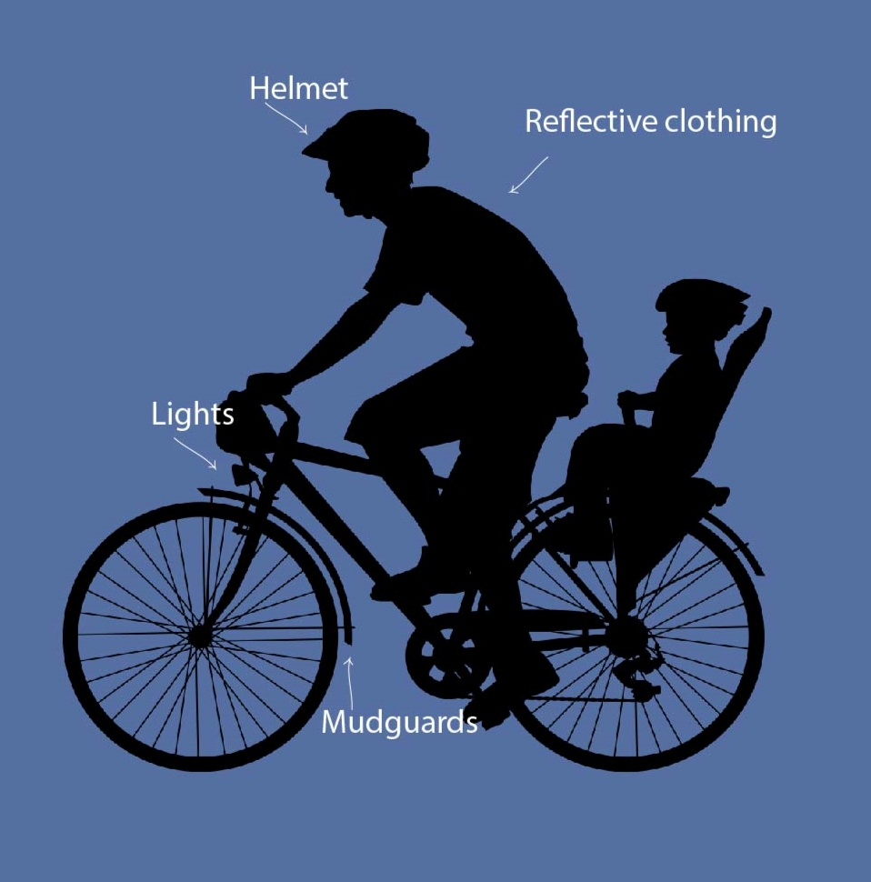

Do you own a bicycle, but have found it hard to start using it for commuting to work? You're not alone. With the right mindset, determination and planning, everybody can become a cycling commuter. Learn why and how to commute by bicycle in the city.

## Why commuting by bicycle is great

The average commuter spends more than six hours a week commuting by car. If you commute by bicycle, this can be leisure time for you. Commuting by bicycle is also a healthier and greener option.

1.  You will save time
2.  You will save money
3.  You will get healthier - mentally and physically
4.  You will get to know the city better

Which of these advantages is most applicable in your situation? What improvement is most important for you? **Write it down!** These notes can motivate you on difficult days.

### How am I going to save time commuting by bicycle?

Do you think commuting to work is faster by car than by bicycle? Nothing is less true **in a city**. Just think of the time you spend searching for a parking lot. It can easily take you 20 minutes each time. How far do you cycle in 20 minutes? About 6 kilometers. Traffic jam is another trouble you'll save yourself going by bicycle. Busses can also get stuck in rush hour. And if you factor in the time it takes to get to and from the station, you'll probably be faster by bike than by public transport.

### How will commuting by bicycle save me money?

Well, this is quite obvious. Get rid of filling your tank every week and save on car maintenance costs. You'll spend less on public transport, too. Even if you go for combining cycling with public transport you'll need a ticket for only one type, e.g., the train.

### How can commuting by bicycle improve mental and physical health?

You will be active outside! That in itself is already a mood lifter. Research shows that physical activity prevents depression and improves concentration. On your way to and from work you'll have time to switch to the next setting and focus on what comes next. That will make your **boss and your family happy.**

And of course, you'll be more active than driving a car or sitting in an overloaded train. In the long term you'll improve your fitness level. You don't have to worry about catching the flu either.

### How does commuting make me get to know the city better?

You might have found the shortest way through the city, but is it the best? Try different routes. Take the short one in the morning and a beautiful one after work! Take a detour to do some shopping or to see friends for an after-work chill out. Different routes might open up new opportunities for you to really connect with your city. You'll be **closer to life and feel how you belong here**.

## How to get started commuting by bicycle

So, you have a busy life and your never-ending commute is not really helping. You've heard about the benefits of cycle commuting and now you're wondering how to get started. You want to be faster than before and get to work safe and healthy on your bicycle. Here is how to do this.

### Get the right bike and gear for commuting

The right bike for commuting should be the right bike for you in your city and for your situation. Here in Lisbon chances are that you have to climb a couple of steep hills to arrive at work. So an **eBike** is a good option to keep you motivated.

Think about how long you have for your commute and if the distance is feasible for you on a conventional bike. Be realistic. Don't arrive at work exhausted. **Choose a bike that makes your commute cheaper in the long haul, not much slower, healthier and convenient enough to stick with it.**

Do you want to combine public transport with cycling? Or do you come to the periphery from far away by car? In that case a **folding bike** is probably the best choice for you.

Have your bike checked in a bike shop. Are the gears adjusted well, is the chain still good? Save yourself the hassle on your way to work and make sure your bicycle is always well maintained. Does the bike fit you? Make sure the saddle height is correct and the distance to the steer fits your preferred sitting position.

Most importantly, your bike needs to be safe:

- a good headlight and backlight,
- mudguards
- a bell
- reflective clothing
- a lock and
- a helmet are indispensable.

You might want to use a **cycling outfit** and change at work. If you plan to do your shopping on the way home, **panniers** are more practical than a backpack. Do you want to cycle even in bad weather? Get the proper gear!

### Get a bike buddy

You do not just hop on your bike and start commuting by bicycle in the city. That's why you are here. To start you need to figure out the **safest, most convenient route** in advance, and learn how to avoid the hazards of a bike ride in the city.

So, you want a great route and **self-confidence** for your new challenge. The best way to go about these crucial points to success is to find a bike buddy. Find someone who is already riding through the city by bicycle every day. A bike buddy can advise you on what busy intersections and heavy traffic areas to avoid. Or which train stations work best for bikes.

Practice on a weekend or at any time the traffic is low. Do that at least 2 or 3 times before you start to commute by bike for real. The routine will help you to get over the initial inner resistance. Read through the advantages and improvements you noted in the beginning every time you'd rather go by car.

And don't forget to **enjoy the fresh air and time you save** on your first commute!

### Tell your employer and your friends

When you start to bike to work for the first time you are not used to it. In the beginning you might miscalculate the time you need. Maybe your chain slips and you haven't learned yet how to get it back within a couple of seconds?

Share your plans to commute by bicycle in advance with friends and at work. You'll be surprised about the support and the motivation you'll experience! If you're late they will understand, and it is quite likely that they'll help you. Maybe you'll even start advocating for bicycle commuting at your work!

### Organize a parking place for your bike at work in advance

Ask before you occupy space inside a building that wasn't dedicated to bicycles until now. That way you'll avoid trouble. Not every workspace has a place for bicycles. You might need to find an unconventional solution. With a good lock and something to lock your bike on, you can also park your bicycle on the street.

## What you need for a safe cycle commute

Bike culture is becoming more prevalent and bikes are more often seen even in cyclewise difficult cities like Lisbon. The more people commute by bike and claim urban space the better the biking infrastructure will become. And the safer the cyclists will be. However, in order to improve safety now, cyclists should consider these basic guidelines:

- wear bright reflective colors and a helmet
- stick to the rules
- do not insist on your right – you will lose in a crash
- be aware of the **blind spot** on the car's right side

## Takeaway

Commuting by bike can be a more relaxed, cheaper and healthier alternative to driving or using public transport. People are increasingly commuting even in cyclewise difficult cities like Lisbon thanks to the rise of electric bikes. The benefits of commuting by bike are plentiful: less fuel costs, less carbon dioxide emission, less time spent in traffic jams or searching for a parking lot and a healthier lifestyle. Well prepared everybody should be able to do it.

Don't wait for the perfect moment. Ask others how they do it! What do others do when they arrive sweaty at work? There is more than one solution for everything.

**_So, get on your bike and share the most beautiful, safest, shortest and most practical bike routes with others. Talk about bike transport. Give someone a bike or a bike day! Just don't give up until everyone's riding bikes. Because cycling makes you happy._**
