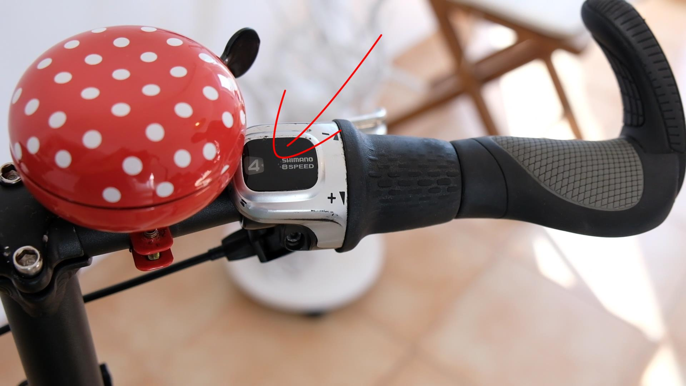
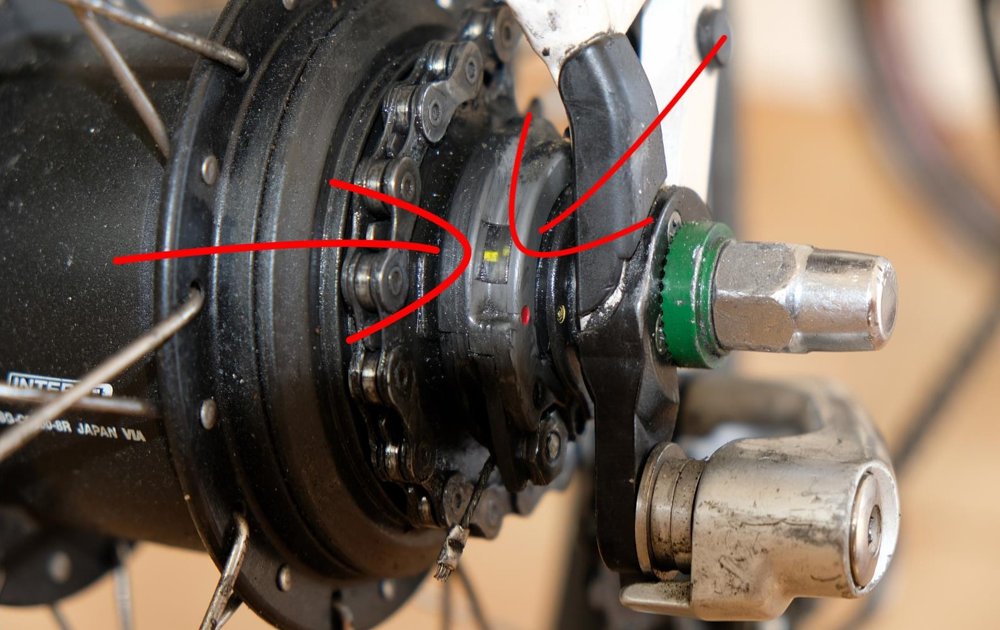
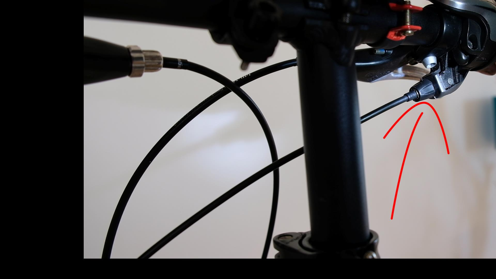
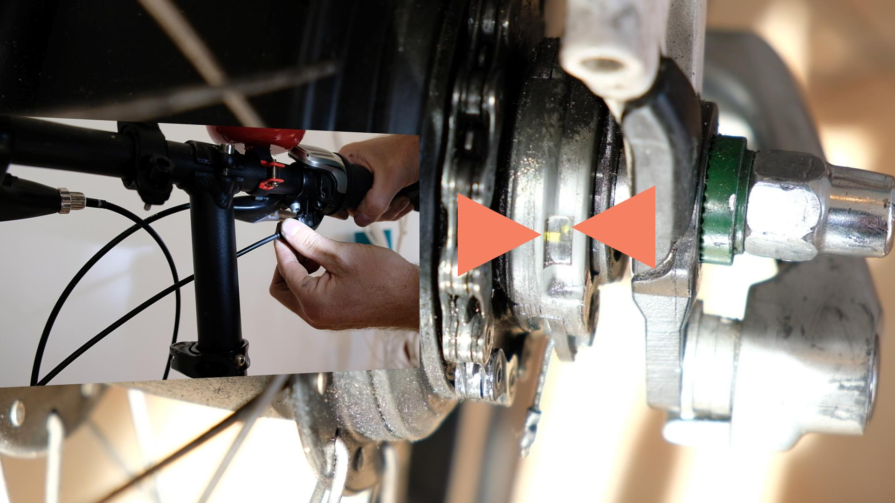
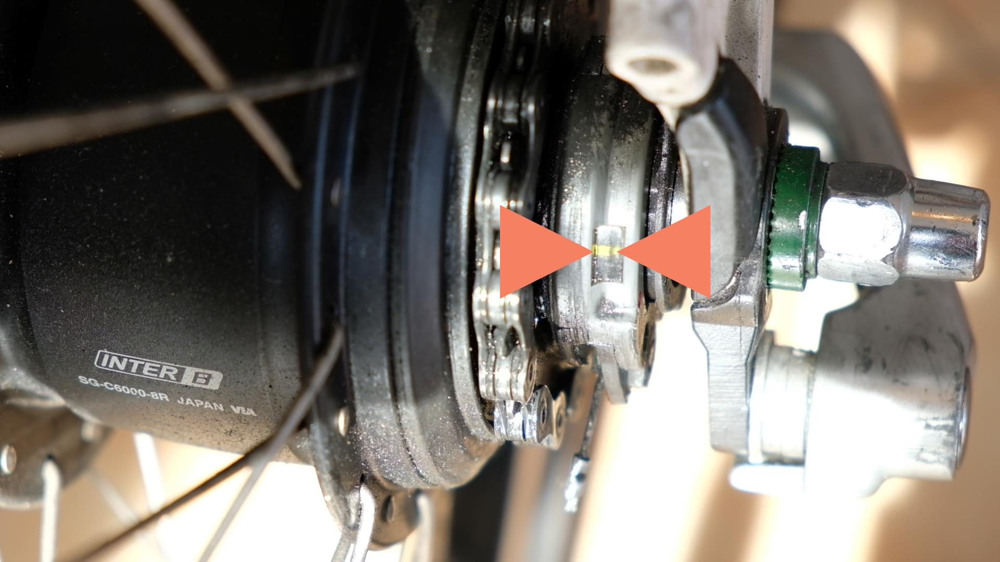

In diesem Beitrag erfährst du, wie du die 8-Gang Nabenschaltung der Shimano Nexus-Serie in **nur 3 Schritten** selbst genau justieren kannst.

Warum ist das wichtig: Die Shimano Nexus 8 ist eine super Gangschaltung – aber nur wenn sie korrekt eingestellt ist.

Schwierigkeitsgrad: **kann jeder**

Was du brauchst: einen Lappen

## Vorteile der Shimano Nexus 8

Die 8-Gang-Nabenschaltung der Shimano Nexus Serie C6000 ist wahnsinnig beliebt. Die Gründe liegen auf der Hand:

- preiswert, komplettes Rad ca. 200 Euro
- hält ewig bei korrekter Wartung (1x pro Jahr/2000 km)
- vergleichsweise großer Schaltbereich für das kleine Ding: 307 %

Die Shimano Nexus 8 ist vielseitig. Ihr Haupteinsatzgebiet ist das Radfahren in der Stadt. Sie ist auch für E-Bikes mit höherer Kettenspannung geeignet. Also alles perfekt, oder? Genau. Solange du 2 Dinge beachtest:

👍 Nicht unter Belastung schalten!

👍 Die Schaltung muss genau eingestellt sein!

Hier geht's zum Video.

  <iframe width="1026" height="577" src="https://www.youtube.com/embed/byTM-MrHh5U" title="YouTube video player" frameborder="0" allow="accelerometer; autoplay; clipboard-write; encrypted-media; gyroscope; picture-in-picture" allowfullscreen></iframe>

## Schritt 1

Die Schaltung muss im 4. Gang stehen.

👉 Stelle den Ganghebel dazu in den 1. Gang und schalte Schritt für Schritt in den nächsthöheren Gang.

Wenn du ungewollt in den fünften geschaltet hast, musst du noch einmal beim ersten Gang beginnen.

## Schritt 2

👉 Suche die 2 gelben Markierung auf der Schaltnabe.

Das ist im Prinzip der schwierigste Schritt, weil die kleinen gelben Punkte unter Öl und Schmutz versteckt sind. Nimm dir einen fusselfreien Lappen und säubere den Ring, der sich außenseitig der Kette befindet.

## Schritt 3

👉 Jetzt drehst du den Drehknopf am Schaltzug so, dass die gelben Markierungen auf einer Linie stehen.

Im folgenden Bild siehst du den Drehknopf am Schaltzug.

So sieht es aus, wenn die Markierungen noch nicht auf einer Linie stehen. Du musst noch weiter drehen.

Und so soll es am Ende aussehen.

Das war's auch schon. Wenn du deine Shimano Nexus 8 immer gut einstellst und nicht unter Belastung schaltest, wirst du für kleines Geld lange Freude an dieser vielseitigen und wertigen Nabenschaltung haben.

Viel Erfolg beim Justieren! Bis dahin...

**_Schwing dich also aufs Fahrrad, teile die schönsten, die sichersten, die kürzesten und praktischsten Fahrradrouten mit anderen. Sprich über Fahrradreparatur. Verschenk mal ein Fahrrad oder einen Fahrradtag! Gib einfach nicht auf, bis alle Fahrrad fahren. Denn Fahrradfahren macht glücklich._**
