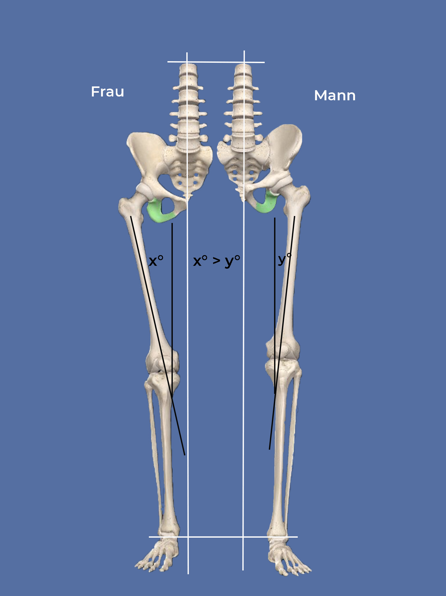
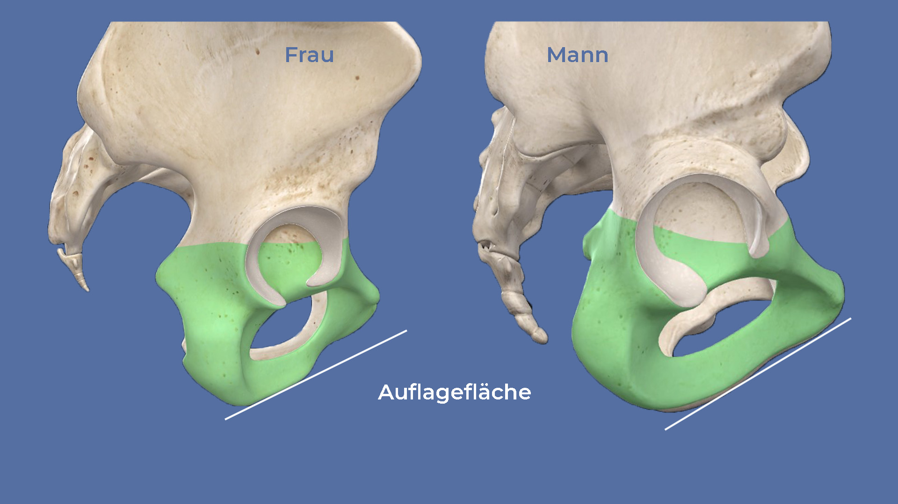

Die Sattelauswahl ist riesengroß. Trotzdem klagen viele über Schmerzen auf dem Sattel, Nach-Vorne-Rutschen oder Taubheitsgefühl. In diesem Beitrag erfährst du, welche Satteleigenschaften für welchen Effekt verantwortlich sind und wie du bei der Auswahl einiger Testsättel am besten vorgehst.

Sattelform bei Mann und Frau
----------------------------

In diesem Artikel gehen unsere fiktiven Radfahrfreunde Jenny und Ben Sättel für ihre Tour kaufen. Sie haben unseren [Beitrag zur Sitzbeinvermessung](https://weonbikes.com/blog/sitzbeinabstand-bestimmen-in-3-schritten/) gelesen, um ihre Sattelbreite zu bestimmen. Beide haben einen Sitzknochenabstand von 12 cm und eine mäßig sportliche Sitzposition. Daher wissen sie, dass sie **beide** einen Sattel mit einer Breite von 14 cm brauchen. Das ist ein häufiges Maß sowohl bei Männern als auch bei Frauen.

👉 Sattelbreite = 14 cm für Jenny und für Ben

Darf die Form auch die gleiche sein? Nein, eher nicht. Selbst bei gleichem Sitzbeinabstand, können andere Faktoren variieren. Schauen wir uns zum Beispiel mal die grundsätzlichen Unterschiede am Becken von Männern und Frauen an.

### Oberschenkelwinkel, T-Sattel und V-Sattel

Jenny hat zwar den gleichen Sitzhöckerabstand wie Ben, ihr Becken wird aber nach oben hin etwas breiter. Wenn sie die Füße dann auf die gleichen Pedale setzt wie Ben, führen ihre Oberschenkel enger am Sattel vorbei. Möglicherweise sind ihre Oberschenkel auch noch dicker als die von Ben.

Hier kommt die Sattelform ins Spiel. Je größerer der Oberschenkelwinkel und je dicker die Oberschenkel desto eher muss der Sattel nach vorne schmaler werden. Er sollte daher eine **T-Form** haben. Verläuft der Oberschenkelknochen gerader nach unten, bei Männern zum Beispiel, und ist der Oberschenkel eher dünn, brauchen die Oberschenkel keinen zusätzlichen Platz. Der Sattel kann dann auch eine **V-Form** haben.

**Achte also darauf, dass deine Oberschenkel gut am Sattel vorbeikommen. Das ist nicht abhängig vom Geschlecht, sondern vom Hüftwinkel und den Oberschenkeln.**

In der Abbildung siehst du den Unterschied im Winkel der Oberschenkelknochen zur Vertikalen bei Frau (links) und Mann (rechts). Je größer der Winkel, desto größer die Wahrscheinlichkeit, dass der Oberschenkel am Sattel scheuert. Für ausreichende Bewegungsfreiheit der Beine muss der Sattel nach vorne hin schnell schmal werden. Je kleiner der Winkel, desto paralleler verläuft das Bein zur vertikalen Achse. Der Oberschenkel kommt besser am Sattel vorbei.

Was du tun kannst, wenn deine Füße nicht mittig auf den Pedalen bleiben möchten, besprechen wir in einem folgenden Beitrag. Das liegt nicht am Sattel.

👉 Jenny = T-Sattel

👉 Ben = V-Sattel

Im Bild siehst du nochmal, welche Form gemeint ist:

### Von der Seite betrachtet: eben, abgesenkt, erhöht

Unterschied Nummer 2: Jennys Becken ist an der Unterseite **gewölbt**. Bens Becken ist an der Unterseite eher gerade. Ben hat somit eine größere Auflagefläche selbst bei einer sportlicheren Sitzposition. Bei Jenny ist die **Druckbelastung punktueller**, wenn sie sich nach vorne beugt.

In der Abbildung siehst du die unterschiedliche Form der Schambeinkufen ausgehend von den Sitzbeinhöckern bei Frau (links) und Mann (rechts). Beim weiblichen Becken ist die Auflagefläche kleiner, da sich die Knochen eher nach oben wölben. Der Druck konzentriert sich bei einer sportlichen Sitzposition dadurch auf eine kleinere Fläche.

Eine Lösung für Jenny wäre ein Sattel mit einer passenden Wölbung - eine leichte Kuhle, auf die sich der Druck der Beckenkurve verteilt. Der Sattel müsste dann aber sehr genau passen, damit die Sattelnase nicht drückt. Alternativ geht auch ein Sattel, der im mittleren Bereich ein wenig gepolstert ist und sich dadurch anpasst. Bei vielen funktioniert eine Mittelfurche gut, um den Damm zu entlasten.

Ben sollte dagegen darauf achten, dass der Sattel schön eben ist und die Sattelnase auf keinen Fall nach oben zeigt. Das könnte zu Druckbeschwerden an den Weichteilen führen.

👉 Jenny = Sattel mit Mittelfurche oder Kuhle und etwas nachgiebigem Material im mittleren Bereich (nicht vergessen: das ist nur _eine_ Möglichkeit!)

👉 Ben = ebener Sattel, Sattelnase kann abgesenkt sein, ob er Mittelfurche mag, muss er ausprobieren

👉 Beide können auch einen Stufensattel ausprobieren

Soweit die Form in der Draufsicht und in der Seitenansicht. Weiter geht's mit der Polsterung.

Hart oder weich
---------------

Nun schauen wir mal von vorne oder hinten auf den Sattel. Wie stark ist die Rundung? Sind die Kanten ausgeprägt. Wie ist der Sattel gepolstert?

**Hart ist besser als weich.** Unsere Sitzknochen können unser gesamtes Gewicht tragen. Dafür sind sie gemacht. Dass sie beim Radfahren trotzdem zunächst schmerzen, liegt an der leichten Hin- und Herbewegung beim Treten. Daran gewöhnt man sich. Fahrradhosen sind eine Möglichkeit, solche Schmerzen zu lindern.

Jenny und Ben haben gerade sehr genau nach der richtigen Form gesucht. Würden sie nun einen weich gepolsterten Sattel wählen, wäre das alles umsonst gewesen. Denn dann **sinkt der Po in den Sattel ein** und die sorgfältig ausgewählten **Auflagepunkte** verschieben sich auf die Weichteile zwischen den Sitzbeinhöckern und Schambeinkufen. Damit wäre nichts gewonnen.

Der Sattel sollte bei mäßig sportlicher Tourenradhaltung (40-60%) auch nicht steinhart sein. Die meisten Menschen finden eine leichte Polsterung angenehm. Jenny und Ben sollten ihre **Sitzbeinhöcker auf dem Sattel noch spüren** können.

### Sattelmaterial

Ein **Ledersattel** ist zwar klassisch, aber auch hart. Er muss außerdem eingefahren, gepflegt und gespannt werden. Wenn er sich nach einiger Zeit anpasst und nachgibt, wird er zu den Seiten hin breiter. Das wäre für das Oberschenkelproblem nicht dienlich.

Ein **Kunststoffsattel** kann mehr oder weniger stark gepolstert sein. Gel-Polster unterscheiden sich nur durch die Kunststoffstruktur von preiswerteren schaumstoffgepolsterten Sätteln. Da ist nicht wirklich Gel drin.

Im Sportbereich wird an jedem Gramm gespart. Neben **Carbon** gibt es noch viele andere innovative Materialien.

### Glatte oder raue Oberfläche

Je schräger die Sitzhaltung, desto eher muss die Sattelnase abgesenkt werden, um Druckpunkte zu vermeiden. In einem solchen Fall begünstigt ein glatter Sattel das Nach-Vorne-Rutschen. Eine Satteloberfläche, die etwas **Haftung** bietet, verhindert das und schont somit auch die Handgelenke, die sonst immer gegenhalten müssten.

### Rundung oder Kanten

Stark gepolsterte Sättel haben meist noch eine Rundung über die ganze Sattelbreite. Das ist nicht wünschenswert. Der Sattel sollte über die errechnete Sattelbreite **nicht mehr als 1 cm** nach unten abfallen.

Keine Rundung also. Die Kanten sollten dagegen einen fließenden Übergang bilden. Jenny und Ben werden ausprobieren müssen, welche Kantenform am besten zu ihnen passt.

7 Schritte zum Testsattel
-------------------------

Das waren eine Menge Eigenschaften. So wählst du deinen Testsattel systematisch aus:

❶ [Sitzknochenabstand vermessen](https://weonbikes.com/blog/sitzbeinabstand-bestimmen-in-3-schritten/#anleitung-zur-sitzknochenvermessung/)

❷  Entscheide dich für eine Sitzposition und [berechne die Sattelbreite](https://weonbikes.com/blog/sitzbeinabstand-bestimmen-in-3-schritten/#sitzwinkel-und-berechnung-der-sattelbreite/)

❸ Entscheide dich für T-Form oder V-Form je nach Oberschenkel-Anatomie

❹ Teste 2 oder 3 Formen: eben, abgesenkte Nase, mit Kuhle, Stufensattel

❺ Teste Modelle mit Mittelfurche und Schlitz

❻ Vergleiche einen harten glatten Sattel mit einem leicht gepolsterten

❼ Teste ein paar Sättel auf dem Fahrrad, bevor du kaufst.

Warum ist die Sattelnase so lang
--------------------------------

Im Prinzip sitzt man nie auf der Sattelnase. Sie steht immer mehr oder weniger weit über. Wozu? Die Sattelnase sorgt für Seitenstabilität beim Fahren. Bewusst oder unbewusst drückst du beim Fahren in bestimmten Situationen mit den Beinen gegen den Sattel, um dich zu stabilisieren. Ein langer Sattel bietet dir dann mehr Halt. Bei ausgewiesenen Frauensätteln ist die Nase oft kürzer. Dafür gibt es keinen physiologischen Grund.

Nach-Vorne-Rutschen auf dem Sattel
----------------------------------

Ein häufiges Problem, das 3 mögliche Ursachen hat.

👉 Einstellung am Rad: Sattel ist nach unten geneigt, Abstand zum Lenker ist zu groß

👉 Sattelform: Oberschenkel kommen nicht am Sattel vorbei, du rutschst zur Sattelnase

👉 Haltung: Bauch hängt durch, Hohlkreuz, zu wenig Pedalkraft

Alle drei Punkte sind häufig anzutreffen. Eingeschlafene Hände sind auch ein Hinweis auf Punkt 1: zu großer Abstand zum Vorbau. Das ist mangelhaftes **Bikefitting**. Nach dem Fahrradkauf sollte das Fahrrad unbedingt korrekt eingestellt werden. Kaufst du eins von der Stange, geh zum Fahrradladen oder lerne in unseren Beiträgen, wie du das Einstellen selber machst.

Wie du die richtige **Sattelform** findest, hast du oben gelesen. Wenn deine Oberschenkel am Sattel schleifen, solltest du dir einen Sattel mit stärker ausgeprägter T-Form suchen. Besonders dann, wenn du beim Radfahren auch Taubheitsgefühle im Sitzbereich oder den Beinen bekommst.

Die **Haltung** wird als Ursache oft vernachlässigt. Dabei kannst du **mit der richtigen Körperspannung und etwas mehr Pedaldruck** viele von deinen Sattelproblemen verhindern:

✅ Ziehe dein Schambein gedanklich in Richtung Bauchnabel. So richtest du dein Becken auf, ohne den Rücken zu krümmen. Du wirst direkt merken, wie sich dein Gewicht von den Händen auf deine Körpermitte verlagert.

✅ Atme tief in die Brust ein, ohne ein Hohlkreuz zu machen und behalte diese Stellung auch nach dem Ausatmen bei. So entspannst du Nacken und Schultern.

✅ Fahre mit etwas mehr Pedaldruck. **Die beste Federung bei Unebenheiten sind deine Beine!** Ruh dich ruhig ab und an mit dem vollen Gewicht im Sattel aus, aber nicht die ganze Zeit. Das schont den Po.

Apropos Federung. Bei besseren Sätteln ist die Sattelschale für eine gewisse Flexibilität und Stoßabsorbtion konstruiert. Gegen Schlaglöcher hilft das aber nicht.

Die Beine sind wie gesagt die beste Federung. Aber wer aufrecht sitzt und womöglich noch ein Kind vor sich hat, stellt sich nicht so einfach in die Pedale. Wenn du kaum Polsterung am Sattel hast und keine Federung wie beim klassischen Ledersattel, kannst du auf gefederte Sattelstützen zurückgreifen. Es gibt Teleskopsattelstützen und Parallelogramm-Sattelstützen. Damit ist der Fahrkomfort gerettet.

Ledersattel, Stufensattel, was? Genau, im nächsten Sattelbeitrag stellen wir 3 Sattelmarken mit Beispielen vor und dann geht's ans Positionieren. Bis dahin...

**_Schwing dich aufs Fahrrad, teste und teile die besten, robustesten, günstigsten oder fortschrittlichsten Sattelmodelle mit anderen. Sprich über Fahrradtouren Verschenk' mal ein Rad oder einen Fahrradtag! Gib einfach nicht auf, bis alle Fahrrad fahren. Denn Fahrradfahren macht glücklich._**