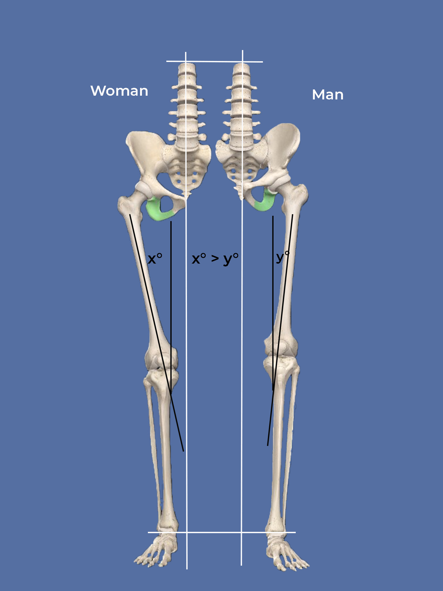
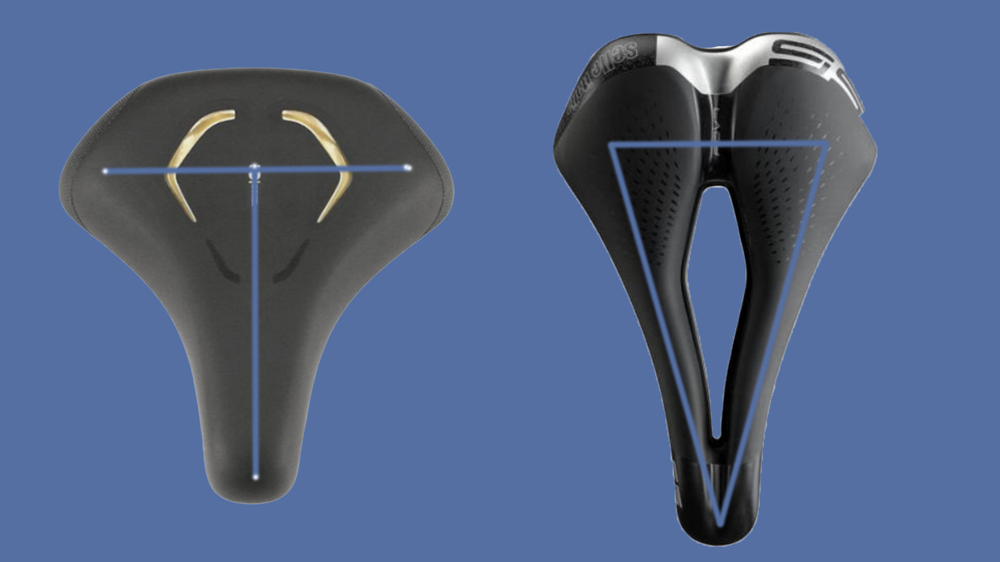
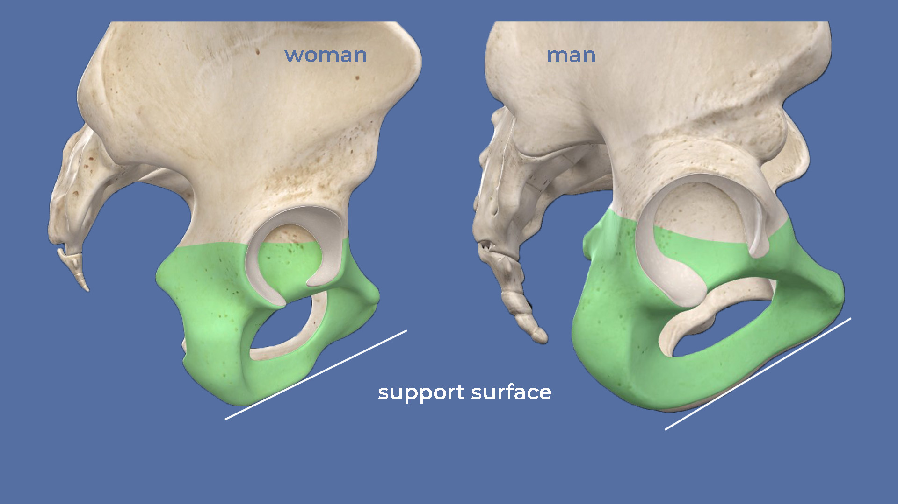
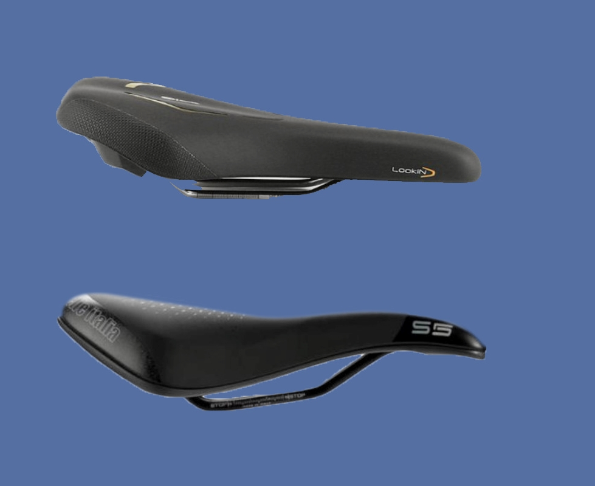
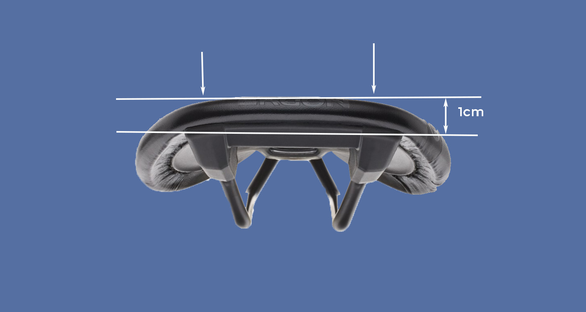

The range of saddle you can choose from is huge. Nevertheless, many complain about saddle pain, sliding to the front or numbness in the legs. In this post, you will learn which saddle specs are responsible for what effect and how you go about choosing a couple of saddles for testing.

## Saddle shape for men and women

In this article, our fictional cycling friends Jenny and Ben go shopping for saddles for their trip. They've read our [post on seat bone measurement](https://weonbikes.com/en/blog/measuring-sitbone-width-3-steps/) and determined their saddle width. Both have a sit bone distance of 12 cm and a moderately sporty sitting position. So they know that they **both** need a saddle that is 14 cm wide. This is a common measurement in both men and women.

👉 Saddle width = 14 cm for Jenny and for Ben

Can the shape also be the same? No, not really. Even with the same ischial spacing, other factors may vary. For example, let's look at the fundamental differences in the pelvis of men and women.

### Thigh angle, T-saddle and V-saddle

Although Jenny has the same sit bone distance as Ben, her pelvis gets a little wider towards the top. When she puts her feet on the same pedals as Ben, her thighs pass closer along the saddle. Perhaps her thighs are also larger than Ben's.

This is where the saddle shape comes into play. The larger the thigh angle and the thicker the thighs, the sooner the saddle has to be narrower towards the front. It should therefore have a **T-shape**. If the thigh bone is straighter down, in men for example, and the thigh is rather thin, the thighs do not need any additional space. The saddle can then have a **V-shape.**

**So make sure that your thighs come well past the saddle. This is not dependent on gender, but on hip angle and thighs.**

In the picture you can see the difference in the angle of the thigh bones to the vertical line in woman (left) and man (right). The greater the angle, the greater the likelihood that the thigh will chafe on the saddle. For sufficient freedom of movement of the legs, the saddle should quickly become narrow towards the nose. The smaller the angle of the thigh bones to the vertical line, the more parallel, the leg extends along the vertical axis. In this case the thighs have more room to pass the saddle.

What you can do if your feet don't want to stay in the middle of the pedals, we will discuss in a following article.  It's not the saddle.

👉 Jenny = T saddle

👉 Ben = V saddle

In the picture you see what saddle form we are talking about:

### Seen from the side: level, lowered, raised

Difference number 2: Jenny's pelvis is **curved** at the bottom. Ben’s pelvis is rather straight at the bottom. Ben thus has a larger contact surface even with a sportier seating position. With Jenny, the pressure load is **more punctiform** when she bends forward.

In the picture you can see the different shape of the pubic area starting from the sit bones in woman (left) and man (right). In the female pelvis, the support surface is smaller due to the bone shape. At a sportive sitting position, the pressure would be concentrated on a smaller area than in men's pelvis.

A solution for Jenny would be a saddle with a fitting concave dip - a slight depression over which the pressure of the pelvic curve is distributed. The saddle would then have to fit very precisely so that the saddle nose does not press. Alternatively, a saddle that is slightly padded in the middle area and thus adapts to it is also possible. For many, a central groove works well to decompress the perineum.

Ben, on the other hand, should make sure that the saddle is flat and that the nose of the saddle does not point upwards. This could lead to pressure problems on the soft tissues.

👉 Jenny = Saddle with a central groove or dip and slightly flexible material in the middle area (don't forget: this is just _one_ possibility!)

👉 Ben = flat saddle, saddle nose can be lowered, and he should try out a central groove to see if he likes it

👉 Both can also try a step saddle

So much for the form in the top view and in the side view. Next up is the padding.

## Hard or Soft

Now let's take a look at the saddle from the front or the back. How big is the curve? Are the edges pronounced? How is the saddle padded?

**Hard is better than soft**. Our sit bones can carry our entire weight. That's what they're made for. The fact that they still hurt when cycling is due to the slight sidewards movement when pedaling. You get used to that. Cycling pants are a way to alliviate this type of pain.

Jenny and Ben have just been looking very carefully for the right shape. If they now choose a softly padded saddle, it will all have been in vain. Because then **the bottom sinks into the saddle** and the **carefully selected support points** shift to the soft tissue between the seat bones and pubic bone. They would have accomplished nothing.

The saddle shouldn't be rock-hard with a moderately sporty touring bike position (40-60%). Most people find light padding comfortable. Jenny and Ben should still **be able to feel their sit bones on the saddle**.

### Saddle Material

A **leather saddle** is of course classic, but also tough. And it needs to be broken in, maintained and tensioned. As it adjusts and flexes over time, it widens towards the sides. That would not help the thigh problem.

A **synthetic saddle** can be padded to a greater or lesser extent. Gel pads only differ from cheaper foam-padded saddles by the structure of the foam. There isn't really any gel in there.

In the sports sector, every gram is saved. In addition to **carbon**, there are many other innovative materials.

### Smooth or rough surface

The more sloping the sitting position, the sooner the saddle nose has to be lowered to avoid pressure points. In such a case, a smooth saddle surface favors the rider to slide forward. A saddle surface that offers some **grip** prevents this and thus also protects the wrists, which otherwise always have to hold tight to prevent sliding.

### Curves or Edges

Heavily padded saddles usually have a curve over the entire width of the saddle. That is not desirable. Over the calculated saddle width the saddle should round off **not more than 1 cm.**

So, no rounding. The edges, on the other hand, should form a smooth transition. Jenny and Ben will have to try out which edge shape suits them best.

## 7 Steps to find your saddle:

That was a lot of specifications. This is how you select your test saddle systematically:

❶ Measure the [sit bone distance](https://weonbikes.com/en/blog/measuring-sitbone-width-3-steps/#how-to-measure-your-sit-bones/)

❷ Decide on a seating position and [calculate the saddle width](https://weonbikes.com/en/blog/measuring-sitbone-width-3-steps/#sitting-position-and-saddle-width-calculation/)

❸ Decide on T-shape or V-shape depending on thigh anatomy

❹ Test 2 or 3 shapes: flat, dropped nose, with hollow, stepped saddle

❺ Test center groove and cut-out models

❻ Compare a hard, smooth saddle with a lightly padded one

❼ Make sure that the test saddle has the calculated width without too much rounding

Test a few saddles on the bike before you buy!

## Why is the saddle nose so long?

In principle, you never sit on the nose of the saddle. It always sticks out more or less. For what reason? The saddle nose provides lateral stability when riding. Consciously or unconsciously, you push your legs against the saddle when riding in certain situations to stabilize yourself. A long saddle thus offers you more support. In designated women's saddles, the nose is often shorter. There is no physiological reason for this.

## Sliding forward on the saddle

A frequent problem that has 3 possible causes:

👉 Adjustments to the bike: the saddle is tilted downwards; the distance to the handlebars is too great

👉 Saddle shape: Thighs can’t get past the saddle, you slide towards the nose of the saddle

👉 Posture: Stomach sagging, hollow back, not enough pedal power

All three points are common. Hands that have gone to sleep are also an indication of point 1: too great a distance to the stem. This is poor **bike fitting**. After buying a bike, it is important to set it up correctly. If you buy one off the shelf, go to the bike shop or learn how to adjust it yourself in our articles.

You have read above how to find the right **saddle shape**: If your thighs are rubbing against the saddle, you should look for a saddle with a more pronounced T-shape. Especially if you also get numbness in the seat area or legs while cycling.

**Posture** is often neglected as a cause. **With the right body tension and a little more pedal pressure**, you can prevent many of your saddle problems:

✅ Imagine pulling your pubic bone towards your navel. This is how you straighten your pelvis without arching your back. You will immediately notice how your weight shifts from your hands to your core.

✅ Breathe deeply into your chest without arching your back and hold this position after exhaling. This is how you relax your neck and shoulders.

✅ Ride with a little more pedal pressure. **The best suspension on bumps are your legs!** Rest occasionally with your full weight in the saddle, but not all the time. That protects the bottom.

Speaking of suspension: With better saddles, the saddle shell is designed for flexibility and shock absorption. But that doesn't help against potholes.

As I said, your legs are the best suspension. But if you're sitting upright and possibly have a child in front of you, it's not so easy to get on the pedals. If you have hardly any padding on the saddle and no suspension, as with the classic leather saddle, you can use spring-loaded seatposts. There are telescopic seatposts and parallelogram seatposts. This prevents discomfort.

Leather saddle, step saddle, huh? Exactly. In the next saddle article we present 3 saddle brands with examples and then we start positioning. Until then...

**Get on your bike, test and share the best, most robust, cheapest or most advanced saddle models with others. Talk about bike tours. Give away a bike or a bike day! Just don't give up until everyone's riding bikes. Because cycling makes you happy.**
