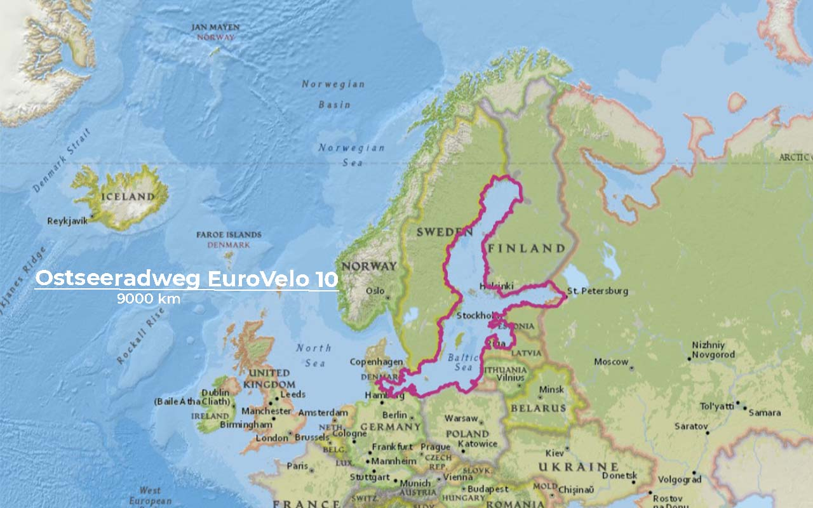
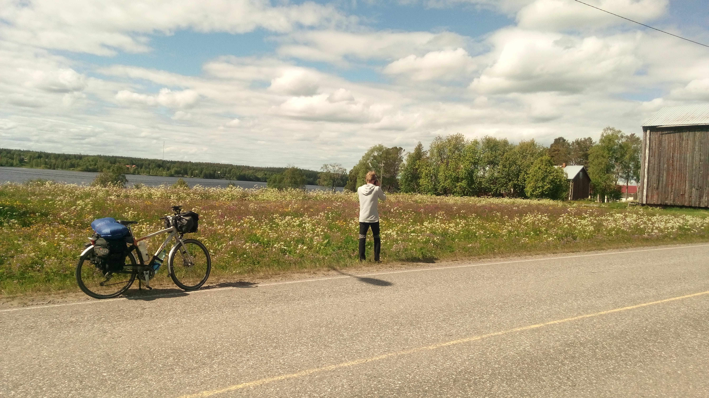
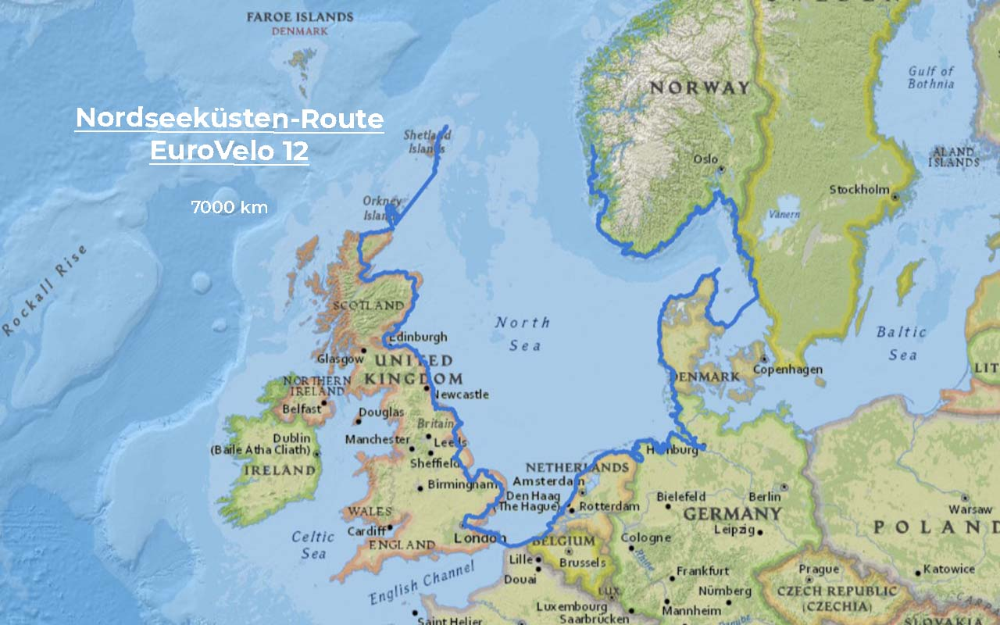
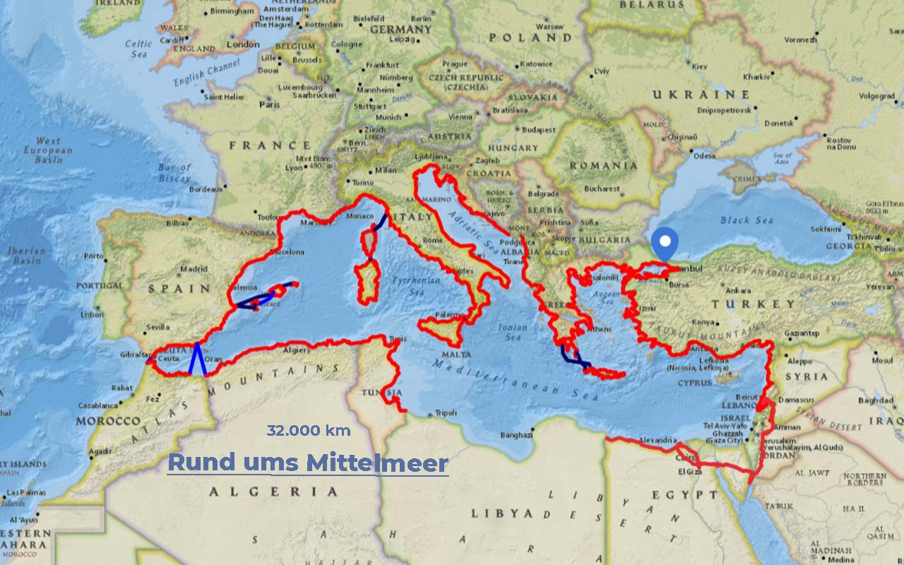

import SevenRoutesDownload from "../../../src/utils/sevenRoutesDownload.js";

Teil 3 unserer Routenplanung. Nach den [langen Fernradwegen](https://weonbikes.com/blog/7-radwanderwege-in-europa-nord-sued/) von über 5000 km von Norden nach Süden durch Europa und den [beliebtesten mittellangen Routen bis zu 2000 km](https://weonbikes.com/blog/7-fernradwege-fuer-urlaub-in-europa/), schauen wir uns Fernradwege entlang der Küsten der 3 Meere Europas an: Nordsee, Ostsee und Mittelmeer. Ist ein Teil davon ein Kandidat für unsere Tour von Kap zu Kap?

<SevenRoutesDownload link="https://drive.google.com/drive/folders/1hx0_4M5TXVaB1UR2cyQWejMQooa1bTeM?usp=sharing" />

Ostseeradweg 9000 km EuroVelo 10
--------------------------------

Der Ostseeradweg ist ein **Rundweg um die gesamte Ostsee**. Du kannst demnach beginnen, wo du willst: in Kopenhagen, Flensburg, Gdansk, Riga, Tallin, St. Petersburg, in Finnland oder Schweden, wo du gerade bist. Zum Erscheinungszeitpunkt dieses Beitrags wird von der Einreise nach Russland jedoch abgeraten. Du solltest du lieber mit der Fähre von Tallin nach Helsinki übersetzen und für die Runde über St. Petersburg auf friedlichere Zeiten warten. Kaliningrad kannst du über Litauen umfahren - so siehst du auch viel mehr von Litauen als auf dem ursprünglichen EuroVelo 10.

**9 Länder** kannst du auf dem Ostseeradweg kennenlernen: Dänemark, Deutschland, Polen, Litauen, Lettland, Estland, Russland (derzeit leider nicht), Finnland und Schweden.

Der EuroVelo 10 führt über fast die gesamte Strecke unglaublich nahe an der Küste entlang. In der flachen Gegend wirst du trotzdem nicht immer Sicht auf die Ostsee haben. Du kannst aber oft einen kleinen Abstecher an die Küste bzw. an den Strand machen. In Dänemark kannst du Kopenhagen kennenlernen und (kleiner Inselabstecher) Bornholm umrunden, in Deutschland dagegen die Insel Fehmarn. In Riga, Tallin und Helsinki kannst du urbanes Leben aufsaugen. Der 9000 bis 10.000 Kilometer lange Fernradweg bietet vor allem viel Natur und ein vergleichsweise gut ausgebautes Radwegenetz.

Der nördliche Teil in Finnland und Schweden liegt auf 66° nördlicher Breite. Da fehlt nicht mehr viel zum Polarkreis. Für vernünftige Campingbedingungen empfiehlt es sich, diesen Teil nicht viel später als August bis Anfang September zu fahren. Eine tolle Zeit ist Juni - dann stehen die Wiesen in voller Blüte. Auf dem Bild unten siehst du Menno in der Nähe von Kemi in Finnland am nördlichsten Punkt des EuroVelo 10 im auf [unserer Tour im Juni 2018](https://weonbikes.com/buch/). Auch wegen der vielen Ferienorte im südlichen Teil der Route ist die Zeit vor den Sommerferien zu empfehlen.

Nordseeküsten-Route 7000 km EuroVelo 12
---------------------------------------

Eine ziemlich verrückte Route. Die Nordsee lässt sich nun nicht wirklich umrunden wie die Ostsee.

**8 Länder** durchradelst du auf diesem Fernradweg: Norwegen, Schweden, Dänemark, Deutschland, die Niederlande, Belgien, Frankreich und das Vereinigte Königreich.

Während du die gesamte Küste der Niederlande und Belgiens entlangradelst, lernst du von Frankreich nur das winzige Stück zwischen Dunkerque und Calais kennen. Apropos Calais: Kaum ein anderer Radwanderweg kann mit so **vielen Fährfahrten** aufwarten! Calais-Dover zwischen Frankreich und England, von Schottland auf die Orkney-Inseln und von dort auf die Shetland-Inseln und weil dort die Route endet, wahrscheinlich auch wieder zurück. Von Schweden nach Dänemark musst du über den Kattegat übersetzen, in Norwegen über den Oslofjord und an Norwegens Westküste über alle möglichen Fjorde.

In Norwegen gibt eine ganze Reihe von **Tunneln, die für Radfahrer verboten** sind. Wenn es in einer solchen Situation dann keinen Fährbetrieb mehr gibt und du kein anderes Boot findest, sind Umwege von 100 km und mehr keine Seltenheit. Auf dieser [Website mit einer Karte aller Tunnel für Radfahrer in Norwegen](https://www.cycletourer.co.uk/maps/tunnelmaplrge.shtml) solltest du deine Route vor der Reise genau überprüfen. Denn es können neue Tunnel hinzugekommen sein, die für Radfahrer gesperrt sind. Das ist vor allem beim Insel-Hopping wichtig.

Von den **Klippen Norwegens** über die **niederländischen Polder unter dem Meeresspiegel** zur **Whisky-Verkostung in Schottland** hat der Nordseeküsten-Radweg unglaublich viel zu bieten. Während der Sommerferien können die dichtbesiedelten mittleren Abschnitte der Strecke recht überlaufen sein. Lege deinen Fahrradurlaub für dieses Radwanderprojekt am besten in die Nebensaison.

Mit dem Fahrrad ums Mittelmeer 32.000 km
----------------------------------------

Es gibt keine Fahrradroute um das Mittelmeer. Trotzdem ist sie einer gefahren. 2010 ist [Vyacheslav Stoyanov für](http://www.vyacheslavstoyanov.com/) ein Fundraising-Projekt einmal ums Mittelmeer geradelt. Die Website ist noch online und enthält die Routen und links zu einem Blog. Der bulgarischen Radwanderer Vyacheslav Stoyanov ist bekannt für das Projekt [Cycle for REcycle von Alaska bis Argentinien](http://www.cycle4recycle.com/).

Diese Route verläuft über **19 Länder**: Türkei, Syrien, Libanon, Jordanien (statt Israel), Ägypten, Tunesien, Algerien, Marokko, Spanien, Frankreich, Monaco, Italien, Malta, Slowenien, Kroatien, Bosnien, Herzegowina, Montenegro, Albanien, Griechenland. Libyen nicht.

Schauen wir uns das ganze mal genauer an. Ist das auch etwas für Normalsterbliche? Nun, im Norden sieht es gut aus: Der [EuroVelo 8](https://weonbikes.com/blog/7-radwanderwege-in-europa-nord-sued/#7-mittelmeer-route-7500-km-eurovelo-8) deckt den Löwenanteil der Küste ab und Griechenland und die Türkei sind auch kein Problem. Hier findest du alles über [Radwandern in der Türkei](https://cycloscope.net/cycling-turkey). Auf der Karte siehst du die Route, die Vyacheslav Stoyanov unbegleitet gefahren ist. Er hat auch mehrere Inseln umrundet.

In Libyen gibt es keinen Track. 2010/11 war die Situation dort noch weitaus schlechter als jetzt und an Einreise gar nicht zu denken. Derzeit ist es möglich, nach Libyen einzureisen, allerdings gilt das Land nach wie vor als gefährlich für Touristen und entlang der Küste sollen sich zahlreiche Militärposten befinden. Zum Radwandern nicht zu empfehlen.

Auch für Syrien besteht eine Reisewarnung. Zwar gibt es Leute, die dort derzeit radwandern, die Sicherheitssituation ist jedoch nicht annähernd mit der an der Nordküste des Mittelmeers zu vergleichen. Selbst auf [Wikiloc](https://www.wikiloc.com/) gibt es dort nur sehr wenige Tracks. Wer in unsicheren Gegenden radwandern möchte, sollte sich unbedingt **bei Einheimischen informieren**.

Die gesamte Runde zu radeln ist wohl nichts für durchschnittliche Radwandernde. Aber warum nicht die **westliche Hälfte des Mittelmeers umrunden?** Das ist dann nicht nur kürzer, sondern auch sicherer. Von Tunis nach Palermo kannst du fliegen oder die Fähre nehmen und triffst dann in Sizilien direkt auf den [EuroVelo7, die Sonnenroute](https://weonbikes.com/blog/7-radwanderwege-in-europa-nord-sued/#3-sonnenroute-7700-km-eurovelo-7).

Mit dem Rad ums Schwarze Meer ca. 5000 km
-----------------------------------------

Es gibt noch ein weiteres Meer an Europas Grenze zu Asien, das es mit dem Rad zu umrunden gilt: das Schwarze Meer. Es gibt einen Track von Vyacheslav Stoyanov von 2009, den du über den Link unten herunterladen kannst.

**6 Länder** grenzen an das Schwarze Meer: Türkei, Georgien, Russland, Ukraine, Rumänien und Bulgarien.

Die ukrainische und die russische Küste müsstest du derzeit auslassen. Das ist ein sehr großer Teil der Strecke. Über den türkischen Teil kannst du in [diesem Beitrag](https://tortoiseandhareontour.com/cycling-along-the-black-sea-coast/) mehr lesen. Bleibt nur zu hoffen, dass wir diesen Beitrag bald mit guten Neuigkeiten aktualisieren können. Bis dahin...

**_Schwing dich aufs Fahrrad, teile die schönsten, die sichersten, die kürzesten, längsten oder praktischsten Fahrradrouten mit anderen. Sprich über Fahrradreisen Verschenk' mal ein Rad oder einen Fahrradtag! Gib einfach nicht auf, bis alle Fahrrad fahren. Denn Fahrradfahren macht friedlich._**

<SevenRoutesDownload link="https://drive.google.com/drive/folders/1hx0_4M5TXVaB1UR2cyQWejMQooa1bTeM?usp=sharing" />

Die Karten in diesem Artikel wurden mit [MapHub](https://maphub.net) unter Verwendung der Karte National Geographic, Esri, DeLorme, HERE, UNEP-WCMC, USGS, NASA, ESA, METI, NRCAN, GEBCO, NOAA, iPC erstellt.