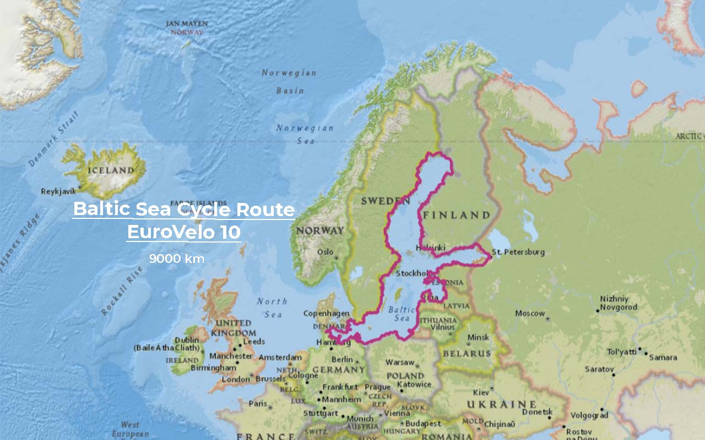
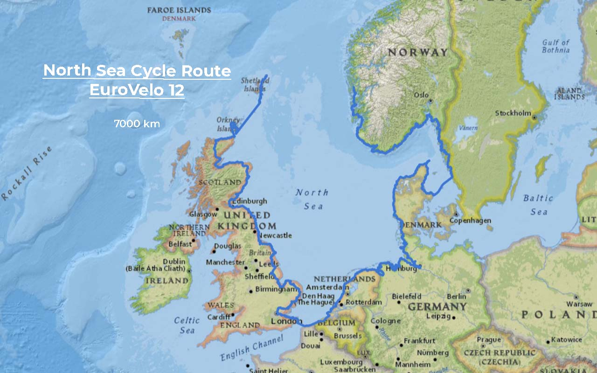
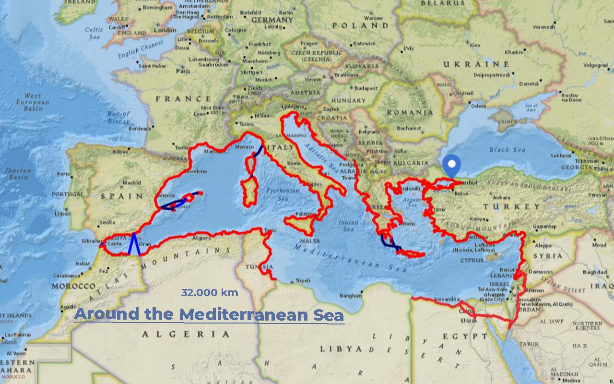

import SevenRoutesDownload from "../../../src/utils/sevenRoutesDownload.js";

Part 3 of our route planning. After the very [long-distance cycle routes of more than 5000 km](https://weonbikes.com/en/blog/7-cycling-routes-europe-north-to-south/) from north to south through Europe and the [most popular medium-length routes of up to 2000 km](https://weonbikes.com/en/blog/7-cycling-routes-for-bike-tour-holidays/), we look at long-distance cycle routes along the coasts of the 3 seas of Europe: North Sea, Baltic Sea and Mediterranean Sea. Is a part of them a candidate for our Cape-to-Cape tour?

<SevenRoutesDownload link="https://drive.google.com/drive/folders/1hx0_4M5TXVaB1UR2cyQWejMQooa1bTeM?usp=sharing" />

## #1 Baltic Sea Cycle Route 9000 km EuroVelo 10

The Baltic Sea Cycle Route is a **circular route around the entire Baltic Sea**. So you can start wherever you want: in Copenhagen, Flensburg, Gdansk, Riga, Tallinn, St. Petersburg, in Finland or Sweden, wherever you are. At the time this article is published, however, entry into Russia is not recommended. You'd be better off taking the ferry from Tallinn to Helsinki and waiting for more peaceful times to make the round trip via St. Petersburg. You can avoid Kaliningrad cycling via Lithuania - this way you also see a lot more of Lithuania than on the original EuroVelo 10.

You can get to know **9 countries** on the Baltic Sea Cycle Route: Denmark, Germany, Poland, Lithuania, Latvia, Estonia, Russia (unfortunately not at the moment), Finland and Sweden.

The EuroVelo 10 runs incredibly close to the coast for almost the entire route. In the flat area you will still not always have a view of the Baltic Sea. But you can often make a small detour to the coast or the beach. In Denmark, dive into cycling city Copenhagen and (small island detour) go around Bornholm by bike. While in Germany you can visit the island of Fehmarn. Soak up urban life in capitals like Riga, Tallinn and Helsinki. This 9,000 to 10,000 km long-distance cycle route offers a lot of nature and a comparatively well-developed network of cycle paths.

The northern part in Finland and Sweden reaches a latitude of 66° north. This is nearly at the Arctic Circle. If you want reasonable camping conditions, you shouldn't go much later than early September. A great time is June - when the meadows are in full bloom. The picture below shows Menno near Kemi in Finland at the northernmost point of EuroVelo 10 on [our tour in June 2018](https://weonbikes.com/en/book/). Also, because there are a lot of holiday destinations in the south part of this route it is better to go before summer holidays on EuroVelo 10.

## North Sea Cycle Route 7000 km EuroVelo 12

This sea is rather open and continued by the Norwegian Sea. You cannot really cycle around the North Sea like you can with the Baltic Sea.

You will pass **8 countries** on this long-distance cycle route: Norway, Sweden, Denmark, Germany, the Netherlands, Belgium, France and the United Kingdom.

You'll cycle along the entire coast of the Netherlands and Belgium, but from France you only get to know the tiny stretch between Dunkirk and Calais. Speaking of Calais: Hardly any other cycle path can offer so **many ferry rides**! Calais-Dover between France and England, from Scotland to the Orkney Islands and from there to the Shetland Islands and because this is the end of the route probably back as well. From Sweden to Denmark, you have to cross the Kattegat by ferry, in Norway the Oslofjord and on Norway's west coast all kinds of fjords.

In Norway there are quite a number of **tunnels that are forbidden for cyclists**. If in such a situation there is no longer any ferry service and you cannot find another boat, detours of 100 km and more are not uncommon. On this [website with a map of all tunnels for cyclists in Norway](https://www.cycletourer.co.uk/maps/tunnelmaplrge.shtml) you should check your route carefully before you travel. New tunnels may have been added that are closed to cyclists. This is especially important when island hopping.

From the **cliffs of Norway** to the **Dutch polders below sea level** to **whiskey tasting in Scotland**, the North Sea Coast Cycle Route has so much to offer. During the summer holidays, the densely populated middle sections of the route can of course be quite crowded. It is best to plan your cycling holiday for this cycling project in the off-season.

## Around the Mediterranean Sea 32.000 km

Here we go: the Mediterranean Sea. There is **no cycling route around** the Mediterranean Sea. Yet, it has been done before! In 2010, [Vyacheslav Stoyanov cycled around the Mediterranean Sea](http://www.vyacheslavstoyanov.com/) as a fundraising project. The website is still available and contains routes and links to a blog. The Bulgarian cyclist Vyacheslav Stoyanov is known for the project [Cycling for REcycling from Alaska to Argentina](http://www.cycle4recycle.com/) from 2015 to 2019.

This route goes through **19 countries:** Turkey, Syria, Lebanon, Jordan (instead of Israel), Egypt, Tunisia, Algeria, Morocco, Spain, France, Monaco, Italy, Malta, Slovenia, Croatia, Bosnia-Herzegovina, Montenegro, Albania and Greece. Not Libya.

Let's take a closer look at the whole thing. Is that also something for mere mortals? Well, things are looking good in the north: the [EuroVelo 8](https://weonbikes.com/en/blog/7-cycling-routes-europe-north-to-south/#7-mediterranean-route-7500-km-eurovelo-8) covers the lion's share of the coast and Greece and Turkey are not a problem either. Here you can find everything about [cycling in Turkey](https://cycloscope.net/cycling-turkey). On the map you can see the route that Vyacheslav Stoyanov rode self-supported. He also cycled around several islands.

There is no track in Libya. In 2010/2011, the situation there was far worse than it is now and there was no question of entering the country. It is currently possible to enter Libya, but the country is still considered dangerous for tourists and there are said to be numerous military posts along the coast. Not recommended for cycling.

There is also a travel warning for Syria. Although there are people who are currently cycling there, the security situation is nowhere near comparable to that on the north coast of the Mediterranean. Even on [Wikiloc](https://www.wikiloc.com/) there are very few tracks there. If you want to cycle in unsafe areas, you should definitely **get information from the locals**.

Cycling the entire loop is probably not for average cycle touring. But why not **cycle around the western half of the Mediterranean Sea**? This is not only shorter but also safer. You can fly or take the ferry from Tunis to Palermo and then join the [EuroVelo7, the sun route](https://weonbikes.com/en/blog/7-cycling-routes-europe-north-to-south/#3-sun-route-7700-km-eurovelo-7), directly in Sicily.

## By bike around the Black Sea ca. 5000 km

There is another sea on Europe's border with Asia that you could cycle around under more peaceful circumstances: the Black Sea. There is a track by Vyacheslav Stoyanov from 2009 that you can also download.

**6 countries** border the Black Sea: Turkey, Georgia, Russia, Ukraine, Romania and Bulgaria.

You would have to skip the Ukrainian and Russian coasts at the moment. That's a big part of the route. You can read more about the Turkish part in [this post](https://tortoiseandhareontour.com/cycling-along-the-black-sea-coast/). Hopefully, we can update our article with good news soon. Until then...

**_Get on your bike and share the most beautiful, safest, shortest, or longest and most practical bike routes with others. Talk about holidays by bicycle. Give someone a bike or a bike day! Just don't give up until everyone's riding by bicycle. Because cycling makes peaceful._**

<SevenRoutesDownload link="https://drive.google.com/drive/folders/1hx0_4M5TXVaB1UR2cyQWejMQooa1bTeM?usp=sharing" />

The maps in this article were created using [MapHub](https://maphub.net/) using the map National Geographic, Esri, DeLorme, HERE, UNEP-WCMC, USGS, NASA, ESA, METI, NRCAN, GEBCO, NOAA, iPC.
